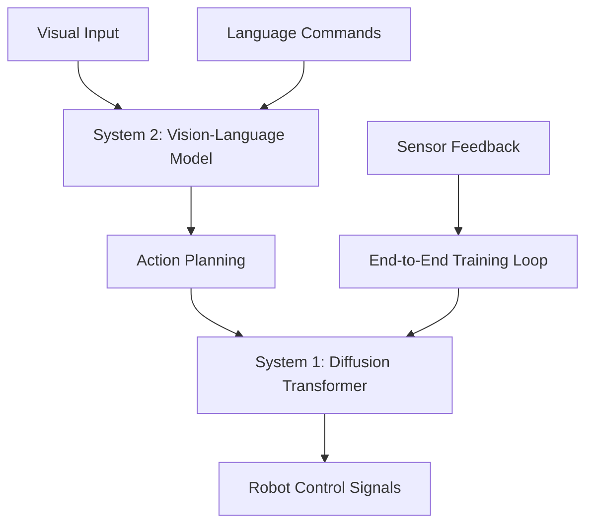

# Isaac GR00T N1 Architecture

Isaac GR00T N1 is NVIDIA's foundation model for humanoid robots, introduced in March 2025. It implements a dual-system architecture based on human cognitive models.

## System Architecture



## Key Components

| Component | Function | Latency |
|-----------|----------|---------|
| System 2 (VLM) | Environment interpretation | 50-100ms |
| System 1 (Diffusion) | Motion generation | 5-10ms |
| Training Pipeline | Heterogeneous data fusion | 24hrs for 6500hrs data |

## Performance Metrics

- **Accuracy**: 40% improvement over baseline models
- **Training Speed**: 780,000 trajectories processed in 11 hours
- **Control Frequency**: Up to 1kHz for torque control
- **Inference Speed**: Real-time on Jetson Thor (2070 TFLOPS)

## Hardware Requirements

```bash
# Minimum GPU Memory
export MIN_VRAM=16GB  # For inference
export RECOMMENDED_VRAM=24GB  # For fine-tuning

# Latest Jetson Platform
export JETSON_THOR_MEM=128GB  # LPDDR5X
export GPU_CORES=2560  # Blackwell architecture
```

## Data Sources

- Real robot trajectories: 30% of training data
- Human video demonstrations: 40% of training data
- Synthetic simulation data: 30% of training data

The model processes diverse manipulation tasks including pick-and-place, assembly, and dynamic balancing specific to bipedal locomotion.