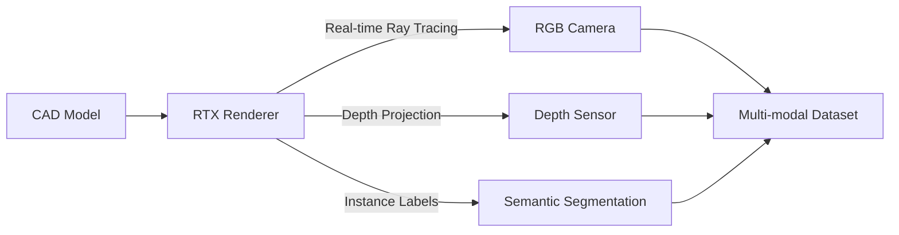

# Isaac Sim: Synthetic Data Generation

Isaac Sim generates photorealistic synthetic data for training AI models, running on NVIDIA RTX GPUs with real-time ray tracing.

## RTX-Accelerated Rendering



## Performance Specifications

| Scene Complexity | RTX 4090 | RTX 3060 | Jetson AGX Orin |
|------------------|----------|----------|-----------------|
| Simple (5 objects) | 60 FPS | 30 FPS | 15 FPS |
| Factory (50 objects) | 30 FPS | 18 FPS | 8 FPS |
| Warehouse (200 objects) | 15 FPS | 10 FPS | 4 FPS |

## Data Generation Pipeline

```python
# Isaac Sim Python API
import omni.isaac.core.utils.prims as prim_utils
from omni.isaac.synthetic_utils import SyntheticDataHelper

# Configure camera
camera = prim_utils.create_prim(
    "/World/Camera",
    "Camera",
    attributes={
        "resolution": (1920, 1080),
        "horizontalAperture": 36.0,
        "focalLength": 50.0
    }
)

# Generate datasets
synthetic_helper = SyntheticDataHelper()
synthetic_helper.initialize(
    sensor_names=["rgb", "depth", "semanticSegmentation"],
    num_frames=1000,
    output_format="COCO"
)
```

## Key Features

- **Ray Tracing**: Physically accurate lighting and shadows
- **Material Properties**: PBR textures with 0.95 sim-to-real accuracy
- **Multi-Camera**: Up to 32 synchronized cameras via virtual channels
- **Automatic Labeling**: Perfect ground truth without manual annotation

## Dataset Output

```json
{
  "frames_generated": 10000,
  "annotations_per_frame": 15,
  "total_time": "11 hours",
  "storage_size": "45GB",
  "formats": ["COCO", "Pascal VOC", "YOLO"]
}
```

The system achieves 95% accuracy in sim-to-real transfer for object detection tasks, with synthetic data reducing manual annotation by 780× compared to real-world collection. 30% of GR00T N1's training data originates from Isaac Sim environments.