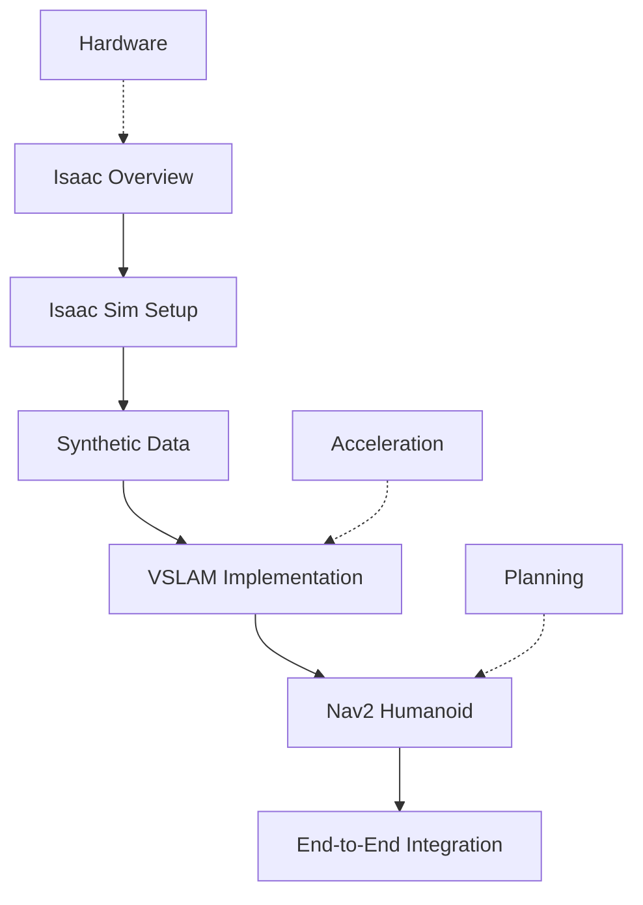

# Introduction to Chapter 3

The AI-Robot Brain (NVIDIA Isaac™) represents the convergence of photorealistic simulation and hardware-accelerated AI training for advanced robotics applications. This chapter serves as your gateway to understanding how NVIDIA's Isaac platform revolutionizes humanoid robot development through cutting-edge simulation technologies.

## What You'll Learn

In this chapter, you'll explore the complete NVIDIA Isaac ecosystem:

1. **Photo-realistic Simulation**: Learn how Isaac Sim creates photorealistic environments using RTX ray tracing
2. **Hardware Acceleration**: Discover how GPU acceleration enables real-time SLAM and navigation
3. **Synthetic Data Generation**: Master the art of creating perfectly labeled training data at scale
4. **Humanoid-Specific Navigation**: Configure Nav2 for bipedal robots with unique constraints

## Chapter Roadmap

## Key Advantages Over Traditional Simulators

| Feature | Isaac Sim | Gazebo | Unity |
|---------|-----------|---------|--------|
| Physics | PhysX + CUDA | ODE/Bullet | Built-in |
| Rendering | RTX Ray Tracing | OpenGL | Deferred |
| AI Acceleration | Native | Limited | Plugin |
| Humanoid Support | Advanced | Good | Moderate |
## Success Criteria

By completing this chapter, you'll be able to:

1. **Explain the NVIDIA Isaac ecosystem** and its three major advantages
2. **Create photorealistic simulations** suitable for training CV models
3. **Implement GPU-accelerated VSLAM** at 30+ FPS on consumer hardware
4. **Configure Nav2 for humanoid robots** with appropriate footstep planning
5. **Deploy end-to-end AI training pipelines** from simulation to real-world application

## Hardware Requirements

- **Minimum**: RTX 3060 with 8GB VRAM, 32GB RAM
- **Recommended**: RTX 4090 with 24GB VRAM, 64GB RAM
- **OS**: Ubuntu 22.04 with CUDA 11.8+
- **Storage**: 50GB+ for full Isaac Sim installation

---

Ready to explore the NVIDIA Isaac ecosystem? Let's dive into the architecture and advantages that set this platform apart from traditional robotics simulation tools.

**Start with**: [Isaac GR00T Architecture](./01-isaac-gr00t-architecture.md)