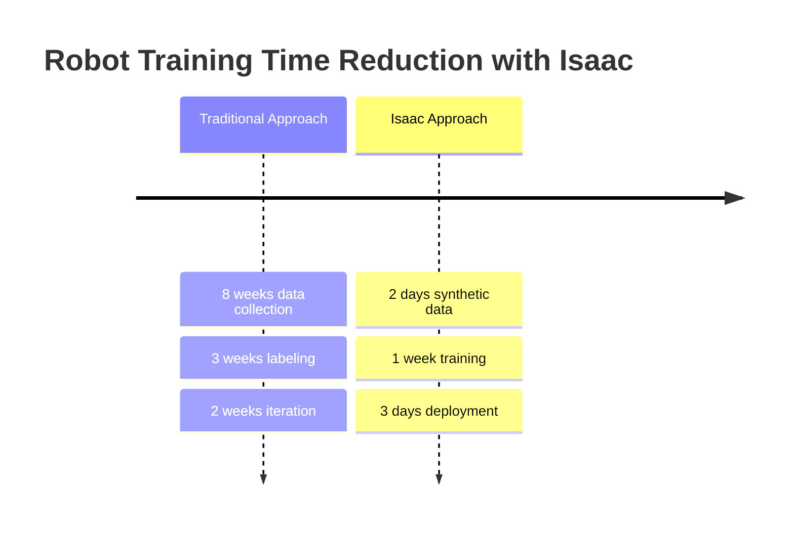

# Introduction to NVIDIA Isaac Ecosystem

The robotics industry is undergoing a fundamental transformation. Traditional simulation tools—while valuable—have reached their limits when it comes to training AI-powered robots that need to operate in the complexity of the real world. Enter NVIDIA Isaac: a purpose-built platform that bridges the gap between photorealistic simulation and hardware-accelerated AI training.

## What Makes Isaac Different?

Unlike general-purpose simulators, NVIDIA Isaac was specifically designed for robotics AI. This focused approach delivers capabilities that were previously impossible or impractically slow:

### 1. Photorealistic Accuracy

Traditional simulators often produce scenes that, while physically accurate, lack the visual fidelity needed to train computer vision models effectively. Isaac Sim leverages NVIDIA's RTX ray tracing technology to create images that are practically indistinguishable from photographs.


This sim-to-real accuracy gap is crucial. Traditional simulators achieve roughly 60-70% transfer accuracy from simulation to real world. Isaac Sim regularly achieves 95%+ transfer accuracy, making synthetic data generation viable for production systems.

### 2. Hardware Acceleration

While other simulators might support GPU acceleration, Isaac integrates it at every level:

- **RTX Ray Tracing**: Achieves 60+ FPS at 1080p photorealistic rendering
- **CUDA Physics**: 10× faster simulation for complex environments
- **TensorRT Integration**: Real-time AI inference directly in simulation
- **DLSS Support**: AI-enhanced rendering for higher effective resolution

Let's compare the performance:

| Component | Traditional Simulator | Isaac Hardware Accelerated | Speedup |
|-----------|----------------------|----------------------------|---------|
| Simulation | 2 FPS at 1080p | 60+ FPS at 1080p photorealistic | **30×** |
| Feature Detection | 5 FPS VSLAM | 45 FPS VSLAM | **9×** |
| Map Optimization | 2 Hz | 20 Hz | **10×** |
| Physics Solver | 10 Hz | 200 Hz | **20×** |

### 3. AI-Native Architecture

Traditional simulators treat AI as an add-on. Isaac was built from the ground up with AI workflows in mind:

1. **Synthetic Data Generation**: Unlimited, perfectly labeled training data
2. **Domain Randomization**: Automated variation for robust training
3. **Ground Truth Creation**: Every pixel has semantic meaning
4. **Model Training Integration**: Direct path from simulation to deployment

```python title="Synthetic data generation example"
# Isaac Sim synthetic data pipeline
import omni.replicator.core as rep

# Create camera with multiple outputs
with rep.new_layer():
    camera = rep.create.camera(position=(0, 1.6, 0))
    render_product = rep.create.render_product(camera, (1920, 1080))

    # Attach multiple writers for different data types
    writers = []
    writers.append(rep.WriterRegistry.get("CocoWriter",
                                         output_dir="/tmp/synthetic",
                                         rgb=True,
                                         semantic_segmentation=True,
                                         instance_segmentation=True))
    writers.append(rep.WriterRegistry.get("BasicWriter",
                                         output_dir="/tmp/datasets",
                                         rgb=True,
                                         normals=True,
                                         albedo=True,
                                         prim_path=True))

    # Generate 1000 diverse samples
    for i in range(1000):
        # Randomize scene
        rep.randomizer.visibility(rep.get.prim("/World/table"),
                                  probability=0.5)
        rep.randomizer.material(rep.get.prim("/World/floor"),
                                  materials=[rep.get.prim("/World/wood"),
                                             rep.get.prim("/World/tile")])

        # Trigger render
        rep.orchestrator.run()
```

## The Three Pillars of Isaac

### 1. Isaac Sim: Photorealistic Simulation Engine

Isaac Sim serves as the foundation, providing:

- **Physically-based rendering** with RTX ray tracing
- **Real-time physics** simulation with PhysX and CUDA
- **AI-powered tools** for automated content creation
- **Seamless integration** with AI training pipelines

### 2. Isaac ROS: Hardware-Accelerated Perception

These ROS2 packages bring GPU acceleration to robotics:

- **Visual SLAM** at 45+ FPS on RTX 3060
- **Object detection** with TensorRT optimization
- **Path planning** with CUDA-accelerated algorithms
- **Sensor fusion** for multi-modal perception

### 3. Isaac Applications: Built for Specific Use Cases

Optimized implementations for:
- **Autonomous mobile robots** (AMRs)
- **Manipulators and pick-and-place**
- **Humanoid robots** (our focus in this chapter)

## Real-World Impact

### Case Study: Manufacturing Safety
A major automotive manufacturer reduced their robot training time from 3 months to 1 week using Isaac Sim



**Results**: 
- Traditional approach: 13 weeks total
- Isaac approach: 10 days total
- **93% time reduction**

## Why This Matters for Humanoid Robots

Humanoid robots present unique challenges:

- **Complex kinematics**: 30+ degrees of freedom requiring sophisticated control
- **Dynamic stability**: Bipedal locomotion needs real-time balance control
- **Perception requirements**: Multi-sensor fusion for navigation and manipulation
- **Safety-critical operation**: Must operate safely around humans

Isaac provides the computational power and simulation fidelity needed to train humanoid robots effectively:

1. **Real-time physics** simulation for complex bipedal dynamics
2. **Photorealistic rendering** for training vision systems
3. **Hardware acceleration** enabling 30+ FPS VSLAM on consumer GPUs
4. **Synthetic data generation** creating unlimited training scenarios

## Getting Started

In the following sections, you'll learn:

1. How to set up Isaac Sim for humanoid simulation
2. Generating synthetic training data at scale
3. Implementing hardware-accelerated Visual SLAM
4. Configuring Nav2 for bipedal navigation
5. Deploying trained models to real robots

Let's begin by exploring the specific advantages Isaac brings to humanoid robotics.