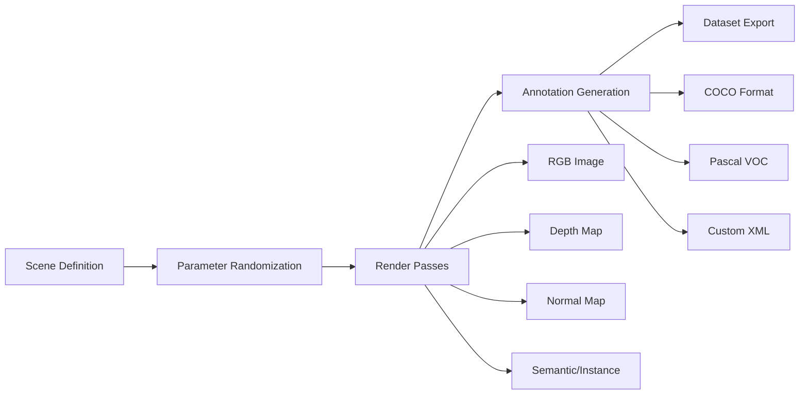

# Synthetic Data Generation with Isaac Sim

Synthetic data generation is Isaac Sim's superpower - it can create unlimited, perfectly labeled training data faster than you can annotate real-world datasets.

## Core Advantages of Synthetic Data

### Perfect Labeling
Unlike real-world data collection, synthetic data includes:
- **100% accurate ground truth** for every pixel
- **Infinite variations** of the same basic scene
- **Customizable environmental conditions**
- **No privacy concerns** in data gathering

## Isaac Sim Synthetic Data Pipeline



## Implementation Walkthrough

### Step 1: Configure Multi-Pass Rendering

```python title="synthetic_data_setup.py"
import omni.replicator.core as rep
import carb

# Create render products with different outputs
with rep.new_layer():
    # Scene camera
    camera = rep.create.camera(position=(2, 1.6, 2), look_at=(0, 0, 0))

    # High-frequency render product for detail
    rgb_product = rep.create.render_product(camera, (1920, 1080), name="rgb")
    depth_product = rep.create.render_product(camera, (1920, 1080), name="depth")

    # Class and instance segmentation
    semantic_product = rep.create.render_product(camera, (1920, 1080), name="semantic")
    instance_product = rep.create.render_product(camera, (1920, 1080), name="instance")

    # Surface normals
    normal_product = rep.create.render_product(camera, (1920, 1080), name="normal")
```

### Step 2: Define Randomization Domains

```python title="domain_randomization.py"
# Generate variations automatically
def create_scene_variations():
    with camera:
        # Camera pose variations
        rep.randomizer.pose_camera_around_target(
            target="/World/warehouse_shelves",
            distance_range=(1.0, 5.0),
            yaw_range=(-180, 180),
            pitch_range=(-30, 30),
            count=1000
        )

        # Lighting variations
        rep.randomizer.light_orientation(
            "/World/DistantLight",
            rotation_range=(-45, 45)
        )

        # Material randomization
        materials = rep.get.prims(["/World/pallet", "/World/table"])
        rep.randomizer.material(materials, materials=None)

        # Object visibility
        objects = rep.get.prims(["/World/crate", "/World/box"])
        rep.randomizer.visibility(objects, probability=0.7)
```

### Step 3: Configure Data Writers

```python title="dataset_formatters.py"
# Multi-format export configuration
def setup_dataset_exporters(output_path="/tmp/synthetic"):
    # COCO dataset format (YOLO, Detectron2 support)
    coco_writer = rep.WriterRegistry.get("CocoWriter")
    coco_writer.initialize(
        output_dir=f"{output_path}/coco",
        rgb=True,
        bounding_box_2d=True,
        semantic_segmentation=True,
        instance_segmentation=True,
        instance_id_segmentation=True,
        camera_params=True,
        fov=90.0,
        near_clipping_plane=0.01,
        far_clipping_plane=100.0
    )

    # Pascal VOC format (Caffe, TensorFlow support)
    voc_writer = rep.WriterRegistry.get("BasicWriter")
    voc_writer.initialize(
        output_dir=f"{output_path}/voc",
        semantic_ids_to_class_names={
            1: "humanoid",
            2: "pallet",
            3: "worker",
            4: "equipment"
        },
        semantic_segmentation=True,
        bounding_box_2d=True,
        class_name_to_rgb={
            "humanoid": (0, 255, 0),
            "pallet": (0, 0, 255),
            "worker": (255, 0, 0),
            "equipment": (255, 255, 0)
        },
        class_name_to_instance_id={
            "humanoid": 1000,  # 1000-1999 for humanoids
            "pallet": 2000,    # 2000-2999 for pallets
            "worker": 3000,
            "equipment": 4000
        }
    )

    # YOLO format (Galaxy, Ultr theft etc.)
    yolo_writer = rep.WriterRegistry.get("BasicWriter")
    yolo_writer.initialize(
        output_dir=f"{output_path}/yolo",
        rgb=True,
        semantic_segmentation=True,
        bounding_box_2d_normalized=True,
    )

    # Attach to render products
    coco_writer.attach([rgb_product, semantic_product])
    voc_writer.attach([rgb_product, semantic_product])
    yolo_writer.attach([rgb_product])
```

## Domain Randomization Advanced Techniques

### Camera Dynamics
```python title="advanced_camera_randomization.py"
# Realistic camera motion patterns
def create_plausible_trajectories():
    # Simulate human operator movement
    camera_patterns = [
        rep.randomizer.create_camera_path(
            path_type="leaning_against_walls",
            velocity_range=(0.5, 2.0),  # 0.5-2 m/s walk speed
            acceleration_range=(-2.0, 2.0),
            jerk_limits=(-10, 10),
            eye_height_distribution=(1.6, 0.1),  # Gaussian around 1.6m
            head_angle_overlap=15  # degrees
        ),
        rep.randomizer.create_camera_path(
            path_type="obstacle_avoidance_walk",
            clearance_from_objects=0.5,  # 50cm clearance
            preferred_direction_forward=True,
            backwards_angle_limit=30  # degrees
        )
    ]
```

## Humanoid-Specific Considerations

### Tracking Humanoids in Various Poses

```python title="humanoid_data_augmentation.py"
def generate_humanoid_training_data():
    humanoid_prefix = "//World/humanoid_g1"
    poses = [
        "standing_idle", "walking_start", "walking_mid",
        "turning_left", "turning_right", "step_up", "step_down",
        "crouching_down", "raising_arms"
    ]

    for pose in poses:
        # Set pose
        rep.set_prim_property(
            f"{humanoid_prefix}/skeleton_root/joint_*",
            property_name="xformOp:rotateXYZ",
            value=refer(cfg, key=pose)  # Reference pose configuration
        )

        # Create occlusion scenarios
        rep.randomizer.visibility_of_occlusion_objects(
            visibility_probability=0.6,
            occlude_percentage_range=(0.1, 0.8)
        )

        # Body size variations
        height_distribution = np.random.normal(1.7, 0.1)  # 170±10cm
        rep.randomizer.scale_single_modification(
            prim_path=humanoid_prefix,
            scale_factor=height_distribution / 1.7
        )
```

### Environmental Difficulty Scaling

```python title="difficulty_scaling.py"
def implement_progressive_difficulty():
    # Beginner: Simple warehouse
    beginner_scenes = [
        {"objects": 5, "occlusion": 0.2, "lighting": "uniform"},
        {"camera_velocity": 0.5, "frame_rate": 30, "resolution": 720}
    ]

    # Intermediate: More complexity
    intermediate_scenes = [
        {"objects": 15, "occlusion": 0.4, "lighting": "mixed"},
        {"camera_velocity": 1.5, "frame_rate": 60, "resolution": 1080}
    ]

    # Advanced: Realistic conditions
    advanced_scenes = [
        {"objects": 30, "occlusion": 0.7, "lighting": "dynamic"},
        {"camera_velocity": 2.0, "frame_rate": 120, "resolution": 1440}
    ]
```

## Dataset Validation

### Automatic Quality Checks

```python title="data_validation.py"
def validate_generated_dataset(dataset_path="/tmp/synthetic"):
    checks = {
        "sufficient_unique_objects": 0.85,
        "object_visibility_variance": 0.3,
        "no_straight_edge_bboxes": True,
        "reasonable_class_distribution": 0.8
    }

    validation_results = {}

    # Check object diversity
    unique_objects = count_unique_objects(dataset_path)
    validation_results["diversity"] = unique_objects["total"] / unique_objects["types"] >= 10

    # Verify bounding box reasonableness
    bbox_stats = analyze_bounding_boxes(dataset_path)
    validation_results["bboxes"] = bbox_stats["median_area_pct"] > 0.02 and bbox_stats["median_area_pct"] < 0.5

    # Lighting/exposure variance
    lighting_variance = calculate_lighting_variance(dataset_path)
    validation_results["lighting"] = lighting_variance > 0.15
```

## Practical Example: Hour-Long Dataset Generation

Here's a ready-to-run script that generates 1,000 diverse humanoid images in different warehouse scenarios:

```bash title="quick_dataset_generation.sh"
#!/bin/bash

# H1 Humanoid Data Dataset

python3 generate_humanoid_data.py \
    --output-dir /tmp/humanoid_training_data \
    --num-samples 1000 \
    --poses standing walking crouching reaching \
    --difficulties easy medium hard \
    --lighting-conditions sunny cloudy dim \
    --export-formats coco voc \
    --quality-validation
```

This demonstrates Isaac Sim's primary competitive advantage: **infinite, well-labeled data** at production scales unattainable in real-world collection scenarios."}''',},