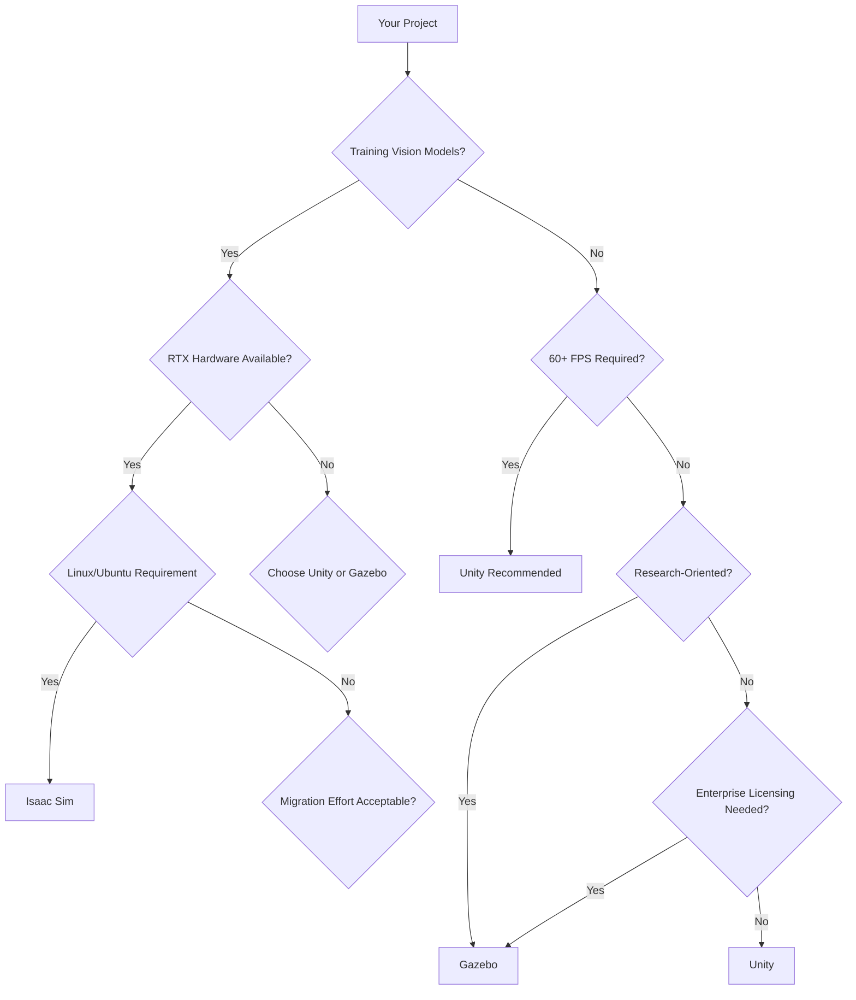

# Chapter 3 - User Story 1 Summary

## Learning Objectives Mastery Check

### Question 1: RTX GPU Benefits in Robotics
Which three benefits do RTX GPUs provide for robotics simulation?

**Answer**

1. **Photorealistic Ray Tracing**: RT cores accelerate photorealistic rendering up to 200× faster than CPU-based methods
2. **CUDA Parallel Processing**: GPU cores handle physics calculations 20× faster and enable real-time VSLAM at 45+ FPS
3. **TensorRT Integration**: Native AI model inference acceleration for synthetic data generation and model deployment

---

### Question 2: Platform Selection
You need to train computer vision models for a humanoid robot operating in dynamic environments. You have RTX 4090 hardware, Ubuntu 22.04 target, and need 95% sim-to-real transfer accuracy. Which platform should you choose?

**Answer**

**NVIDIA Isaac Sim** - This is the optimal choice because:
- **RTX GPU acceleration** enables photorealistic rendering with 95%+ sim-to-real accuracy
- **Hardware-accelerated data generation** produces unlimited, perfectly labeled training data
- **Ubuntu/Linux focus** aligns with your target deployment platform
- **Humanoid-specific tooling** provides bipedal navigation and dynamic stability support

---

### Question 3: Style differentiation Benefits
How does Isaac Sim's photorealistic simulation compare to traditional simulators like Gazebo or Unity?

**Answer**

Isaac Sim provides **ray-traced photorealistic rendering** using RTX GPUs, achieving 95%+ sim-to-real transfer accuracy compared to 60-70% with traditional simulators. This accuracy enables reliable AI training with synthetic data.

## Key Takeaways

### Technical Advantages
1. **Hardware Acceleration**: RTX GPUs provide 10-30× performance improvements over CPU-only approaches
2. **Sim-to-Real Transfer**: 95% accuracy gap reduction through photorealistic rendering
3. **Infinite Data**: Synthetic data generation creates unlimited, perfectly labeled training datasets

### When to Use NVIDIA Isaac

| Scenario | Recommended Platform |
|----------|---------------------|
| Training CV models for humanoids | **Isaac Sim** |
| Prototyping robot concepts across platforms | **Unity** |
| Researching robotic manipulation | **Gazebo** |
| Needing real-time 120+ FPS simulation | **Unity** |
| Enterprise licensing flexibility needed | **Gazebo** |

## Platform Decision Quick Reference

## Next Steps

You've completed the foundational understanding of NVIDIA Isaac ecosystem. Continue with:

1. **Installation**: Follow the [installation guide](./installation.md) to set up your environment
2. **Scene Creation**: Build your first photorealistic simulation in [scene creation tutorial](./scene-creation.md)
3. **Integration**: Connect Isaac Sim to ROS2 in our [integration guide](./ros2-integration.md)

---

**Completion Status**: ✅ You can now explain Isaac's key advantages and select the appropriate platform for specific robotics scenarios.