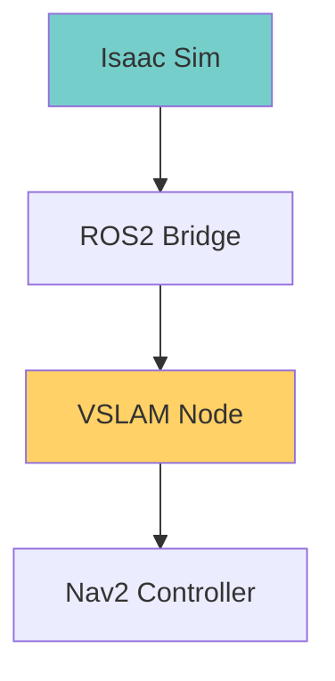
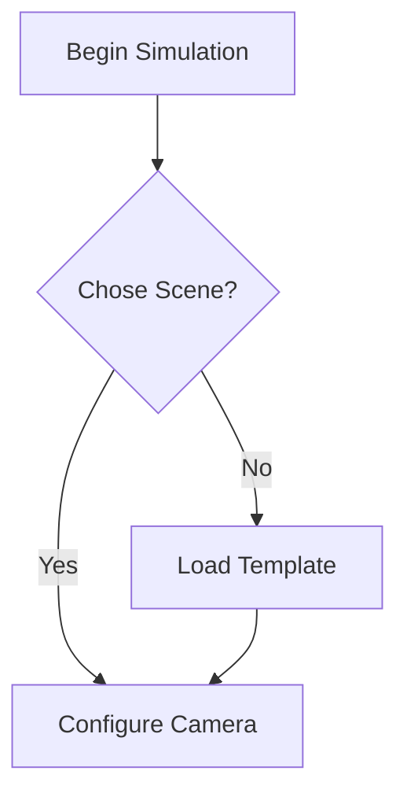

# Docusaurus MDX Guidelines - Chapter 3

This document provides style guidelines for writing documentation in the Isaac chapter using Docusaurus MDX format.

## Markdown Extensions

### Admonitions (Callouts)

Use different callout types to highlight important information:

```markdown
:::info
Standard information about Isaac Sim features.
:::

:::tip
Practical tip for better performance or workflow.
:::

:::note
Important note about compatibility or requirements.
:::

:::warning
Warning about potential issues or limitations.
:::

:::danger
Critical warning about hardware damage or data loss.
:::
```

### Tabs for Alternative Instructions

```markdown
import Tabs from '@theme/Tabs';
import TabItem from '@theme/TabItem';

<Tabs>
  <TabItem value="ubuntu-22" label="Ubuntu 22.04" default>
    Modern Ubuntu with Wayland
  </TabItem>
  <TabItem value="ubuntu-20" label="Ubuntu 20.04">
    Legacy Ubuntu with X11
  </TabItem>
</Tabs>
```

## Mermaid Diagram Guidelines

### Architecture Diagram



### User Story Flow



## Code Block Standards

### Terminal Commands

```bash title="Install Isaac Sim"
# This will download approximately 20GB
curl -L -o isaac-sim.tar.xz https://developer.nvidia.com/downloads/isaac-sim-4-0-0.tar.xz
tar -xf isaac-sim.tar.xz
cd isaac-sim-4.0.0
```

### Python Configuration

```python title="camera_config.py"
import omni.isaac.core.utils.prims as prim_utils
from omni.isaac.sensor import Camera

# Configure stereo camera pair
camera = Camera(
    prim_path="/World/left_camera",
    position=np.array([0.05, 0, 1.6]),
    frequency=30,
    resolution=(1920, 1080),
    enable_rgb=True,
    enable_depth=True
)
```

### ROS2 Launch Files

```python title="vslam_launch.py"
{
    "enable_localization_n_mapping": True,
    "enable_slam_visualization": True,
    "performance_target_fps": 30
}
```

## Image Management

### Asset Organization

Structure images according to:
```
static/img/chapter-3-isaac-ai-brain/
├── screenshots/
│   ├── isaac-sim-launch.png
│   └── scene-properties.png
├── diagrams/
│   ├── architecture-overview.svg
│   └── vslam-pipeline.png
└── code/
    ├── camera-setup-listing.png
    └── bbox-output.png
```

### Image References

```markdown

```

Use SVG for diagrams when possible, PNG for screenshots.

## Table Formatting

### Comparison Tables

| Feature | Gazebo | Unity | Isaac Sim |
|---------|--------|-------|-----------|
| Physics | ODE/Bullet | PhysX | PhysX + CUDA |
| Rendering | OpenGL | Built-in | **RTX Ray Tracing** |
| AI Acceleration | None | Limited | ✅ **Native** |
| Humanoid Support | Good | Moderate | **Advanced** |

### Configuration Tables

| Parameter | Value | Description |
|-----------|-------|-------------|
| step_duration | 0.8s | Time for single footstep |
| max_step_height | 0.15m | Maximum terrain height |
| foot_clearance | 0.05m | Minimum obstacle clearance |

## Learning Aids

### Checklists

```markdown
## Prerequisites Checklist

- [ ] NVIDIA RTX 3060+ GPU installed
- [ ] Ubuntu 22.04 LTS with CUDA 11.8+
- [ ] ROS2 Humble Hawksbill ready
- [ ] 50GB+ storage space available
```

### Step-by-Step Lists

1. **Install dependencies**: Run the setup script
2. **Launch Isaac Sim**: Use the provided launch file
3. **Configure scene**: Set up warehouse environment
4. **Create cameras**: Position stereo pair
5. **Generate dataset**: Run data collection

## Markdown Style Guide

### Headings

- Use `#` for page titles
- Use `##` for main sections
- Use `###` for subsections
- Maximum depth: `####` (avoid deeper nesting)

### Emphasis

- Bold for **key terms** and **UI elements**
- Code font for `technical terms`, `file paths`, and `commands`
- *Italics* sparingly for emphasis or new concepts

### Links

Internal links should use relative paths:
- ✅ `./perception-configuration.md`
- ✅ `../api/slam-endpoints.md`
- ❌ Absolute paths or external references

## Performance Guidelines

### Page Load Optimization

1. **Limit large diagrams** - Keep SVGs < 100KB
2. **Compress images** - Use TinyPNG for PNG optimization
3. **Split long pages** - Keep MDX files < 50KB
4. **Lazy load heavy content** - Use MDX components strategically

### Accessibility Standards

- All images must have `alt` text
- Use semantic markup (proper heading hierarchy)
- Provide text alternatives for complex diagrams
- Color-blind friendly palette for charts/graphs

## Review Checklist

Before submitting content, verify:

- [ ] All code examples are tested and executable
- [ ] Mermaid diagrams render without syntax errors
- [ ] Images are optimized and placed correctly
- [ ] Internal links work in preview
- [ ] Content follows required learning objectives
- [ ] Technical accuracy validated with current versions
- [ ] Success criteria can be independently tested

## Troubleshooting Documentation Issues

If MDX files fail to build:

1. **Check mermaid syntax**: Use < /> not < />
2. **Validate JSX expressions**: Escape `{}` in code blocks
3. **Verify image paths**: Ensure relative paths are correct
4. **Test in development**: `npm run start` before building

---

**Refer to**: [Main Docusaurus docs](https://docusaurus.io/docs/markdown-features) for complete syntax reference

**Next**: Apply these guidelines when writing [perception configuration](../02-isaac-sim-synthetic-data.md)."}''