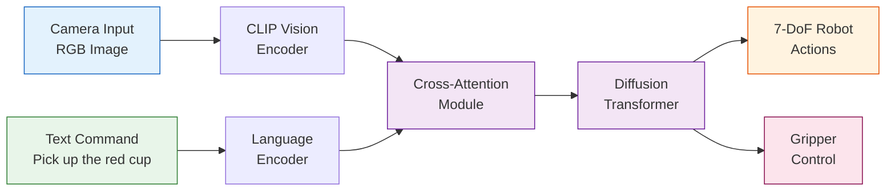
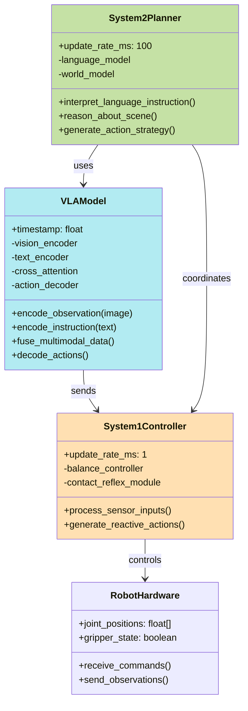

# 4.1 Introduction to Vision-Language-Action Models

## Learning Objectives

After completing this sub-chapter, you will be able to:

1. **Define** Vision-Language-Action (VLA) models and explain how they unify perception, natural language, and motor control
2. **Identify** the three architectural pillars that form the foundation of every VLA system
3. **Explain** the dual-system architecture pattern used by modern VLA models for reasoning and control
4. **Compare** leading VLA models (GR00T N1.5, OpenVLA, π0.6) based on architecture and use cases

## What Are VLA Models?

Vision-Language-Action (VLA) models are a paradigm shift in robotics, unifying three essential capabilities into single neural networks. Unlike traditional robotic systems that handle perception, reasoning, and action control as separate, hand-coded components, VLA models learn all three skills jointly from multimodal data.

Consider this scenario: A humanoid robot equipped with a VLA model receives the command, "Please clear the dishes from the dining table and put them in the dishwasher." Here's what happens internally:

1. **Vision**: The model perceives the cluttered table, identifies plates, cups, and utensils
2. **Language**: It understands the task, breaking it into sub-goals (find dishes, pick them up, locate dishwasher, load)
3. **Action**: It generates precise motor commands to reach, grasp, and transport each item

This holistic approach enables **generalization**. Show a VLA model dishes in a new kitchen with different colors and positions, and it still succeeds—it has learned the abstract concept of "dishwasher loading" rather than memorizing specific motions.

## The Three Pillars of VLA

Every VLA model architecture rests upon three pillars that process data in sequence:

### 1. Vision Pipeline
Converts visual observations into meaningful representations:
```
RGB Camera → Vision Encoder → Visual Embeddings
[HW3] → [Patch Embeddings] → [Visual Features]
```

Common encoders include:
- **CLIP ViT**: Vision Transformer pre-trained on image-text pairs
- **PaliGemma**: Google's vision-language encoder with spatial reasoning
- **Grounded-SAM2**: Segment Anything Model v2 for precise pixel-level understanding

### 2. Language Processing
Parses natural language instructions into structured understanding:
```
Natural Language → Language Encoder → Text Embeddings
[Text JSON] → [Token IDs] → [Contextual Embeddings]
```

Popular choices:
- **Large Language Models**: GPT-4, Claude, Llama 3
- **Instruction-Tuned Models**: Specialized for following robot commands
- **Domain-Specific**: Models fine-tuned on robotics terminology

### 3. Action Decoding
Transforms fused multimodal representations into motor commands:
```
Fused Embeddings → Action Decoder → Robot Actions
[Combined Features] → [Specialized Decoder] → [7-DoF End-Effector]
```

Decoder architectures:
- **Diffusion Transformers**: Probability distributions over actions (π0.6)
- **Flow Matching**: Direct trajectory prediction via learned dynamics
- **Discrete Motion Primitives**: Vocabulary of atomic motions

## VLA Pipeline Architecture



## Dual-System Architecture

Modern VLA models employ a **dual-system architecture** inspired by human cognition:

### System 1: Reactive Control
- **Speed**: sub-millisecond responses
- **Task**: Low-level motion control, reflex actions
- **Examples**: Maintaining balance, adapting to contact forces

### System 2: Deliberative Reasoning
- **Speed**: dozens to hundreds of milliseconds
- **Task**: High-level planning, context understanding
- **Examples**: Interpreting complex instructions, strategizing approach

This mirrors how humans operate: when coffee spills, System 1 instantly stabilizes your laptop as System 2 processes "Clean up this mess."

## Dual-System Class Diagram



## State-of-the-Art VLA Models

The VLA landscape evolves rapidly. Here's comparison of leading models as of December 2025:

| Model | Developer | Parameters | Architecture | Training Data | Strengths | Best For |
|-------|-----------|------------|--------------|---------------|-----------|----------|
| **GR00T N1.5** | NVIDIA | 5B | Dual-System (VLM + DiT) | 1M+ teleoperated hours | Fine-tunable, Isaac Sim integration | Industrial applications, simulation-to-real |
| **OpenVLA** | UC Berkeley | 7B | Prismatic + DiT | RT-1 dataset (130k episodes) | Open-source, customizable | Research, custom fine-tuning |
| **π0.6** | Physical Intelligence | 5B | Flow Matching expert | Heterogeneous prompts | Real-world deployment proven | Production household robots |
| **ChatVLA-2** | Stanford | 13B | Instruction-tuned | Diverse internet data | Maintains VLM capabilities during training | Multi-modal reasoning |

### Conceptual VLA Forward Pass

```python
# Conceptual VLA implementation (educational pseudo-code)
import torch
from typing import List, Tuple

class VisionLanguageAction:
    def __init__(
        self,
        vision_encoder,  # e.g., CLIP ViT
        text_encoder,    # e.g., Llama, GPT
        fusion_module,   # Cross-attention layers
        action_decoder   # Diffusion or flow
    ):
        self.vision = vision_encoder
        self.language = text_encoder
        self.fusion = fusion_module
        self.actor = action_decoder

    def forward(
        self,
        rgb_image: torch.Tensor,      # [C, H, W]
        text_command: str,             # "Pick up the red cup"
        robot_joint_angles: torch.Tensor = None  # [N, 7]
    ) -> torch.Tensor:
        # Encode visual observation
        visual_features = self.vision(rgb_image)
        encoding_time = time.time()

        # Encode textual instruction
        text_features = self.language(text_command)

        # Fuse multimodal representations
        fused_features = self.fusion(
            vision=visual_features,
            language=text_features,
            proprioception=robot_joint_angles
        )

        # Generate action predictions
        actions = self.actor(fused_features)

        return actions  # [Δx, Δy, Δz, Δroll, Δpitch, Δyaw, gripper]

# Usage example
vla_model = VisionLanguageAction(
    vision_encoder=CLIP_ViT(),
    text_encoder=Llama2_7B(),
    fusion_module=CrossAttentionFusion(),
    action_decoder=DiffusionTransformer()
)

robot_actions = vla_model(
    rgb_image=camera_frame,
    text_command="Pick up the red cup and place it on the table",
    robot_joint_angles=current_joints
)
```

### Loading & Using OpenVLA Model

```python
# Python 3.11+
# Loading a state-of-the-art VLA model (PyTorch 2.x)
from transformers import VlaModel, VlaProcessor
from PIL import Image

# Load OpenVLA model and processor
model = VlaModel.from_pretrained("yl7900/open-vla-7b")
processor = VlaProcessor.from_pretrained("yl7900/open-vla-7b")

# Prepare inputs
camera_image = Image.open("kitchen_scene.jpg")
instruction = "Clear the table and load the dishwasher"

# Encode multimodal inputs
inputs = processor(
    images=camera_image,
    text=instruction,
    return_tensors="pt"
)

# Generate actions
with torch.no_grad():
    outputs = model(**inputs)

    # Decode actions from model outputs
    next_action = processor.decode_action(
        outputs.logits,
        normalization_stats=dataset_stats
    )

# Execute on robot
current_joints = get_robot_state()
target_joints = current_joints + next_action
move_robot(target_joints)
```

## Exercises

### Exercise 1: Diagram Completion (Easy)
Complete the VLA pipeline diagram by:
1. Adding missing data dimensions to each stage
2. Labeling key fusion layer operations
3. Identifying which components run at different update frequencies

### Exercise 2: Model Comparison (Medium)
Create a detailed comparison matrix of three VLA models not covered above (research ChatVLA-2, SpatialVLA, or any recent ArXiv papers). Include:
- Architecture differences
- Training dataset composition
- Intended deployment scenario
- Open-source availability

### Exercise 3: Architecture Design (Hard)
Design a variant VLA architecture for a specific use case (e.g., autonomous driving, warehouse automation, or household manipulation). Consider:
- How to handle the domain's unique challenges
- Which existing components to reuse vs. rebuild
- Performance requirements and safety constraints
- Training data collection strategy

## Further Reading

For deeper understanding of VLA architectures and current research:

1. **NVIDIA GR00T Paper** (2025): "Open Foundation Model for Humanoid Robots"
   - Technical implementation details
   - Fine-tuning strategies for specific tasks
   - Performance benchmarks across robot platforms

2. **OpenVLA Repository** (GitHub): `github.com/openvla`
   - Practical implementation examples
   - Training and fine-tuning code
   - Community-contributed improvements

3. **VLA Survey** (ArXiv 2024): "Vision-Language-Action Models for Robotics"
   - Comprehensive architecture comparison
   - Training dataset analysis
   - Future research directions

## Next Steps

Now that you understand VLA architecture and leading models, let's implement the first practical component: **speech recognition** that converts natural language instructions into robot commands. In [sub-chapter 4.2](./02-voice-to-action.md), you'll build a complete voice-to-action pipeline using OpenAI Whisper and ROS 2, culminating in a 15-minute Quick Start that enables voice-controlled robot operation.