# 4.3 Cognitive Planning with LLMs

## Learning Objectives

By completing this sub-chapter, you will be able to:

1. **Implement** LLM-based task planning using function calling patterns
2. **Validate** LLM outputs with Pydantic schemas for type safety and correctness
3. **Design** feedback loops that enable LLMs to recover from execution errors
4. **Apply** safety constraints to prevent physically impossible or dangerous actions

## Quick Start: Pick Up Cup Planning (15 Minutes)

Transform "Pick up the cup" into executable robot actions using an LLM planner.

### Prerequisites
- OpenAI API key (or Anthropic Claude API)
- ROS 2 Humble installed
- Python 3.11+ with `openai` and `pydantic` packages

### Step 1: Install Dependencies

```bash
pip install openai pydantic
export OPENAI_API_KEY="your-api-key-here"  # Or use .env file
```

### Step 2: Define Action Schema

```python
# robot_actions.py
from pydantic import BaseModel, Field
from typing import Literal, List
from enum import Enum

class ActionType(str, Enum):
    """Valid robot action types"""
    NAVIGATE = "navigate"
    SCAN = "scan"
    GRASP = "grasp"
    PLACE = "place"
    RELEASE = "release"

class RobotAction(BaseModel):
    """Single robot action with parameters"""
    action_type: ActionType
    target: str = Field(..., description="Target object or location name")
    position: tuple[float, float, float] | None = Field(None, description="3D coordinates (x, y, z) in meters")
    confidence: float = Field(default=1.0, ge=0.0, le=1.0)
    
    class Config:
        use_enum_values = True

class TaskPlan(BaseModel):
    """Complete task plan as sequence of actions"""
    task_description: str
    actions: List[RobotAction] = Field(..., min_items=1, max_items=20)
    estimated_duration: float = Field(..., description="Estimated duration in seconds", gt=0)
```

**Expected**: Schemas define valid action types and enforce constraints (e.g., max 20 actions).

### Step 3: Create LLM Function Calling

```python
# llm_planner.py
from openai import OpenAI
import json
from robot_actions import TaskPlan, RobotAction, ActionType

client = OpenAI()  # Reads OPENAI_API_KEY from env

# Define function schema for OpenAI
FUNCTION_SCHEMA = {
    "name": "create_robot_plan",
    "description": "Generate a sequence of robot actions to accomplish a task",
    "parameters": {
        "type": "object",
        "properties": {
            "task_description": {
                "type": "string",
                "description": "High-level task description"
            },
            "actions": {
                "type": "array",
                "items": {
                    "type": "object",
                    "properties": {
                        "action_type": {
                            "type": "string",
                            "enum": ["navigate", "scan", "grasp", "place", "release"]
                        },
                        "target": {"type": "string"},
                        "position": {
                            "type": "array",
                            "items": {"type": "number"},
                            "minItems": 3,
                            "maxItems": 3
                        }
                    },
                    "required": ["action_type", "target"]
                }
            },
            "estimated_duration": {"type": "number"}
        },
        "required": ["task_description", "actions", "estimated_duration"]
    }
}

def plan_task(task_description: str) -> TaskPlan:
    """Use LLM to generate task plan"""
    response = client.chat.completions.create(
        model="gpt-4",
        messages=[
            {"role": "system", "content": "You are a robot task planner. Generate executable action sequences."},
            {"role": "user", "content": f"Plan how to: {task_description}"}
        ],
        functions=[FUNCTION_SCHEMA],
        function_call={"name": "create_robot_plan"}
    )
    
    # Extract function call arguments
    function_call = response.choices[0].message.function_call
    plan_data = json.loads(function_call.arguments)
    
    # Validate with Pydantic
    plan = TaskPlan(**plan_data)
    return plan
```

### Step 4: Test the Planner

```python
# test_planner.py
from llm_planner import plan_task

# Test with simple command
plan = plan_task("Pick up the cup from the table")

print(f"Task: {plan.task_description}")
print(f"Estimated Duration: {plan.estimated_duration}s")
print(f"\nAction Sequence ({len(plan.actions)} steps):")

for i, action in enumerate(plan.actions, 1):
    print(f"{i}. {action.action_type.upper()}: {action.target}")
    if action.position:
        print(f"   Position: {action.position}")
```

**Expected Output**:
```
Task: Pick up the cup from the table
Estimated Duration: 15.0s

Action Sequence (4 steps):
1. NAVIGATE: table
   Position: (1.5, 0.3, 0.0)
2. SCAN: cup
3. GRASP: cup
   Position: (1.5, 0.3, 0.8)
4. NAVIGATE: home_position
   Position: (0.0, 0.0, 0.0)
```

### Step 5: Integrate with ROS 2

```python
# planning_node.py
import rclpy
from rclpy.node import Node
from std_msgs.msg import String
from llm_planner import plan_task
import json

class CognitivePlanningNode(Node):
    def __init__(self):
        super().__init__('cognitive_planning_node')
        
        # Subscribe to voice commands
        self.subscription = self.create_subscription(
            String,
            '/voice/command',
            self.command_callback,
            10
        )
        
        # Publish action plans
        self.plan_pub = self.create_publisher(String, '/robot/action_plan', 10)
        
        self.get_logger().info("Cognitive Planning Node ready")
    
    def command_callback(self, msg):
        """Generate plan from voice command"""
        command = msg.data
        self.get_logger().info(f"Planning task: {command}")
        
        try:
            # Generate plan using LLM
            plan = plan_task(command)
            
            # Publish as JSON
            plan_msg = String()
            plan_msg.data = plan.model_dump_json()
            self.plan_pub.publish(plan_msg)
            
            self.get_logger().info(f"Plan generated: {len(plan.actions)} actions")
            
        except Exception as e:
            self.get_logger().error(f"Planning failed: {e}")

def main(args=None):
    rclpy.init(args=args)
    node = CognitivePlanningNode()
    rclpy.spin(node)
    node.destroy_node()
    rclpy.shutdown()

if __name__ == '__main__':
    main()
```

**Result**: Voice commands now automatically generate validated action plans! 🎉

---

## LLM Planning Fundamentals

### Why LLMs for Robot Planning?

Traditional robot planning uses algorithms like A* for path planning or PDDL for task planning. These approaches require:

1. **Explicit world models**: Complete knowledge of environment state
2. **Hand-coded rules**: "If object is graspable, approach from above"
3. **Domain-specific languages**: PDDL, STRIPS, or custom DSLs
4. **Expert tuning**: Parameter adjustment for each robot/task

**LLM-based planning** offers a paradigm shift:

- **Zero-shot task understanding**: No hand-coded rules needed
- **Natural language interface**: "Clean the room" instead of formal syntax
- **Common-sense reasoning**: Knows cups are graspable, tables are surfaces
- **Flexible adaptation**: Handles novel tasks without retraining

**Example**:

Traditional planner requires:
```python
def plan_pick_up(object_name, location):
    if not is_graspable(object_name):
        raise ValueError(f"{object_name} cannot be grasped")
    if not is_reachable(location):
        raise ValueError(f"{location} is out of reach")
    return [Navigate(location), Grasp(object_name)]
```

LLM planner:
```python
plan = llm.plan("Pick up the cup")  # Figures out navigate → grasp automatically
```

### Limitations and Risks

⚠️ **Critical**: LLMs can generate physically impossible or unsafe plans. Always validate outputs.

**Common LLM Planning Errors**:
1. **Hallucinated objects**: Plans actions for objects that don't exist
2. **Incorrect physics**: "Fly to the ceiling" (robot can't fly)
3. **Missing dependencies**: Tries to grasp before navigating to object
4. **Infinite loops**: "Navigate to X, navigate back, navigate to X..."

**Mitigation**: Use Pydantic validation + safety constraints (covered below).

---

## Function Calling Pattern

### What is Function Calling?

Function calling (also called "tool use") allows LLMs to generate structured outputs that match predefined schemas. Instead of free-form text, the LLM produces JSON that conforms to a function signature.

**Without Function Calling**:
```python
response = llm.complete("Plan: Pick up cup")
# Returns: "First, navigate to the table. Then scan for the cup..."
# Problem: Unstructured text, hard to parse
```

**With Function Calling**:
```python
response = llm.call_function("create_robot_plan", prompt)
# Returns: {"actions": [{"action_type": "navigate", "target": "table"}, ...]}
# Benefit: Structured JSON, type-safe
```

### Implementation with OpenAI API

```python
# complete_llm_planner.py
from openai import OpenAI
from typing import List
import json

client = OpenAI()

# Define multiple functions for different robot capabilities
FUNCTIONS = [
    {
        "name": "create_navigation_plan",
        "description": "Plan a navigation path to a target location",
        "parameters": {
            "type": "object",
            "properties": {
                "target_location": {"type": "string"},
                "avoid_obstacles": {"type": "boolean"},
                "max_speed": {"type": "number", "minimum": 0.1, "maximum": 2.0}
            },
            "required": ["target_location"]
        }
    },
    {
        "name": "create_manipulation_plan",
        "description": "Plan object manipulation (grasp, place, release)",
        "parameters": {
            "type": "object",
            "properties": {
                "object_name": {"type": "string"},
                "action": {"type": "string", "enum": ["grasp", "place", "release"]},
                "target_location": {"type": "string"}
            },
            "required": ["object_name", "action"]
        }
    },
    {
        "name": "create_task_plan",
        "description": "Plan a complete multi-step task",
        "parameters": {
            "type": "object",
            "properties": {
                "task_description": {"type": "string"},
                "actions": {
                    "type": "array",
                    "items": {
                        "type": "object",
                        "properties": {
                            "action_type": {"type": "string"},
                            "parameters": {"type": "object"}
                        }
                    }
                }
            },
            "required": ["task_description", "actions"]
        }
    }
]

def plan_with_multi_functions(user_request: str):
    """Let LLM choose which function to call based on request"""
    response = client.chat.completions.create(
        model="gpt-4",
        messages=[
            {"role": "system", "content": "You are a helpful robot assistant. Choose the appropriate planning function based on the user's request."},
            {"role": "user", "content": user_request}
        ],
        functions=FUNCTIONS,
        function_call="auto"  # Let LLM choose function
    )
    
    message = response.choices[0].message
    
    if message.function_call:
        function_name = message.function_call.name
        arguments = json.loads(message.function_call.arguments)
        return {
            "function": function_name,
            "arguments": arguments
        }
    else:
        return {"error": "No function called", "content": message.content}

# Test
result = plan_with_multi_functions("Navigate to the kitchen")
print(f"LLM chose function: {result['function']}")
print(f"Arguments: {result['arguments']}")
```

**Expected**:
```
LLM chose function: create_navigation_plan
Arguments: {'target_location': 'kitchen', 'avoid_obstacles': True, 'max_speed': 1.0}
```

### Anthropic Claude Function Calling

OpenAI and Anthropic use slightly different APIs. Here's the Claude equivalent:

```python
# claude_planner.py
from anthropic import Anthropic

client = Anthropic()  # Reads ANTHROPIC_API_KEY from env

CLAUDE_TOOL = {
    "name": "create_robot_plan",
    "description": "Generate a sequence of robot actions",
    "input_schema": {
        "type": "object",
        "properties": {
            "actions": {
                "type": "array",
                "items": {
                    "type": "object",
                    "properties": {
                        "action_type": {"type": "string"},
                        "target": {"type": "string"}
                    }
                }
            }
        },
        "required": ["actions"]
    }
}

def plan_with_claude(task: str):
    response = client.messages.create(
        model="claude-3-5-sonnet-20241022",
        max_tokens=1024,
        tools=[CLAUDE_TOOL],
        messages=[{"role": "user", "content": f"Plan: {task}"}]
    )
    
    # Extract tool use from response
    for block in response.content:
        if block.type == "tool_use":
            return block.input
    
    return None
```

---

## Schema Validation with Pydantic

### Why Pydantic?

LLMs sometimes generate invalid JSON:
- Missing required fields
- Wrong data types (`"5.2"` instead of `5.2`)
- Out-of-range values (negative durations, coordinates outside workspace)

**Pydantic** provides:
1. **Runtime type checking**: Ensures `position` is `tuple[float, float, float]`
2. **Field validation**: Enforces `confidence >= 0.0 and <= 1.0`
3. **Automatic coercion**: Converts `"5.2"` to `5.2` when possible
4. **Clear error messages**: "estimated_duration must be greater than 0"

### Advanced Pydantic Models

```python
# advanced_schemas.py
from pydantic import BaseModel, Field, field_validator, model_validator
from typing import List, Literal
import numpy as np

class Position3D(BaseModel):
    """3D position with workspace constraints"""
    x: float = Field(..., ge=-5.0, le=5.0, description="X coordinate in meters")
    y: float = Field(..., ge=-5.0, le=5.0, description="Y coordinate in meters")
    z: float = Field(..., ge=0.0, le=2.5, description="Z coordinate in meters (height)")
    
    @field_validator('x', 'y', 'z')
    @classmethod
    def round_precision(cls, v):
        """Round to 3 decimal places"""
        return round(v, 3)

class GraspAction(BaseModel):
    """Grasp action with physics constraints"""
    action_type: Literal["grasp"] = "grasp"
    object_name: str = Field(..., min_length=1, max_length=50)
    approach_vector: tuple[float, float, float] = Field(default=(0, 0, -1), description="Grasp approach direction")
    gripper_width: float = Field(default=0.08, ge=0.0, le=0.15, description="Gripper opening in meters")
    force: float = Field(default=10.0, ge=1.0, le=50.0, description="Grasp force in Newtons")
    
    @field_validator('approach_vector')
    @classmethod
    def normalize_vector(cls, v):
        """Ensure approach vector is normalized"""
        norm = np.linalg.norm(v)
        if norm == 0:
            raise ValueError("Approach vector cannot be zero")
        return tuple(np.array(v) / norm)

class NavigateAction(BaseModel):
    """Navigation action with path constraints"""
    action_type: Literal["navigate"] = "navigate"
    target: Position3D
    max_velocity: float = Field(default=1.0, ge=0.1, le=2.0, description="Max speed in m/s")
    obstacle_clearance: float = Field(default=0.3, ge=0.1, le=1.0, description="Minimum clearance in meters")

class EnhancedTaskPlan(BaseModel):
    """Task plan with cross-action validation"""
    task_description: str
    actions: List[GraspAction | NavigateAction]
    total_distance: float | None = None
    
    @model_validator(mode='after')
    def validate_action_sequence(self):
        """Ensure action sequence is physically valid"""
        # Check: Can't grasp before navigating to object
        for i, action in enumerate(self.actions):
            if isinstance(action, GraspAction):
                if i == 0:
                    raise ValueError("Cannot grasp as first action (must navigate first)")
                prev_action = self.actions[i-1]
                if not isinstance(prev_action, NavigateAction):
                    raise ValueError(f"Grasp must be preceded by navigation, got {type(prev_action).__name__}")
        
        return self

# Test validation
try:
    plan = EnhancedTaskPlan(
        task_description="Pick up cup",
        actions=[
            GraspAction(object_name="cup")  # Invalid: grasp without navigation
        ]
    )
except ValueError as e:
    print(f"Validation error: {e}")
    # Output: "Cannot grasp as first action (must navigate first)"
```

### Custom Validators for Robot Safety

```python
# safety_validators.py
from pydantic import BaseModel, field_validator

# Define safe workspace bounds (example for tabletop robot)
SAFE_WORKSPACE = {
    "x_min": -0.5, "x_max": 0.5,
    "y_min": -0.3, "y_max": 0.3,
    "z_min": 0.0, "z_max": 0.4
}

class SafePosition(BaseModel):
    x: float
    y: float
    z: float
    
    @field_validator('x')
    @classmethod
    def validate_x(cls, v):
        if not (SAFE_WORKSPACE["x_min"] <= v <= SAFE_WORKSPACE["x_max"]):
            raise ValueError(f"X position {v} outside safe workspace")
        return v
    
    @field_validator('y')
    @classmethod
    def validate_y(cls, v):
        if not (SAFE_WORKSPACE["y_min"] <= v <= SAFE_WORKSPACE["y_max"]):
            raise ValueError(f"Y position {v} outside safe workspace")
        return v
    
    @field_validator('z')
    @classmethod
    def validate_z(cls, v):
        if not (SAFE_WORKSPACE["z_min"] <= v <= SAFE_WORKSPACE["z_max"]):
            raise ValueError(f"Z position {v} outside safe workspace")
        return v

# LLM might generate position outside workspace
try:
    dangerous_pos = SafePosition(x=10.0, y=0.0, z=0.0)  # Far outside bounds
except ValueError as e:
    print(f"Safety violation prevented: {e}")
```

---

## Feedback Loops for Error Recovery

### Why Feedback Loops?

Real-world robot execution fails frequently:
- Object moved since planning
- Grasp failed (object slipped)
- Navigation blocked by unexpected obstacle
- Sensor noise caused mis-detection

**Feedback loops** allow LLMs to adapt plans based on execution results.

### Architecture

```mermaid
sequenceDiagram
    participant User
    participant Planner as LLM Planner
    participant Executor as Action Executor
    participant Robot
    
    User->>Planner: "Pick up cup"
    Planner->>Executor: Plan: [navigate, grasp, place]
    Executor->>Robot: Execute action 1: navigate
    Robot->>Executor: ✓ Success
    Executor->>Robot: Execute action 2: grasp
    Robot->>Executor: ✗ Failure (object slipped)
    Executor->>Planner: Error: "Grasp failed, cup slipped"
    Planner->>Planner: Replan considering error
    Planner->>Executor: Updated plan: [approach_differently, reattempt_grasp]
    Executor->>Robot: Execute revised plan
    Robot->>Executor: ✓ Success
    Executor->>User: Task completed
```



### Implementation

```python
# feedback_loop.py
from openai import OpenAI
from robot_actions import TaskPlan, RobotAction
import json

client = OpenAI()

class FeedbackPlanner:
    def __init__(self):
        self.conversation_history = []
        self.execution_log = []
    
    def plan(self, task: str) -> TaskPlan:
        """Generate initial plan"""
        self.conversation_history = [
            {"role": "system", "content": "You are a robot task planner. Generate executable plans and adapt to feedback."},
            {"role": "user", "content": f"Plan: {task}"}
        ]
        
        response = client.chat.completions.create(
            model="gpt-4",
            messages=self.conversation_history,
            functions=[FUNCTION_SCHEMA],
            function_call={"name": "create_robot_plan"}
        )
        
        # Parse plan
        function_call = response.choices[0].message.function_call
        plan = TaskPlan(**json.loads(function_call.arguments))
        
        # Save to history
        self.conversation_history.append(response.choices[0].message)
        
        return plan
    
    def replan_on_error(self, failed_action: RobotAction, error_message: str) -> TaskPlan:
        """Generate new plan based on execution error"""
        # Add error feedback to conversation
        feedback = f"Action '{failed_action.action_type}' on '{failed_action.target}' failed: {error_message}. Generate a recovery plan."
        
        self.conversation_history.append({"role": "user", "content": feedback})
        
        # Request new plan
        response = client.chat.completions.create(
            model="gpt-4",
            messages=self.conversation_history,
            functions=[FUNCTION_SCHEMA],
            function_call={"name": "create_robot_plan"}
        )
        
        # Parse recovery plan
        function_call = response.choices[0].message.function_call
        recovery_plan = TaskPlan(**json.loads(function_call.arguments))
        
        # Log recovery attempt
        self.execution_log.append({
            "failed_action": failed_action.model_dump(),
            "error": error_message,
            "recovery_plan": recovery_plan.model_dump()
        })
        
        return recovery_plan

# Usage example
planner = FeedbackPlanner()

# Initial plan
plan = planner.plan("Pick up the cup from the table")
print(f"Initial plan: {len(plan.actions)} actions")

# Simulate grasp failure
failed_action = plan.actions[2]  # Assume action 2 is grasp
recovery = planner.replan_on_error(
    failed_action,
    "Grasp failed: cup slipped from gripper. Object appears wet."
)

print(f"\nRecovery plan: {len(recovery.actions)} actions")
for action in recovery.actions:
    print(f"  - {action.action_type}: {action.target}")
```

**Expected Recovery Plan**:
```
Initial plan: 4 actions
  - navigate: table
  - scan: cup
  - grasp: cup
  - navigate: home

Recovery plan: 3 actions
  - adjust_gripper: increase_force
  - dry_object: cup (using cloth)
  - reattempt_grasp: cup
```

---

## Safety Constraints & Validation

### Pre-execution Validation

Always validate LLM plans before execution:

```python
# safety_validator.py
from robot_actions import TaskPlan, RobotAction, ActionType
from typing import List

class SafetyValidator:
    """Validate task plans for safety and feasibility"""
    
    def __init__(self, workspace_bounds, max_actions=20, max_duration=300):
        self.workspace_bounds = workspace_bounds
        self.max_actions = max_actions
        self.max_duration = max_duration
    
    def validate_plan(self, plan: TaskPlan) -> tuple[bool, List[str]]:
        """
        Validate plan for safety violations.
        
        Returns:
            (is_valid, error_messages)
        """
        errors = []
        
        # Check 1: Plan length
        if len(plan.actions) > self.max_actions:
            errors.append(f"Plan too long: {len(plan.actions)} actions (max {self.max_actions})")
        
        # Check 2: Duration
        if plan.estimated_duration > self.max_duration:
            errors.append(f"Plan too slow: {plan.estimated_duration}s (max {self.max_duration}s)")
        
        # Check 3: Workspace bounds
        for i, action in enumerate(plan.actions):
            if action.position:
                x, y, z = action.position
                if not self._in_workspace(x, y, z):
                    errors.append(f"Action {i}: Position {action.position} outside safe workspace")
        
        # Check 4: Action sequence validity
        sequence_errors = self._validate_sequence(plan.actions)
        errors.extend(sequence_errors)
        
        return (len(errors) == 0, errors)
    
    def _in_workspace(self, x, y, z):
        """Check if position is within safe workspace"""
        return (
            self.workspace_bounds["x_min"] <= x <= self.workspace_bounds["x_max"] and
            self.workspace_bounds["y_min"] <= y <= self.workspace_bounds["y_max"] and
            self.workspace_bounds["z_min"] <= z <= self.workspace_bounds["z_max"]
        )
    
    def _validate_sequence(self, actions: List[RobotAction]) -> List[str]:
        """Validate action sequence logic"""
        errors = []
        
        # Rule: Can't grasp without first navigating to object
        for i, action in enumerate(actions):
            if action.action_type == ActionType.GRASP:
                if i == 0:
                    errors.append("Cannot grasp as first action")
                else:
                    prev_action = actions[i-1]
                    if prev_action.action_type not in [ActionType.NAVIGATE, ActionType.SCAN]:
                        errors.append(f"Grasp must follow navigate/scan, got {prev_action.action_type}")
        
        # Rule: Can't place without first grasping
        has_grasped = False
        for i, action in enumerate(actions):
            if action.action_type == ActionType.GRASP:
                has_grasped = True
            if action.action_type == ActionType.PLACE and not has_grasped:
                errors.append(f"Action {i}: Cannot place without grasping first")
        
        # Rule: Detect infinite loops (same action repeated >3 times)
        action_counts = {}
        for action in actions:
            key = (action.action_type, action.target)
            action_counts[key] = action_counts.get(key, 0) + 1
            if action_counts[key] > 3:
                errors.append(f"Potential infinite loop: {action.action_type} on {action.target} repeated {action_counts[key]} times")
        
        return errors

# Usage
validator = SafetyValidator(
    workspace_bounds={"x_min": -1.0, "x_max": 1.0, "y_min": -1.0, "y_max": 1.0, "z_min": 0.0, "z_max": 2.0}
)

# Validate a plan
is_valid, errors = validator.validate_plan(plan)
if not is_valid:
    print("⚠️  Plan validation failed:")
    for error in errors:
        print(f"  - {error}")
else:
    print("✓ Plan is safe to execute")
```

---

## Common Errors

### Error 1: "Invalid JSON from LLM"

**Symptoms**:
```
json.JSONDecodeError: Expecting ',' delimiter: line 5 column 3
```

**Causes**:
- LLM generated malformed JSON (missing comma, trailing comma, unquoted keys)
- Function calling not enforced (model returned text instead of function call)
- Model doesn't support function calling (older GPT-3.5 models)

**Solutions**:
```python
# Solution 1: Retry with explicit format instruction
def plan_with_retry(task, max_retries=3):
    for attempt in range(max_retries):
        try:
            response = client.chat.completions.create(
                model="gpt-4",
                messages=[
                    {"role": "system", "content": "Output ONLY valid JSON. No explanation."},
                    {"role": "user", "content": task}
                ],
                functions=[FUNCTION_SCHEMA],
                function_call={"name": "create_robot_plan"}
            )
            return json.loads(response.choices[0].message.function_call.arguments)
        except json.JSONDecodeError as e:
            print(f"Attempt {attempt+1} failed: {e}")
            if attempt == max_retries - 1:
                raise
    return None

# Solution 2: Use Pydantic's model_validate_json (more forgiving)
from pydantic import ValidationError

try:
    plan = TaskPlan.model_validate_json(llm_response)
except ValidationError as e:
    print(f"Validation error: {e}")
```

### Error 2: "Impossible actions generated"

**Symptoms**:
- LLM plans "Fly to ceiling" (robot can't fly)
- Plans grasp on non-existent object
- Navigates outside workspace bounds

**Causes**:
- LLM lacks robot capability knowledge
- No safety constraints in prompt
- No validation layer

**Solutions**:
```python
# Solution: Add capability constraints to system prompt
SYSTEM_PROMPT = """You are a robot task planner with these constraints:

CAPABILITIES:
- Can navigate on ground (x, y), cannot fly (z must be 0 during navigation)
- Can grasp objects weighing <2kg with gripper
- Workspace bounds: x∈[-1,1]m, y∈[-1,1]m, z∈[0,2]m
- Max reach: 0.8m from base

KNOWN OBJECTS:
- cup (0.5kg, graspable)
- table (surface, not graspable)
- box (1.2kg, graspable)

Generate plans that respect these constraints. If a task is impossible, return an error action."""

# Then use SafetyValidator to catch any violations
```

### Error 3: "LLM request timeout"

**Symptoms**:
```
openai.error.Timeout: Request timed out after 60 seconds
```

**Causes**:
- Complex task requires long thinking time
- API service overloaded
- Network latency

**Solutions**:
```python
# Solution 1: Increase timeout
client = OpenAI(timeout=120.0)  # 2 minutes

# Solution 2: Use streaming for progress updates
def plan_with_streaming(task):
    stream = client.chat.completions.create(
        model="gpt-4",
        messages=[{"role": "user", "content": task}],
        functions=[FUNCTION_SCHEMA],
        function_call={"name": "create_robot_plan"},
        stream=True
    )
    
    function_args = ""
    for chunk in stream:
        if chunk.choices[0].delta.function_call:
            function_args += chunk.choices[0].delta.function_call.arguments or ""
            print(".", end="", flush=True)  # Progress indicator
    
    return json.loads(function_args)

# Solution 3: Fallback to simpler model
def plan_with_fallback(task):
    try:
        return plan_with_model(task, model="gpt-4", timeout=30)
    except Timeout:
        print("GPT-4 timed out, falling back to GPT-3.5-turbo")
        return plan_with_model(task, model="gpt-3.5-turbo", timeout=60)
```

### Error 4: "Infinite loop in action sequence"

**Symptoms**:
- Plan contains repeated actions: `[navigate(A), navigate(B), navigate(A), navigate(B), ...]`
- Robot oscillates between positions
- Plan never completes

**Causes**:
- LLM misunderstands task completion criteria
- Feedback loop amplifies errors
- No loop detection

**Solutions**:
```python
# Solution: Detect and break loops in validator
def detect_loops(actions: List[RobotAction], max_repeats=2):
    """Detect repeated action patterns"""
    for i in range(len(actions) - max_repeats):
        window = actions[i:i+max_repeats+1]
        # Check if same action repeated
        if all(a.action_type == window[0].action_type and a.target == window[0].target for a in window):
            return True, f"Loop detected: {window[0].action_type} on {window[0].target} repeated {max_repeats+1} times"
    return False, ""

# Add to SafetyValidator
has_loop, loop_msg = detect_loops(plan.actions)
if has_loop:
    raise ValueError(f"Plan contains infinite loop: {loop_msg}")
```

---

## Exercises

### Exercise 1: Add New Action Type (Easy, 30 minutes)

**Goal**: Extend the planner to support a new "scan" action that inspects objects before grasping.

**Tasks**:
1. Add `SCAN` to `ActionType` enum
2. Create `ScanAction` Pydantic model with field `scan_duration: float`
3. Update function schema to include scan action
4. Test LLM generates scan before grasp

**Hints**:
```python
class ScanAction(BaseModel):
    action_type: Literal["scan"] = "scan"
    target: str
    scan_duration: float = Field(default=2.0, ge=0.5, le=10.0)
    scan_mode: Literal["visual", "depth", "both"] = "both"
```

### Exercise 2: Multi-step Task Planning (Medium, 45 minutes)

**Goal**: Plan a complex task like "Clean the table" that requires multiple object manipulations.

**Tasks**:
1. Define task: Pick up all objects from table, move to storage bin
2. Generate plan with LLM (should include multiple grasp-place cycles)
3. Validate plan ensures objects are placed, not just grasped
4. Add constraint: Max 3 objects can be carried simultaneously

**Hints**:
- Use `model_validator` to track carried objects count
- Require `RELEASE` action before grasping 4th object

### Exercise 3: State Machine Integration (Hard, 60 minutes)

**Goal**: Integrate LLM planner with a finite state machine for robust execution.

**Tasks**:
1. Define states: IDLE, PLANNING, EXECUTING, ERROR, REPLANNING
2. Implement state machine that:
   - Transitions IDLE → PLANNING on voice command
   - Transitions PLANNING → EXECUTING when plan validated
   - Transitions EXECUTING → ERROR on action failure
   - Transitions ERROR → REPLANNING, then back to EXECUTING
3. Add timeout: If stuck in REPLANNING >3 attempts, abort task
4. Log all state transitions

**Hints**:
```python
from enum import Enum

class State(Enum):
    IDLE = 1
    PLANNING = 2
    EXECUTING = 3
    ERROR = 4
    REPLANNING = 5

class StateMachine:
    def __init__(self):
        self.state = State.IDLE
        self.replan_attempts = 0
    
    def transition(self, new_state: State, reason: str):
        print(f"State: {self.state.name} → {new_state.name} ({reason})")
        self.state = new_state
```

---

## Further Reading

### Research Papers
1. **Large Language Models as Zero-Shot Planners** (Huang et al., 2022)
   - https://arxiv.org/abs/2201.07207
   - Shows LLMs can plan complex tasks without fine-tuning

2. **ProgPrompt: Program-Guided Prompt Engineering for Robot Planning** (Singh et al., 2023)
   - Combines LLMs with structured programming for safer plans

### Documentation
1. **OpenAI Function Calling Guide**
   - https://platform.openai.com/docs/guides/function-calling
   - Official documentation for function calling API

2. **Pydantic Documentation**
   - https://docs.pydantic.dev/
   - Complete guide to data validation with Pydantic

### Tutorials
1. **LLM Planning Survey** (Valmeekam et al., 2023)
   - https://arxiv.org/abs/2305.15771
   - Comprehensive analysis of LLM planning capabilities and limitations

---

## Next Steps

You've mastered cognitive planning! In the next sub-chapter, [4.4 Vision Integration & Object Detection](./04-vision-integration.md), you'll learn how to integrate computer vision so your robot can see the cup before trying to pick it up.

**Key Takeaways**:
- ✅ Function calling enables structured LLM outputs (type-safe JSON)
- ✅ Pydantic validation catches invalid plans before execution
- ✅ Feedback loops allow LLMs to recover from errors dynamically
- ✅ Safety validators prevent dangerous or impossible actions
- ✅ Always validate LLM outputs—they can hallucinate impossible plans
