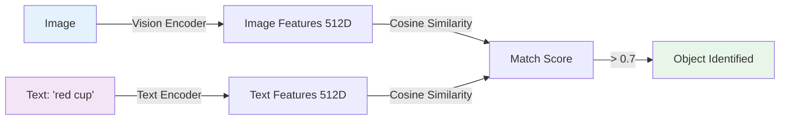
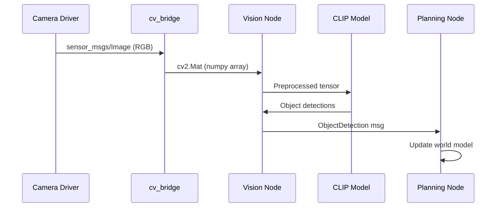
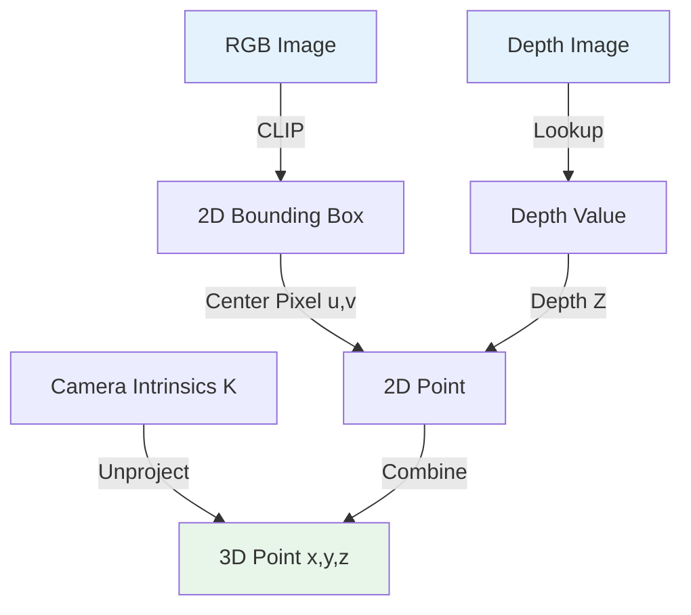
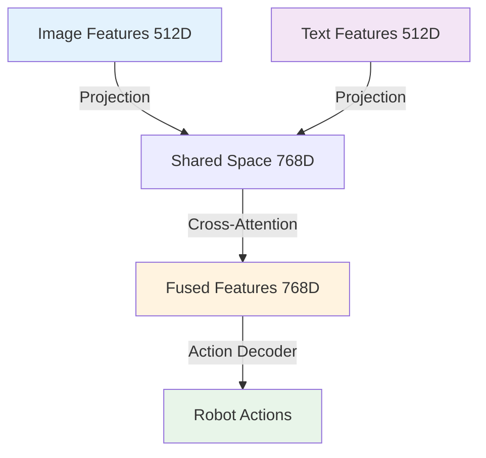

# 4.4 Vision Integration & Object Detection

## Learning Objectives

By completing this sub-chapter, you will be able to:

1. **Integrate** vision backbones (CLIP, PaliGemma) into VLA pipelines for object recognition
2. **Process** ROS 2 camera streams and convert them for vision model inference
3. **Implement** 3D object localization using depth sensors and camera intrinsics
4. **Combine** visual and language features through multimodal fusion architectures

## Vision Backbones in VLA Models

### Why Vision Matters for VLA

When you say "Pick up the red cup," the robot needs to:
1. **See** the environment through cameras
2. **Identify** which object is the "red cup" 
3. **Localize** the cup's 3D position for grasping
4. **Verify** the action succeeded after execution

Vision enables robots to ground natural language commands in the physical world. Without vision, "pick up the cup" is just text—with vision, the robot knows **which cup, where it is, and how to grasp it**.

### Vision Backbone Comparison

| Model | Type | Parameters | Strengths | Use Case |
|-------|------|------------|-----------|----------|
| **CLIP** | Vision-Language | 400M | Zero-shot classification, fast inference | Object identification from text |
| **PaliGemma** | Vision-Language | 3B | Spatial reasoning, detailed captions | Scene understanding |
| **Grounded-SAM2** | Vision-Language-Segmentation | 1.2B | Pixel-level segmentation, prompting | Precise object boundaries |
| **DINOv2** | Vision-only | 300M | Feature extraction, no labels needed | Visual embeddings |

**Recommendation for Robotics**: Start with **CLIP** for object identification (fast, accurate) + **Grounded-SAM2** for segmentation when you need precise boundaries for grasping.

### CLIP Architecture

CLIP (Contrastive Language-Image Pre-training) learns to match images with text descriptions:



**How it works**:
1. **Vision Encoder** (ViT or ResNet) converts image → 512D vector
2. **Text Encoder** (Transformer) converts "red cup" → 512D vector  
3. **Cosine similarity** measures how well image matches text
4. High similarity (>0.7) = object identified

**Key Advantage**: Zero-shot recognition—can identify objects never seen during training by comparing to text descriptions.

---

## ROS 2 Camera Integration

### Camera Data Flow



### Complete Vision Node Implementation

```python
#!/usr/bin/env python3
# vision_node.py
# ROS 2 node for CLIP-based object detection
# Requirements: torch, torchvision, transformers, cv_bridge

import rclpy
from rclpy.node import Node
from sensor_msgs.msg import Image
from std_msgs.msg import String
from cv_bridge import CvBridge
import torch
from transformers import CLIPProcessor, CLIPModel
from PIL import Image as PILImage
import json

class VisionNode(Node):
    """
    Processes camera images and detects objects using CLIP.
    
    Subscribes:
        /camera/color/image_raw (sensor_msgs/Image): RGB camera feed
        /vision/query (std_msgs/String): Object to search for (e.g., "red cup")
    
    Publishes:
        /vision/detections (std_msgs/String): JSON with detected objects
    """
    
    def __init__(self):
        super().__init__('vision_node')
        
        # Parameters
        self.declare_parameter('model_name', 'openai/clip-vit-base-patch32')
        self.declare_parameter('confidence_threshold', 0.25)
        self.declare_parameter('device', 'cuda' if torch.cuda.is_available() else 'cpu')
        
        model_name = self.get_parameter('model_name').value
        self.confidence_threshold = self.get_parameter('confidence_threshold').value
        device = self.get_parameter('device').value
        
        # Load CLIP model
        self.get_logger().info(f"Loading CLIP model: {model_name}")
        self.model = CLIPModel.from_pretrained(model_name).to(device)
        self.processor = CLIPProcessor.from_pretrained(model_name)
        self.device = device
        
        # CV Bridge for ROS image conversion
        self.bridge = CvBridge()
        
        # Current search query
        self.search_query = ["object"]  # Default fallback
        
        # Subscribers
        self.image_sub = self.create_subscription(
            Image,
            '/camera/color/image_raw',
            self.image_callback,
            10
        )
        
        self.query_sub = self.create_subscription(
            String,
            '/vision/query',
            self.query_callback,
            10
        )
        
        # Publishers
        self.detection_pub = self.create_publisher(String, '/vision/detections', 10)
        
        self.get_logger().info(f"Vision Node ready on {device}")
    
    def query_callback(self, msg):
        """Update search query from planning node"""
        self.search_query = [msg.data]
        self.get_logger().info(f"Updated search query: {msg.data}")
    
    def image_callback(self, msg):
        """Process incoming camera image"""
        try:
            # Convert ROS Image to OpenCV format
            cv_image = self.bridge.imgmsg_to_cv2(msg, desired_encoding='rgb8')
            
            # Convert to PIL Image for CLIP
            pil_image = PILImage.fromarray(cv_image)
            
            # Run detection
            detections = self.detect_objects(pil_image, self.search_query)
            
            # Publish results
            if detections:
                detection_msg = String()
                detection_msg.data = json.dumps(detections)
                self.detection_pub.publish(detection_msg)
                
                self.get_logger().info(f"Detected: {detections}")
            
        except Exception as e:
            self.get_logger().error(f"Image processing error: {e}")
    
    def detect_objects(self, image, text_queries):
        """
        Detect objects in image matching text queries.
        
        Args:
            image: PIL Image
            text_queries: List of text descriptions (e.g., ["red cup", "blue box"])
        
        Returns:
            List of detections with confidence scores
        """
        # Preprocess inputs
        inputs = self.processor(
            text=text_queries,
            images=image,
            return_tensors="pt",
            padding=True
        ).to(self.device)
        
        # Run inference
        with torch.no_grad():
            outputs = self.model(**inputs)
            logits_per_image = outputs.logits_per_image
            probs = logits_per_image.softmax(dim=1)
        
        # Extract detections above threshold
        detections = []
        for i, query in enumerate(text_queries):
            confidence = probs[0][i].item()
            if confidence > self.confidence_threshold:
                detections.append({
                    "object": query,
                    "confidence": round(confidence, 3)
                })
        
        return detections

def main(args=None):
    rclpy.init(args=args)
    node = VisionNode()
    rclpy.spin(node)
    node.destroy_node()
    rclpy.shutdown()

if __name__ == '__main__':
    main()
```

### Testing the Vision Node

```bash
# Terminal 1: Start camera driver (or simulator)
ros2 run usb_cam usb_cam_node_exe

# Terminal 2: Run vision node
python vision_node.py

# Terminal 3: Send search query
ros2 topic pub /vision/query std_msgs/String "data: 'red cup'" --once

# Terminal 4: Monitor detections
ros2 topic echo /vision/detections
```

**Expected Output**:
```json
{
  "object": "red cup",
  "confidence": 0.873
}
```

---

## Object Detection for Manipulation

### From Detection to 3D Localization

CLIP tells us **what** is in the image, but not **where** in 3D space. For manipulation, we need (x, y, z) coordinates.

**Pipeline**:
1. **CLIP**: Identify object in RGB image → get 2D bounding box
2. **Depth sensor**: Get depth value at object center
3. **Camera intrinsics**: Unproject 2D pixel + depth → 3D point



### 3D Localization Implementation

```python
# localization_helper.py
import numpy as np

class Camera3DLocalizer:
    """Convert 2D image coordinates + depth to 3D world coordinates"""
    
    def __init__(self, camera_intrinsics):
        """
        Args:
            camera_intrinsics: Dict with keys 'fx', 'fy', 'cx', 'cy'
                fx, fy: Focal lengths in pixels
                cx, cy: Principal point (image center)
        """
        self.fx = camera_intrinsics['fx']
        self.fy = camera_intrinsics['fy']
        self.cx = camera_intrinsics['cx']
        self.cy = camera_intrinsics['cy']
    
    def unproject(self, u, v, depth):
        """
        Convert 2D pixel (u, v) + depth to 3D point (x, y, z).
        
        Args:
            u: Pixel x-coordinate (column)
            v: Pixel y-coordinate (row)
            depth: Depth value in meters
        
        Returns:
            np.array: [x, y, z] in camera frame (meters)
        """
        # Pinhole camera model: x = (u - cx) * Z / fx
        x = (u - self.cx) * depth / self.fx
        y = (v - self.cy) * depth / self.fy
        z = depth
        
        return np.array([x, y, z])
    
    def project(self, point_3d):
        """
        Project 3D point to 2D pixel coordinates.
        
        Args:
            point_3d: np.array [x, y, z] in camera frame
        
        Returns:
            (u, v): Pixel coordinates
        """
        x, y, z = point_3d
        u = int(self.fx * x / z + self.cx)
        v = int(self.fy * y / z + self.cy)
        return (u, v)

# Example usage
intrinsics = {
    'fx': 615.0,  # RealSense D435 typical values
    'fy': 615.0,
    'cx': 320.0,
    'cy': 240.0
}

localizer = Camera3DLocalizer(intrinsics)

# Object detected at pixel (350, 200) with depth 0.8m
pixel_u, pixel_v = 350, 200
depth_m = 0.8

point_3d = localizer.unproject(pixel_u, pixel_v, depth_m)
print(f"3D position: x={point_3d[0]:.3f}, y={point_3d[1]:.3f}, z={point_3d[2]:.3f}")
# Output: 3D position: x=0.039, y=-0.052, z=0.800
```

### Enhanced Vision Node with 3D Localization

```python
# vision_node_3d.py
from sensor_msgs.msg import Image
from geometry_msgs.msg import Point
import numpy as np

class VisionNode3D(VisionNode):
    """Extended vision node with 3D localization"""
    
    def __init__(self):
        super().__init__()
        
        # Subscribe to depth
        self.depth_sub = self.create_subscription(
            Image,
            '/camera/depth/image_raw',
            self.depth_callback,
            10
        )
        
        # Publisher for 3D positions
        self.position_pub = self.create_publisher(Point, '/vision/object_position', 10)
        
        # Cache latest depth image
        self.latest_depth = None
        
        # Camera intrinsics (load from calibration file in practice)
        self.localizer = Camera3DLocalizer({
            'fx': 615.0, 'fy': 615.0, 'cx': 320.0, 'cy': 240.0
        })
    
    def depth_callback(self, msg):
        """Cache depth image"""
        self.latest_depth = self.bridge.imgmsg_to_cv2(msg, desired_encoding='passthrough')
    
    def get_object_3d_position(self, bbox, depth_image):
        """
        Get 3D position of object from bounding box + depth.
        
        Args:
            bbox: Dict with 'x_min', 'y_min', 'x_max', 'y_max'
            depth_image: Depth image (numpy array)
        
        Returns:
            np.array: [x, y, z] 3D position
        """
        # Get bounding box center
        center_u = int((bbox['x_min'] + bbox['x_max']) / 2)
        center_v = int((bbox['y_min'] + bbox['y_max']) / 2)
        
        # Get median depth in central region (more robust than single pixel)
        roi_size = 10
        depth_roi = depth_image[
            center_v-roi_size:center_v+roi_size,
            center_u-roi_size:center_u+roi_size
        ]
        depth_m = np.median(depth_roi[depth_roi > 0])  # Ignore zero depths
        
        # Unproject to 3D
        return self.localizer.unproject(center_u, center_v, depth_m)
```

---

## Multimodal Fusion

### Combining Vision + Language Features

VLA models fuse visual and language features to enable grounding:



**Cross-Attention Mechanism**:
- **Query**: Language features ("pick up")
- **Key/Value**: Vision features (object locations)
- **Output**: Grounded representation (language + visual context)

### Simple Fusion Implementation

```python
# multimodal_fusion.py
import torch
import torch.nn as nn

class SimpleVLFusion(nn.Module):
    """Fuse vision and language features for VLA"""
    
    def __init__(self, vision_dim=512, language_dim=512, hidden_dim=768):
        super().__init__()
        
        # Project to shared dimensionality
        self.vision_proj = nn.Linear(vision_dim, hidden_dim)
        self.language_proj = nn.Linear(language_dim, hidden_dim)
        
        # Cross-attention layer
        self.cross_attention = nn.MultiheadAttention(hidden_dim, num_heads=8)
        
        # Output projection
        self.output_proj = nn.Linear(hidden_dim, 256)
    
    def forward(self, vision_features, language_features):
        """
        Args:
            vision_features: Tensor [batch, vision_dim]
            language_features: Tensor [batch, language_dim]
        
        Returns:
            Fused features [batch, 256]
        """
        # Project to shared space
        vision_emb = self.vision_proj(vision_features).unsqueeze(0)  # [1, batch, hidden]
        language_emb = self.language_proj(language_features).unsqueeze(0)
        
        # Cross-attend: language attends to vision
        fused, _ = self.cross_attention(
            query=language_emb,
            key=vision_emb,
            value=vision_emb
        )
        
        # Project to output
        output = self.output_proj(fused.squeeze(0))
        return output

# Example usage
model = SimpleVLFusion()

# Simulate CLIP features
vision_feat = torch.randn(1, 512)  # From CLIP vision encoder
language_feat = torch.randn(1, 512)  # From CLIP text encoder

fused = model(vision_feat, language_feat)
print(f"Fused features shape: {fused.shape}")  # [1, 256]
```

---

## Common Errors

### Error 1: "No objects detected"

**Symptoms**:
- CLIP returns low confidence for all queries
- Empty detection results

**Causes**:
- Image too dark/bright
- Object outside camera field of view
- Text query too specific ("crimson cup" vs "red cup")

**Solutions**:
1. **Adjust confidence threshold**: Lower from 0.7 to 0.3
2. **Try multiple queries**: ["cup", "red object", "container"]
3. **Check image preprocessing**: Ensure RGB not BGR

```python
# Multi-query fallback
queries = ["red cup", "cup", "red object", "mug"]
for query in queries:
    detections = detect_objects(image, [query])
    if detections:
        break
```

### Error 2: "Noisy depth measurements"

**Symptoms**:
- 3D positions jump randomly
- Depth values at object edges are incorrect

**Causes**:
- Depth sensor noise (especially on reflective/transparent objects)
- Using single pixel depth (not robust)
- Object edges have invalid depth

**Solutions**:
```python
# Solution: Median filtering in ROI
def get_robust_depth(depth_image, center_u, center_v, roi_size=15):
    """Get robust depth using median filter"""
    roi = depth_image[
        center_v-roi_size:center_v+roi_size,
        center_u-roi_size:center_u+roi_size
    ]
    # Filter out zeros and outliers
    valid_depths = roi[(roi > 0.1) & (roi < 5.0)]
    return np.median(valid_depths) if len(valid_depths) > 0 else None
```

### Error 3: "High vision processing latency"

**Symptoms**:
- Camera callback queue fills up
- Detections lag behind live feed

**Causes**:
- Running CLIP on CPU (slow)
- Processing every frame (30 FPS = 30 inferences/sec)

**Solutions**:
```python
# Solution: Throttle processing rate
import time

class VisionNode(Node):
    def __init__(self):
        super().__init__('vision_node')
        self.last_process_time = 0
        self.process_interval = 0.5  # Process every 500ms
    
    def image_callback(self, msg):
        # Throttle to 2 Hz
        now = time.time()
        if now - self.last_process_time < self.process_interval:
            return  # Skip this frame
        
        self.last_process_time = now
        # Process image...
```

### Error 4: "Camera calibration errors"

**Symptoms**:
- 3D positions systematically offset
- Grasp attempts miss object

**Causes**:
- Wrong camera intrinsics (fx, fy, cx, cy)
- Camera moved after calibration
- Using default values instead of calibrated

**Solutions**:
```bash
# Calibrate camera using ROS 2 camera_calibration
ros2 run camera_calibration cameracalibrator --size 8x6 --square 0.025

# Save intrinsics to YAML, load in code
import yaml
with open('camera_info.yaml') as f:
    calib = yaml.safe_load(f)
    intrinsics = {
        'fx': calib['camera_matrix']['data'][0],
        'fy': calib['camera_matrix']['data'][4],
        'cx': calib['camera_matrix']['data'][2],
        'cy': calib['camera_matrix']['data'][5]
    }
```

---

## Exercises

### Exercise 1: Swap Vision Model (Easy, 30 minutes)

**Goal**: Replace CLIP with a different vision-language model.

**Tasks**:
1. Try PaliGemma instead of CLIP
2. Compare detection accuracy on test images
3. Measure inference latency difference

**Starter Code**:
```python
from transformers import PaliGemmaProcessor, PaliGemmaForConditionalGeneration

model = PaliGemmaForConditionalGeneration.from_pretrained("google/paligemma-3b-pt-224")
processor = PaliGemmaProcessor.from_pretrained("google/paligemma-3b-pt-224")
```

### Exercise 2: Color-based Filtering (Medium, 45 minutes)

**Goal**: Enhance CLIP with HSV color filtering for "red cup" vs "blue cup".

**Tasks**:
1. Convert RGB image to HSV color space
2. Create color masks for red/blue/green
3. Combine CLIP detection with color verification
4. Reject detections if color doesn't match

### Exercise 3: Kalman Filter Tracking (Hard, 60 minutes)

**Goal**: Track object 3D positions over time with Kalman filtering.

**Tasks**:
1. Implement Kalman filter for 3D position tracking
2. Predict object position between detections
3. Handle temporary occlusions
4. Smooth noisy depth measurements

---

## Further Reading

### Research Papers
1. **CLIP: Learning Transferable Visual Models** (Radford et al., 2021)
   - https://arxiv.org/abs/2103.00020

2. **PaliGemma: A versatile vision language model** (Google, 2024)
   - https://arxiv.org/abs/2407.07726

### Documentation
1. **ROS 2 vision_opencv Package**
   - https://github.com/ros-perception/vision_opencv
   - cv_bridge for image conversion

2. **Intel RealSense ROS 2**
   - https://github.com/IntelRealSense/realsense-ros
   - Depth camera integration

---

## Next Steps

Vision complete! In the final sub-chapter, [4.5 Capstone Project: Autonomous Humanoid](./05-capstone-project.md), you'll integrate voice, planning, and vision into a complete end-to-end VLA system.

**Key Takeaways**:
- ✅ CLIP enables zero-shot object recognition from text
- ✅ Depth sensors + camera intrinsics provide 3D localization
- ✅ Multimodal fusion grounds language in visual context
- ✅ Median filtering makes depth measurements robust
- ✅ Throttle vision processing to 2-5 Hz for real-time performance
