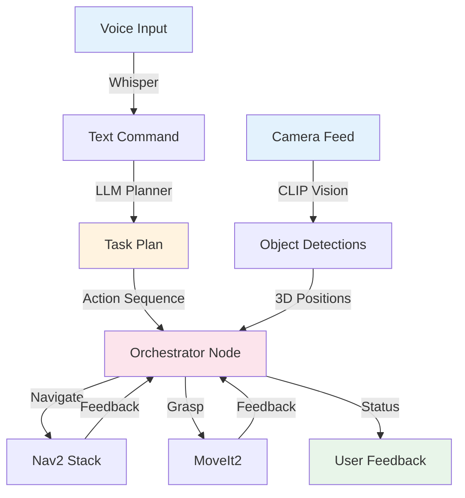
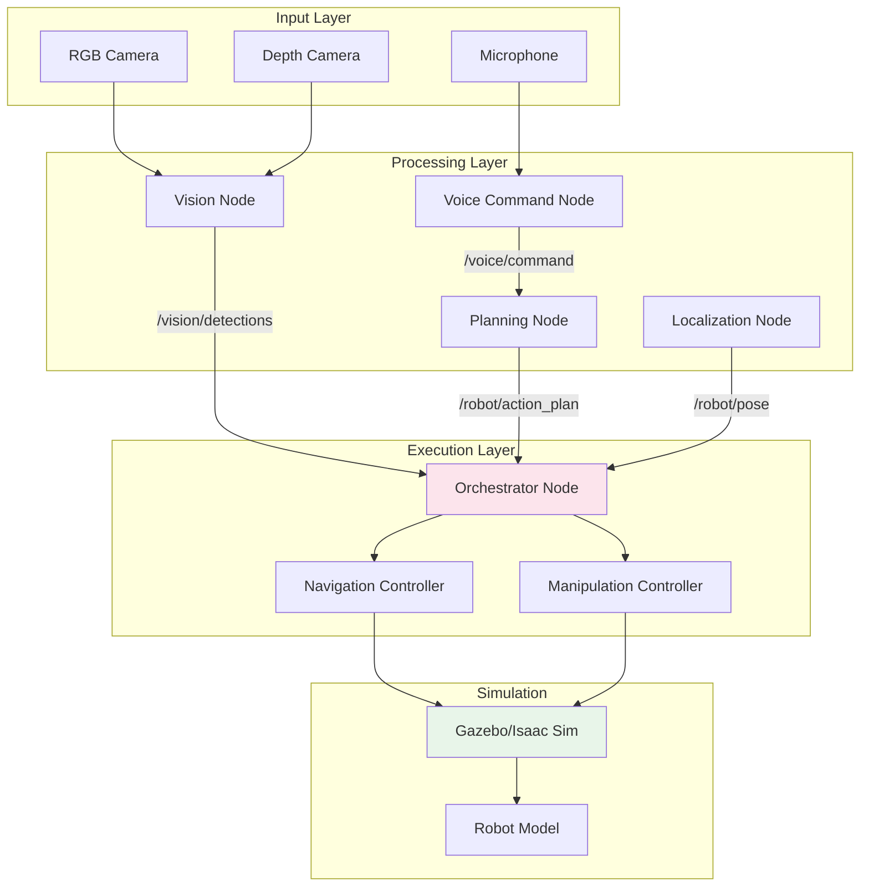
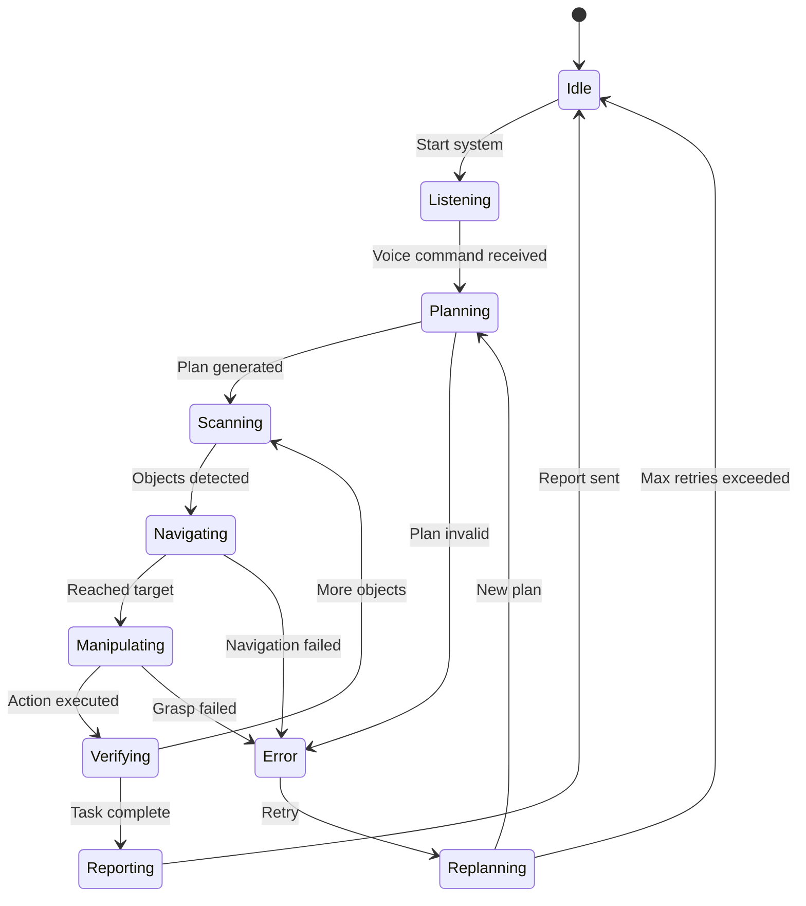

# 4.5 Capstone Project: Autonomous Humanoid

## Learning Objectives

By completing this capstone project, you will be able to:

1. **Integrate** voice, cognitive planning, vision, navigation, and manipulation into a complete VLA system
2. **Fine-tune** pre-trained VLA models on custom robot tasks using demonstration data
3. **Deploy** end-to-end autonomous systems to simulated environments (Gazebo/Isaac Sim)
4. **Evaluate** system performance using quantitative metrics (success rate, latency, accuracy)
5. **Troubleshoot** complex integration issues across multiple subsystems

## Project Overview

### Goal

Build a complete autonomous robot that receives a voice command, plans a task, navigates to objects, identifies them using computer vision, and manipulates them to accomplish the goal.

**Example Task**: "Clean the room" 
- Robot hears command via Whisper
- LLM plans: [navigate to objects, identify items, grasp each, navigate to bin, place]
- Vision identifies objects (cup, book, toy)
- Robot executes manipulation sequence
- Reports completion: "Task complete. 3 objects cleaned."

### Components



### Timeline

- **Week 1 (4-6 hours)**: System architecture design, component integration
- **Week 2 (6-8 hours)**: Testing, debugging, performance optimization
- **Week 3 (2-3 hours)**: Documentation, video recording, final submission

**Total**: 12-17 hours

---

## Phase 1: System Architecture Design

### Define Your Task

Choose a concrete task for your robot:

**Easy Tasks** (Recommended for beginners):
1. **Single Object Pickup**: "Pick up the cup"
2. **Object Sorting**: "Move red objects to box A, blue objects to box B"
3. **Table Clearing**: "Remove all objects from the table"

**Medium Tasks**:
1. **Room Cleaning**: "Clean the room" (multiple object types, navigation required)
2. **Fetch and Deliver**: "Bring me the book from the shelf"
3. **Object Arrangement**: "Arrange objects in a line"

**Hard Tasks** (Advanced students):
1. **Multi-room Navigation**: "Find and bring the cup from the kitchen"
2. **Contextual Manipulation**: "Put away the dirty dishes" (requires understanding)
3. **Collaborative Task**: "Help me set the table" (interactive)

### System Architecture

Create a system architecture diagram showing:



### File Structure

```
vla_capstone/
├── launch/
│   ├── full_system.launch.py       # Main launch file
│   ├── simulation.launch.py        # Gazebo/Isaac Sim setup
│   └── sensors.launch.py           # Camera, microphone
├── config/
│   ├── robot_config.yaml           # Robot parameters
│   ├── camera_intrinsics.yaml      # Calibration data
│   └── task_definitions.yaml       # Task-specific configs
├── src/
│   ├── orchestrator_node.py        # Main coordination logic
│   ├── voice_command_node.py       # From sub-chapter 4.2
│   ├── planning_node.py            # From sub-chapter 4.3
│   ├── vision_node.py              # From sub-chapter 4.4
│   ├── navigation_client.py        # Nav2 action client
│   └── manipulation_client.py      # MoveIt2 action client
├── tests/
│   ├── test_integration.py         # End-to-end tests
│   └── test_individual_nodes.py    # Unit tests
├── docs/
│   ├── architecture.md
│   └── user_guide.md
└── README.md
```

---

## Phase 2: Integration Strategy

### State Machine Design

The orchestrator node coordinates all components using a state machine:



### Orchestrator Node Implementation

```python
#!/usr/bin/env python3
# orchestrator_node.py
# Main coordinator for VLA system

import rclpy
from rclpy.node import Node
from rclpy.action import ActionClient
from std_msgs.msg import String
from geometry_msgs.msg import Point
from enum import Enum
import json

class SystemState(Enum):
    IDLE = 1
    LISTENING = 2
    PLANNING = 3
    SCANNING = 4
    NAVIGATING = 5
    MANIPULATING = 6
    VERIFYING = 7
    REPORTING = 8
    ERROR = 9

class OrchestratorNode(Node):
    """
    Main orchestrator coordinating voice, planning, vision, navigation, manipulation.
    """
    
    def __init__(self):
        super().__init__('orchestrator_node')
        
        # State machine
        self.state = SystemState.IDLE
        self.current_plan = None
        self.current_action_index = 0
        self.detected_objects = []
        self.max_retries = 3
        self.retry_count = 0
        
        # Subscribers
        self.voice_sub = self.create_subscription(
            String, '/voice/command', self.voice_callback, 10
        )
        self.plan_sub = self.create_subscription(
            String, '/robot/action_plan', self.plan_callback, 10
        )
        self.vision_sub = self.create_subscription(
            String, '/vision/detections', self.vision_callback, 10
        )
        
        # Publishers
        self.status_pub = self.create_publisher(String, '/system/status', 10)
        self.query_pub = self.create_publisher(String, '/vision/query', 10)
        
        # Action clients (navigation, manipulation)
        # self.nav_client = ActionClient(self, NavigateToPose, '/navigate_to_pose')
        # self.grasp_client = ActionClient(self, GraspObject, '/grasp_object')
        
        # Timer for state machine execution
        self.timer = self.create_timer(0.1, self.execute_state_machine)
        
        self.get_logger().info("Orchestrator ready. Awaiting voice command...")
        self.transition_state(SystemState.LISTENING)
    
    def transition_state(self, new_state: SystemState):
        """Transition to new state with logging"""
        self.get_logger().info(f"State: {self.state.name} → {new_state.name}")
        self.state = new_state
        self.publish_status(f"State: {new_state.name}")
    
    def publish_status(self, message: str):
        """Publish system status"""
        msg = String()
        msg.data = message
        self.status_pub.publish(msg)
    
    def voice_callback(self, msg):
        """Handle incoming voice command"""
        if self.state == SystemState.LISTENING:
            self.get_logger().info(f"Voice command: {msg.data}")
            self.transition_state(SystemState.PLANNING)
            # Planning node will receive this and generate plan
    
    def plan_callback(self, msg):
        """Handle action plan from LLM planner"""
        if self.state == SystemState.PLANNING:
            try:
                self.current_plan = json.loads(msg.data)
                self.current_action_index = 0
                self.get_logger().info(f"Plan received: {len(self.current_plan['actions'])} actions")
                self.transition_state(SystemState.SCANNING)
            except json.JSONDecodeError as e:
                self.get_logger().error(f"Invalid plan JSON: {e}")
                self.transition_state(SystemState.ERROR)
    
    def vision_callback(self, msg):
        """Handle object detections from vision"""
        if self.state == SystemState.SCANNING:
            try:
                self.detected_objects = json.loads(msg.data)
                self.get_logger().info(f"Detected {len(self.detected_objects)} objects")
                if self.detected_objects:
                    self.transition_state(SystemState.NAVIGATING)
                else:
                    self.get_logger().warn("No objects detected, retrying...")
            except json.JSONDecodeError as e:
                self.get_logger().error(f"Invalid detection JSON: {e}")
    
    def execute_state_machine(self):
        """Main state machine execution loop"""
        
        if self.state == SystemState.IDLE:
            pass  # Waiting for start signal
        
        elif self.state == SystemState.LISTENING:
            pass  # Waiting for voice command
        
        elif self.state == SystemState.PLANNING:
            pass  # Waiting for plan from LLM
        
        elif self.state == SystemState.SCANNING:
            # Request vision to find target object
            if self.current_plan and self.current_action_index < len(self.current_plan['actions']):
                action = self.current_plan['actions'][self.current_action_index]
                if action['action_type'] == 'grasp':
                    # Query vision for this object
                    query_msg = String()
                    query_msg.data = action['target']
                    self.query_pub.publish(query_msg)
        
        elif self.state == SystemState.NAVIGATING:
            # Send navigation goal
            self.execute_navigation()
        
        elif self.state == SystemState.MANIPULATING:
            # Send grasp goal
            self.execute_manipulation()
        
        elif self.state == SystemState.VERIFYING:
            # Check if task complete
            self.current_action_index += 1
            if self.current_action_index >= len(self.current_plan['actions']):
                self.transition_state(SystemState.REPORTING)
            else:
                self.transition_state(SystemState.SCANNING)
        
        elif self.state == SystemState.REPORTING:
            self.publish_status("Task complete!")
            self.transition_state(SystemState.IDLE)
        
        elif self.state == SystemState.ERROR:
            self.retry_count += 1
            if self.retry_count < self.max_retries:
                self.get_logger().warn(f"Error occurred, retrying ({self.retry_count}/{self.max_retries})")
                self.transition_state(SystemState.LISTENING)
            else:
                self.get_logger().error("Max retries exceeded, aborting task")
                self.transition_state(SystemState.IDLE)
    
    def execute_navigation(self):
        """Execute navigation action"""
        # Simplified: In practice, use Nav2 action client
        self.get_logger().info("Navigating to target...")
        # Simulate navigation completion
        self.transition_state(SystemState.MANIPULATING)
    
    def execute_manipulation(self):
        """Execute manipulation action"""
        # Simplified: In practice, use MoveIt2 action client
        self.get_logger().info("Grasping object...")
        # Simulate grasp completion
        self.transition_state(SystemState.VERIFYING)

def main(args=None):
    rclpy.init(args=args)
    node = OrchestratorNode()
    rclpy.spin(node)
    node.destroy_node()
    rclpy.shutdown()

if __name__ == '__main__':
    main()
```

---

## Phase 3: Fine-tuning VLA on Custom Task

### Why Fine-tune?

Pre-trained VLA models (like GR00T N1.5) are trained on diverse tasks but may not optimize for your specific robot/environment. Fine-tuning adapts the model to:

1. **Your robot's kinematics** (humanoid vs arm vs mobile manipulator)
2. **Your objects** (specific cups, boxes, tools in your lab)
3. **Your task success criteria** (precision requirements, speed constraints)

### Data Collection

Collect 50-100 demonstrations of your task:

```python
# collect_demonstrations.py
import rclpy
from rclpy.node import Node
from sensor_msgs.msg import Image, JointState
import h5py
import numpy as np

class DemonstrationCollector(Node):
    """Collect VLA training data: images + actions"""
    
    def __init__(self, output_file='demonstrations.h5'):
        super().__init__('demo_collector')
        
        # Create HDF5 file
        self.h5file = h5py.File(output_file, 'w')
        self.demo_count = 0
        self.current_demo = []
        
        # Subscribe to sensors and actions
        self.image_sub = self.create_subscription(
            Image, '/camera/color/image_raw', self.image_callback, 10
        )
        self.joint_sub = self.create_subscription(
            JointState, '/joint_states', self.joint_callback, 10
        )
        
        self.get_logger().info("Collecting demonstrations. Press SPACE to start/stop recording.")
    
    def save_demonstration(self):
        """Save collected demo to HDF5"""
        group = self.h5file.create_group(f'demo_{self.demo_count}')
        
        # Save images, actions, language commands
        images = np.array([frame['image'] for frame in self.current_demo])
        actions = np.array([frame['action'] for frame in self.current_demo])
        
        group.create_dataset('images', data=images)
        group.create_dataset('actions', data=actions)
        group.attrs['language_command'] = "Pick up the cup"
        
        self.demo_count += 1
        self.current_demo = []
        self.get_logger().info(f"Saved demonstration {self.demo_count}")
```

### Fine-tuning Script

```python
# finetune_vla.py
import torch
from transformers import AutoModelForVision2Seq, TrainingArguments, Trainer
from datasets import load_dataset

# Load pre-trained VLA model
model = AutoModelForVision2Seq.from_pretrained("nvidia/gr00t-n1.5")

# Load your demonstrations
dataset = load_dataset("hdf5", data_files="demonstrations.h5")

# Training configuration
training_args = TrainingArguments(
    output_dir="./vla_finetuned",
    num_train_epochs=10,
    per_device_train_batch_size=4,
    learning_rate=1e-5,
    save_steps=100,
    logging_steps=10
)

# Fine-tune
trainer = Trainer(
    model=model,
    args=training_args,
    train_dataset=dataset['train']
)

trainer.train()
model.save_pretrained("./vla_finetuned_final")
```

---

## Phase 4: Deployment & Testing

### Complete Launch File

```python
# full_system.launch.py
from launch import LaunchDescription
from launch_ros.actions import Node

def generate_launch_description():
    return LaunchDescription([
        # Simulation
        Node(
            package='gazebo_ros',
            executable='spawn_entity.py',
            arguments=['-entity', 'robot', '-file', 'robot.urdf']
        ),
        
        # Sensors
        Node(
            package='usb_cam',
            executable='usb_cam_node_exe',
            name='camera'
        ),
        
        # VLA Components
        Node(
            package='vla_capstone',
            executable='voice_command_node',
            name='voice'
        ),
        Node(
            package='vla_capstone',
            executable='planning_node',
            name='planning'
        ),
        Node(
            package='vla_capstone',
            executable='vision_node',
            name='vision'
        ),
        Node(
            package='vla_capstone',
            executable='orchestrator_node',
            name='orchestrator'
        ),
    ])
```

### Evaluation Harness

```python
# evaluate_system.py
import rclpy
from rclpy.node import Node
import time
import json

class EvaluationHarness(Node):
    """Automated evaluation of VLA system"""
    
    def __init__(self):
        super().__init__('evaluator')
        
        self.test_cases = [
            {"command": "Pick up the red cup", "expected_objects": ["red cup"], "timeout": 60},
            {"command": "Clean the table", "expected_objects": ["cup", "book", "toy"], "timeout": 120},
        ]
        
        self.results = []
    
    def run_evaluation(self):
        """Run all test cases and collect metrics"""
        for i, test in enumerate(self.test_cases):
            self.get_logger().info(f"Test {i+1}/{len(self.test_cases)}: {test['command']}")
            
            start_time = time.time()
            success = self.execute_test(test)
            duration = time.time() - start_time
            
            self.results.append({
                "test": test['command'],
                "success": success,
                "duration": duration,
                "timeout": test['timeout']
            })
        
        self.print_summary()
    
    def print_summary(self):
        """Print evaluation results"""
        total = len(self.results)
        successful = sum(1 for r in self.results if r['success'])
        
        print("\n=== Evaluation Results ===")
        print(f"Success Rate: {successful}/{total} ({100*successful/total:.1f}%)")
        print(f"Avg Duration: {sum(r['duration'] for r in self.results)/total:.1f}s")
        
        for r in self.results:
            status = "✓" if r['success'] else "✗"
            print(f"{status} {r['test']}: {r['duration']:.1f}s")
```

---

## Phase 5: Troubleshooting & Optimization

### Performance Metrics

Track these metrics:

| Metric | Target | Measurement |
|--------|--------|-------------|
| **Task Success Rate** | >70% | Tasks completed / Tasks attempted |
| **Voice Recognition Accuracy** | >90% | Correct transcriptions / Total commands |
| **Object Detection Precision** | >80% | True positives / (True positives + False positives) |
| **Navigation Success** | >85% | Successful navigations / Navigation attempts |
| **Grasp Success** | >75% | Successful grasps / Grasp attempts |
| **End-to-End Latency** | &lt;90s | Time from voice command to task completion |

### Common Integration Issues

#### Issue 1: "System hangs in SCANNING state"

**Symptoms**: Orchestrator stuck waiting for vision detections

**Debug**:
```bash
# Check if vision node is publishing
ros2 topic hz /vision/detections

# Check camera feed
ros2 run rqt_image_view rqt_image_view /camera/color/image_raw

# Check vision query
ros2 topic echo /vision/query
```

**Solutions**:
- Ensure vision node receives camera images
- Verify CLIP model loaded correctly
- Check confidence threshold (lower to 0.2 for testing)

#### Issue 2: "High failure rate on manipulation"

**Symptoms**: Grasp success &lt;50%

**Solutions**:
1. **Improve 3D localization**: Use larger ROI for depth median filtering
2. **Add pre-grasp alignment**: Rotate gripper to match object orientation
3. **Implement visual servoing**: Close-loop control using camera feedback

#### Issue 3: "Latency budget exceeded"

**Symptoms**: Tasks take >2 minutes for simple commands

**Optimization**:
```python
# Profile each component
import time

class ProfilingOrchestrator(OrchestratorNode):
    def __init__(self):
        super().__init__()
        self.timings = {}
    
    def transition_state(self, new_state):
        if hasattr(self, 'state_start_time'):
            duration = time.time() - self.state_start_time
            self.timings[self.state.name] = duration
            self.get_logger().info(f"{self.state.name}: {duration:.2f}s")
        
        self.state_start_time = time.time()
        super().transition_state(new_state)
```

---

## Project Deliverables

### Required Submissions

1. **Demonstration Video** (2-3 minutes)
   - Show complete task execution from voice command to completion
   - Include at least 2 successful runs and 1 failure with recovery
   - Narrate key decision points ("Here the LLM planned 4 actions...", "Vision detected object at 0.8m...")

2. **Code Repository** (GitHub)
   - All source code with README
   - Launch files and configuration
   - Installation instructions
   - Example commands to run system

3. **Performance Report** (2-4 pages)
   - Task success rate across 10 trials
   - Breakdown by subsystem (voice, planning, vision, navigation, manipulation)
   - Latency analysis
   - Failure mode analysis with examples

4. **Lessons Learned** (1 page)
   - Top 3 technical challenges and how you solved them
   - Unexpected failure modes discovered
   - Suggestions for future improvements

### Grading Rubric

| Category | Weight | Criteria |
|----------|--------|----------|
| **Code Quality** | 30% | Clean, documented, follows ROS 2 conventions |
| **Integration** | 25% | All components work together, state machine robust |
| **Performance** | 25% | Meets &gt;70% success rate, &lt;90s latency |
| **Documentation** | 20% | Clear README, architecture diagram, performance report |
| **Total** | 100% | |

**Bonus Points** (+10% each):
- Deploy to real hardware (not just simulation)
- Implement fine-tuning of VLA model
- Add safety monitoring (collision avoidance, emergency stop)
- Multi-task support (switch between tasks dynamically)

---

## Exercises

### Exercise 1: Add Object Sorting (Easy, 2 hours)

**Goal**: Extend system to sort objects by color.

**Tasks**:
1. Define task: "Sort objects by color"
2. Modify vision node to detect object colors
3. Update LLM prompt with sorting logic
4. Test with 3 red and 3 blue objects

### Exercise 2: Multi-Robot Coordination (Medium, 4 hours)

**Goal**: Coordinate 2 robots on same task.

**Tasks**:
1. Launch 2 orchestrator instances
2. Implement task allocation (robot 1 gets objects 1-3, robot 2 gets 4-6)
3. Add collision avoidance between robots
4. Measure speedup vs single robot

### Exercise 3: Real Hardware Deployment (Hard, 8+ hours)

**Goal**: Deploy to physical robot.

**Tasks**:
1. Calibrate cameras on real robot
2. Handle real-world noise (lighting, occlusion, sensor drift)
3. Implement safety monitoring (force limits, workspace bounds)
4. Compare simulation vs real-world success rates

---

## Further Reading

### Research Papers
1. **RT-2: Vision-Language-Action Models Transfer Web Knowledge to Robotic Control** (Google, 2023)
   - https://arxiv.org/abs/2307.15818

2. **GR00T: Generalist Robot Foundation Model** (NVIDIA, 2024)
   - Multimodal VLA architecture details

### Documentation
1. **ROS 2 Best Practices**
   - https://docs.ros.org/en/humble/The-ROS2-Project/Contributing/Developer-Guide.html

2. **MoveIt2 Integration Guide**
   - https://moveit.ros.org/

### Case Studies
1. **Physical Intelligence π0: Dishwasher Task**
   - Real-world VLA deployment lessons

2. **Boston Dynamics Spot + VLA**
   - Vision-language control of quadruped robots

---

## Conclusion

🎉 **Congratulations!** You've completed the VLA module and built a complete autonomous robot system.

You now have hands-on experience with:
- ✅ Voice-controlled robotics using Whisper
- ✅ LLM-based cognitive planning with function calling
- ✅ Computer vision integration for object detection
- ✅ End-to-end VLA pipeline from language to action
- ✅ Real-world deployment and troubleshooting

### What's Next?

1. **Extend your capstone**: Add new capabilities (tool use, collaborative tasks)
2. **Deploy to hardware**: Apply for lab access to physical robots
3. **Contribute to open source**: Share your VLA implementations with the community
4. **Explore research**: Read latest VLA papers, propose improvements
5. **Career opportunities**: Physical AI engineers are in high demand (Tesla, Boston Dynamics, NVIDIA, Figure AI)

**Keep building intelligent robots!** 🤖
