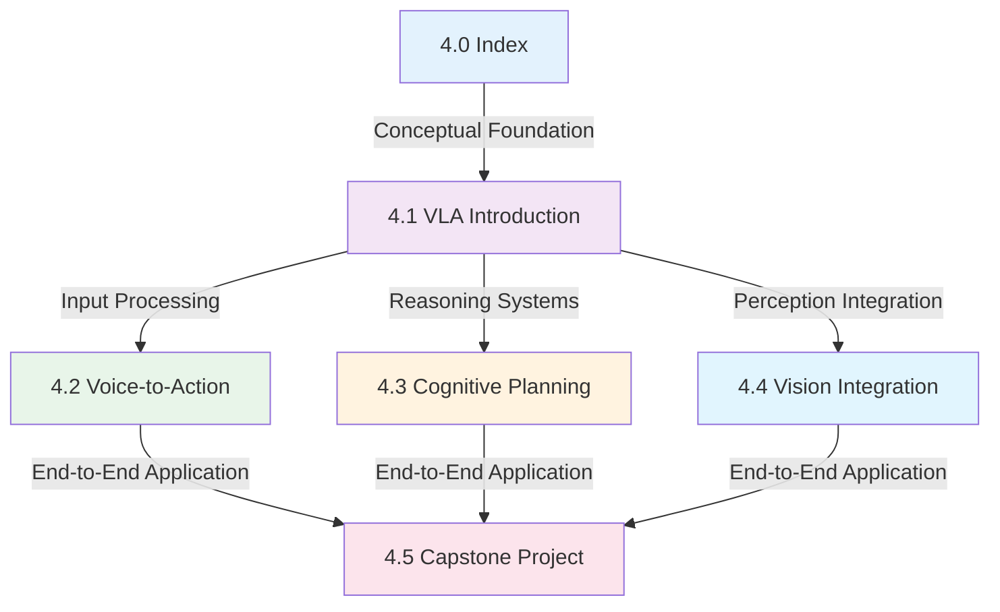

# Chapter 4: Vision-Language-Action Models

## Why VLA Models Matter

In early 2025, Physical Intelligence unveiled π0.6, a 5-billion parameter Vision-Language-Action model that achieved something remarkable: it could make a bed, light birthday candles, and clean a kitchen with a single neural network. Using only natural language instructions like "Please clean up the kitchen," π0.6 would intelligently coordinate its vision system to identify dirty dishes, navigate to the sink, and perform the multi-step task—all without hand-crafted rules or task-specific programming.

This breakthrough exemplifies why Vision-Language-Action (VLA) models represent the future of robotics. Traditional robotic systems require engineers to write specific rules for every possible scenario: "If you see a cup and hear 'pick it up,' move arm to position (x, y, z) and close gripper." This approach doesn't scale to complex, real-world tasks. VLA models instead learn generalizable skills from data, enabling them to understand language, perceive visual scenes, and generate appropriate actions for novel situations.

VLA models are arguably the first step toward **artificial general intelligence for robotics**. They combine three pillars—vision (what the robot sees), language (what the robot hears or reads), and action (what the robot does)—into unified neural networks trained on massive multimodal datasets containing images, text, and robot trajectory data.

## Chapter Learning Objectives

By completing this chapter, you will be able to:

1. **Define** VLA models and explain their advantages over traditional task-specific robotic approaches
2. **Analyze** the architecture of modern VLA models like GR00T N1.5, OpenVLA, and π0.6
3. **Implement** voice-to-action pipelines using OpenAI Whisper and ROS 2
4. **Design** cognitive planning systems using LLM function calling and schema validation
5. **Integrate** vision backbones like CLIP and PaliGemma into VLA architectures
6. **Fine-tune** pre-trained VLA models on custom tasks using limited demonstration data

## Learning Path Through Chapter 4

## Prerequisites

Before starting this chapter, ensure you've completed:

- [**Chapter 1: ROS 2 Fundamentals**](../ros2-fundamentals/index.md) - Understanding ROS 2 architecture and node development
- [**Chapter 2: Digital Twin Concepts**](../module-2-digital-twin/index.md) - Simulation environments and robot modeling
- [**Chapter 3: NVIDIA Isaac AI Brain**](../chapter-3-isaac-ai-brain/index.md) - Foundation models in robotics, Isaac Sim integration

Additionally, you'll need:
- Python 3.11+ programming experience
- Basic understanding of PyTorch and transformers
- Familiarity with natural language processing concepts
- Access to a GPU recommended (RTX 3060+ or cloud credits)

## Chapter Roadmap

This chapter consists of five sub-chapters, each building toward comprehensive VLA model understanding and implementation:

### 4.1 [Introduction to VLA Models](./01-vla-introduction.md) (12 min)
Begin with the foundational concepts: What defines a VLA model? How do the three pillars (vision, language, action) work together? We'll explore state-of-the-art models including NVIDIA's GR00T N1.5, Physical Intelligence's π0.6, and the open-source OpenVLA. You'll understand the dual-system architecture that enables both high-level reasoning and low-level motor control.

### 4.2 [Voice-to-Action with OpenAI Whisper](./02-voice-to-action.md) (15 min)
Implement your first VLA component: speech recognition that converts natural language into actionable robot commands. Through a hands-on 15-minute Quick Start, you'll integrate Whisper with ROS 2, handle audio preprocessing, and create a complete voice command system. Includes troubleshooting for real-world audio challenges like noise and latency.

### 4.3 [Cognitive Planning with LLMs](./03-cognitive-planning.md) (18 min)
Master the art of converting natural language instructions into executable action sequences. Learn function calling patterns that let LLMs generate structured robot commands, implement schema validation with Pydantic, and build intelligent feedback loops that recover from failures. The Quick Start demonstrates "Pick up cup" → robot actions with robust error handling.

### 4.4 [Vision Integration & Object Detection](./04-vision-integration.md) (16 min)
Integrate computer vision into your VLA pipeline using CLIP and PaliGemma vision backbones. Process ROS 2 camera streams, implement object detection for manipulation tasks, and understand how vision features fuse with language representations. Includes 3D localization techniques and sensor fusion patterns.

### 4.5 [Capstone Project: Autonomous Humanoid](./05-capstone-project.md) (25 min + 4-6 hours project)
Combine everything into an end-to-end VLA system that enables autonomous task execution. Fine-tune a GR00T model on your custom task, deploy to Isaac Sim or Gazebo, and implement comprehensive evaluation metrics. Complete with project deliverables, grading rubric, and deployment optimization strategies.

## Next Steps

Click [here](./01-vla-introduction.md) to begin with the foundational concepts of Vision-Language-Action models, starting with why they represent such a paradigm shift in robotics. By the end of sub-chapter 4.1, you'll understand the architecture that powers modern autonomous robots.

Alternatively, if you're comfortable with VLA concepts and want hands-on experience immediately, jump to [sub-chapter 4.2](./02-voice-to-action.md) to start building voice-controlled robots.

### Helpful Resources While Learning

- [NVIDIA GR00T N1.5 Documentation](https://www.nvidia.com/en-us/ai-data-science/robotics/) - Latest VLA resources
- [Physical Intelligence π0 Paper](https://arcade-ai.com/blog) - Original π0 publication details
- [OpenVLA Repository](https://github.com/openvla) - Open-source VLA implementation

### Key Technologies Covered

- **Foundation Models**: GR00T N1.5, π0.6, OpenVLA, ChatVLA-2
- **Vision Backbones**: CLIP, PaliGemma, Grounded-SAM2
- **Language Models**: GPT-4, Claude, Llama for function calling
- **Speech Recognition**: OpenAI Whisper (small/medium models)
- **Training Frameworks**: PyTorch 2.x, Hugging Face Transformers
- **Simulation**: NVIDIA Isaac Sim, Gazebo, Isaac Lab
- **ROS 2 Integration**: Humble release, custom nodes and interfaces