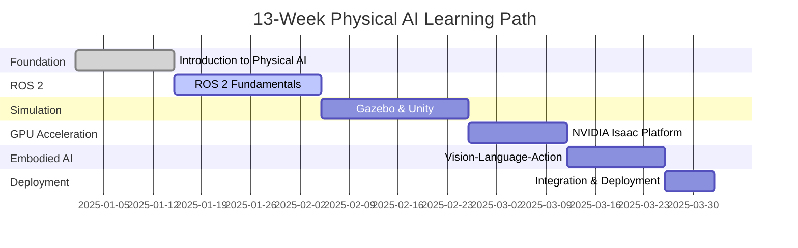

# Introduction: Physical AI & Humanoid Robotics

## Why Physical AI Matters

Imagine a robot that doesn't just follow pre-programmed instructions but actually *understands* its environment,
makes decisions in real time, and adapts to unexpected situations. That's the promise of **Physical AI**—the
convergence of artificial intelligence, robotics, and real-world perception. Physical AI enables machines to
perceive their surroundings through sensors, reason about tasks using AI models, and take physical actions to
accomplish goals in dynamic, unpredictable environments.

Traditional robots excel at repetitive, scripted tasks in controlled environments like factory assembly lines. They
 follow precise instructions: move arm to position X, close gripper, repeat. But the real world is messy,
unpredictable, and constantly changing. A warehouse robot must navigate around obstacles, pick items of different
shapes and weights, and adapt when products are stacked differently than expected. A humanoid assistant needs to
understand natural language commands ("Can you get me the red box?"), locate objects in cluttered spaces, and
manipulate them safely around humans. Physical AI bridges this gap by combining the decision-making power of AI
with the sensory perception and physical capabilities of robots.

The demand for Physical AI expertise is exploding across industries. **Autonomous vehicles** use AI to perceive
road conditions and make split-second driving decisions in real time. **Humanoid robots** are being deployed in
warehouses, hospitals, and homes to assist with tasks too complex for traditional automation. **Manufacturing
robotics** powered by AI can assemble intricate products, adapting to variations and detecting defects without
human intervention. **Logistics and warehouse automation** systems use Physical AI to navigate dynamic
environments, handle diverse products, and coordinate with human workers. Companies like Tesla, Boston Dynamics,
NVIDIA, and Figure AI are investing billions in this space, creating unprecedented career opportunities for
developers who can bridge the gap between AI and robotics.

## What This Book Covers

This book takes you on a hands-on journey from robotics fundamentals to deploying intelligent, AI-powered systems
in the real world. You'll master four core modules that build on each other progressively:

### Module 1: ROS 2 Fundamentals (Weeks 3-5)

Master the Robot Operating System 2, the industry-standard framework for modern robotics.

**You'll learn**:
- How to structure robot software using nodes, topics, services, and actions
- Building communication patterns for sensors, actuators, and AI models
- Managing configuration with launch files and parameters
- Debugging and testing ROS 2 systems in real time

**ROS 2 (Robot Operating System 2)** is a flexible framework for writing robot software that handles communication
between different parts of your robot system. Imagine it as the "nervous system" that lets your robot's sensors
talk to its motors, cameras talk to AI models, and everything coordinate in real time. Throughout this book, you'll
 use ROS 2 as the foundational platform for building autonomous systems.

### Module 2: Gazebo & Unity Simulation (Weeks 6-8)

Build realistic virtual environments where you can test robots without expensive hardware.

**You'll learn**:
- Creating physics-based simulations with Gazebo and Unity
- Modeling sensors (cameras, LIDAR, depth sensors) and robot bodies (URDF)
- Integrating simulations with ROS 2 for seamless testing
- Validating robot behavior before real-world deployment

**Simulation** allows you to create virtual robots and test them in realistic environments on your computer before
deploying to physical hardware. Think of it like a flight simulator for pilots—you can practice complex maneuvers,
test edge cases, and fail safely without risking expensive equipment. In this book, you'll build simulated
environments that accurately mimic real-world physics, enabling you to develop and validate robotics systems from
any laptop.

### Module 3: NVIDIA Isaac Platform (Weeks 9-10)

Leverage GPU acceleration to train AI models and run simulations at scale.

**You'll learn**:
- Using Isaac Sim for photorealistic robot simulation
- Generating synthetic training data for AI models
- Accelerating perception and planning with NVIDIA hardware
- Optimizing deployment for edge robotics devices

**GPU Acceleration** uses specialized graphics processors to perform massive parallel computations, dramatically
speeding up AI training and simulation. Instead of waiting hours for your AI model to train on a CPU, GPUs can
complete the same task in minutes by processing thousands of calculations simultaneously. You'll learn to harness
NVIDIA's Isaac platform to generate realistic sensor data, train perception models, and run multiple simulation
scenarios in parallel.

### Module 4: Vision-Language-Action Models (Weeks 11-12)

Integrate cutting-edge foundation models that enable robots to see, understand language, and take action.

**You'll learn**:
- How VLA models combine computer vision, natural language processing, and motor control
- Training and fine-tuning embodied AI models
- Deploying language-instructable robots ("Go pick up the red box")
- Building end-to-end systems from perception to action

**Vision-Language-Action (VLA) models** are AI systems that can see through cameras, understand natural language
commands, and output physical actions for robots to execute. Picture a robot that you can ask in plain English to
"pick up the book on the table" and it knows how to locate the book visually, plan a grasp, and execute the
movement. These foundation models represent the cutting edge of Physical AI, and you'll learn to integrate them
into your robotic systems.

### Learning Progression

Here's how the modules connect:

Each module builds on the previous one, taking you from basic robot communication to deploying intelligent AI systems.

## Who This Book Is For

This book is designed for software developers and engineers with basic programming experience who want to break
into robotics and Physical AI. If you can write Python code (variables, functions, loops), you're ready to start—no
 prior robotics knowledge required.

You'll benefit most from this book if you're:

- A developer looking to add robotics skills to your career toolkit
- An AI/ML engineer curious about deploying models on physical robots
- A student studying computer science, engineering, or related fields
- A hobbyist passionate about building intelligent machines
- A career changer transitioning into robotics from software development

You don't need expensive hardware—most exercises use simulation, so you can learn from any modern laptop with a
decent GPU (NVIDIA recommended, but not required for basic modules). If you do have access to robotics hardware
(like a simple wheeled robot or robotic arm), we'll show you how to deploy your simulated systems to real devices
in the final chapters.

## What You'll Learn

By the end of this book, you'll have hands-on experience with the complete Physical AI stack. Here are the key
skills you'll gain:

- Design and implement autonomous robotic systems using ROS 2 for real-time communication and control
- Create realistic simulation environments with Gazebo and Unity to test robots without hardware
- Leverage GPU acceleration using NVIDIA Isaac Sim for high-fidelity physics simulation and AI training
- Integrate vision and language models to build robots that can see, understand natural language, and take action
- Deploy AI-powered robots from simulation to real hardware with confidence
- Generate synthetic training data for perception models using photorealistic simulations
- Apply best practices for safe, reliable robotic systems in dynamic environments
- Build end-to-end pipelines from data collection through model training to deployment

These aren't just theoretical concepts—every skill includes hands-on projects where you'll build working systems
step by step.

## 13-Week Learning Path

This book follows a structured 13-week progression, taking you from foundational concepts to real-world deployment.
 Each week builds on the previous ones, with hands-on projects reinforcing key concepts.

Week-by-Week Breakdown

Weeks 1-2: Introduction to Physical AI
Foundation and ecosystem overview. You'll set up your development environment, install ROS 2 and simulation tools,
and understand how AI, robotics, and perception come together in modern systems.

Weeks 3-5: ROS 2 Fundamentals
Master robot communication patterns. Build your first ROS 2 nodes, work with topics/services/actions, create launch
 configurations, and understand the publish-subscribe architecture that powers modern robots.

Weeks 6-8: Simulation & Testing
Create virtual environments with Gazebo and Unity. Model sensors, design robot bodies with URDF, validate behavior
in realistic physics simulations, and test your systems before deployment.

Weeks 9-10: NVIDIA Isaac Platform
Accelerate your workflows with GPU power. Generate synthetic data, run photorealistic simulations, train perception
 models faster, and optimize for edge deployment on robotic hardware.

Weeks 11-12: Vision-Language-Action Models
Integrate foundation models for embodied AI. Build robots that respond to natural language commands, combine vision
 with language understanding, and make intelligent decisions based on visual and linguistic input.

Week 13: Integration & Deployment
Bring it all together. Deploy a complete system from simulation to real hardware, apply production best practices,
implement safety mechanisms, and validate your robot in real-world scenarios.

### Visual Timeline

**Time Commitment**: Expect to spend 5-10 hours per week, including reading, exercises, and projects. You can adjust
the pace to fit your schedule—the 13-week structure is a guideline, not a requirement. Some learners complete the
material faster, while others prefer a slower, more thorough pace with additional experimentation.

## Prerequisites

### Required

To get the most out of this book, you'll need:

- Python basics: You should be comfortable writing functions, using classes, and working with common libraries like
 NumPy. If you've built a few Python scripts or taken an intro programming course, you're ready.
- Linux command line familiarity: Basic navigation (cd, ls, mkdir), running scripts, and installing packages with
apt or pip. Don't worry—we'll guide you through robotics-specific commands as we go.

Optional (Helpful but Not Required)

- ROS or robotics experience: If you've used ROS before, you'll move faster through Weeks 3-5. But we teach
everything from scratch, so no prior knowledge is assumed.
- Machine learning background: Helps with Weeks 11-12 (VLA models), but we explain AI concepts as we go. You don't
need to be an ML expert.
- Access to robotics hardware: Most exercises use simulation, but if you have a robot (wheeled platform, robotic
arm, quadruped, etc.), we show you how to deploy your code to real hardware in later chapters.
- NVIDIA GPU: Recommended for Weeks 9-12 to accelerate training and simulation, but not strictly required. You can
complete earlier modules on any modern laptop.

**Bottom line**: If you can code in Python and use a terminal, you're ready to start building intelligent robots.

## How to Use This Book

### For Beginners: Start from the Beginning

If you're new to robotics, **follow the chapters sequentially**. Each module builds on the previous one:

1. Read the introduction (you're here!)
2. Set up your development environment (Chapter 1)
3. Work through ROS 2 fundamentals (Chapters 2-4)
4. Progress through simulation, Isaac, and VLA modules
5. Complete hands-on projects at the end of each chapter

This path ensures you build a solid foundation before tackling advanced topics. Don't skip chapters—concepts introduced early are used throughout the book.

### For Experienced Practitioners: Skip Ahead

Already have experience? Here's how to jump to relevant sections:

- If you know ROS 2: Skip Chapters 2-4 → Start with Chapter 5: Advanced ROS 2 Patterns or jump to Chapter 6: Gazebo
 Simulation. Review the "Quick Reference" section in Chapter 2 to ensure you're familiar with our naming
conventions.
- If you're a simulation expert (Gazebo/Unity): Skip to Chapter 9: NVIDIA Isaac Platform. Skim Chapter 6-7 to
understand how we integrate simulation with ROS 2.
- If you have AI/ML background: Skim Chapters 2-10 → Focus on Chapters 11-12: Vision-Language-Action Models. You'll
 pick up robotics-specific concepts quickly.
- If you want deployment guidance: Review prerequisites in each chapter → Jump to Chapter 13: Real-World
Deployment. Make sure you understand ROS 2 basics (Chapter 2) before attempting hardware deployment.

Even if you're skipping ahead, check the "Quick Reference" sections in earlier chapters to ensure you're familiar
with our conventions, tooling choices, and project structure.

### Hands-On vs. Theory

Each chapter balances concepts with practice:

- Quick Start (15 minutes): Get something working fast to build confidence
- Deep Dive: Understand the "why" behind the "how" with detailed explanations
- Projects: Apply skills to realistic scenarios that mirror real-world robotics challenges
- Common Errors: Troubleshoot issues you're likely to encounter, with solutions and debugging tips

Choose your depth based on your learning style and time constraints. If you're in a hurry, focus on Quick Starts
and Projects. If you want deep understanding, work through the Deep Dive sections.

## Next Steps

Ready to dive in? Turn the page to Chapter 1: Setting Up Your Development Environment where you'll install ROS 2,
configure your simulation tools, and run your first robot program. By the end of Chapter 1, you'll have a fully
functional development environment and understand the fundamental architecture of a Physical AI system.

You'll build a simple mobile robot in simulation, make it navigate autonomously, and see how all the pieces
(sensors, AI, control) work together. This hands-on introduction will give you the confidence to tackle more
complex projects as you progress through the book.

Let's build some intelligent robots! 🤖
