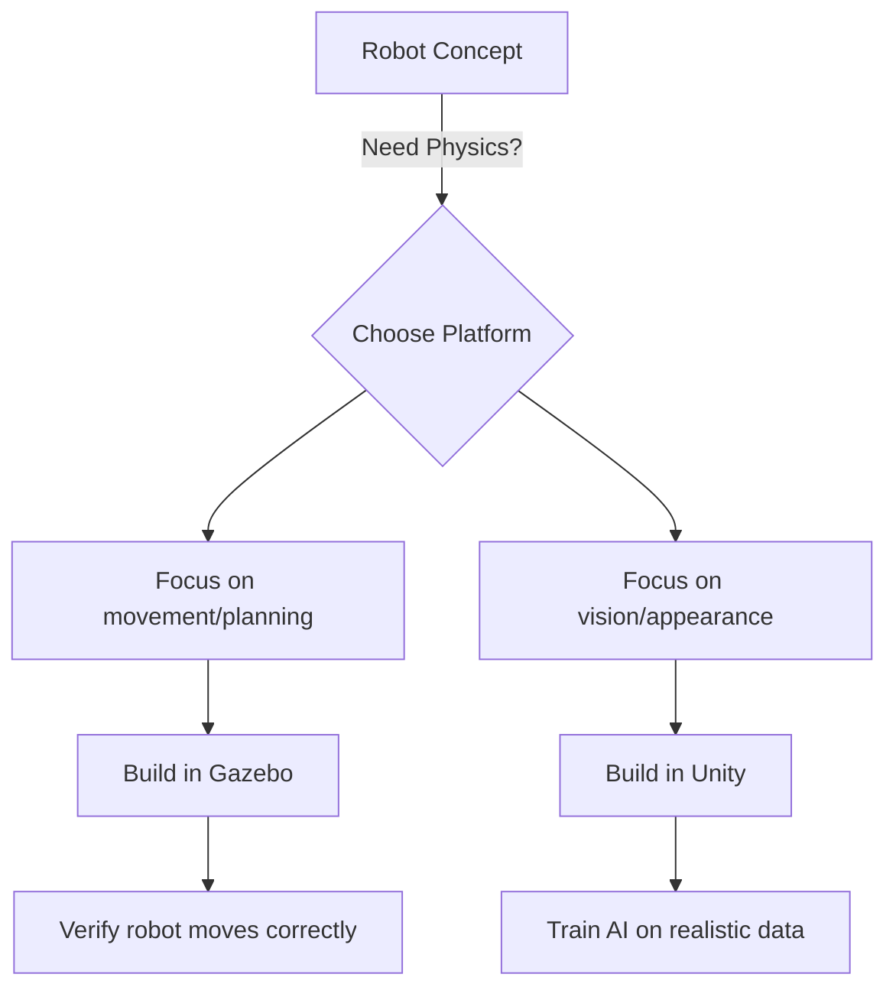

# 01. Digital Twin Basics

Before building your first simulated robot, you need to understand: **What exactly is a digital twin?**

## The Simple Definition

A digital twin is a virtual copy of your robot that behaves realistically. Think of it as a video game version of your robot that follows the same physics rules as the real world.

## Two Types of Simulation

### 1. Gazebo (Physics-First)
Gazebo focuses on **accurate physics**:
- Robot joints move with realistic torque and friction
- Objects collide and fall like in the real world
- Gravitational pull feels natural
- ROS2 integration is built-in

**When to use Gazebo:**
- Testing navigation algorithms (SLAM, path planning)
- Validating controller designs
- Ensuring mechanical limits work correctly
- Training robots safely before hardware deployment

### 2. Unity (Visual-First)
Unity specializes in **photorealistic visuals**:
- Looks nearly identical to real camera footage
- Perfect for computer vision training
- Human-robot interaction feels natural
- Industry-grade lighting and materials

**When to use Unity:**
- Training vision-based AI algorithms
- Creating human-robot collaboration scenarios
- Generating synthetic training data
- Building demonstrations that look professional

## The Sim-to-Real Gap

**The Challenge**: Even perfect simulations differ from reality. Robot arms might move differently, sensors might see unexpected reflections, and materials don't always behave the same.

**The Solution**: Always test your best simulation results on hardware. Use simulation for rapid iteration, then validate with real testing.

## Quick Decision Guide

**Use Gazebo if you're asking:**
- "Will my robot navigate this maze?"
- "Can my arm reach this position?"
- "Is my control algorithm stable?"

**Use Unity if you're asking:**
- "Can my vision system find objects?"
- "Will human operators understand my interface?"
- "Do I have enough training data?"

## Next Steps

**Your Simulation Journey:**
1. **[Gazebo Physics Tutorial](./gazebo-physics)** - Build your first physics-based world
2. **[Unity Visual Simulation](./unity-rendering)** - Create photorealistic environments
3. **[Integration Guide](./integration)** - Connect simulation to your workflow

**Pro Tip**: Start simple. A basic simulation that compiles and runs is better than a complex one full of errors. Build complexity gradually.