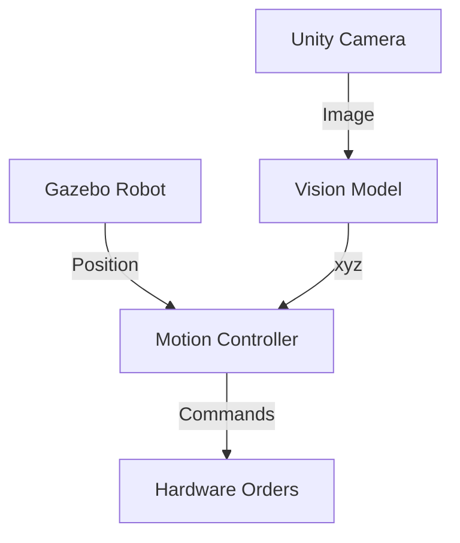

# 04. Integration Best Practices

The real power comes from combining Gazebo's physics accuracy with Unity's visual fidelity. This section shows you how.

## Why Combine Both Platforms?

**Gazebo** = Correct robot behavior; **Unity** = Perfect visual data

Together they create the most powerful robotics testing environment available today.

## The Simulation Pipeline

### Step 1: Physics Validation in Gazebo
Start with Gazebo to ensure your robot works physically:
- Test navigation algorithms
- Validate mechanical constraints
- Ensure safe operation

### Step 2: Visual Training in Unity
Then use Unity to create training data:
- Generate labeled images for AI
- Create diverse lighting conditions
- Build human interaction scenarios

### Step 3: Reality Check
Finally test on hardware to validate:
- Expect 70-80% accuracy from simulation
- Identify domain gaps to fix
- Refine world assumptions

## Practical Workflow Example

### Building a Pick-and-Place System

**Gazebo Phase** (3 hours):
```bash
# 1. Create warehouse world with robot arm
# 2. Test gripper and object physics
# 3. Validate trajectories are collision-free
# 4. Confirm grasp stability
```

**Unity Phase** (2 hours):
```bash
# 1. Generate 10,000 training images
# 2. Vary lighting and positions
# 3. Create synthetic depth data
# 4. Test vision algorithm convergence
```

**Hardware Phase** (6 hours):
```bash
# 1. Deploy physics-validated control
# 2. Use Unity-trained vision model
# 3. Fine-tune grasp parameters
# 4. Refine based on differences
```

## Data Flow Architecture



## Best Practices for Integration

### 1. Start Simultaneously
Don't build everything in one platform first. Build basic versions in both and iterate together.

### 2. Maintain Shared Ground Truth
Keep consistent:
- World dimensions
- Object physics
- Robot specifications
- Coordinate systems

### 3. Bridge the Gap Early
Identify sim-to-real issues in week 1, not week 10:
- Test basic movement on hardware ASAP
- Compare physics behavior (e.g., object falling)
- Validate vision detection in real lighting

### 4. Use the Right Tool for Each Job
- **Navigation** -> Gazebo first
- **Vision** -> Unity first
- **Safety** -> Hardware testing mandatory
- **Cost** -> Unity when data is expensive

## Common Pitfalls

### Platform Overlap
Avoid using Unity for physics problems or Gazebo for visual AI. Each platform shines in different areas.

### Simulation Creep
Don't let simulation get too perfect. Aim for "good enough" to find issues, not perfect replication.

### Missing Cross-Platform Timing
Visual and physics systems often run different update frequencies. Ensure synchronization when combining.

## Quick Verification Checklist

Before moving to hardware testing:

**Gazebo Checks:**
- [ ] Robot reaches all intended poses
- [ ] No collisions during normal operation
- [ ] Movement feels physically realistic
- [ ] Emergency stops function correctly

**Unity Checks:**
- [ ] Vision accuracy over 95% in simulation
- [ ] Works in varied lighting conditions
- [ ] Generalizes across environments
- [ ] Performance meets requirements

**Integration Checks:**
- [ ] Physics and visual data agree
- [ ] Coordinate systems matched
- [ ] Timing between systems aligned
- [ ] Error handling on both sides

**Hardware Pre-Check:**
- [ ] Physics validation completed
- [ ] Vision model trained
- [ ] Safety procedures defined
- [ ] Validation metrics set

## When to Stop Simulating

**Don't spend more than:**
- 80% of project time in simulation
- 50% of budget on simulation tools
- 3 weeks on perfect world-building

**Move to hardware when:**
- Basic movement works reliably
- Vision gives consistent results
- 70%+ accuracy target achieved
- Time/cost ratio favors hardware

## Next Steps After Simulation

1. **Hardware Testing**: Start with safest possible environment
2. **Iterative Refinement**: Use hardware feedback to improve simulation
3. **Continuous Validation**: Keep comparing simulation and reality
4. **Documentation**: Record everything for team learning

---

*Remember: Simulation is a tool, not a destination. Use it to validate concepts quickly, then graduate to hardware testing as soon as safely possible.*

## Chapter Summary

You've learned:
- When to use Gazebo (physics) vs Unity (visuals)
- How to build both types of simulation worlds
- Connecting simulation data to reality
- Best practices for platform integration

**Ready to build your complete robotic solution?** Start with a simple test case - maybe just robot navigation. Master that first before tackling the full complex system.

**Good luck!** 🚀