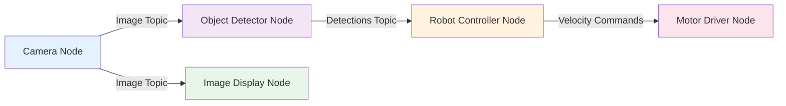

import Quiz from '@site/src/components/Quiz';
import Callout from '@site/src/components/Callout';

# What is ROS 2?

Imagine building a self-driving car where the camera, lidar, path planner, and motor controllers all need to work together seamlessly. How do these components communicate? How do you test them independently before assembling the full system? This is where ROS 2 comes in.

In this sub-chapter, you'll learn what ROS 2 is, why it exists, and how it revolutionized the way we build robotic systems.

---

## What is ROS 2?

**ROS 2** (Robot Operating System 2) is an open-source **middleware framework** that enables software components in a robotic system to communicate with each other. Think of it as the nervous system of a robot—it doesn't tell the robot what to do, but it provides the infrastructure for all the parts to talk to each other.

### Key Characteristics

- **Distributed**: No single point of failure—nodes can run on different machines
- **Modular**: Break complex systems into small, reusable components (nodes)
- **Language-Agnostic**: Write nodes in Python, C++, or other supported languages
- **Real-Time Capable**: Supports deterministic execution for safety-critical applications
- **Cross-Platform**: Runs on Linux, Windows, macOS, and embedded systems

<Callout type="info" title="ROS 2 vs. Operating Systems">
Despite its name, ROS 2 is **not an operating system** like Windows or Linux. It's a **middleware layer** that sits on top of an OS and provides tools for inter-process communication, package management, and hardware abstraction.
</Callout>

---

## Why ROS 2?

### The Challenge: Robotic Complexity

Modern robots are incredibly complex systems with dozens or hundreds of interconnected components:

- **Sensors**: Cameras, lidar, IMUs, GPS, tactile sensors
- **Actuators**: Motors, servos, grippers
- **Processing**: Perception, planning, control, localization
- **Communication**: Between components, with cloud services, with human operators

Building all of this from scratch for every project would be:
- ⏱️ **Time-consuming** (months to years)
- 💰 **Expensive** (reinventing the wheel)
- 🐛 **Error-prone** (communication bugs are hard to debug)
- 🔒 **Not reusable** (locked to one project)

### The Solution: ROS 2 Framework

ROS 2 provides:

1. **Communication Infrastructure**: Standardized message passing between components
2. **Abstraction Layers**: Hardware drivers that work across different sensors
3. **Tooling Ecosystem**: Visualization (rviz), simulation (Gazebo), logging, debugging
4. **Community Packages**: Thousands of pre-built components for navigation, vision, manipulation, etc.

**Result**: Focus on your robot's unique capabilities instead of reinventing communication protocols.

---

## ROS 2 Architecture

At its core, ROS 2 is built on a **computational graph** where:

- **Nodes** are processes that perform computation (e.g., camera driver, object detector)
- **Topics** are named channels for asynchronous message passing
- **Services** provide synchronous request-response communication
- **Actions** handle long-running tasks with feedback

**Diagram Explanation**:
- The **Camera Node** publishes images to a topic
- **Two subscribers** (Object Detector and Display) receive those images independently
- The detector sends results to the controller, which commands the motors
- Each node is independent and replaceable

<Quiz
  question="What is the primary purpose of ROS 2?"
  options={[
    "To replace Linux as a robot's operating system",
    "To provide a communication framework for robotic software components",
    "To compile Python code into C++ for faster execution",
    "To directly control motors and sensors"
  ]}
  correctAnswer={1}
  explanation="ROS 2 is a middleware framework that handles inter-process communication, allowing different parts of a robotic system to exchange data. It does not replace the OS, compile code, or directly control hardware."
  difficulty="easy"
/>

---

## Core Concepts

### Nodes: The Building Blocks

A **node** is an independent process that performs a specific task. Examples:

- **Camera Driver Node**: Reads frames from a camera and publishes them
- **Object Detection Node**: Subscribes to images, runs a neural network, publishes detections
- **Path Planner Node**: Subscribes to detections and map data, publishes navigation commands

**Philosophy**: Each node should do one thing well. This makes systems:
- ✅ Easier to test (test nodes in isolation)
- ✅ More maintainable (replace one node without affecting others)
- ✅ Reusable (use the same camera driver in multiple projects)

### Topics: Asynchronous Communication

**Topics** enable publish-subscribe communication:
- Publishers send messages without knowing who (if anyone) is listening
- Subscribers receive all messages on topics they're interested in
- Many-to-many: multiple publishers and subscribers on one topic

**Analogy**: Think of a topic like a radio station. The broadcaster (publisher) sends signals without knowing who's tuned in. Listeners (subscribers) can tune in or out anytime.

### Messages: Data Containers

Messages are the data structures sent over topics. ROS 2 provides standard message types:
- `std_msgs/String`: Simple text
- `geometry_msgs/Twist`: Velocity commands (linear + angular)
- `sensor_msgs/Image`: Camera frames
- `sensor_msgs/LaserScan`: Lidar data

You can also define custom messages for your application.

<Quiz
  question="In a publish-subscribe system, what happens if a publisher sends a message when no subscribers are listening?"
  options={[
    "The message is queued until a subscriber connects",
    "The message is immediately discarded",
    "The publisher blocks until a subscriber connects",
    "An error is thrown and the node crashes"
  ]}
  correctAnswer={1}
  explanation="ROS 2 topics use a fire-and-forget model. If no subscribers exist when a message is published, the message is discarded immediately. This is by design to prevent unbounded memory growth."
  difficulty="medium"
/>

---

## ROS 1 vs. ROS 2: What Changed?

If you've heard of ROS (version 1), you might wonder why ROS 2 exists. Here are the key improvements:

| Feature | ROS 1 | ROS 2 |
|---------|-------|-------|
| **Central Master** | Required `roscore` (single point of failure) | No central master—nodes discover each other via DDS |
| **Real-Time Support** | Limited | Full support for deterministic execution |
| **Security** | None (all nodes trusted) | Authentication, encryption, access control |
| **Platforms** | Primarily Linux | Linux, Windows, macOS, embedded (QNX, VxWorks) |
| **Build System** | catkin | ament (based on CMake/setuptools) |
| **Python Version** | Python 2 (deprecated) | Python 3 |

<Callout type="info" title="ROS 1 to ROS 2 Migration">
Many existing ROS 1 packages are being ported to ROS 2. If you're starting a new project today, **use ROS 2**—it's the future-proof choice. For maintaining legacy systems, ROS 1 Noetic (final release) is supported until 2025.
</Callout>

---

## DDS: The Communication Backbone

ROS 2 uses **DDS** (Data Distribution Service) as its underlying communication layer. DDS is an industry-standard middleware used in:

- 🚗 Automotive (ADAS systems)
- ✈️ Aerospace (flight control)
- 🏥 Medical devices
- ⚡ Industrial automation

**Benefits of DDS**:
- **Reliability**: Configurable Quality of Service (QoS) policies
- **Scalability**: Handles thousands of nodes efficiently
- **Interoperability**: Different DDS vendors can communicate
- **Discovery**: Automatic node discovery without a central server

You don't need to understand DDS internals to use ROS 2, but knowing it's there helps explain why ROS 2 is production-ready.

<Quiz
  question="What is DDS in the context of ROS 2?"
  options={[
    "A Python library for data science",
    "The middleware layer that handles inter-process communication",
    "A tool for 3D visualization of robots",
    "A programming language for writing ROS 2 nodes"
  ]}
  correctAnswer={1}
  explanation="DDS (Data Distribution Service) is the industry-standard middleware that ROS 2 uses under the hood for reliable, real-time communication between nodes. It handles message delivery, discovery, and quality of service."
  difficulty="medium"
/>

---

## Use Cases: Where is ROS 2 Used?

ROS 2 powers diverse robotic applications:

### Autonomous Vehicles 🚗
- **Companies**: Tier IV (Autoware), Apex.AI, AutonomouStuff
- **Tasks**: Sensor fusion, path planning, localization, control

### Service Robots 🤖
- **Examples**: Warehouse robots (Amazon, Fetch Robotics), delivery robots (Starship)
- **Tasks**: Navigation, obstacle avoidance, human-robot interaction

### Industrial Automation 🏭
- **Examples**: Collaborative robots (cobots), assembly lines, inspection systems
- **Tasks**: Manipulation, quality control, adaptive behavior

### Research & Education 🎓
- **Examples**: University research labs, robotics competitions (RoboCup, DARPA)
- **Tasks**: Algorithm development, multi-robot systems, human-robot collaboration

### Drones & Aerial Systems 🛸
- **Examples**: PX4 autopilot integration, inspection drones, mapping
- **Tasks**: Autonomous flight, payload delivery, aerial photography

<Callout type="tip" title="Start Small, Scale Up">
You don't need a physical robot to learn ROS 2! Start with simulation using **Gazebo** or **Webots**, where you can test algorithms on virtual robots before deploying to hardware. Many companies follow this workflow: develop in simulation, validate on hardware.
</Callout>

---

## The ROS 2 Ecosystem

Beyond the core framework, ROS 2 includes:

### Tools
- **rviz2**: 3D visualization of sensor data, robot state, and planning results
- **rqt**: Qt-based GUI tools for introspection and debugging
- **ros2 CLI**: Command-line tools for inspecting nodes, topics, services

### Simulators
- **Gazebo**: Physics-based 3D simulation (de facto standard)
- **Webots**: Alternative simulator with strong sensor models
- **Isaac Sim** (NVIDIA): GPU-accelerated, photorealistic simulation

### Libraries
- **nav2**: Navigation stack (path planning, obstacle avoidance)
- **MoveIt 2**: Motion planning for robot arms
- **tf2**: Transform library for coordinate frames
- **rosbag2**: Record and playback message data

### Community
- **30,000+** ROS 2 repositories on GitHub
- **10,000+** active community members
- **Hundreds** of contributed packages

---

## What You've Learned

In this sub-chapter, you've learned:

- ✅ ROS 2 is a **middleware framework** for robotic communication, not an OS
- ✅ It enables **modular, distributed systems** where nodes communicate via topics, services, and actions
- ✅ ROS 2 uses **DDS** for reliable, real-time inter-process communication
- ✅ Key improvements over ROS 1 include **no central master, real-time support, and cross-platform compatibility**
- ✅ ROS 2 is used in **autonomous vehicles, service robots, industrial automation, and research**

<Quiz
  question="Which statement best describes the difference between ROS 1 and ROS 2?"
  options={[
    "ROS 2 is written in C++, while ROS 1 was Python-only",
    "ROS 2 eliminates the central master node and uses DDS for decentralized communication",
    "ROS 2 can only run on Linux, while ROS 1 supported all platforms",
    "ROS 2 removes support for custom message types"
  ]}
  correctAnswer={1}
  explanation="The biggest architectural change in ROS 2 is removing the dependency on a central 'roscore' master. ROS 2 uses DDS for peer-to-peer discovery, making systems more robust and scalable. Both versions support Python and C++, ROS 2 is more cross-platform, and both support custom messages."
  difficulty="medium"
/>

---

## Next Steps

Now that you understand what ROS 2 is and why it's revolutionary, it's time to install it on your system!

**Continue to**: [Installation & Setup](./02-installation.md)

---

## Additional Resources

:::info Dive Deeper
- [ROS 2 Design Documentation](https://design.ros2.org/) - Architectural decisions and rationale
- [DDS Introduction](https://www.omg.org/omg-dds-portal/) - Learn about the underlying middleware
- [ROS 2 Distributions](https://docs.ros.org/en/rolling/Releases.html) - Release timeline and support
:::
