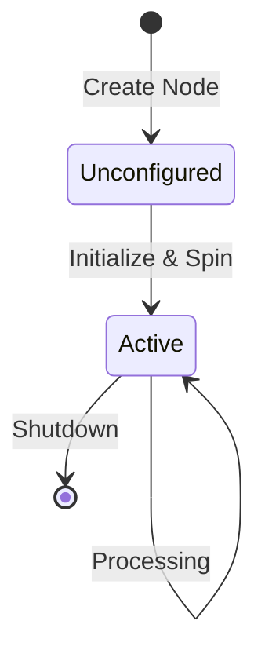

import Quiz from '@site/src/components/Quiz';
import Callout from '@site/src/components/Callout';

# Your First ROS 2 Node

You've installed ROS 2—now it's time to create your first node! In this sub-chapter, you'll learn what nodes are, create a ROS 2 package, and write a simple publisher node that sends messages.

---

## What is a ROS 2 Node?

A **node** is the fundamental building block of a ROS 2 application. Think of a node as a specialized worker in a factory—each worker (node) performs one specific job, and they all work together to build the final product (your robot's behavior).

**Examples of Nodes**:
- **Camera Driver Node**: Captures images from a camera sensor
- **Object Detector Node**: Analyzes images to identify objects
- **Motor Controller Node**: Sends velocity commands to motors
- **Logger Node**: Records sensor data to disk

**Philosophy**: One node, one responsibility. This makes your system modular, testable, and maintainable.

<Callout type="info" title="Nodes as Processes">
Each node runs as an independent process (or can share a process in advanced configurations). This isolation means if one node crashes, others keep running.
</Callout>

---

## Node Lifecycle



For simple nodes (like the ones you'll write initially), the lifecycle is straightforward:
1. **Create**: Instantiate the node class
2. **Initialize**: Call `rclpy.init()` to set up ROS 2 infrastructure
3. **Spin**: Enter a loop processing callbacks (timers, subscriptions)
4. **Shutdown**: Clean up resources with `rclpy.shutdown()`

<Quiz
  question="What is the primary purpose of a ROS 2 node?"
  options={[
    "To store configuration files for the robot",
    "To perform a specific computational task in a modular way",
    "To compile Python code into machine code",
    "To replace the operating system kernel"
  ]}
  correctAnswer={1}
  explanation="Nodes are modular processes that perform specific tasks like reading sensors, processing data, or controlling actuators. They don't store configs (parameters do that), compile code, or interact with the OS kernel directly."
  difficulty="easy"
/>

---

## Creating a ROS 2 Package

Before writing a node, you need a **package**—a container for your code, dependencies, and metadata.

### Step 1: Create a Workspace

```bash
# Create workspace directory
mkdir -p ~/ros2_ws/src
cd ~/ros2_ws/src
```

### Step 2: Create a Python Package

```bash
ros2 pkg create --build-type ament_python my_first_package
```

**Expected Output**:
```
going to create a new package
package name: my_first_package
destination directory: /home/user/ros2_ws/src
package format: 3
version: 0.0.0
description: TODO: Package description
maintainer: ['user <user@todo.todo>']
licenses: ['TODO: License declaration']
build type: ament_python
dependencies: []
creating folder ./my_first_package
...
```

### Step 3: Explore Package Structure

```bash
cd my_first_package
tree
```

**Output**:
```
my_first_package/
├── my_first_package/
│   └── __init__.py
├── package.xml
├── resource/
│   └── my_first_package
├── setup.cfg
├── setup.py
└── test/
    ├── test_copyright.py
    ├── test_flake8.py
    └── test_pep257.py
```

**Key Files**:
- `package.xml`: Package metadata and dependencies
- `setup.py`: Python package installation configuration
- `my_first_package/`: Your Python code goes here

---

## Writing a Minimal Publisher Node

Let's create a node that publishes string messages every 0.5 seconds.

### Create the Node File

```bash
cd ~/ros2_ws/src/my_first_package/my_first_package
touch publisher_node.py
chmod +x publisher_node.py
```

### Write the Code

```python title="my_first_package/publisher_node.py" showLineNumbers {9-11}
import rclpy
from rclpy.node import Node
from std_msgs.msg import String

class MinimalPublisher(Node):
    def __init__(self):
        super().__init__('minimal_publisher')
        
        # Create publisher: message type, topic name, queue size
        self.publisher_ = self.create_publisher(String, 'chatter', 10)
        
        # Create timer: period in seconds, callback function
        timer_period = 0.5
        self.timer = self.create_timer(timer_period, self.timer_callback)
        
        self.i = 0
        self.get_logger().info('Publisher node started')
    
    def timer_callback(self):
        # Create message
        msg = String()
        msg.data = f'Hello World: {self.i}'
        
        # Publish message
        self.publisher_.publish(msg)
        self.get_logger().info(f'Publishing: "{msg.data}"')
        
        self.i += 1

def main(args=None):
    rclpy.init(args=args)
    node = MinimalPublisher()
    
    try:
        rclpy.spin(node)
    except KeyboardInterrupt:
        pass
    finally:
        node.destroy_node()
        rclpy.shutdown()

if __name__ == '__main__':
    main()
```

**Code Breakdown**:
- **Lines 1-3**: Import ROS 2 Python library (`rclpy`), base Node class, and String message type
- **Line 7**: Call parent class constructor with node name
- **Lines 9-10**: Create a publisher for `std_msgs/String` on topic `chatter` with queue size 10
- **Lines 13-14**: Create a timer that calls `timer_callback` every 0.5 seconds
- **Lines 19-27**: Timer callback publishes a message and increments counter
- **Lines 30-39**: Main function initializes ROS 2, spins node, and handles cleanup

<Callout type="tip" title="Queue Size Explained">
The queue size (10) determines how many messages are buffered if publishing faster than subscribers can process. Start with 10 for most applications—increase for high-frequency data like camera images.
</Callout>

---

## Configuring the Package

### Update `setup.py`

Edit `~/ros2_ws/src/my_first_package/setup.py` to add the entry point:

```python title="setup.py" showLineNumbers {20-23}
from setuptools import setup

package_name = 'my_first_package'

setup(
    name=package_name,
    version='0.0.0',
    packages=[package_name],
    data_files=[
        ('share/ament_index/resource_index/packages',
            ['resource/' + package_name]),
        ('share/' + package_name, ['package.xml']),
    ],
    install_requires=['setuptools'],
    zip_safe=True,
    maintainer='your_name',
    maintainer_email='your_email@example.com',
    description='My first ROS 2 package',
    license='Apache License 2.0',
    entry_points={
        'console_scripts': [
            'publisher = my_first_package.publisher_node:main',
        ],
    },
)
```

**What Changed**: Added `publisher` executable that calls the `main()` function in `publisher_node.py`.

---

## Building and Running

### Build the Package

```bash
cd ~/ros2_ws
colcon build --packages-select my_first_package
```

**Expected Output**:
```
Starting >>> my_first_package
Finished <<< my_first_package [0.85s]

Summary: 1 package finished [1.01s]
```

### Source the Workspace

```bash
source ~/ros2_ws/install/setup.bash
```

<Callout type="warning" title="Overlay vs. Underlay">
You now have **two** sourced environments:
1. **Underlay**: `/opt/ros/humble/setup.bash` (ROS 2 base installation)
2. **Overlay**: `~/ros2_ws/install/setup.bash` (your workspace)

The overlay takes precedence, allowing you to override base packages.
</Callout>

### Run the Node

```bash
ros2 run my_first_package publisher
```

**Expected Output**:
```
[INFO] [1638360000.123456] [minimal_publisher]: Publisher node started
[INFO] [1638360000.623456] [minimal_publisher]: Publishing: "Hello World: 0"
[INFO] [1638360001.123456] [minimal_publisher]: Publishing: "Hello World: 1"
[INFO] [1638360001.623456] [minimal_publisher]: Publishing: "Hello World: 2"
...
```

**Success!** 🎉 Your node is publishing messages. Press `Ctrl+C` to stop.

<Quiz
  question="In the code `self.create_publisher(String, 'chatter', 10)`, what does the `10` represent?"
  options={[
    "The number of subscribers allowed",
    "The message publishing rate in Hz",
    "The queue size (number of messages buffered)",
    "The priority level of the publisher"
  ]}
  correctAnswer={2}
  explanation="The queue size determines how many messages are stored if the publisher produces messages faster than subscribers can consume them. With a queue size of 10, up to 10 messages will be buffered before old ones are discarded."
  difficulty="medium"
/>

---

## Testing Your Node

### Verify Node is Running

Open a new terminal and check active nodes:

```bash
source ~/ros2_ws/install/setup.bash
ros2 node list
```

**Output**:
```
/minimal_publisher
```

### Inspect the Topic

See what topics exist:

```bash
ros2 topic list
```

**Output**:
```
/chatter
/parameter_events
/rosout
```

### Echo Messages

Listen to messages on `/chatter`:

```bash
ros2 topic echo /chatter
```

**Output**:
```
data: 'Hello World: 15'
---
data: 'Hello World: 16'
---
...
```

---

## What You've Learned

- ✅ Created a **ROS 2 workspace** and Python package
- ✅ Wrote a **publisher node** that sends messages on a timer
- ✅ Configured `setup.py` with an **entry point**
- ✅ Built and ran the node with **colcon** and **ros2 run**
- ✅ Used **ros2 CLI tools** to inspect nodes and topics

<Quiz
  question="What happens if you forget to call `rclpy.init()` before creating a node?"
  options={[
    "The node will run but won't publish messages",
    "A runtime error will occur: 'rcl not initialized'",
    "Messages will be published but not received by subscribers",
    "The node will run in simulation mode"
  ]}
  correctAnswer={1}
  explanation="`rclpy.init()` initializes the ROS 2 client library. Without it, trying to create a node will raise a runtime error because the underlying middleware (rcl) hasn't been initialized."
  difficulty="medium"
/>

---

## Next Steps

**Continue to**: [Topics & Messages](04-topics-messages)
