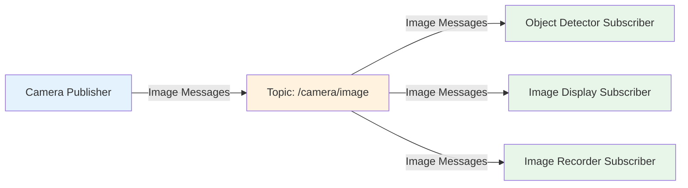

import Quiz from '@site/src/components/Quiz';
import Callout from '@site/src/components/Callout';

# Topics & Messages

In the previous sub-chapter, you created a publisher node. But how do other nodes receive those messages? And what if you need to send more than just strings? This sub-chapter dives deep into topics and messages—the backbone of asynchronous communication in ROS 2.

---

## Understanding the Publish-Subscribe Pattern

Imagine a radio station broadcasting music. The station (publisher) sends signals without knowing who's listening. Anyone with a radio (subscriber) tuned to the right frequency (topic) receives the broadcast. If no one is listening, the music still plays—it's just not heard.

**This is the publish-subscribe pattern** in ROS 2:
- **Publishers** send messages to topics without knowing (or caring) about subscribers
- **Subscribers** listen to topics and receive all messages published there
- **Topics** are named channels that decouple publishers from subscribers

### Benefits of Pub-Sub

1. **Decoupling**: Publishers and subscribers don't need to know about each other
2. **Scalability**: Add/remove subscribers without modifying publishers
3. **Flexibility**: Multiple publishers and subscribers on the same topic
4. **Asynchronous**: No blocking—publishers don't wait for subscribers



**Diagram Explanation**: A single camera publisher sends images to a topic. Three different subscribers (detector, display, recorder) all receive the same images independently.

<Quiz
  question="What happens if a publisher sends a message when no subscribers are listening?"
  options={[
    "The message is queued until a subscriber connects",
    "The message is immediately discarded",
    "The publisher blocks until a subscriber connects",
    "An error is logged and the node crashes"
  ]}
  correctAnswer={1}
  explanation="ROS 2 uses a fire-and-forget model for topics. If no subscribers exist, messages are discarded immediately to prevent unbounded memory growth. This is intentional—publishers don't wait for subscribers."
  difficulty="medium"
/>

---

## ROS 2 Message Types

Messages are strongly-typed data structures. ROS 2 provides hundreds of standard message types organized into packages:

### Common Message Packages

**std_msgs**: Basic types
```python
from std_msgs.msg import String, Int32, Float64, Bool
```

**geometry_msgs**: Spatial data
```python
from geometry_msgs.msg import Point, Pose, Twist, Vector3
```

**sensor_msgs**: Sensor data
```python
from sensor_msgs.msg import Image, LaserScan, Imu, PointCloud2
```

**nav_msgs**: Navigation data
```python
from nav_msgs.msg import Odometry, Path
```

### Message Anatomy

Every message type has **fields** with specific data types:

```python
# geometry_msgs/Twist
linear:
  x: float64  # Forward/backward velocity (m/s)
  y: float64  # Left/right velocity (m/s)
  z: float64  # Up/down velocity (m/s)
angular:
  x: float64  # Roll rate (rad/s)
  y: float64  # Pitch rate (rad/s)
  z: float64  # Yaw rate (rad/s)
```

---

## Creating a Subscriber Node

Let's create a subscriber that listens to the messages from our publisher in Sub-Chapter 3.

### Write the Subscriber Code

```python title="my_first_package/subscriber_node.py" showLineNumbers {9-10,13-17}
import rclpy
from rclpy.node import Node
from std_msgs.msg import String

class MinimalSubscriber(Node):
    def __init__(self):
        super().__init__('minimal_subscriber')
        
        # Create subscriber: message type, topic name, callback, queue size
        self.subscription = self.create_subscription(
            String, 'chatter', self.listener_callback, 10)
        
        self.get_logger().info('Subscriber node started')
    
    def listener_callback(self, msg):
        # This function is called every time a message is received
        self.get_logger().info(f'I heard: "{msg.data}"')

def main(args=None):
    rclpy.init(args=args)
    node = MinimalSubscriber()
    
    try:
        rclpy.spin(node)
    except KeyboardInterrupt:
        pass
    finally:
        node.destroy_node()
        rclpy.shutdown()

if __name__ == '__main__':
    main()
```

**Key Points**:
- **Line 10**: Create subscription with message type, topic name, callback function, and queue size
- **Lines 15-17**: Callback function executes whenever a message arrives
- **Callback Parameter**: `msg` is a `String` object with a `.data` attribute

<Callout type="tip" title="Callback Execution">
The callback function runs in the executor's thread. Keep callbacks fast—heavy computation should be offloaded to separate threads or use timers to batch process messages.
</Callout>

### Update setup.py

Add the subscriber entry point:

```python title="setup.py" {22-23}
entry_points={
    'console_scripts': [
        'publisher = my_first_package.publisher_node:main',
        'subscriber = my_first_package.subscriber_node:main',
    ],
},
```

### Build and Run

```bash
cd ~/ros2_ws
colcon build --packages-select my_first_package
source ~/ros2_ws/install/setup.bash
```

**Run publisher in Terminal 1**:
```bash
ros2 run my_first_package publisher
```

**Run subscriber in Terminal 2**:
```bash
source ~/ros2_ws/install/setup.bash
ros2 run my_first_package subscriber
```

**Expected Output (Terminal 2)**:
```
[INFO] [minimal_subscriber]: Subscriber node started
[INFO] [minimal_subscriber]: I heard: "Hello World: 5"
[INFO] [minimal_subscriber]: I heard: "Hello World: 6"
[INFO] [minimal_subscriber]: I heard: "Hello World: 7"
...
```

🎉 **Success!** Your subscriber is receiving messages from the publisher.

<Quiz
  question="In `self.create_subscription(String, 'chatter', self.listener_callback, 10)`, what is the purpose of `self.listener_callback`?"
  options={[
    "It's the name of the subscriber node",
    "It's the function called every time a message is received on the topic",
    "It's the queue size for buffering messages",
    "It's the message type being subscribed to"
  ]}
  correctAnswer={1}
  explanation="The callback function (self.listener_callback) is invoked by the ROS 2 executor every time a new message arrives on the subscribed topic. It receives the message as a parameter."
  difficulty="easy"
/>

---

## Topic Inspection with CLI Tools

ROS 2 provides powerful command-line tools to inspect topics:

### List Active Topics

```bash
ros2 topic list
```

**Output**:
```
/chatter
/parameter_events
/rosout
```

### Get Topic Info

```bash
ros2 topic info /chatter
```

**Output**:
```
Type: std_msgs/msg/String
Publisher count: 1
Subscription count: 1
```

### Echo Topic Messages

```bash
ros2 topic echo /chatter
```

**Output** (live stream):
```
data: 'Hello World: 12'
---
data: 'Hello World: 13'
---
```

Press `Ctrl+C` to stop.

### Publish from Command Line

You can publish manually without writing code:

```bash
ros2 topic pub /chatter std_msgs/msg/String "data: 'Hello from CLI'"
```

This publishes a single message (add `--rate 1` to publish at 1 Hz).

<Callout type="info" title="CLI Publishing for Testing">
`ros2 topic pub` is incredibly useful for testing subscribers without writing publisher code. Great for debugging!
</Callout>

---

## Working with Complex Messages

Let's upgrade from simple strings to robot velocity commands using `geometry_msgs/Twist`.

### Velocity Publisher Example

```python title="my_first_package/velocity_publisher.py" showLineNumbers {2,10-17}
import rclpy
from rclpy.node import Node
from geometry_msgs.msg import Twist

class VelocityPublisher(Node):
    def __init__(self):
        super().__init__('velocity_publisher')
        self.publisher_ = self.create_publisher(Twist, '/cmd_vel', 10)
        self.timer = self.create_timer(0.5, self.publish_velocity)
        
    def publish_velocity(self):
        msg = Twist()
        # Set linear velocity (forward/backward)
        msg.linear.x = 0.5  # 0.5 m/s forward
        msg.linear.y = 0.0
        msg.linear.z = 0.0
        # Set angular velocity (rotation)
        msg.angular.x = 0.0
        msg.angular.y = 0.0
        msg.angular.z = 0.2  # 0.2 rad/s counterclockwise
        
        self.publisher_.publish(msg)
        self.get_logger().info(f'Publishing: linear.x={msg.linear.x}, angular.z={msg.angular.z}')

def main(args=None):
    rclpy.init(args=args)
    node = VelocityPublisher()
    rclpy.spin(node)
    node.destroy_node()
    rclpy.shutdown()

if __name__ == '__main__':
    main()
```

**What This Does**: Commands a robot to move forward at 0.5 m/s while rotating counterclockwise at 0.2 rad/s.

<Quiz
  question="What would happen if you set `msg.linear.x = -1.0` in the Twist message?"
  options={[
    "The robot would stop moving",
    "The robot would move backward at 1.0 m/s",
    "The robot would move upward",
    "An error would be thrown—negative values aren't allowed"
  ]}
  correctAnswer={1}
  explanation="In geometry_msgs/Twist, positive linear.x means forward, negative means backward. Setting linear.x = -1.0 commands the robot to move backward at 1 m/s. Negative values are perfectly valid."
  difficulty="medium"
/>

---

## Quality of Service (QoS)

ROS 2 topics support **Quality of Service (QoS) policies** that control message delivery behavior.

### Why QoS Matters

Different use cases need different reliability/performance trade-offs:
- **Sensor data** (camera, lidar): High frequency, loss acceptable → **Best Effort**
- **Commands** (motor control): Must arrive → **Reliable**
- **Diagnostics**: Need history of recent messages → **Keep Last N**

### QoS Profiles

```python
from rclpy.qos import QoSProfile, ReliabilityPolicy, HistoryPolicy

# Sensor data profile (lossy, low latency)
sensor_qos = QoSProfile(
    reliability=ReliabilityPolicy.BEST_EFFORT,
    history=HistoryPolicy.KEEP_LAST,
    depth=10
)

publisher = self.create_publisher(Image, '/camera/image', sensor_qos)
```

**Common Policies**:
- **Reliability**:
  - `BEST_EFFORT`: Send and forget (fast, may lose messages)
  - `RELIABLE`: Guarantee delivery (slower, no loss)
  
- **History**:
  - `KEEP_LAST`: Store last N messages (depth parameter)
  - `KEEP_ALL`: Store all messages (unbounded)

<Callout type="warning" title="QoS Compatibility">
Publishers and subscribers must have **compatible** QoS settings to communicate. For example, a `BEST_EFFORT` publisher can't send to a `RELIABLE` subscriber. Use `ros2 topic info -v <topic>` to check QoS settings.
</Callout>

---

## Common Patterns and Pitfalls

### Pattern: Throttling Messages

If you're receiving messages faster than you can process:

```python
import time

class ThrottledSubscriber(Node):
    def __init__(self):
        super().__init__('throttled_subscriber')
        self.subscription = self.create_subscription(
            Image, '/camera/image', self.image_callback, 10)
        self.last_process_time = time.time()
        
    def image_callback(self, msg):
        current_time = time.time()
        # Only process every 0.5 seconds
        if current_time - self.last_process_time > 0.5:
            self.process_image(msg)
            self.last_process_time = current_time
    
    def process_image(self, msg):
        # Heavy computation here
        pass
```

### Pitfall: Mismatched Message Types

**Error**:
```python
# Publisher sends String
self.pub = self.create_publisher(String, '/data', 10)

# Subscriber expects Int32 on same topic
self.sub = self.create_subscription(Int32, '/data', self.callback, 10)
```

**Result**: No communication! Publisher and subscriber must use the **same message type** on a topic.

**Fix**: Ensure both use `String` or both use `Int32`.

### Pitfall: Forgetting to Spin

```python
def main(args=None):
    rclpy.init(args=args)
    node = MinimalSubscriber()
    # Missing rclpy.spin(node)  ← Callbacks never execute!
    node.destroy_node()
    rclpy.shutdown()
```

**Fix**: Always call `rclpy.spin()` to process callbacks.

---

## What You've Learned

- ✅ The **publish-subscribe pattern** decouples publishers and subscribers via topics
- ✅ **Messages** are strongly-typed data structures (String, Twist, Image, etc.)
- ✅ **Subscribers** use callbacks to process incoming messages
- ✅ **ros2 CLI tools** (topic list, echo, pub) for inspection and testing
- ✅ **QoS policies** control reliability, history, and performance trade-offs
- ✅ Common patterns (throttling) and pitfalls (type mismatches, missing spin)

<Quiz
  question="Which QoS reliability policy should you use for high-frequency sensor data where occasional message loss is acceptable?"
  options={[
    "RELIABLE—to ensure all sensor data arrives",
    "BEST_EFFORT—to minimize latency and allow message loss",
    "KEEP_ALL—to buffer all messages",
    "TRANSIENT_LOCAL—to persist messages"
  ]}
  correctAnswer={1}
  explanation="For high-frequency sensor data (camera, lidar), BEST_EFFORT is preferred because it minimizes latency and avoids retransmission overhead. Occasional message loss is acceptable since new data arrives quickly."
  difficulty="hard"
/>

---

## Next Steps

Now that you've mastered asynchronous communication with topics, let's explore **synchronous** communication with services!

**Continue to**: [Services](05-services)

---

## Additional Resources

:::info Dive Deeper
- [ROS 2 Topic Tutorial](https://docs.ros.org/en/humble/Tutorials/Beginner-Client-Libraries/Writing-A-Simple-Py-Publisher-And-Subscriber.html)
- [Message Type Reference](https://docs.ros2.org/humble/api/)
- [QoS Policies Guide](https://docs.ros.org/en/humble/Concepts/About-Quality-of-Service-Settings.html)
:::
