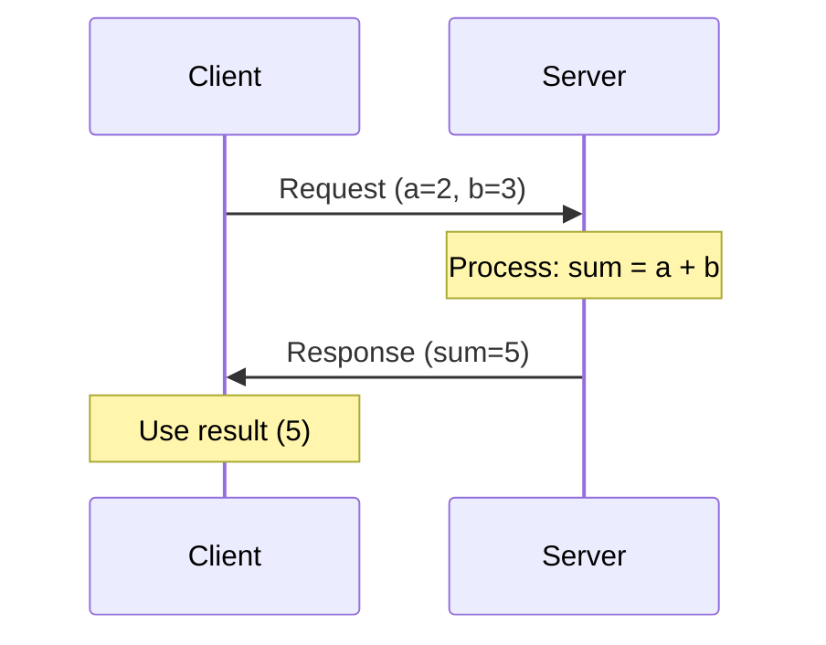

import Quiz from '@site/src/components/Quiz';
import Callout from '@site/src/components/Callout';

# Services

Topics are great for streaming data, but what if you need a **response**? What if you want to ask a question and wait for an answer? This is where **services** come in—ROS 2's request-response communication pattern.

---

## Understanding Request-Response

Think of a service like calling a restaurant to place an order:
1. **You (client)** make a request: "I'd like a pizza"
2. **Restaurant (server)** processes the request
3. **Restaurant** sends a response: "Your pizza will arrive in 30 minutes"

Unlike topics (where publishers don't wait for acknowledgment), **service clients block until they receive a response**.



**Key Differences from Topics**:
- **Synchronous**: Client waits for server response
- **One-to-one**: Each request goes to exactly one server
- **Bidirectional**: Request flows one way, response flows back
- **Transient**: No message history—each call is independent

<Quiz
  question="When should you use a service instead of a topic?"
  options={[
    "When you need to send high-frequency sensor data",
    "When you need confirmation that a request was processed and want a result",
    "When you want multiple nodes to receive the same data",
    "When you need asynchronous communication"
  ]}
  correctAnswer={1}
  explanation="Services are for synchronous request-response patterns where you need confirmation and a result. Topics are for asynchronous streaming data. Use services when you need an answer (e.g., 'calculate sum', 'check if obstacle detected')."
  difficulty="medium"
/>

---

## ROS 2 Service Types

Like messages, services are strongly typed. A service type defines:
- **Request**: Data sent from client to server
- **Response**: Data sent from server back to client

### Common Service Types

**std_srvs**: Simple triggers
```python
from std_srvs.srv import Trigger, SetBool, Empty
```

**example_interfaces**: Basic operations
```python
from example_interfaces.srv import AddTwoInts, SetBool
```

**nav_msgs**: Navigation services
```python
from nav_msgs.srv import GetMap, GetPlan
```

### Service Definition Example

```python
# example_interfaces/srv/AddTwoInts.srv

# Request
int64 a
int64 b
---
# Response
int64 sum
```

The `---` separator divides request fields from response fields.

---

## Creating a Service Server

Let's create a server that adds two integers.

### Write the Server Code

```python title="my_first_package/add_server.py" showLineNumbers {2,10-13,15-20}
import rclpy
from rclpy.node import Node
from example_interfaces.srv import AddTwoInts

class AddTwoIntsServer(Node):
    def __init__(self):
        super().__init__('add_two_ints_server')
        
        # Create service: service type, service name, callback
        self.srv = self.create_service(
            AddTwoInts,
            'add_two_ints',
            self.add_two_ints_callback)
        
        self.get_logger().info('Add Two Ints Server is ready')
    
    def add_two_ints_callback(self, request, response):
        response.sum = request.a + request.b
        self.get_logger().info(f'Request: {request.a} + {request.b} = {response.sum}')
        return response

def main(args=None):
    rclpy.init(args=args)
    node = AddTwoIntsServer()
    
    try:
        rclpy.spin(node)
    except KeyboardInterrupt:
        pass
    finally:
        node.destroy_node()
        rclpy.shutdown()

if __name__ == '__main__':
    main()
```

**Code Breakdown**:
- **Line 10-13**: Create service with type, name, and callback
- **Lines 17-20**: Callback receives `request` object, populates `response` object, returns it
- **Request Access**: `request.a` and `request.b` are the two integers
- **Response**: `response.sum` is the result

<Callout type="info" title="Service Callbacks Must Return Response">
Unlike topic callbacks (which return nothing), service callbacks **must return the response object**. If you forget, clients will hang waiting forever!
</Callout>

### Update setup.py

```python title="setup.py" {24}
entry_points={
    'console_scripts': [
        'publisher = my_first_package.publisher_node:main',
        'subscriber = my_first_package.subscriber_node:main',
        'add_server = my_first_package.add_server:main',
    ],
},
```

### Build and Run

```bash
cd ~/ros2_ws
colcon build --packages-select my_first_package
source ~/ros2_ws/install/setup.bash

ros2 run my_first_package add_server
```

**Output**:
```
[INFO] [add_two_ints_server]: Add Two Ints Server is ready
```

Server is now waiting for requests!

---

## Creating a Service Client

Now let's write a client to call the server.

### Write the Client Code

```python title="my_first_package/add_client.py" showLineNumbers {2,10-11,15-19,21-28}
import sys
import rclpy
from rclpy.node import Node
from example_interfaces.srv import AddTwoInts

class AddTwoIntsClient(Node):
    def __init__(self):
        super().__init__('add_two_ints_client')
        
        # Create client: service type, service name
        self.cli = self.create_client(AddTwoInts, 'add_two_ints')
        
        # Wait for service to be available
        while not self.cli.wait_for_service(timeout_sec=1.0):
            self.get_logger().info('Service not available, waiting...')
    
    def send_request(self, a, b):
        # Create request
        req = AddTwoInts.Request()
        req.a = a
        req.b = b
        
        # Call service asynchronously
        future = self.cli.call_async(req)
        rclpy.spin_until_future_complete(self, future)
        
        if future.result() is not None:
            return future.result()
        else:
            self.get_logger().error('Service call failed')
            return None

def main(args=None):
    rclpy.init(args=args)
    
    # Get numbers from command line
    if len(sys.argv) != 3:
        print('Usage: ros2 run my_first_package add_client <a> <b>')
        return
    
    node = AddTwoIntsClient()
    result = node.send_request(int(sys.argv[1]), int(sys.argv[2]))
    
    if result:
        node.get_logger().info(f'Result: {sys.argv[1]} + {sys.argv[2]} = {result.sum}')
    
    node.destroy_node()
    rclpy.shutdown()

if __name__ == '__main__':
    main()
```

**Code Breakdown**:
- **Lines 15-16**: Wait for server to be available (timeout if not found)
- **Lines 18-21**: Create and populate request object
- **Line 24**: Call service asynchronously (non-blocking)
- **Line 25**: Wait for response to complete
- **Lines 27-30**: Handle result or error

<Callout type="warning" title="Avoid Deadlocks with Async Calls">
**Never** use `call()` (synchronous) from within a callback—it will deadlock! Always use `call_async()` and handle the future with `spin_until_future_complete()` or callbacks.
</Callout>

### Update setup.py

```python title="setup.py" {25}
entry_points={
    'console_scripts': [
        'publisher = my_first_package.publisher_node:main',
        'subscriber = my_first_package.subscriber_node:main',
        'add_server = my_first_package.add_server:main',
        'add_client = my_first_package.add_client:main',
    ],
},
```

### Build and Test

```bash
colcon build --packages-select my_first_package
source ~/ros2_ws/install/setup.bash
```

**Terminal 1 (Server)**:
```bash
ros2 run my_first_package add_server
```

**Terminal 2 (Client)**:
```bash
ros2 run my_first_package add_client 5 7
```

**Expected Output (Terminal 2)**:
```
[INFO] [add_two_ints_client]: Result: 5 + 7 = 12
```

**Expected Output (Terminal 1)**:
```
[INFO] [add_two_ints_server]: Request: 5 + 7 = 12
```

🎉 **Success!** Client and server are communicating.

<Quiz
  question="What would happen if you called `self.cli.call()` (synchronous) inside a timer callback?"
  options={[
    "The service call would complete normally",
    "A deadlock would occur because the executor can't process the response while blocked",
    "The timer would stop running",
    "The service call would fail with a timeout error"
  ]}
  correctAnswer={1}
  explanation="Synchronous `call()` blocks the executor thread, but the service response needs the executor to process it. This creates a deadlock. Always use `call_async()` and handle futures properly."
  difficulty="hard"
/>

---

## Service CLI Tools

### List Available Services

```bash
ros2 service list
```

**Output**:
```
/add_two_ints
/add_two_ints_client/describe_parameters
/add_two_ints_server/describe_parameters
...
```

### Get Service Type

```bash
ros2 service type /add_two_ints
```

**Output**:
```
example_interfaces/srv/AddTwoInts
```

### Call Service from Command Line

```bash
ros2 service call /add_two_ints example_interfaces/srv/AddTwoInts "{a: 10, b: 15}"
```

**Output**:
```
waiting for service to become available...
requester: making request: example_interfaces.srv.AddTwoInts_Request(a=10, b=15)

response:
example_interfaces.srv.AddTwoInts_Response(sum=25)
```

---

## Advanced: Callback-Based Async Calls

Instead of blocking with `spin_until_future_complete()`, use callbacks:

```python
def send_request_async(self, a, b):
    req = AddTwoInts.Request()
    req.a = a
    req.b = b
    
    # Attach callback to future
    future = self.cli.call_async(req)
    future.add_done_callback(self.response_callback)

def response_callback(self, future):
    try:
        result = future.result()
        self.get_logger().info(f'Result: {result.sum}')
    except Exception as e:
        self.get_logger().error(f'Service call failed: {e}')
```

**Benefits**: Non-blocking, allows handling multiple requests in parallel.

---

## Common Use Cases

### Use Case 1: State Queries

**Example**: Check if an obstacle is detected

```python
# Service: GetObstacleState (custom)
Request:
  # Empty
Response:
  bool obstacle_detected
  float32 distance
```

### Use Case 2: Triggering Actions

**Example**: Reset odometry

```python
# Service: std_srvs/Trigger
Request:
  # Empty
Response:
  bool success
  string message
```

### Use Case 3: Configuration

**Example**: Set camera exposure

```python
# Service: SetCameraExposure (custom)
Request:
  int32 exposure_time
Response:
  bool success
  string message
```

<Callout type="tip" title="When NOT to Use Services">
Avoid services for:
- **High-frequency data** (sensor streams) → Use topics
- **Long-running tasks** (navigation to goal) → Use actions
- **Broadcasting to multiple nodes** → Use topics

Services are for quick, synchronous operations that need a response.
</Callout>

---

## What You've Learned

- ✅ **Services** provide synchronous request-response communication
- ✅ **Service servers** handle requests and return responses via callbacks
- ✅ **Service clients** send requests and wait for responses (use `call_async()` to avoid deadlocks)
- ✅ Service types define request and response structures
- ✅ **ros2 CLI tools** for listing, inspecting, and calling services
- ✅ Use cases: state queries, triggering actions, configuration

<Quiz
  question="What is the key difference between a topic and a service in ROS 2?"
  options={[
    "Topics are faster than services",
    "Topics are asynchronous (fire-and-forget), services are synchronous (request-response)",
    "Services can have multiple servers, topics can only have one publisher",
    "Topics use DDS, services use TCP"
  ]}
  correctAnswer={1}
  explanation="The fundamental difference is the communication pattern: topics are asynchronous (publishers don't wait for acknowledgment), while services are synchronous (clients block waiting for a response from the server)."
  difficulty="medium"
/>

---

## Next Steps

Services handle short, synchronous operations. But what about **long-running tasks** that provide progress feedback? That's where **actions** come in!

**Continue to**: [Actions](06-actions)

---

## Additional Resources

:::info Dive Deeper
- [ROS 2 Service Tutorial](https://docs.ros.org/en/humble/Tutorials/Beginner-Client-Libraries/Writing-A-Simple-Py-Service-And-Client.html)
- [Service Type Reference](https://docs.ros2.org/humble/api/)
- [Async Service Calls](https://docs.ros.org/en/humble/Concepts/About-Services.html)
:::
