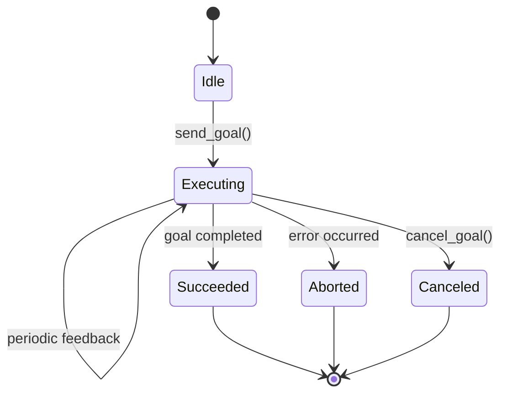

import Quiz from '@site/src/components/Quiz';
import Callout from '@site/src/components/Callout';

# Actions

You've learned topics (asynchronous streaming) and services (synchronous request-response). But what about tasks that take time and provide progress updates? **Actions** are ROS 2's solution for long-running, goal-oriented operations with feedback.

---

## Understanding Actions

Imagine tracking a package delivery:
1. **You (client)** set a goal: "Deliver to 123 Main St"
2. **Delivery service (server)** accepts the goal and starts working
3. **Service sends periodic updates**: "Picked up", "In transit", "Out for delivery"
4. **Service sends final result**: "Delivered" or "Failed"
5. **You can cancel** the delivery anytime before completion

This is the **action pattern** in ROS 2.



**Action Components**:
- **Goal**: What you want to achieve (e.g., "Navigate to pose X")
- **Feedback**: Progress updates during execution (e.g., "50% complete", "Current position")
- **Result**: Final outcome when done (e.g., "Success", "Failed: obstacle detected")

<Quiz
  question="When should you use an action instead of a service?"
  options={[
    "When you need a quick request-response operation",
    "When you need to stream high-frequency sensor data",
    "When you have a long-running task that provides progress updates and can be canceled",
    "When you want to broadcast data to multiple subscribers"
  ]}
  correctAnswer={2}
  explanation="Actions are for long-running tasks (navigation, manipulation, file processing) that take time, provide progress feedback, and allow cancellation. Services are for quick operations, topics for streaming data."
  difficulty="medium"
/>

---

## ROS 2 Action Types

Action definitions include three parts:
1. **Goal**: Request sent to start the action
2. **Result**: Final outcome returned when action completes
3. **Feedback**: Periodic updates during execution

### Example: Fibonacci Action

```
# Goal
int32 order
---
# Result
int32[] sequence
---
# Feedback
int32[] partial_sequence
```

**Popular Action Types**:
- **nav2_msgs/action/NavigateToPose**: Robot navigation
- **control_msgs/action/FollowJointTrajectory**: Robot arm movement
- **turtle_actionlib/Rotate**: TurtleSim rotation (tutorial)

---

## Creating an Action Server

Let's create a Fibonacci sequence action server that generates numbers and provides feedback.

### Install Action Dependencies

First, add action support to your package:

```bash
cd ~/ros2_ws/src/my_first_package
```

Edit `package.xml` to add:

```xml
<depend>rclpy</depend>
<depend>action_msgs</depend>
<depend>example_interfaces</depend>
```

### Create Custom Action Definition

```bash
mkdir -p action
```

Create `action/Fibonacci.action`:

```
# Goal
int32 order
---
# Result
int32[] sequence
---
# Feedback
int32[] partial_sequence
```

Update `CMakeLists.txt` (for ament_cmake) or `setup.py` (Python) to include action.

<Callout type="info" title="Using Pre-built Actions">
For this tutorial, we'll use a pre-existing action type from `example_interfaces` or create a simple example. In practice, you'd define custom actions for your robot's specific tasks.
</Callout>

### Write the Action Server

```python title="my_first_package/fibonacci_server.py" showLineNumbers
import time
import rclpy
from rclpy.action import ActionServer
from rclpy.node import Node
from example_interfaces.action import Fibonacci

class FibonacciActionServer(Node):
    def __init__(self):
        super().__init__('fibonacci_action_server')
        
        self._action_server = ActionServer(
            self,
            Fibonacci,
            'fibonacci',
            self.execute_callback
        )
        
        self.get_logger().info('Fibonacci Action Server started')
    
    def execute_callback(self, goal_handle):
        self.get_logger().info('Executing goal...')
        
        # Initialize feedback
        feedback_msg = Fibonacci.Feedback()
        feedback_msg.partial_sequence = [0, 1]
        
        # Generate Fibonacci sequence
        for i in range(1, goal_handle.request.order):
            # Check if goal was canceled
            if goal_handle.is_cancel_requested:
                goal_handle.canceled()
                self.get_logger().info('Goal canceled')
                return Fibonacci.Result()
            
            # Calculate next Fibonacci number
            feedback_msg.partial_sequence.append(
                feedback_msg.partial_sequence[i] + feedback_msg.partial_sequence[i-1]
            )
            
            # Publish feedback
            goal_handle.publish_feedback(feedback_msg)
            self.get_logger().info(f'Feedback: {feedback_msg.partial_sequence}')
            
            time.sleep(1)  # Simulate work
        
        # Mark goal as succeeded
        goal_handle.succeed()
        
        # Return result
        result = Fibonacci.Result()
        result.sequence = feedback_msg.partial_sequence
        return result

def main(args=None):
    rclpy.init(args=args)
    node = FibonacciActionServer()
    rclpy.spin(node)
    node.destroy_node()
    rclpy.shutdown()

if __name__ == '__main__':
    main()
```

**Key Points**:
- **Line 11-15**: Create ActionServer with action type, name, and execute callback
- **Lines 27-31**: Check for cancellation requests
- **Line 39**: Publish periodic feedback
- **Line 45**: Mark goal as succeeded
- **Line 48-50**: Return final result

---

## Creating an Action Client

```python title="my_first_package/fibonacci_client.py" showLineNumbers
import rclpy
from rclpy.action import ActionClient
from rclpy.node import Node
from example_interfaces.action import Fibonacci

class FibonacciActionClient(Node):
    def __init__(self):
        super().__init__('fibonacci_action_client')
        
        self._action_client = ActionClient(
            self,
            Fibonacci,
            'fibonacci'
        )
    
    def send_goal(self, order):
        goal_msg = Fibonacci.Goal()
        goal_msg.order = order
        
        self.get_logger().info('Waiting for action server...')
        self._action_client.wait_for_server()
        
        self.get_logger().info(f'Sending goal: order={order}')
        
        send_goal_future = self._action_client.send_goal_async(
            goal_msg,
            feedback_callback=self.feedback_callback
        )
        
        send_goal_future.add_done_callback(self.goal_response_callback)
    
    def goal_response_callback(self, future):
        goal_handle = future.result()
        
        if not goal_handle.accepted:
            self.get_logger().info('Goal rejected')
            return
        
        self.get_logger().info('Goal accepted')
        
        get_result_future = goal_handle.get_result_async()
        get_result_future.add_done_callback(self.get_result_callback)
    
    def get_result_callback(self, future):
        result = future.result().result
        self.get_logger().info(f'Result: {result.sequence}')
        rclpy.shutdown()
    
    def feedback_callback(self, feedback_msg):
        feedback = feedback_msg.feedback
        self.get_logger().info(f'Feedback: {feedback.partial_sequence}')

def main(args=None):
    rclpy.init(args=args)
    
    action_client = FibonacciActionClient()
    action_client.send_goal(10)
    
    rclpy.spin(action_client)

if __name__ == '__main__':
    main()
```

**Flow**:
1. **Lines 25-28**: Send goal with feedback callback
2. **Lines 32-42**: Handle goal acceptance/rejection
3. **Lines 44-47**: Handle final result
4. **Lines 49-51**: Handle periodic feedback

---

## Testing the Action

**Terminal 1 (Server)**:
```bash
ros2 run my_first_package fibonacci_server
```

**Terminal 2 (Client)**:
```bash
ros2 run my_first_package fibonacci_client
```

**Expected Output (Client)**:
```
[INFO] [fibonacci_action_client]: Sending goal: order=10
[INFO] [fibonacci_action_client]: Goal accepted
[INFO] [fibonacci_action_client]: Feedback: [0, 1, 1]
[INFO] [fibonacci_action_client]: Feedback: [0, 1, 1, 2]
[INFO] [fibonacci_action_client]: Feedback: [0, 1, 1, 2, 3]
...
[INFO] [fibonacci_action_client]: Result: [0, 1, 1, 2, 3, 5, 8, 13, 21, 34, 55]
```

<Quiz
  question="What is the purpose of the feedback callback in an action client?"
  options={[
    "To send the final result back to the server",
    "To receive periodic progress updates from the action server",
    "To cancel the action",
    "To verify the action server is running"
  ]}
  correctAnswer={1}
  explanation="The feedback callback is invoked periodically by the action server to provide progress updates to the client. This allows the client to monitor long-running tasks (e.g., '50% complete', 'current position: X, Y')."
  difficulty="medium"
/>

---

## Action CLI Tools

### List Active Actions

```bash
ros2 action list
```

**Output**:
```
/fibonacci
```

### Get Action Info

```bash
ros2 action info /fibonacci
```

**Output**:
```
Action: /fibonacci
Action clients: 1
Action servers: 1
```

### Send Goal from CLI

```bash
ros2 action send_goal /fibonacci example_interfaces/action/Fibonacci "{order: 5}"
```

---

## When to Use Each Pattern

| Pattern | Use Case | Example |
|---------|----------|---------|
| **Topic** | Streaming data, one-way | Camera images, sensor readings |
| **Service** | Quick request-response | Get robot state, set parameter |
| **Action** | Long-running, cancellable tasks | Navigate to pose, pick object |

<Callout type="tip" title="Action vs. Service Decision">
If the operation takes **more than 1 second** and you need progress feedback or cancellation, use an **action**. Otherwise, a **service** is simpler.
</Callout>

---

## What You've Learned

- ✅ **Actions** handle long-running, goal-oriented tasks with feedback and cancellation
- ✅ Actions have **goal**, **result**, and **feedback** components
- ✅ **Action servers** execute tasks and publish feedback
- ✅ **Action clients** send goals, receive feedback, and get results
- ✅ Use actions for navigation, manipulation, and other time-consuming operations

<Quiz
  question="What are the three main components of a ROS 2 action?"
  options={[
    "Publisher, Subscriber, Topic",
    "Request, Response, Acknowledgment",
    "Goal, Feedback, Result",
    "Client, Server, Message"
  ]}
  correctAnswer={2}
  explanation="Actions consist of: (1) Goal (what to achieve), (2) Feedback (periodic progress updates), and (3) Result (final outcome when complete or canceled)."
  difficulty="easy"
/>

---

## Next Steps

You now understand all three communication patterns in ROS 2! Next, learn how to configure nodes and orchestrate multi-node systems.

**Continue to**: [Parameters & Launch Files](07-parameters-launch)

---

## Additional Resources

:::info Dive Deeper
- [ROS 2 Action Tutorial](https://docs.ros.org/en/humble/Tutorials/Intermediate/Writing-an-Action-Server-Client/Py.html)
- [Action Type Reference](https://docs.ros2.org/humble/api/)
:::
