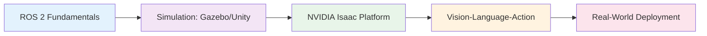

# Data Model: Introduction Chapter Content Structure

**Feature**: 004-book-intro-chapter
**Date**: 2025-12-06
**Phase**: 1.1 - Content Structure Model

## Overview

This document defines the structure and relationships of content entities in the introduction chapter MDX file. The introduction chapter is a structured document with fixed sections, embedded metadata, and visual elements.

## Entity Definitions

### 1. Chapter Metadata

**Description**: Frontmatter fields at the top of the MDX file controlling Docusaurus behavior

**Attributes**:
- `id` (string, required): Unique identifier for the chapter (e.g., "introduction")
- `title` (string, required): Full chapter title displayed on page (e.g., "Introduction: Physical AI & Humanoid Robotics")
- `sidebar_label` (string, required): Short label for sidebar navigation (e.g., "Introduction")
- `sidebar_position` (number, required): Numeric position in sidebar (value: 1 for introduction)
- `sidebar_custom_props` (object, optional): Custom metadata
  - `difficulty` (string): "Beginner" | "Intermediate" | "Advanced"
  - `readingTime` (string): Estimated time (e.g., "18 minutes")

**Constraints**:
- `sidebar_position` for introduction MUST be 1
- `difficulty` for introduction MUST be "Beginner"
- `readingTime` MUST be between "15 minutes" and "20 minutes"

**Example**:
```yaml
---
id: introduction
title: "Introduction: Physical AI & Humanoid Robotics"
sidebar_label: "Introduction"
sidebar_position: 1
sidebar_custom_props:
  difficulty: "Beginner"
  readingTime: "18 minutes"
---
```

---

### 2. Section

**Description**: Structural content unit within the chapter (Markdown heading ## level 2)

**Attributes**:
- `title` (string, required): Section heading text
- `order` (number, required): Position within chapter (1-7)
- `content` (markdown, required): Body paragraphs, lists, diagrams
- `technical_terms` (array of Technical Term Definition, optional): Inline definitions

**Fixed Sections** (per FR-001 to FR-007):
1. "Why Physical AI Matters" (order: 1)
2. "What This Book Covers" (order: 2)
3. "Who This Book Is For" (order: 3)
4. "Learning Outcomes" | "What You'll Learn" (order: 4)
5. "Course Structure" | "13-Week Learning Path" (order: 5)
6. "Prerequisites" | "What You Need to Know" (order: 6)
7. "How to Use This Book" (order: 7)

**Constraints**:
- All 7 sections MUST be present
- Sections MUST appear in the specified order
- Each section MUST have at least 2 paragraphs or 1 paragraph + 1 list

---

### 3. Learning Outcome

**Description**: Measurable skill or capability statement readers will gain

**Attributes**:
- `statement` (string, required): Action-oriented skill description (e.g., "Design autonomous robotic systems using ROS 2")
- `specificity` (string, required): "Specific" | "Measurable" | "Actionable"

**Constraints**:
- Chapter MUST contain 6-8 Learning Outcomes (per FR-004)
- Each statement MUST start with an action verb (e.g., "Design", "Create", "Leverage", "Integrate", "Deploy")
- Each statement MUST reference specific technology or outcome

**Examples**:
```markdown
- Design and implement autonomous robotic systems using ROS 2
- Create realistic simulation environments for testing and validation
- Leverage GPU acceleration for advanced robotics applications
- Integrate vision and language models for embodied AI
- Deploy AI-powered robots from simulation to real hardware
- Apply best practices for safe and reliable robotic systems
```

---

### 4. Module Description

**Description**: Summary of one of the four core modules covered in the book

**Attributes**:
- `name` (string, required): Module title (e.g., "ROS 2 Fundamentals")
- `focus_area` (string, required): 1-sentence description of module's primary focus
- `key_topics` (array of strings, required): 3-4 bullet points of topics covered
- `weeks` (string, required): Week range from 13-week timeline (e.g., "Weeks 3-5")

**Fixed Modules** (per FR-001, homepage content cards):
1. **ROS 2 Fundamentals**
   - Focus: Master the Robot Operating System 2
   - Weeks: 3-5

2. **Gazebo & Unity Simulation**
   - Focus: Build realistic robotic environments
   - Weeks: 6-8

3. **NVIDIA Isaac Platform**
   - Focus: GPU-accelerated robotics development
   - Weeks: 9-10

4. **Vision-Language-Action (VLA)**
   - Focus: End-to-end embodied AI systems
   - Weeks: 11-12

**Constraints**:
- Chapter MUST describe all 4 modules (per FR-001)
- Each module MUST have 3-4 key topics listed

**Example**:
```markdown
### ROS 2 Fundamentals
Master the Robot Operating System 2 for modern robotics.

**Key Topics**:
- Node architecture and communication patterns
- Topics, services, and actions for robot control
- Launch files and parameter configuration
- Real-time system integration and debugging
```

---

### 5. Target Audience Profile

**Description**: Reader persona defining ideal characteristics and background

**Attributes**:
- `persona_type` (string, required): "Primary" | "Secondary" | "Advanced"
- `background` (string, required): Prior knowledge description
- `goals` (string, required): Learning objectives for this persona
- `skills` (array of strings, required): Required or beneficial skills

**Personas** (per spec and clarifications):
1. **Primary**: Developers/engineers with Python basics, no robotics background
2. **Secondary**: Students, hobbyists, career changers with programming fundamentals
3. **Advanced**: Readers with ROS 2 or simulation experience seeking specific topics

**Constraints**:
- "Who This Book Is For" section MUST address all 3 persona types
- Each persona MUST have clear prerequisites stated

**Example**:
```markdown
This book is for you if:
- **You're a software developer** with Python experience wanting to break into robotics
- **You're a student or hobbyist** curious about building intelligent robots
- **You're an engineer** looking to add Physical AI skills to your toolkit
```

---

### 6. Technical Term Definition

**Description**: Inline explanation of technical term with example/analogy (per FR-011 clarification)

**Attributes**:
- `term` (string, required): Technical term being defined
- `simple_definition` (string, required): 1-sentence plain-language definition
- `example_or_analogy` (string, required): 1-2 sentence relatable comparison
- `context_in_book` (string, required): 1 sentence explaining how it's used in this book

**Format** (3-4 sentences total):
```markdown
**[Term]**: [Simple definition]. [Analogy or example]. [Context in this book].
```

**Example**:
```markdown
**Physical AI**: The convergence of artificial intelligence, robotics, and real-world perception enabling machines to understand and act in physical environments. Think of it like giving robots both a "brain" (AI for decision-making) and "eyes and hands" (sensors and actuators for interacting with the real world). In this book, you'll learn to build Physical AI systems that can perceive their surroundings, reason about tasks, and safely execute actions in dynamic environments.
```

**Constraints**:
- Definitions MUST be 3-4 sentences (per clarification)
- Each definition MUST include an example or analogy
- Terms defined on first use only (no repetition)

---

### 7. Visual Element

**Description**: Diagram, chart, or image embedded in the chapter

**Attributes**:
- `type` (string, required): "Mermaid Diagram" | "Static Image"
- `format` (string, required): "flowchart" | "gantt" | "png" | "svg"
- `caption` (string, optional): Alt text / figure caption
- `location` (string, required): Section where element appears

**Required Visual Elements** (per FR-013, FR-014):
1. **Module Relationship Diagram** (Mermaid flowchart)
   - Location: "What This Book Covers" section
   - Shows progression: ROS 2 → Simulation → NVIDIA Isaac → VLA → Deployment

2. **13-Week Timeline** (Mermaid gantt chart or timeline)
   - Location: "Course Structure" section
   - Shows week ranges for each topic phase

**Mermaid Diagram Template (Module Relationships)**:


**Constraints**:
- Chapter MUST include at least 1 diagram for module relationships (FR-013)
- Diagrams MUST render correctly in Docusaurus
- All diagrams MUST have descriptive text preceding them

---

## Entity Relationships

### Chapter Structure Hierarchy

```
Introduction Chapter (MDX File)
├── Chapter Metadata (Frontmatter)
│   ├── id
│   ├── title
│   ├── sidebar_label
│   ├── sidebar_position
│   └── sidebar_custom_props
│       ├── difficulty
│       └── readingTime
│
├── Section 1: "Why Physical AI Matters"
│   ├── Technical Term: "Physical AI" (definition)
│   └── content (paragraphs)
│
├── Section 2: "What This Book Covers"
│   ├── Module Description 1: ROS 2 Fundamentals
│   ├── Module Description 2: Gazebo/Unity
│   ├── Module Description 3: NVIDIA Isaac
│   ├── Module Description 4: VLA Models
│   └── Visual Element 1: Module Relationship Diagram (Mermaid)
│
├── Section 3: "Who This Book Is For"
│   ├── Target Audience Profile 1: Primary (Developers)
│   ├── Target Audience Profile 2: Secondary (Students/Hobbyists)
│   └── Target Audience Profile 3: Advanced (Experienced practitioners)
│
├── Section 4: "Learning Outcomes"
│   ├── Learning Outcome 1
│   ├── Learning Outcome 2
│   ├── ... (6-8 total)
│   └── Learning Outcome 8
│
├── Section 5: "Course Structure"
│   ├── Technical Term: "13-week learning path" (definition)
│   ├── Visual Element 2: 13-Week Gantt Chart (Mermaid)
│   └── content (week-by-week breakdown)
│
├── Section 6: "Prerequisites"
│   ├── Required skills list (Python, Linux CLI)
│   └── Optional skills list (ROS, hardware access)
│
└── Section 7: "How to Use This Book"
    ├── Path for beginners (sequential reading)
    ├── Path for ROS-experienced readers (skip to Chapter X)
    └── Path for simulation experts (skip to Chapter Y)
```

### Cardinality Rules

- **Chapter** : **Chapter Metadata** = 1 : 1 (exactly one frontmatter block)
- **Chapter** : **Section** = 1 : 7 (exactly 7 fixed sections)
- **Section** : **Technical Term Definition** = 1 : 0..N (zero or more definitions per section)
- **"Learning Outcomes" Section** : **Learning Outcome** = 1 : 6..8 (6 to 8 outcomes required)
- **"What This Book Covers" Section** : **Module Description** = 1 : 4 (exactly 4 modules)
- **"Who This Book Is For" Section** : **Target Audience Profile** = 1 : 3 (3 personas minimum)
- **Chapter** : **Visual Element** = 1 : 2..N (at least 2 diagrams required)

---

## Content Validation Rules

### Completeness Checks

1. ✅ All 7 sections present in order
2. ✅ 6-8 learning outcomes listed
3. ✅ 4 module descriptions included
4. ✅ Frontmatter complete (id, title, position=1, difficulty, readingTime)
5. ✅ At least 2 visual elements (module diagram + timeline)
6. ✅ All technical terms have 3-4 sentence definitions
7. ✅ Skip-ahead guidance present in "How to Use This Book"

### Quality Checks

1. ✅ Reading time: 15-20 minutes (word count: 2000-3000)
2. ✅ Conversational tone maintained (second-person "you", active voice)
3. ✅ No implementation-specific code examples (concepts only)
4. ✅ Real-world applications mentioned (autonomous vehicles, humanoids, warehouses)
5. ✅ Mermaid diagrams render without errors
6. ✅ Accessibility: Alt text for all visual elements

---

**Data Model Complete**: All entities, attributes, relationships, and validation rules defined. Ready for content writing (quickstart.md).
