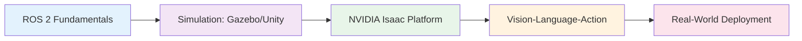
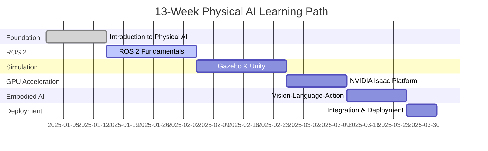

# Quick Start: Writing the Introduction Chapter

**Feature**: 004-book-intro-chapter
**Date**: 2025-12-06
**Phase**: 1.2 - Content Writing Guide

## Overview

This guide provides templates, examples, and best practices for writing the introduction chapter in the correct tone, structure, and format.

## 1. Frontmatter Template

**File Location**: `docs/intro.md`

```mdx
---
id: introduction
title: "Introduction: Physical AI & Humanoid Robotics"
sidebar_label: "Introduction"
sidebar_position: 1
sidebar_custom_props:
  difficulty: "Beginner"
  readingTime: "18 minutes"
---

# Introduction: Physical AI & Humanoid Robotics

[Chapter content starts here...]
```

**Key Points**:
- `sidebar_position: 1` ensures introduction appears first
- `readingTime` should be 15-20 minutes
- Title appears in both frontmatter (`title:`) and as H1 (`#`)

---

## 2. Tone & Voice Guidelines

### ✅ DO: Encouraging Conversational Tone

**Use second-person "you" and active voice**:
- ✅ "You'll learn to design autonomous robotic systems"
- ❌ "Autonomous robotic systems will be learned" (passive, third-person)

**Be encouraging and supportive**:
- ✅ "By the end of this book, you'll have the skills to..."
- ❌ "This book covers the skills needed to..." (impersonal)

**Use active, specific verbs**:
- ✅ "You'll design, simulate, and deploy intelligent robots"
- ❌ "The book discusses robot design" (vague, passive)

### ❌ DON'T: Academic or Overly Formal

**Avoid third-person passive voice**:
- ❌ "It is demonstrated that Physical AI enables..."
- ✅ "You'll see how Physical AI enables..."

**Avoid excessive jargon without definitions**:
- ❌ "Leverage VLA architectures for embodied cognition"
- ✅ "You'll integrate Vision-Language-Action (VLA) models—AI systems that can see, understand language, and take physical actions"

### Tone Examples

| ❌ Avoid This Tone | ✅ Use This Tone |
|-------------------|------------------|
| "The field of Physical AI encompasses..." | "Physical AI brings together three powerful technologies: AI, robotics, and real-world perception" |
| "Readers must possess Python proficiency" | "You'll need basic Python skills—think variables, functions, and loops" |
| "This text elucidates..." | "This book shows you..." |
| "One can implement..." | "You can build..." |

---

## 3. Technical Definition Template

**Format**: 3-4 sentences (Simple definition + Example/Analogy + Context in book)

### Template Structure

```markdown
**[Term]**: [1 sentence simple definition]. [1-2 sentences with analogy or example]. [1 sentence explaining how it's used in this book].
```

### Example 1: Physical AI

```markdown
**Physical AI**: The convergence of artificial intelligence, robotics, and real-world perception enabling machines to understand and act in physical environments. Think of it like giving robots both a "brain" (AI for decision-making) and "eyes and hands" (sensors and actuators for interacting with the real world). In this book, you'll learn to build Physical AI systems that can perceive their surroundings, reason about tasks, and safely execute actions in dynamic environments.
```

### Example 2: ROS 2

```markdown
**ROS 2 (Robot Operating System 2)**: A flexible framework for writing robot software that handles communication between different parts of your robot system. Imagine it as the "nervous system" that lets your robot's sensors talk to its motors, cameras talk to AI models, and everything coordinate in real time. Throughout this book, you'll use ROS 2 as the foundational platform for building autonomous systems.
```

### Common Mistakes to Avoid

❌ **Too short** (missing analogy):
> "ROS 2 is a robot framework for communication."

❌ **Too technical** (jargon-heavy):
> "ROS 2 provides publish-subscribe middleware with DDS-based inter-process communication for distributed robotics architectures."

❌ **No context** (missing "how it's used in this book"):
> "ROS 2 is like a nervous system for robots that handles communication between components."

---

## 4. Section Templates

### Section 1: Why Physical AI Matters

**Structure**: Hook → Industry applications → Career opportunities (2-3 paragraphs, ~300 words)

```markdown
## Why Physical AI Matters

Imagine a robot that doesn't just follow pre-programmed instructions but actually *understands* its environment, makes decisions in real time, and adapts to unexpected situations. That's the promise of Physical AI—the convergence of artificial intelligence, robotics, and real-world perception.

Traditional robots excel at repetitive, scripted tasks in controlled environments like factory assembly lines. But the real world is messy, unpredictable, and constantly changing. Physical AI bridges this gap by combining the decision-making power of AI with the sensory perception and physical capabilities of robots. The result? Machines that can navigate warehouses autonomously, assist humans in healthcare settings, assemble complex products, and even explore hazardous environments.

The demand for Physical AI expertise is exploding across industries. Autonomous vehicles, humanoid assistants, warehouse automation, and manufacturing robotics are no longer science fiction—they're multi-billion dollar markets growing rapidly. Companies like [mention current industry leaders] are investing heavily in this space, creating unprecedented career opportunities for developers who can bridge the gap between AI and robotics.
```

**Key Elements**:
- Opens with relatable scenario or question
- Defines Physical AI in context
- Contrasts old vs. new approaches
- Names specific real-world applications
- Mentions career/industry momentum

---

### Section 2: What This Book Covers

**Structure**: Overview paragraph → 4 module descriptions → Mermaid diagram (~ 400 words)

```markdown
## What This Book Covers

This book takes you on a hands-on journey from robotics fundamentals to deploying intelligent, AI-powered systems in the real world. You'll master four core modules that build on each other progressively:

### Module 1: ROS 2 Fundamentals (Weeks 3-5)

Master the Robot Operating System 2, the industry-standard framework for modern robotics.

**You'll learn**:
- How to structure robot software using nodes, topics, services, and actions
- Building communication patterns for sensors, actuators, and AI models
- Managing configuration with launch files and parameters
- Debugging and testing ROS 2 systems in real time

### Module 2: Gazebo & Unity Simulation (Weeks 6-8)

Build realistic virtual environments where you can test robots without expensive hardware.

**You'll learn**:
- Creating physics-based simulations with Gazebo and Unity
- Modeling sensors (cameras, LIDAR, depth sensors) and robot bodies (URDF)
- Integrating simulations with ROS 2 for seamless testing
- Validating robot behavior before real-world deployment

### Module 3: NVIDIA Isaac Platform (Weeks 9-10)

Leverage GPU acceleration to train AI models and run simulations at scale.

**You'll learn**:
- Using Isaac Sim for photorealistic robot simulation
- Generating synthetic training data for AI models
- Accelerating perception and planning with NVIDIA hardware
- Optimizing deployment for edge robotics devices

### Module 4: Vision-Language-Action Models (Weeks 11-12)

Integrate cutting-edge foundation models that enable robots to see, understand language, and take action.

**You'll learn**:
- How VLA models combine computer vision, natural language processing, and motor control
- Training and fine-tuning embodied AI models
- Deploying language-instructable robots ("Go pick up the red box")
- Building end-to-end systems from perception to action

### Learning Progression

Here's how the modules connect:



Each module builds on the previous one, taking you from basic robot communication to deploying intelligent AI systems.
```

**Key Elements**:
- Each module has: name, focus area (1 sentence), key topics (4 bullets)
- Uses "You'll learn" framing (not "This module covers")
- Includes visual diagram showing progression
- Connects modules logically (foundation → advanced)

---

### Section 3: Who This Book Is For

**Structure**: Primary audience → Secondary audiences → Prerequisites (2-3 paragraphs, ~250 words)

```markdown
## Who This Book Is For

This book is designed for **software developers and engineers** with basic programming experience who want to break into robotics and Physical AI. If you can write Python code (variables, functions, loops), you're ready to start—no prior robotics knowledge required.

You'll benefit most from this book if you're:

- **A developer** looking to add robotics skills to your career toolkit
- **An AI/ML engineer** curious about deploying models on physical robots
- **A student** studying computer science, engineering, or related fields
- **A hobbyist** passionate about building intelligent machines
- **A career changer** transitioning into robotics from software development

You don't need expensive hardware—most exercises use simulation, so you can learn from any modern laptop. If you *do* have access to robotics hardware (like a simple wheeled robot or robotic arm), we'll show you how to deploy your simulated systems to real devices.

**Prerequisites**: You should be comfortable with Python basics (functions, classes, basic libraries like NumPy) and have familiarity with the Linux command line (navigating directories, running scripts). Experience with ROS, robotics, or AI is helpful but not required—we'll teach you everything from the ground up.
```

**Key Elements**:
- Defines primary audience clearly (developers with Python)
- Uses bullet list for different personas
- Addresses "do I need hardware?" concern
- States prerequisites explicitly (required vs. optional)
- Encouraging tone: "no prior robotics knowledge required"

---

### Section 4: Learning Outcomes

**Structure**: Introduction sentence → 6-8 bullet points starting with action verbs (~200 words)

```markdown
## What You'll Learn

By the end of this book, you'll have hands-on experience with the complete Physical AI stack. Here are the key skills you'll gain:

- **Design and implement** autonomous robotic systems using ROS 2 for real-time communication and control
- **Create realistic simulation environments** with Gazebo and Unity to test robots without hardware
- **Leverage GPU acceleration** using NVIDIA Isaac Sim for high-fidelity physics simulation and AI training
- **Integrate vision and language models** to build robots that can see, understand natural language, and take action
- **Deploy AI-powered robots** from simulation to real hardware with confidence
- **Generate synthetic training data** for perception models using photorealistic simulations
- **Apply best practices** for safe, reliable robotic systems in dynamic environments
- **Build end-to-end pipelines** from data collection through model training to deployment

These aren't just theoretical concepts—every skill includes hands-on projects where you'll build working systems step by step.
```

**Key Elements**:
- Starts with strong action verbs (Design, Create, Leverage, Integrate, Deploy)
- Each outcome is specific and measurable
- References specific technologies (ROS 2, Isaac Sim, VLA)
- 6-8 bullets total (per FR-004)
- Ends with emphasis on hands-on nature

---

### Section 5: Course Structure

**Structure**: Overview paragraph → 13-week timeline → Gantt chart (~ 350 words)

```markdown
## 13-Week Learning Path

This book follows a structured 13-week progression, taking you from foundational concepts to real-world deployment. Each week builds on the previous ones, with hands-on projects reinforcing key concepts.

### Week-by-Week Breakdown

**Weeks 1-2: Introduction to Physical AI**
Foundation and ecosystem overview. You'll set up your development environment and understand how AI, robotics, and perception come together.

**Weeks 3-5: ROS 2 Fundamentals**
Master robot communication patterns. Build your first ROS 2 nodes, work with topics/services/actions, and create launch configurations.

**Weeks 6-8: Simulation & Testing**
Create virtual environments with Gazebo and Unity. Model sensors, design robot bodies with URDF, and validate behavior before deployment.

**Weeks 9-10: NVIDIA Isaac Platform**
Accelerate your workflows with GPU power. Generate synthetic data, run photorealistic simulations, and optimize for edge deployment.

**Weeks 11-12: Vision-Language-Action Models**
Integrate foundation models for embodied AI. Build robots that respond to natural language commands and make intelligent decisions.

**Week 13: Integration & Deployment**
Bring it all together. Deploy a complete system from simulation to real hardware and apply production best practices.

### Visual Timeline



**Time Commitment**: Expect to spend 5-10 hours per week, including reading, exercises, and projects. You can adjust the pace to fit your schedule—the 13-week structure is a guideline, not a requirement.
```

**Key Elements**:
- Shows week-by-week progression with brief descriptions
- Visual Gantt chart illustrating timeline
- Mentions time commitment (5-10 hours/week)
- Clarifies timeline is flexible

---

### Section 6: Prerequisites

**Structure**: Required skills → Optional skills (~ 150 words)

```markdown
## Prerequisites

### Required

To get the most out of this book, you'll need:

- **Python basics**: You should be comfortable writing functions, using classes, and working with common libraries like NumPy. If you've built a few Python scripts or taken an intro programming course, you're ready.
- **Linux command line familiarity**: Basic navigation (cd, ls, mkdir), running scripts, and installing packages. Don't worry—we'll guide you through robotics-specific commands.

### Optional (Helpful but Not Required)

- **ROS or robotics experience**: If you've used ROS before, you'll move faster through Weeks 3-5. But we teach everything from scratch.
- **Machine learning background**: Helps with Weeks 11-12 (VLA models), but we explain AI concepts as we go.
- **Access to robotics hardware**: Most exercises use simulation, but if you have a robot (wheeled platform, robotic arm, etc.), we show you how to deploy your code.

**Bottom line**: If you can code in Python and use a terminal, you're ready to start.
```

**Key Elements**:
- Clearly separates required vs. optional
- Defines "basic Python" concretely (functions, classes, NumPy)
- Reassures readers they don't need hardware
- Encouraging close: "you're ready to start"

---

### Section 7: How to Use This Book

**Structure**: Linear path for beginners → Skip-ahead paths for experienced readers (~250 words)

```markdown
## How to Use This Book

### For Beginners: Start from the Beginning

If you're new to robotics, **follow the chapters sequentially**. Each module builds on the previous one:

1. Read the introduction (you're here!)
2. Set up your development environment (Chapter 1)
3. Work through ROS 2 fundamentals (Chapters 2-4)
4. Progress through simulation, Isaac, and VLA modules
5. Complete hands-on projects at the end of each chapter

This path ensures you build a solid foundation before tackling advanced topics.

### For Experienced Practitioners: Skip Ahead

Already have experience? Here's how to jump to relevant sections:

- **If you know ROS 2**: Skip Chapters 2-4 → Start with **Chapter 5: Advanced ROS 2 Patterns** or jump to **Chapter 6: Gazebo Simulation**
- **If you're a simulation expert** (Gazebo/Unity): Skip to **Chapter 9: NVIDIA Isaac Platform**
- **If you have AI/ML background**: Skim Chapters 2-10 → Focus on **Chapters 11-12: Vision-Language-Action Models**
- **If you want just deployment**: Review prerequisites in each chapter → Jump to **Chapter 13: Real-World Deployment**

Even if you're skipping ahead, **check the "Quick Reference" sections** in earlier chapters to ensure you're familiar with our conventions and tooling choices.

### Hands-On vs. Theory

Each chapter balances concepts with practice:
- **Quick Start** (15 minutes): Get something working fast
- **Deep Dive**: Understand the "why" behind the "how"
- **Projects**: Apply skills to realistic scenarios
- **Common Errors**: Troubleshoot issues you're likely to encounter

Choose your depth based on your learning style and time constraints.
```

**Key Elements**:
- Clear linear path for beginners
- Specific skip-ahead guidance by experience level (per clarification)
- Mentions "Quick Reference" sections for context
- Explains chapter structure (Quick Start, Deep Dive, Projects)

---

## 5. Mermaid Diagram Examples

### Module Relationship Flowchart


### 13-Week Gantt Chart


**Diagram Best Practices**:
- Always include descriptive text before the diagram
- Use pastel colors for accessibility (not too bright)
- Keep flowcharts left-to-right (LR) for readability
- Test in local Docusaurus build before committing

---

## 6. Validation Checklist

Before finalizing the introduction chapter, verify:

### Content Completeness
- [ ] All 7 required sections present (Why, What, Who, Learning Outcomes, Structure, Prerequisites, How to Use)
- [ ] 6-8 learning outcomes listed with action verbs
- [ ] 4 module descriptions included
- [ ] Frontmatter complete (id, title, sidebar_position=1, difficulty="Beginner", readingTime)

### Tone & Quality
- [ ] Second-person "you" used throughout (not third-person)
- [ ] Active voice (not passive)
- [ ] Encouraging, supportive language
- [ ] Technical terms defined with 3-4 sentence format (definition + analogy + context)
- [ ] No implementation code examples (concepts only)

### Visualizations
- [ ] Module relationship diagram (Mermaid flowchart) present
- [ ] 13-week timeline (Mermaid gantt or timeline) present
- [ ] Diagrams render correctly in `npm start` (test locally)
- [ ] Descriptive text precedes each diagram

### Reading Time
- [ ] Word count: 2000-3000 words
- [ ] Estimated reading time: 15-20 minutes
- [ ] Ruthlessly edited for conciseness (no fluff)

### Accessibility
- [ ] Mermaid diagrams have text descriptions
- [ ] Headings follow hierarchy (H1 → H2 → H3, no skips)
- [ ] Lists use proper markdown formatting

---

**Quick Start Complete**: All templates, examples, and validation criteria provided. Ready for content writing implementation.
