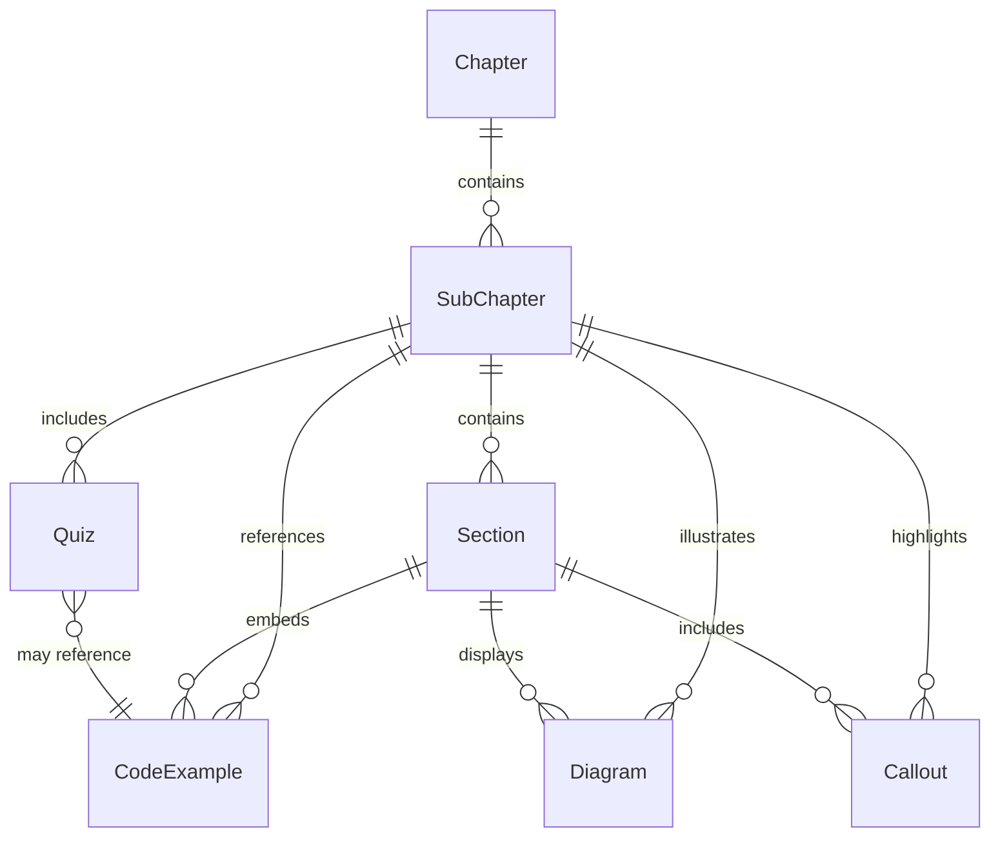
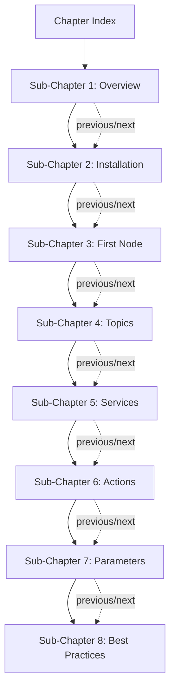
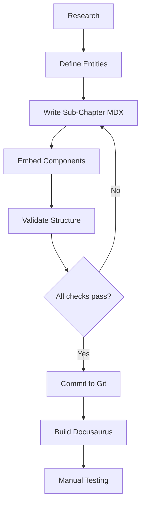
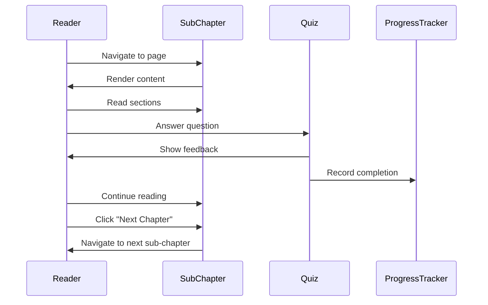

# Data Model - ROS 2 Fundamentals Chapter

**Feature**: 005-ros2-fundamentals-chapter  
**Created**: 2025-12-06  
**Purpose**: Define entities, relationships, and structure for chapter content

---

## 1. Core Entities

### 1.1 Chapter

**Represents**: Top-level container for the ROS 2 Fundamentals learning module

```typescript
interface Chapter {
  id: string;                    // "ros2-fundamentals"
  title: string;                 // "Chapter 1: ROS 2 Fundamentals"
  description: string;           // Brief overview for navigation
  difficulty: 'Beginner' | 'Intermediate' | 'Advanced';
  estimatedReadingTime: number;  // Total minutes (reading only)
  estimatedHandsOnTime: number;  // Total minutes (exercises)
  subChapters: SubChapter[];     // Ordered list
  prerequisites: string[];       // ["Python basics", "Linux CLI"]
  learningOutcomes: string[];    // What readers will learn
  slug: string;                  // URL path segment
}
```

**Example Instance**:
```json
{
  "id": "ros2-fundamentals",
  "title": "Chapter 1: ROS 2 Fundamentals",
  "description": "Master the Robot Operating System 2 framework for building autonomous systems",
  "difficulty": "Beginner",
  "estimatedReadingTime": 150,
  "estimatedHandsOnTime": 315,
  "subChapters": [/* SubChapter instances */],
  "prerequisites": [
    "Python 3.10+ installed",
    "Basic command line navigation",
    "ROS 2 Humble installed (see Installation sub-chapter)"
  ],
  "learningOutcomes": [
    "Understand ROS 2 architecture and core concepts",
    "Create publisher and subscriber nodes in Python",
    "Implement service servers and clients",
    "Use actions for long-running tasks",
    "Configure nodes with parameters and launch files"
  ],
  "slug": "ros2-fundamentals"
}
```

---

### 1.2 SubChapter

**Represents**: Individual lesson within the chapter (e.g., "Topics & Messages")

```typescript
interface SubChapter {
  id: string;                      // "03-first-node"
  title: string;                   // "Your First ROS 2 Node"
  sidebarLabel: string;            // Shortened for navigation
  sidebarPosition: number;         // 1-based ordering
  difficulty: 'Beginner' | 'Intermediate' | 'Advanced';
  estimatedReadingTime: number;    // Minutes
  estimatedHandsOnTime: number;    // Minutes
  sections: Section[];             // Ordered content sections
  quizzes: Quiz[];                 // Assessment questions
  codeExamples: CodeExample[];     // Complete working code
  diagrams: Diagram[];             // Mermaid visualizations
  callouts: Callout[];             // Tips, warnings, info boxes
  previousSubChapter?: string;     // ID of previous sub-chapter
  nextSubChapter?: string;         // ID of next sub-chapter
  slug: string;                    // File path (e.g., "03-first-node.md")
}
```

**Example Instance**:
```json
{
  "id": "03-first-node",
  "title": "Your First ROS 2 Node",
  "sidebarLabel": "First Node",
  "sidebarPosition": 3,
  "difficulty": "Beginner",
  "estimatedReadingTime": 20,
  "estimatedHandsOnTime": 45,
  "sections": [/* Section instances */],
  "quizzes": [/* Quiz instances */],
  "codeExamples": [/* CodeExample instances */],
  "diagrams": [/* Diagram instances */],
  "callouts": [/* Callout instances */],
  "previousSubChapter": "02-installation",
  "nextSubChapter": "04-topics-messages",
  "slug": "03-first-node"
}
```

---

### 1.3 Section

**Represents**: Thematic block of content within a sub-chapter

```typescript
interface Section {
  id: string;                  // "understanding-nodes"
  heading: string;             // "What is a ROS 2 Node?"
  level: 2 | 3 | 4;            // Heading level (##, ###, ####)
  content: MarkdownContent;    // Main prose
  order: number;               // Position within sub-chapter
  type: 'concept' | 'tutorial' | 'reference' | 'exercise';
}

type MarkdownContent = string;  // MDX-compatible markdown
```

**Example Instance**:
```json
{
  "id": "understanding-nodes",
  "heading": "What is a ROS 2 Node?",
  "level": 2,
  "content": "A **node** is a fundamental building block in ROS 2...",
  "order": 1,
  "type": "concept"
}
```

---

### 1.4 CodeExample

**Represents**: Complete, runnable code snippet with context

```typescript
interface CodeExample {
  id: string;                     // "minimal-publisher"
  title: string;                  // "Minimal Publisher Node"
  description: string;            // What this code does
  language: 'python' | 'cpp' | 'yaml' | 'xml' | 'bash';
  code: string;                   // Complete source code
  filePath?: string;              // Suggested file location
  highlightLines?: number[];      // Lines to emphasize
  showLineNumbers: boolean;       // Default: true
  expectedOutput?: string;        // Console output readers should see
  dependencies?: string[];        // Required packages
  context: string;                // Where in lesson this appears
}
```

**Example Instance**:
```json
{
  "id": "minimal-publisher",
  "title": "Minimal Publisher Node",
  "description": "A simple publisher that sends string messages every 0.5 seconds",
  "language": "python",
  "code": "import rclpy\nfrom rclpy.node import Node...",
  "filePath": "src/my_first_package/my_first_package/publisher.py",
  "highlightLines": [8, 9, 10],
  "showLineNumbers": true,
  "expectedOutput": "[INFO] [minimal_publisher]: Publishing: \"Hello World: 0\"\n[INFO] [minimal_publisher]: Publishing: \"Hello World: 1\"",
  "dependencies": ["rclpy", "std_msgs"],
  "context": "After explaining the publish-subscribe pattern, readers implement their first publisher"
}
```

---

### 1.5 Quiz

**Represents**: Interactive assessment question

```typescript
interface Quiz {
  id: string;                      // "node-lifecycle-quiz-1"
  question: string;                // Question text
  type: 'multiple-choice' | 'true-false' | 'code-completion';
  options: QuizOption[];           // Answer choices
  correctAnswerIndex: number;      // 0-based index
  explanation: string;             // Why this answer is correct
  difficulty: 'easy' | 'medium' | 'hard';
  codeSnippet?: string;            // For code-based questions
  hints?: string[];                // Optional progressive hints
  position: 'inline' | 'end';      // Placement in sub-chapter
}

interface QuizOption {
  text: string;                    // Option content
  isCorrect: boolean;              // True for correct answer
  feedback?: string;               // Specific feedback for this option
}
```

**Example Instance (Multiple Choice)**:
```json
{
  "id": "node-lifecycle-quiz-1",
  "question": "Which state comes immediately after 'Unconfigured' in the ROS 2 node lifecycle?",
  "type": "multiple-choice",
  "options": [
    {
      "text": "Active",
      "isCorrect": false,
      "feedback": "Nodes must be configured before activating."
    },
    {
      "text": "Inactive",
      "isCorrect": false,
      "feedback": "Nodes transition to Inactive after being configured and activated."
    },
    {
      "text": "Configured",
      "isCorrect": true,
      "feedback": "Correct! After initialization, nodes transition from Unconfigured → Configured."
    },
    {
      "text": "Finalized",
      "isCorrect": false,
      "feedback": "Finalized is the terminal state, not an intermediate step."
    }
  ],
  "correctAnswerIndex": 2,
  "explanation": "The ROS 2 lifecycle follows: Unconfigured → Configured → Inactive → Active. Configuration happens before activation.",
  "difficulty": "medium",
  "position": "inline"
}
```

**Example Instance (Code Completion)**:
```json
{
  "id": "publisher-creation-quiz",
  "question": "Complete the code to create a publisher for String messages on topic 'chatter':",
  "type": "code-completion",
  "options": [
    {
      "text": "self.publisher_ = self.create_publisher(String, 'chatter', 10)",
      "isCorrect": true
    },
    {
      "text": "self.publisher_ = self.subscribe('chatter', String, 10)",
      "isCorrect": false,
      "feedback": "This syntax is for subscribers, not publishers."
    },
    {
      "text": "self.publisher_ = Publisher(String, 'chatter')",
      "isCorrect": false,
      "feedback": "Missing queue size parameter and incorrect instantiation method."
    }
  ],
  "correctAnswerIndex": 0,
  "explanation": "create_publisher() takes message type, topic name, and queue size as parameters.",
  "difficulty": "easy",
  "codeSnippet": "class MinimalPublisher(Node):\n    def __init__(self):\n        super().__init__('minimal_publisher')\n        # Complete this line:\n        _______________",
  "position": "inline"
}
```

---

### 1.6 Diagram

**Represents**: Mermaid visualization

```typescript
interface Diagram {
  id: string;                   // "node-communication-flow"
  type: 'flowchart' | 'sequence' | 'state' | 'gantt' | 'class';
  title: string;                // Caption/description
  mermaidCode: string;          // Complete Mermaid syntax
  context: string;              // Explanation of what diagram shows
  position: 'inline' | 'figure'; // Inline with text or standalone figure
}
```

**Example Instance (Flowchart)**:
```json
{
  "id": "node-communication-flow",
  "type": "flowchart",
  "title": "Publisher-Subscriber Communication Pattern",
  "mermaidCode": "graph LR\n    A[Publisher Node] -->|String Messages| B[Topic: /chatter]\n    B -->|String Messages| C[Subscriber Node 1]\n    B -->|String Messages| D[Subscriber Node 2]\n    \n    style A fill:#E3F2FD\n    style B fill:#FFF3E0\n    style C fill:#E8F5E9\n    style D fill:#E8F5E9",
  "context": "This diagram illustrates how a single publisher can send messages to multiple subscribers through a topic. The topic acts as a message bus, decoupling publishers from subscribers.",
  "position": "figure"
}
```

**Example Instance (Sequence Diagram)**:
```json
{
  "id": "service-call-sequence",
  "type": "sequence",
  "title": "Service Request-Response Flow",
  "mermaidCode": "sequenceDiagram\n    participant Client\n    participant Server\n    \n    Client->>Server: Request (a=2, b=3)\n    Note over Server: Compute sum=5\n    Server->>Client: Response (sum=5)\n    Note over Client: Process result",
  "context": "Unlike topics, services provide synchronous request-response communication. The client blocks until the server responds.",
  "position": "inline"
}
```

---

### 1.7 Callout

**Represents**: Highlighted informational box (tip, warning, note, error)

```typescript
interface Callout {
  id: string;                         // "deadlock-warning"
  type: 'note' | 'tip' | 'warning' | 'danger' | 'info';
  title: string;                      // Callout heading
  content: MarkdownContent;           // Body text (can include code)
  icon?: string;                      // Optional emoji or icon
  position: number;                   // Insertion point in sub-chapter
}
```

**Example Instance (Warning)**:
```json
{
  "id": "deadlock-warning",
  "type": "warning",
  "title": "Avoid Service Deadlocks",
  "content": "Never call a service from within the same node's callback using synchronous calls. This will cause a **deadlock** because the executor cannot process the service response while blocked on the callback.\n\n**Solution**: Use `call_async()` or run the service client in a separate thread.",
  "icon": "⚠️",
  "position": 15
}
```

**Example Instance (Tip)**:
```json
{
  "id": "debugging-tip",
  "type": "tip",
  "title": "Quick Debugging with ros2 topic echo",
  "content": "To verify your publisher is working without writing a subscriber:\n\n```bash\nros2 topic echo /chatter\n```\n\nThis command prints all messages published to `/chatter` in real time.",
  "icon": "💡",
  "position": 8
}
```

---

## 2. Relationships

### 2.1 Entity Relationship Diagram



**Explanation**:
- A `Chapter` contains multiple ordered `SubChapters`
- Each `SubChapter` has multiple `Sections`, `Quizzes`, `CodeExamples`, etc.
- `Sections` can embed `CodeExamples`, `Diagrams`, and `Callouts`
- `Quizzes` may reference `CodeExamples` for code-based questions

### 2.2 Navigation Flow



---

## 3. File Structure Mapping

### 3.1 Directory Layout

```
docs/
└── ros2-fundamentals/
    ├── index.md                    # Chapter entity (overview + redirects)
    ├── 01-overview.md              # SubChapter entity
    ├── 02-installation.md          # SubChapter entity
    ├── 03-first-node.md            # SubChapter entity
    ├── 04-topics-messages.md       # SubChapter entity
    ├── 05-services.md              # SubChapter entity
    ├── 06-actions.md               # SubChapter entity
    ├── 07-parameters-launch.md     # SubChapter entity
    └── 08-best-practices.md        # SubChapter entity

src/
└── components/
    ├── Quiz.tsx                    # React component for Quiz entity
    ├── Callout.tsx                 # React component for Callout entity
    └── ProgressTracker.tsx         # Optional: tracks quiz completion
```

### 3.2 File Content Structure (MDX)

**Template for SubChapter File**:

```mdx
---
id: {SubChapter.id}
title: {SubChapter.title}
sidebar_label: {SubChapter.sidebarLabel}
sidebar_position: {SubChapter.sidebarPosition}
sidebar_custom_props:
  difficulty: {SubChapter.difficulty}
  readingTime: "{SubChapter.estimatedReadingTime} minutes"
  handsOnTime: "{SubChapter.estimatedHandsOnTime} minutes"
---

import Quiz from '@site/src/components/Quiz';
import Callout from '@site/src/components/Callout';

# {SubChapter.title}

<!-- Section 1 -->
## {Section[0].heading}

{Section[0].content}

<!-- CodeExample inline -->
```{CodeExample[0].language} title="{CodeExample[0].filePath}" showLineNumbers {highlightLines}
{CodeExample[0].code}
```

<!-- Diagram inline -->
```mermaid
{Diagram[0].mermaidCode}
```

<!-- Callout inline -->
<Callout type="{Callout[0].type}" title="{Callout[0].title}">
{Callout[0].content}
</Callout>

<!-- Quiz inline -->
<Quiz
  question="{Quiz[0].question}"
  options={Quiz[0].options.map(o => o.text)}
  correctAnswer={Quiz[0].correctAnswerIndex}
  explanation="{Quiz[0].explanation}"
/>

<!-- Section 2 -->
## {Section[1].heading}

{Section[1].content}

<!-- Repeat pattern... -->
```

---

## 4. Component Specifications

### 4.1 Quiz Component (React/TypeScript)

**Props Interface**:

```typescript
// src/components/Quiz.tsx
interface QuizProps {
  question: string;
  options: string[];
  correctAnswer: number;          // 0-based index
  explanation: string;
  type?: 'multiple-choice' | 'true-false' | 'code';
  codeSnippet?: string;
  difficulty?: 'easy' | 'medium' | 'hard';
}

interface QuizState {
  selectedAnswer: number | null;
  showFeedback: boolean;
  isCorrect: boolean | null;
  attempts: number;
}
```

**Component Behavior**:
1. **Initial State**: All options clickable, no feedback shown
2. **User Selects Answer**: Highlight selected option
3. **User Submits** (or auto-submit on click): 
   - Show green/red indicator
   - Display explanation
   - Disable further attempts (or allow retry based on config)
4. **Accessibility**: Keyboard navigation, ARIA labels

**Usage Example**:

```mdx
<Quiz
  question="What is the queue size in `create_publisher(String, 'topic', 10)`?"
  options={[
    "Maximum number of subscribers",
    "Maximum messages stored if publishing faster than subscribers can process",
    "Delay in milliseconds",
    "Number of threads"
  ]}
  correctAnswer={1}
  explanation="Queue size (10) determines how many messages are buffered if subscribers can't keep up with the publisher."
  difficulty="medium"
/>
```

---

### 4.2 Callout Component (React/TypeScript)

**Props Interface**:

```typescript
// src/components/Callout.tsx
interface CalloutProps {
  type: 'note' | 'tip' | 'warning' | 'danger' | 'info';
  title?: string;
  icon?: string;
  children: React.ReactNode;     // MDX content
}
```

**Visual Design**:
- **note**: Blue background, info icon
- **tip**: Green background, lightbulb icon
- **warning**: Orange background, warning triangle
- **danger**: Red background, exclamation icon
- **info**: Gray background, question mark icon

**Usage Example**:

```mdx
<Callout type="warning" title="Common Pitfall">
Forgetting to call `rclpy.init()` before creating nodes will cause a runtime error:

```bash
RuntimeError: rcl_init called with invalid arguments
```

Always initialize RCL before instantiating nodes.
</Callout>
```

---

## 5. Content Validation Rules

### 5.1 Required Fields per SubChapter

Every sub-chapter file MUST include:
- [ ] Frontmatter with `id`, `title`, `sidebar_label`, `sidebar_position`, `sidebar_custom_props`
- [ ] At least 1 `Section` (H2 heading)
- [ ] At least 1 `CodeExample` (for tutorial sub-chapters)
- [ ] At least 2 `Quizzes` (minimum)
- [ ] At least 1 `Diagram` (visual learners)
- [ ] At least 1 `Callout` (common pitfalls or tips)

### 5.2 Code Example Validation

Every `CodeExample` MUST:
- [ ] Be complete and runnable (no placeholders like `# ...`)
- [ ] Include docstring or comment explaining purpose
- [ ] Specify `title` (file path context)
- [ ] Use proper syntax highlighting (language specified)
- [ ] Include expected output if applicable
- [ ] List dependencies in prose before code block

### 5.3 Quiz Quality Standards

Every `Quiz` MUST:
- [ ] Have exactly 1 correct answer
- [ ] Provide explanation for correct answer
- [ ] Include plausible distractors (incorrect options that seem reasonable)
- [ ] Test understanding, not memorization
- [ ] Be positioned logically (after related content)

---

## 6. Data Flow

### 6.1 Content Creation Workflow



### 6.2 Reader Interaction Flow



---

## 7. Extensibility

### 7.1 Future Entity Types

**Planned (not in MVP)**:

```typescript
interface Exercise {
  id: string;
  title: string;
  description: string;
  starterCode?: string;
  solution: string;
  testCases: TestCase[];
  difficulty: 'easy' | 'medium' | 'hard';
}

interface TestCase {
  input: string;
  expectedOutput: string;
  description: string;
}

interface Video {
  id: string;
  title: string;
  url: string;              // YouTube embed or local file
  duration: number;         // Seconds
  transcript?: string;      // Accessibility
}

interface GlossaryTerm {
  term: string;
  definition: string;
  relatedTerms: string[];
  category: 'core-concept' | 'tool' | 'api';
}
```

### 7.2 Localization Support (i18n)

**Future Enhancement**:

```typescript
interface Chapter {
  // Existing fields...
  translations: {
    locale: string;         // "en", "es", "zh-CN"
    title: string;
    description: string;
    subChapters: SubChapter[];
  }[];
}
```

**Not in current scope** - all content in English (US) for MVP.

---

## 8. Validation Checklist

Before considering a sub-chapter complete:

### Content Completeness
- [ ] All `Section` entities have prose content (no placeholders)
- [ ] All `CodeExample` entities are tested in ROS 2 Humble
- [ ] All `Quiz` entities have correct answers verified
- [ ] All `Diagram` entities render correctly in Docusaurus
- [ ] All `Callout` entities are positioned logically

### Cross-References
- [ ] `previousSubChapter` and `nextSubChapter` links correct
- [ ] Internal links to other sub-chapters use correct slugs
- [ ] External links to official ROS 2 docs are current (not broken)

### Accessibility
- [ ] All headings follow hierarchy (H2 → H3, no skipping levels)
- [ ] All code blocks have language specified
- [ ] All images have alt text (if images added in future)
- [ ] Callout boxes have semantic types (not just visual styling)

### Technical Accuracy
- [ ] Code runs without errors in ROS 2 Humble
- [ ] Commands use correct ROS 2 CLI syntax
- [ ] Package names and message types are correct
- [ ] Best practices align with official ROS 2 guidelines

---

## 9. Example: Complete SubChapter Data Instance

**Sub-Chapter 3: Your First ROS 2 Node**

```json
{
  "id": "03-first-node",
  "title": "Your First ROS 2 Node",
  "sidebarLabel": "First Node",
  "sidebarPosition": 3,
  "difficulty": "Beginner",
  "estimatedReadingTime": 20,
  "estimatedHandsOnTime": 45,
  "sections": [
    {
      "id": "section-node-basics",
      "heading": "What is a ROS 2 Node?",
      "level": 2,
      "content": "A **node** is the fundamental building block...",
      "order": 1,
      "type": "concept"
    },
    {
      "id": "section-create-package",
      "heading": "Creating Your Package",
      "level": 2,
      "content": "Before writing a node, we need a ROS 2 package...",
      "order": 2,
      "type": "tutorial"
    },
    {
      "id": "section-minimal-node",
      "heading": "Writing a Minimal Node",
      "level": 2,
      "content": "Let's create the simplest possible ROS 2 node...",
      "order": 3,
      "type": "tutorial"
    }
  ],
  "codeExamples": [
    {
      "id": "create-package-command",
      "title": "Create ROS 2 Package",
      "language": "bash",
      "code": "ros2 pkg create --build-type ament_python my_first_package",
      "description": "Creates a new Python package with standard structure"
    },
    {
      "id": "minimal-node-code",
      "title": "src/my_first_package/my_first_package/my_node.py",
      "language": "python",
      "code": "import rclpy\nfrom rclpy.node import Node\n\nclass MyNode(Node):\n    def __init__(self):\n        super().__init__('my_node')\n        self.get_logger().info('Hello from ROS 2!')\n\ndef main(args=None):\n    rclpy.init(args=args)\n    node = MyNode()\n    rclpy.spin(node)\n    node.destroy_node()\n    rclpy.shutdown()\n\nif __name__ == '__main__':\n    main()",
      "highlightLines": [5, 6, 7],
      "showLineNumbers": true,
      "expectedOutput": "[INFO] [my_node]: Hello from ROS 2!",
      "dependencies": ["rclpy"]
    }
  ],
  "quizzes": [
    {
      "id": "quiz-node-definition",
      "question": "What is the primary purpose of a ROS 2 node?",
      "type": "multiple-choice",
      "options": [
        {"text": "Store configuration files", "isCorrect": false},
        {"text": "Execute a specific computational task or function", "isCorrect": true},
        {"text": "Manage network connections", "isCorrect": false},
        {"text": "Compile Python code", "isCorrect": false}
      ],
      "correctAnswerIndex": 1,
      "explanation": "Nodes are processes that perform computation, such as reading sensors, controlling motors, or processing data.",
      "difficulty": "easy",
      "position": "inline"
    },
    {
      "id": "quiz-node-name",
      "question": "In `super().__init__('my_node')`, what does the string 'my_node' represent?",
      "type": "multiple-choice",
      "options": [
        {"text": "The Python class name", "isCorrect": false},
        {"text": "The node's unique identifier in the ROS 2 graph", "isCorrect": true},
        {"text": "The package name", "isCorrect": false},
        {"text": "The topic name", "isCorrect": false}
      ],
      "correctAnswerIndex": 1,
      "explanation": "The string passed to the Node constructor becomes the node's name in the ROS 2 computational graph.",
      "difficulty": "medium",
      "position": "inline"
    }
  ],
  "diagrams": [
    {
      "id": "diagram-node-lifecycle",
      "type": "state",
      "title": "ROS 2 Node Lifecycle States",
      "mermaidCode": "stateDiagram-v2\n    [*] --> Unconfigured\n    Unconfigured --> Configured: configure()\n    Configured --> Inactive: activate()\n    Inactive --> Active: activate()\n    Active --> Inactive: deactivate()\n    Inactive --> Unconfigured: cleanup()\n    Unconfigured --> [*]: shutdown()",
      "context": "Most simple nodes skip lifecycle management, but understanding it is important for advanced applications.",
      "position": "figure"
    }
  ],
  "callouts": [
    {
      "id": "callout-node-naming",
      "type": "tip",
      "title": "Node Naming Best Practices",
      "content": "Use descriptive, lowercase names with underscores: `camera_driver`, `object_detector`. Avoid generic names like `node1` or `test`.",
      "icon": "💡",
      "position": 4
    },
    {
      "id": "callout-init-shutdown",
      "type": "warning",
      "title": "Always Clean Up",
      "content": "Every `rclpy.init()` must pair with `rclpy.shutdown()`. Use try/finally blocks to ensure cleanup happens even if errors occur.",
      "icon": "⚠️",
      "position": 10
    }
  ],
  "previousSubChapter": "02-installation",
  "nextSubChapter": "04-topics-messages",
  "slug": "03-first-node"
}
```

---

## 10. Summary

This data model provides:

1. **Clear entity definitions** for all content types (Chapter, SubChapter, Section, Quiz, etc.)
2. **Relationships** showing how entities nest and reference each other
3. **File structure mapping** to Docusaurus MDX files
4. **Component specifications** for React implementations
5. **Validation rules** to ensure content quality
6. **Extensibility hooks** for future enhancements (exercises, videos, i18n)

**Next Steps**:
- ✅ Data model defined
- ⏭️ Create quickstart.md (writing templates for content authors)
- ⏭️ Complete plan.md (architecture and implementation details)

---

**Document Status**: ✅ Complete  
**Last Updated**: 2025-12-06  
**Next Artifact**: quickstart.md
