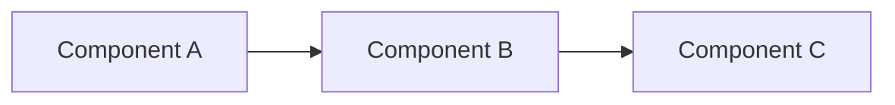
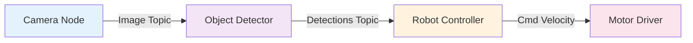
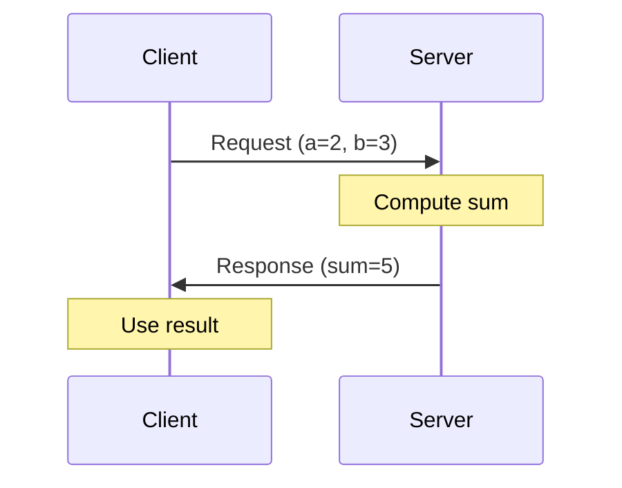
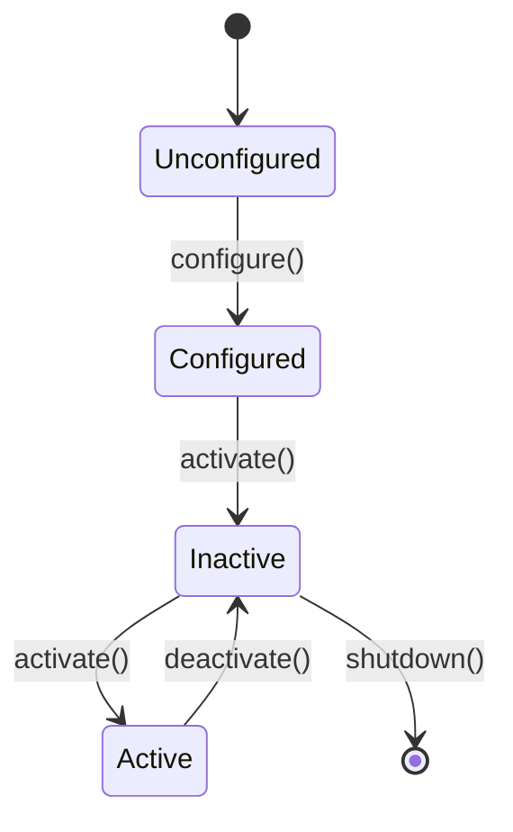
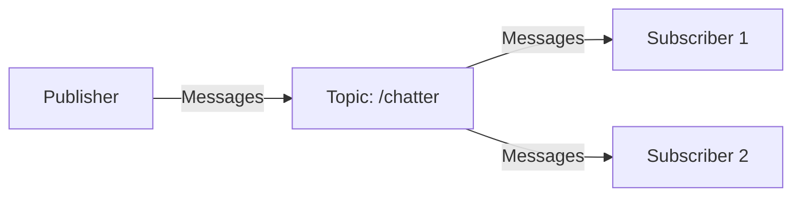

# Quickstart Guide - Writing ROS 2 Fundamentals Content

**Feature**: 005-ros2-fundamentals-chapter  
**Created**: 2025-12-06  
**Audience**: Content authors, technical writers, developers contributing to the chapter

---

## Purpose

This guide provides templates, style guidelines, and best practices for writing sub-chapters for the ROS 2 Fundamentals chapter. Use these templates to ensure consistency, quality, and adherence to project standards.

---

## Quick Reference

### File Naming Convention
- **Pattern**: `{##}-{slug}.md`
- **Examples**: `03-first-node.md`, `05-services.md`
- **Location**: `docs/ros2-fundamentals/`

### Required Components per Sub-Chapter
- ✅ Frontmatter (YAML metadata)
- ✅ Main heading (H1)
- ✅ At least 3 sections (H2 headings)
- ✅ At least 1 code example
- ✅ At least 2 quizzes
- ✅ At least 1 Mermaid diagram
- ✅ At least 1 callout box

### Time Estimates
- **Reading**: 15-25 minutes per sub-chapter
- **Hands-On**: 30-60 minutes per sub-chapter

---

## 1. Sub-Chapter Template

### 1.1 Complete MDX File Template

```mdx
---
id: {##}-{topic-slug}
title: "{Sub-Chapter Title}"
sidebar_label: "{Shortened Label}"
sidebar_position: {##}
sidebar_custom_props:
  difficulty: "Beginner" | "Intermediate" | "Advanced"
  readingTime: "{##} minutes"
  handsOnTime: "{##} minutes"
---

import Quiz from '@site/src/components/Quiz';
import Callout from '@site/src/components/Callout';

# {Sub-Chapter Title}

<!-- Brief introduction paragraph: What will readers learn and why it matters? -->

In this sub-chapter, you'll learn [specific topics]. By the end, you'll be able to [concrete outcome]. This knowledge is essential for [real-world application].

---

## Section 1: Conceptual Overview

<!-- Explain the "what" and "why" before the "how" -->

[Main concept explanation with analogies for beginners]

### Key Terminology

- **Term 1**: Definition with example
- **Term 2**: Definition with example

<!-- Optional: Include a diagram to visualize the concept -->



<Quiz
  question="Conceptual check: [Question testing understanding]"
  options={[
    "[Option 1]",
    "[Option 2]",
    "[Correct Option]",
    "[Option 4]"
  ]}
  correctAnswer={2}
  explanation="[Why this answer is correct and how it relates to the concept]"
/>

---

## Section 2: Hands-On Tutorial

<!-- Step-by-step practical application -->

Now that you understand [concept], let's build [concrete example].

### Prerequisites

Before starting, ensure you have:
- [Prerequisite 1]
- [Prerequisite 2]

### Step 1: [Action]

[Detailed instructions]

```bash title="Terminal"
# Command with explanation
command --flag value
```

**Expected Output**:
```
[What readers should see]
```

<Callout type="tip" title="[Helpful Tip]">
[Practical advice or shortcut]
</Callout>

### Step 2: [Next Action]

[Detailed instructions]

```python title="path/to/file.py" showLineNumbers {5-7}
# Complete, runnable code
import rclpy
from rclpy.node import Node

class ExampleNode(Node):
    def __init__(self):
        super().__init__('example_node')  # Highlighted lines
        self.get_logger().info('Node started')

def main(args=None):
    rclpy.init(args=args)
    node = ExampleNode()
    rclpy.spin(node)
    node.destroy_node()
    rclpy.shutdown()

if __name__ == '__main__':
    main()
```

**Code Explanation**:
- **Line 5**: [What this line does]
- **Line 6-7**: [What these highlighted lines do]

<Callout type="warning" title="Common Pitfall">
[Common mistake readers make and how to avoid it]

```bash
# Incorrect approach
[Wrong command or code]

# Correct approach
[Right command or code]
```
</Callout>

### Step 3: Testing Your Code

[How to verify it works]

```bash
# Run the node
ros2 run [package_name] [node_name]
```

**Expected Output**:
```
[INFO] [example_node]: Node started
```

<Quiz
  question="Code comprehension: [Question about the code you just wrote]"
  options={[
    "[Plausible distractor]",
    "[Correct answer]",
    "[Another distractor]",
    "[Another distractor]"
  ]}
  correctAnswer={1}
  explanation="[Explain the code behavior and why this answer is correct]"
  type="code"
/>

---

## Section 3: Advanced Patterns (Optional)

<!-- For intermediate/advanced readers who want to go deeper -->

:::info Going Deeper
This section covers advanced patterns. Feel free to skip if you're just getting started and return later.
:::

[Advanced concept or variation]

```python title="advanced_example.py"
# More complex implementation
[Code showing advanced pattern]
```

---

## Section 4: Best Practices

<!-- Summarize key takeaways and production-ready patterns -->

When working with [topic], follow these best practices:

1. **[Best Practice 1]**: [Why this matters and example]
2. **[Best Practice 2]**: [Why this matters and example]
3. **[Best Practice 3]**: [Why this matters and example]

<Callout type="danger" title="Never Do This">
[Anti-pattern that causes serious problems]

**Why**: [Explanation of consequences]
</Callout>

---

## Common Errors & Troubleshooting

### Error 1: [Common Error Message]

**Symptoms**:
```
[Actual error output]
```

**Cause**: [What causes this error]

**Solution**:
```bash
# Fix command or code change
[Solution]
```

### Error 2: [Another Common Error]

[Same structure as Error 1]

---

## What You've Learned

In this sub-chapter, you:

- ✅ [Learning outcome 1]
- ✅ [Learning outcome 2]
- ✅ [Learning outcome 3]

<Quiz
  question="Final knowledge check: [Integrative question covering multiple concepts]"
  options={[
    "[Option 1]",
    "[Option 2]",
    "[Correct Option]",
    "[Option 4]"
  ]}
  correctAnswer={2}
  explanation="[Tie answer back to all concepts covered in sub-chapter]"
  difficulty="medium"
/>

---

## Next Steps

<!-- Link to the next sub-chapter -->

Now that you understand [current topic], you're ready to learn about [next topic]. In the next sub-chapter, we'll explore [preview of next content].

**Continue to**: [Next Sub-Chapter Title](./04-next-topic.md)

**Related Resources**:
- [Official ROS 2 Docs](https://docs.ros.org/en/humble/)
- [Community Tutorial](https://example.com)

---
```

---

## 2. Writing Style Guidelines

### 2.1 Tone & Voice

**✅ Do**:
- **Conversational**: Write like you're teaching a friend
  - "Let's build a publisher that sends velocity commands"
  - "You've just created your first ROS 2 node!"
  
- **Encouraging**: Celebrate progress and normalize mistakes
  - "Don't worry if this feels complex at first—it gets easier with practice"
  - "If you see this error, you're on the right track! It means..."

- **Beginner-Friendly**: Define jargon inline on first use
  - "A **topic** (the ROS 2 term for a message channel) allows..."
  - "The **DDS middleware** (underlying communication layer) handles..."

**❌ Avoid**:
- **Overly Academic**: "The publish-subscribe paradigm facilitates..."
- **Condescending**: "Obviously, you should know that..."
- **Vague**: "This is important" (specify *why* it's important)

### 2.2 Analogies for Complex Concepts

Use real-world analogies to explain abstract ROS 2 concepts:

| ROS 2 Concept | Analogy | Example |
|---------------|---------|---------|
| **Topic** | Radio station | "Think of a topic like a radio station. Publishers broadcast on a frequency, and any subscriber tuned to that frequency receives the signal." |
| **Node** | Worker in a factory | "Each node is like a specialized worker: one reads sensor data, another processes it, another controls motors." |
| **Service** | Restaurant order | "A service is like ordering food: you make a request (order), wait for processing (cooking), and get a response (meal)." |
| **Action** | Package delivery | "An action is like tracking a package: you set a goal (destination), get periodic updates (tracking info), and receive a final result (delivered)." |
| **Message** | Envelope with letter | "A message is the envelope—it has a specific format (message type) and carries data (payload)." |

### 2.3 Code Comments

**Every code block MUST include**:

1. **File path or context** (in title):
   ```python title="src/my_package/my_package/publisher.py"
   ```

2. **Top-level comment** explaining purpose:
   ```python
   # This publisher sends velocity commands to move a robot forward
   import rclpy
   ```

3. **Inline comments for complex logic**:
   ```python
   timer_period = 0.5  # Publish every 500ms (2 Hz)
   ```

4. **NO placeholder comments**:
   - ❌ `# TODO: Add error handling`
   - ❌ `# ... rest of code`
   - ✅ Complete, runnable code only

---

## 3. Quiz Writing Guide

### 3.1 Quiz Types

**Type 1: Conceptual Understanding**

Tests whether readers grasp "why" and "what," not just "how."

```mdx
<Quiz
  question="Why do ROS 2 topics use a publish-subscribe pattern instead of direct node-to-node communication?"
  options={[
    "It's faster",
    "It decouples publishers and subscribers, allowing flexible system composition",
    "It uses less memory",
    "It's required by the ROS 2 standard"
  ]}
  correctAnswer={1}
  explanation="Pub-sub decoupling means publishers don't need to know which nodes subscribe, and subscribers don't need to know which nodes publish. This makes systems more modular and easier to modify."
  difficulty="medium"
/>
```

**Type 2: Code Comprehension**

Tests ability to read and understand code.

```mdx
<Quiz
  question="What will this code print when run?"
  type="code"
  codeSnippet={`
class ExampleNode(Node):
    def __init__(self):
        super().__init__('my_node')
        self.counter = 0
        self.timer = self.create_timer(1.0, self.callback)
    
    def callback(self):
        self.counter += 1
        self.get_logger().info(f'Count: {self.counter}')
  `}
  options={[
    "Count: 0 (once)",
    "Count: 1, Count: 2, Count: 3, ... (every second)",
    "Nothing—it will crash",
    "Count: 1 (once)"
  ]}
  correctAnswer={1}
  explanation="The timer calls the callback every 1.0 second, incrementing the counter and logging the new value each time."
  difficulty="easy"
/>
```

**Type 3: Error Diagnosis**

Tests ability to identify and fix bugs.

```mdx
<Quiz
  question="This code causes a deadlock. Why?"
  type="code"
  codeSnippet={`
class MyNode(Node):
    def __init__(self):
        super().__init__('my_node')
        self.cli = self.create_client(AddTwoInts, 'add')
        self.timer = self.create_timer(1.0, self.send_request)
    
    def send_request(self):
        req = AddTwoInts.Request()
        req.a, req.b = 2, 3
        future = self.cli.call(req)  # Synchronous call
        result = future.result()  # Blocks here
        self.get_logger().info(f'Result: {result.sum}')
  `}
  options={[
    "Missing error handling",
    "Synchronous service call blocks the executor, preventing response processing",
    "Wrong message type",
    "Timer period too short"
  ]}
  correctAnswer={1}
  explanation="call() blocks the executor thread, but the service response needs the executor to process it. Use call_async() instead."
  difficulty="hard"
/>
```

### 3.2 Writing Good Distractors (Incorrect Options)

**✅ Plausible Distractors**:
- Based on common misconceptions
- Partially correct but missing key details
- Confuse similar concepts

**Example**:
```
Question: What does the queue size parameter (10) do in create_publisher(String, 'topic', 10)?

Options:
1. "Maximum number of subscribers" ← Plausible (relates to distribution)
2. "Maximum messages buffered if subscribers are slow" ← CORRECT
3. "Delay in milliseconds" ← Common confusion (looks like a time value)
4. "Number of times to retry failed publishes" ← Plausible (relates to reliability)
```

**❌ Bad Distractors**:
- Obviously wrong ("It's the color of the topic")
- Unrelated to the domain ("Number of CPU cores")

### 3.3 Quiz Placement

- **Inline**: After introducing a new concept (conceptual check)
- **Post-Tutorial**: After hands-on code (comprehension check)
- **End of Sub-Chapter**: Integrative question covering all sections

**Rule of Thumb**: 2-4 quizzes per sub-chapter, evenly distributed.

---

## 4. Callout Box Guidelines

### 4.1 Callout Types

**Type: `tip` (💡)**

Use for: Helpful shortcuts, efficiency tips, best practices

```mdx
<Callout type="tip" title="Quick Debugging">
Use `ros2 topic echo /topic_name` to inspect messages without writing a subscriber.
</Callout>
```

**Type: `warning` (⚠️)**

Use for: Common mistakes, potential pitfalls, non-obvious behavior

```mdx
<Callout type="warning" title="Deadlock Risk">
Never call a service synchronously from within a callback—use `call_async()` or separate threads.
</Callout>
```

**Type: `danger` (🚨)**

Use for: Critical errors, data loss risks, safety issues

```mdx
<Callout type="danger" title="Data Loss">
Setting queue size to 1 means only the latest message is kept. If your subscriber is slow, you'll **lose messages**. Use a larger queue (e.g., 10) for streaming data.
</Callout>
```

**Type: `info` (ℹ️)**

Use for: Additional context, external references, related topics

```mdx
<Callout type="info" title="ROS 1 vs ROS 2">
In ROS 1, nodes required a central `roscore`. ROS 2 eliminated this single point of failure using DDS discovery.
</Callout>
```

**Type: `note` (📝)**

Use for: Important information that doesn't fit other categories

```mdx
<Callout type="note">
All code examples assume ROS 2 Humble. Commands may differ slightly in other distributions.
</Callout>
```

### 4.2 Callout Placement

- **After introducing a concept**: Clarify or provide additional context
- **Before a code example**: Warn about common errors
- **After a tutorial section**: Summarize key takeaways

**Avoid**:
- More than 2 callouts per section (creates visual clutter)
- Callouts for trivial information ("This is important")

---

## 5. Code Example Standards

### 5.1 Complete, Runnable Code

**❌ Bad Example** (incomplete):
```python
class MyNode(Node):
    def __init__(self):
        # TODO: Initialize node
        pass
```

**✅ Good Example** (complete):
```python title="src/my_package/my_package/my_node.py" showLineNumbers
import rclpy
from rclpy.node import Node

class MyNode(Node):
    def __init__(self):
        super().__init__('my_node')
        self.get_logger().info('Node initialized')

def main(args=None):
    rclpy.init(args=args)
    node = MyNode()
    rclpy.spin(node)
    node.destroy_node()
    rclpy.shutdown()

if __name__ == '__main__':
    main()
```

### 5.2 Code Highlighting

Use line highlighting to draw attention to key lines:

```python showLineNumbers {5-7}
class VelocityPublisher(Node):
    def __init__(self):
        super().__init__('velocity_publisher')
        # Highlighted: Create publisher
        self.publisher_ = self.create_publisher(Twist, '/cmd_vel', 10)
        self.timer = self.create_timer(1.0, self.publish_velocity)
        self.get_logger().info('Publisher started')
```

**Rule**: Highlight 1-5 lines per code block (the "new" or "important" lines).

### 5.3 Expected Output

Always show what readers should see when running the code:

```bash
# Run the node
ros2 run my_package my_node
```

**Expected Output**:
```
[INFO] [1638360000.123456789] [my_node]: Node initialized
```

**For errors** (when teaching debugging):

```bash
# This will fail if ROS 2 isn't sourced
ros2 run my_package my_node
```

**Expected Error**:
```
Package 'my_package' not found
```

**Fix**:
```bash
source /opt/ros/humble/setup.bash
ros2 run my_package my_node
```

---

## 6. Mermaid Diagram Patterns

### 6.1 Flowchart (Data Flow)

Use for: Showing how data moves between nodes



**Caption**: "Data flows from the camera through detection and control to the motors."

### 6.2 Sequence Diagram (Timing)

Use for: Illustrating request-response or message timing



**Caption**: "Service calls are synchronous: the client waits for the server's response."

### 6.3 State Diagram (Lifecycle)

Use for: Node states, action states, process flows



**Caption**: "ROS 2 lifecycle node states."

---

## 7. External Links & Attribution

### 7.1 Linking to Official Docs

Always use Docusaurus admonitions for external links:

```mdx
:::info Official Documentation
For complete installation instructions, see [ROS 2 Humble Installation](https://docs.ros.org/en/humble/Installation.html).
:::
```

### 7.2 Attributing Code Examples

If adapting code from official tutorials:

```mdx
:::note Source
This example is adapted from the [official ROS 2 tutorials](https://docs.ros.org/en/humble/Tutorials.html).
:::
```

### 7.3 Recommended vs. Required Reading

**Required** (prerequisite knowledge):
```mdx
:::caution Prerequisites
Before starting, complete [Chapter 0: Introduction](../intro.md) to set up your development environment.
:::
```

**Optional** (deeper dive):
```mdx
:::info Going Deeper
For advanced parameter configuration, see the [official parameter guide](https://docs.ros.org/en/humble/Tutorials/Beginner-CLI-Tools/Understanding-ROS2-Parameters/Understanding-ROS2-Parameters.html).
:::
```

---

## 8. Validation Checklist

Before submitting a sub-chapter, verify:

### Content Quality
- [ ] All code examples tested in ROS 2 Humble
- [ ] All commands produce expected output
- [ ] No placeholders (`TODO`, `...`, `[TBD]`)
- [ ] All acronyms defined on first use
- [ ] Reading time estimate accurate (read aloud test)

### Structure
- [ ] Frontmatter complete (id, title, sidebar_label, sidebar_position, custom_props)
- [ ] At least 3 H2 sections
- [ ] Logical progression: concept → tutorial → best practices
- [ ] Previous/next links correct

### Interactive Elements
- [ ] At least 2 quizzes (conceptual + code)
- [ ] All quizzes have correct answers verified
- [ ] All quiz explanations tie back to content
- [ ] At least 1 Mermaid diagram
- [ ] At least 1 callout box (tip, warning, or danger)

### Accessibility
- [ ] Heading hierarchy correct (no skipped levels)
- [ ] Code blocks have language specified
- [ ] Callouts use semantic types (not just visual)
- [ ] External links use descriptive text (not "click here")

### Technical Accuracy
- [ ] ROS 2 commands use correct syntax for Humble
- [ ] Package names and message types correct
- [ ] Best practices align with official guidelines
- [ ] Common errors section includes real errors (tested)

---

## 9. Example: Minimal Sub-Chapter (Skeleton)

**File**: `docs/ros2-fundamentals/04-topics-messages.md`

```mdx
---
id: 04-topics-messages
title: "Topics & Messages"
sidebar_label: "Topics & Messages"
sidebar_position: 4
sidebar_custom_props:
  difficulty: "Beginner"
  readingTime: "25 minutes"
  handsOnTime: "60 minutes"
---

import Quiz from '@site/src/components/Quiz';
import Callout from '@site/src/components/Callout';

# Topics & Messages

Topics are the primary way ROS 2 nodes exchange data asynchronously. In this sub-chapter, you'll learn how topics work, how to create custom message types, and how to build robust publisher-subscriber systems.

---

## Understanding Topics

<!-- Concept explanation with analogy -->

Think of a topic like a radio station...



<Quiz
  question="What happens if a publisher sends a message when no subscribers are listening?"
  options={[
    "The message is queued until a subscriber connects",
    "The message is lost immediately",
    "An error is thrown",
    "The publisher blocks"
  ]}
  correctAnswer={1}
  explanation="ROS 2 topics are fire-and-forget. If no subscribers exist, messages are discarded."
/>

---

## Creating a Publisher

<!-- Step-by-step tutorial -->

Let's create a publisher that sends string messages...

```python title="src/my_package/my_package/publisher.py" showLineNumbers {8-9}
import rclpy
from rclpy.node import Node
from std_msgs.msg import String

class MinimalPublisher(Node):
    def __init__(self):
        super().__init__('minimal_publisher')
        self.publisher_ = self.create_publisher(String, 'chatter', 10)
        self.timer = self.create_timer(0.5, self.timer_callback)
        self.i = 0

    def timer_callback(self):
        msg = String()
        msg.data = f'Hello World: {self.i}'
        self.publisher_.publish(msg)
        self.get_logger().info(f'Publishing: "{msg.data}"')
        self.i += 1

def main(args=None):
    rclpy.init(args=args)
    node = MinimalPublisher()
    rclpy.spin(node)
    node.destroy_node()
    rclpy.shutdown()

if __name__ == '__main__':
    main()
```

<Callout type="tip" title="Queue Size Matters">
The queue size (10) determines how many messages are buffered if subscribers can't keep up. Start with 10 for most applications.
</Callout>

<!-- Continue with subscriber, custom messages, etc. -->

---

## What You've Learned

- ✅ How topics enable asynchronous communication
- ✅ Creating publishers and subscribers
- ✅ Defining custom message types

<Quiz
  question="Final check: When should you use a service instead of a topic?"
  options={[
    "When you need asynchronous communication",
    "When you need a response confirming the request was processed",
    "When you want multiple subscribers",
    "When messages are large"
  ]}
  correctAnswer={1}
  explanation="Services provide synchronous request-response, while topics are fire-and-forget."
  difficulty="medium"
/>

---

## Next Steps

**Continue to**: [Services](./05-services.md)
```

---

## 10. Common Mistakes to Avoid

### ❌ Mistake 1: Unexplained Jargon

**Bad**:
> "The DDS QoS profile determines message reliability."

**Good**:
> "The **Quality of Service (QoS) profile** (configuration for message delivery) determines whether messages are guaranteed to arrive (**reliable**) or sent best-effort (**unreliable**)."

### ❌ Mistake 2: Incomplete Code Examples

**Bad**:
```python
class MyNode(Node):
    def __init__(self):
        # ... initialize here
```

**Good**:
```python
import rclpy
from rclpy.node import Node

class MyNode(Node):
    def __init__(self):
        super().__init__('my_node')
        self.get_logger().info('Initialized')

def main(args=None):
    rclpy.init(args=args)
    node = MyNode()
    rclpy.spin(node)
    node.destroy_node()
    rclpy.shutdown()

if __name__ == '__main__':
    main()
```

### ❌ Mistake 3: Quizzes That Test Memorization

**Bad**:
> "What is the default queue size for publishers in ROS 2?"

**Good**:
> "Why might setting a queue size of 1 cause message loss in a high-frequency publisher?"

---

## 11. Getting Help

### Resources for Content Authors

- **ROS 2 Humble Docs**: https://docs.ros.org/en/humble/
- **Docusaurus MDX Guide**: https://docusaurus.io/docs/markdown-features
- **Mermaid Syntax**: https://mermaid.js.org/intro/
- **Project Constitution**: `.specify/memory/constitution.md`
- **Data Model**: `specs/005-ros2-fundamentals-chapter/data-model.md`

### Review Process

1. **Self-Review**: Complete validation checklist above
2. **Peer Review**: Another author reviews for clarity
3. **Technical Review**: Test all code examples in ROS 2 Humble
4. **Final Approval**: Architect reviews against spec and constitution

---

## 12. Quick Start Workflow

**To create a new sub-chapter**:

1. **Copy template**:
   ```bash
   cp specs/005-ros2-fundamentals-chapter/quickstart.md docs/ros2-fundamentals/0X-new-topic.md
   ```

2. **Fill in frontmatter**:
   - Set unique `id`, `title`, `sidebar_label`, `sidebar_position`
   - Estimate reading and hands-on time

3. **Write content** following section structure:
   - Conceptual overview → Tutorial → Best practices
   - Add quizzes, diagrams, callouts

4. **Validate**:
   - Test all code examples
   - Verify quiz answers
   - Check Mermaid diagrams render

5. **Submit for review**

---

**Document Status**: ✅ Complete  
**Last Updated**: 2025-12-06  
**Next Artifact**: plan.md (implementation architecture)
