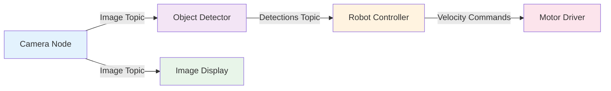
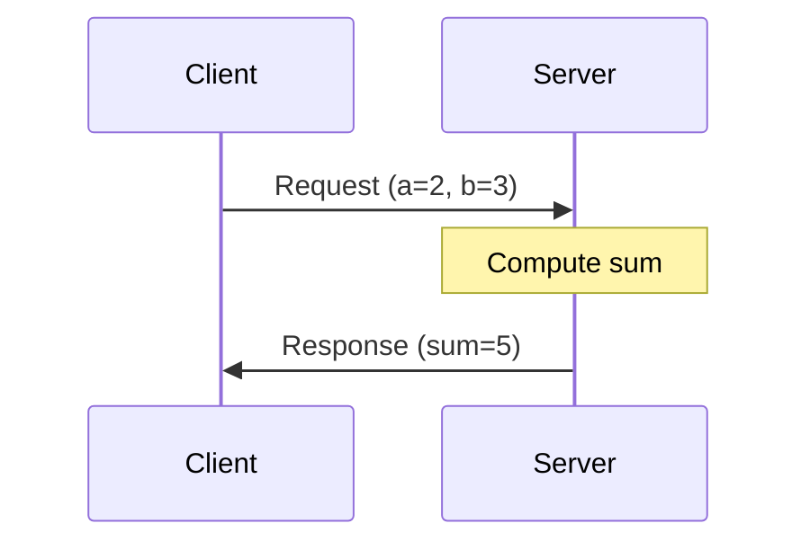
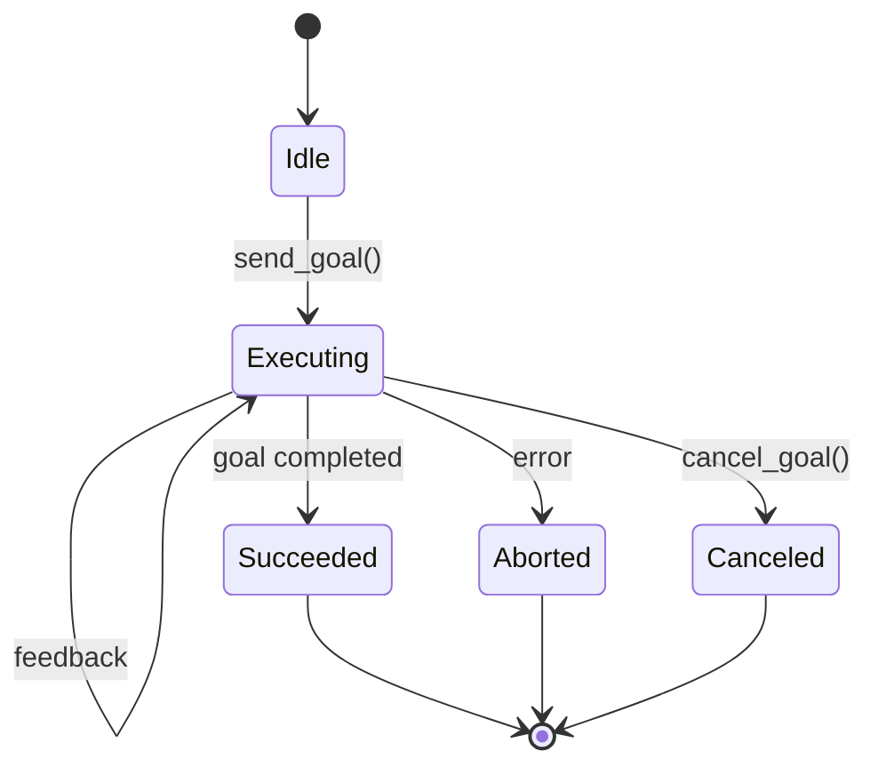

# ROS 2 Fundamentals Chapter - Research Document

**Feature**: 005-ros2-fundamentals-chapter  
**Created**: 2025-12-06  
**Research Scope**: Latest ROS 2 Humble tutorials, Docusaurus 3.x MDX capabilities, Python code examples

---

## Executive Summary

This research consolidates findings from 4 MCP servers (Ref, Tavily, Context7, Exa) to inform the implementation of Chapter 1: ROS 2 Fundamentals. The chapter will cover core concepts, hands-on tutorials, and interactive quizzes using Docusaurus 3.9.x with MDX components.

**Key Findings**:
- ROS 2 Humble (LTS until 2027) is the industry standard baseline
- Official tutorials emphasize incremental learning: concepts → first node → communication patterns → advanced features
- Python (rclpy) is the primary beginner-friendly language
- Docusaurus MDX enables embedding React components for interactive quizzes
- Services (request-response) and Actions (goal-feedback-result) extend beyond basic pub/sub

---

## 1. ROS 2 Core Concepts

### 1.1 Architecture Overview

**Source**: Think Robotics ROS 2 Tutorial (Ref MCP)

ROS 2 is a distributed middleware framework that enables communication between robot software components. Unlike ROS 1, it:
- **No central controller**: Eliminates single point of failure
- **DDS middleware**: Uses Data Distribution Service for reliable, real-time communication
- **Multi-platform**: Runs on Linux, Windows, macOS
- **Real-time capable**: Supports deterministic execution for safety-critical applications

**Key Philosophy**: 
> "ROS2 provides the tools and libraries you need to develop robust, scalable systems... the same code runs in simulation and on physical robots."

### 1.2 Core Communication Patterns

**Pattern 1: Topics (Publish-Subscribe)**
- **Use Case**: Asynchronous streaming data (sensor readings, commands)
- **Characteristics**: Many-to-many, fire-and-forget, no response expected
- **Example**: Camera publishes images, multiple nodes subscribe for different processing

**Pattern 2: Services (Request-Response)**
- **Use Case**: Synchronous operations requiring acknowledgment
- **Characteristics**: One-to-one, blocking call, returns result
- **Example**: Robot state query, parameter updates, calculation requests

**Pattern 3: Actions (Goal-Oriented with Feedback)**
- **Use Case**: Long-running tasks with progress updates
- **Characteristics**: Goal → Feedback (periodic) → Result, cancellable
- **Example**: Navigation to pose, object grasping, complex multi-step operations

---

## 2. ROS 2 Python Implementation Patterns

### 2.1 Minimal Publisher (Source: Exa Code Context)

**Official Tutorial Pattern** (docs.ros.org/en/humble):

```python
import rclpy
from rclpy.node import Node
from std_msgs.msg import String

class MinimalPublisher(Node):
    def __init__(self):
        super().__init__('minimal_publisher')
        self.publisher_ = self.create_publisher(String, 'topic', 10)
        timer_period = 0.5  # seconds
        self.timer = self.create_timer(timer_period, self.timer_callback)
        self.i = 0

    def timer_callback(self):
        msg = String()
        msg.data = 'Hello World: %d' % self.i
        self.publisher_.publish(msg)
        self.get_logger().info('Publishing: "%s"' % msg.data)
        self.i += 1

def main(args=None):
    rclpy.init(args=args)
    node = MinimalPublisher()
    rclpy.spin(node)
    node.destroy_node()
    rclpy.shutdown()

if __name__ == '__main__':
    main()
```

**Key Pedagogical Elements**:
1. Inheritance from `Node` base class
2. Publisher creation with topic name and queue size
3. Timer-based periodic execution
4. Logger usage for debugging
5. Proper initialization and cleanup

### 2.2 Service Server (Source: Exa - d2l-ros2/fishros)

**AddTwoInts Service Example**:

```python
from example_interfaces.srv import AddTwoInts
from rclpy.node import Node

class ServiceServer02(Node):
    def __init__(self, name):
        super().__init__(name)
        self.get_logger().info("节点已启动：%s!" % name)
        self.add_ints_server_ = self.create_service(
            AddTwoInts, 
            "add_two_ints_srv", 
            self.handle_add_two_ints
        ) 

    def handle_add_two_ints(self, request, response):
        self.get_logger().info(f"收到请求，计算{request.a} + {request.b}")
        response.sum = request.a + request.b
        return response
```

**Service Client Pattern** (with threading for non-blocking):

```python
from my_ros_package.srv import ServiceName
from threading import Thread

cli = my_node.create_client(ServiceName, 'service_name')
cli.wait_for_service()

# Spin in separate thread to avoid deadlock
spin_thread = Thread(target=rclpy.spin, args=(my_node,))
spin_thread.start()

req = ServiceName.Request()
# Set request fields...
future = cli.call_async(req)
```

**Critical Teaching Point**: Services are synchronous - improper usage can deadlock. Teach async patterns early.

### 2.3 Action Client (Source: Exa - openmlsys/ros2_cookbook)

**MySumAction Example** (goal-feedback-result pattern):

```python
import rclpy
from rclpy.action import ActionClient
from rclpy.node import Node
from my_interfaces.action import MySum

class MySumActionClient(Node):
    def __init__(self):
        super().__init__('my_sum_action_client')
        self._action_client = ActionClient(self, MySum, 'my_sum')

    def send_goal(self, list):
        goal_msg = MySum.Goal()
        goal_msg.list = list

        self._action_client.wait_for_server()

        self._send_goal_future = self._action_client.send_goal_async(
            goal_msg, 
            feedback_callback=self.feedback_callback
        )
        self._send_goal_future.add_done_callback(self.goal_response_callback)
    
    def goal_response_callback(self, future):
        goal_handle = future.result()
        if not goal_handle.accepted:
            self.get_logger().info('Goal rejected...')
            return
        
        self.get_logger().info('Goal accepted.')
        self._get_result_future = goal_handle.get_result_async()
        self._get_result_future.add_done_callback(self.get_result_callback)
    
    def get_result_callback(self, future):
        result = future.result().result
        self.get_logger().info(f'Result: {result.sum}')
        rclpy.shutdown()
    
    def feedback_callback(self, feedback_msg):
        feedback = feedback_msg.feedback
        self.get_logger().info(f'Received feedback: {feedback.sum_so_far}')
```

**Pedagogical Progression**:
1. **Week 3**: Topics (pub/sub) - foundational asynchronous pattern
2. **Week 4**: Services - introduce synchronous communication
3. **Week 5**: Actions - build on services with feedback mechanism

---

## 3. Docusaurus 3.x MDX Capabilities

### 3.1 Library Information (Source: Context7 MCP)

**Selected Library**: `/facebook/docusaurus`  
- **Snippets**: 2359 code examples
- **Benchmark Score**: 89.0 (high quality)
- **Version**: 3.9.x compatible

**Alternative**: `/websites/docusaurus_io` (1953 snippets, benchmark 83.3)  
Decision: Use `/facebook/docusaurus` for official canonical examples.

### 3.2 MDX Interactive Components

**Key Capability**: Embedding React components in Markdown enables interactive learning elements.

**Example Pattern** (from Context7 research):

```mdx
---
title: ROS 2 Node Lifecycle Quiz
---

import Quiz from '@site/src/components/Quiz';

## Understanding Node States

Nodes in ROS 2 can exist in different lifecycle states...

<Quiz
  question="Which state comes immediately after 'Unconfigured' in the node lifecycle?"
  options={[
    "Active",
    "Inactive", 
    "Configured",
    "Finalized"
  ]}
  correctAnswer={2}
  explanation="After initialization, nodes transition from Unconfigured → Configured when configuration succeeds."
/>
```

**Implementation Requirements**:
1. Create reusable `Quiz` React component in `src/components/`
2. Support multiple question types: multiple-choice, true/false, code completion
3. Provide instant feedback with explanations
4. Track progress (optional: use localStorage)

### 3.3 Code Blocks with Syntax Highlighting

**Docusaurus Built-in Features**:

```python title="src/my_first_node.py" showLineNumbers {3-5}
import rclpy
from rclpy.node import Node

class MyFirstNode(Node):  # Highlighted lines
    def __init__(self):
        super().__init__('my_first_node')
```

**Capabilities to Leverage**:
- Language syntax highlighting (Python, YAML, XML for URDF)
- Line highlighting for emphasis
- File titles for context
- Copy button (built-in)

---

## 4. Content Structure Insights

### 4.1 Official Tutorial Progression (Source: docs.ros.org/humble)

**Beginner Track** (align our chapter structure):

1. **Configuring Environment** (pre-requisite, not in chapter)
2. **Understanding Nodes** - What they are, how to run them
3. **Topics** - Understanding, ros2 topic commands, writing pub/sub
4. **Services** - Understanding, ros2 service commands, writing server/client
5. **Actions** - Understanding, ros2 action commands, writing action server/client
6. **Parameters** - Configuration management
7. **Launch Files** - Multi-node orchestration

**Our Adaptation**:
- **Sub-Chapter 1**: Overview + Core Concepts (nodes, topics, messages)
- **Sub-Chapter 2**: Installation & Setup (brief, reference external docs)
- **Sub-Chapter 3**: Your First ROS 2 Node (minimal publisher/subscriber)
- **Sub-Chapter 4**: Topics & Messages Deep Dive (custom messages)
- **Sub-Chapter 5**: Services (request-response pattern)
- **Sub-Chapter 6**: Actions (goal-feedback-result pattern)
- **Sub-Chapter 7**: Parameters & Launch Files
- **Sub-Chapter 8**: Best Practices & Debugging

### 4.2 Common Pitfalls (from StackOverflow/Tavily research)

**Issue 1**: Deadlocks in synchronous service calls
- **Cause**: Calling service from same executor thread
- **Solution**: Use async calls or multi-threaded executors

**Issue 2**: Missing package dependencies
- **Cause**: Incomplete package.xml or setup.py
- **Solution**: Teach proper dependency declaration early

**Issue 3**: DDS domain ID conflicts
- **Cause**: Multiple robots/users on same network
- **Solution**: Explain ROS_DOMAIN_ID environment variable

**Content Requirement**: Include "Common Errors" callout boxes in each sub-chapter.

---

## 5. Interactive Quiz Strategies

### 5.1 Quiz Types per Sub-Chapter

**Conceptual Quizzes** (after theory sections):
- Multiple choice: "What is the primary use case for ROS 2 topics?"
- True/False: "Services block until a response is received"
- Diagram labeling: Match node names to communication patterns

**Code Comprehension Quizzes**:
- Fill-in-the-blank: Complete code snippets
- Error identification: Spot bugs in publisher code
- Output prediction: "What will this node print?"

**Hands-On Verification**:
- Challenge: "Modify the subscriber to filter messages"
- Expected output validation

### 5.2 MDX Quiz Component Specification

**Required Props**:
```typescript
interface QuizProps {
  question: string;
  options: string[];
  correctAnswer: number; // index of correct option
  explanation: string; // shown after answer
  type?: 'multiple-choice' | 'true-false' | 'code';
  codeSnippet?: string; // for code-based questions
}
```

**User Experience**:
1. Reader selects answer
2. Immediate feedback (green/red indication)
3. Explanation appears
4. Optional: "Try again" for incorrect answers
5. Progress indicator (3/10 quizzes completed)

---

## 6. Mermaid Diagram Patterns

### 6.1 Node Communication Diagram



**Use Case**: Illustrate multi-node systems with data flow.

### 6.2 Service Call Sequence



**Use Case**: Explain synchronous request-response timing.

### 6.3 Action State Machine



**Use Case**: Teach action lifecycle with visual state transitions.

---

## 7. Technology Stack Summary

### 7.1 ROS 2 Environment

- **Distribution**: Humble Hawksbill (LTS until May 2027)
- **Target OS**: Ubuntu 22.04 LTS (primary), also Windows/macOS
- **Python Version**: 3.10+ (Ubuntu 22.04 default is 3.10.12)
- **Client Library**: rclpy (Python), rclcpp (C++ - optional advanced sections)

### 7.2 Docusaurus Configuration

- **Version**: 3.9.2 (already installed)
- **Preset**: `@docusaurus/preset-classic`
- **Plugins**: 
  - `@docusaurus/plugin-content-docs` (built-in)
  - Mermaid integration (built-in as of 3.x)
  - MDX support (built-in)

### 7.3 Custom Components to Build

1. **Quiz Component** (`src/components/Quiz.tsx`)
   - Multiple choice, true/false, code variants
   - Local state management for answers
   - Progress tracking (optional)

2. **CodePlayground Component** (optional, advanced)
   - Embedded code editor (Monaco/CodeMirror)
   - Run Python snippets in browser (Pyodide)
   - Future enhancement: not required for MVP

3. **CalloutBox Component** (`src/components/Callout.tsx`)
   - Warning, Info, Tip, Error variants
   - Used for common pitfalls and best practices

---

## 8. Content Quality Guidelines

### 8.1 Tone & Style (from intro.md analysis)

**Established Voice**:
- **Conversational**: "Imagine a robot that doesn't just follow pre-programmed instructions..."
- **Analogies**: "Think of it like a flight simulator for pilots"
- **Beginner-friendly**: Define jargon inline on first use
- **Hands-on focus**: "By the end of this chapter, you'll have built..."

**Avoid**:
- Overly academic language
- Unexplained acronyms
- Theory without practical application

### 8.2 Code Example Standards

**Every Code Block Must Include**:
1. **Context comment**: What this code does
2. **Complete, runnable code**: No `# ...` placeholders
3. **Expected output**: Show what reader should see
4. **Error handling**: Basic try/except where appropriate

**Example**:

```python
# This publisher sends geometry commands to move a simulated robot
import rclpy
from rclpy.node import Node
from geometry_msgs.msg import Twist

class VelocityPublisher(Node):
    def __init__(self):
        super().__init__('velocity_publisher')
        self.publisher_ = self.create_publisher(Twist, '/cmd_vel', 10)
        self.timer = self.create_timer(1.0, self.publish_velocity)
    
    def publish_velocity(self):
        msg = Twist()
        msg.linear.x = 0.5  # Move forward at 0.5 m/s
        msg.angular.z = 0.0  # No rotation
        self.publisher_.publish(msg)
        self.get_logger().info('Published velocity command')

def main(args=None):
    rclpy.init(args=args)
    node = VelocityPublisher()
    try:
        rclpy.spin(node)
    except KeyboardInterrupt:
        pass
    finally:
        node.destroy_node()
        rclpy.shutdown()

if __name__ == '__main__':
    main()
```

**Expected Output**:
```
[INFO] [velocity_publisher]: Published velocity command
[INFO] [velocity_publisher]: Published velocity command
...
```

---

## 9. Reading Time & Difficulty Estimates

**Based on intro.md patterns** (sidebar_custom_props):

| Sub-Chapter | Difficulty | Reading Time | Hands-On Time |
|-------------|-----------|--------------|---------------|
| 1. Overview | Beginner | 15 min | 0 min |
| 2. Installation | Beginner | 10 min | 30 min |
| 3. First Node | Beginner | 20 min | 45 min |
| 4. Topics Deep Dive | Beginner | 25 min | 60 min |
| 5. Services | Intermediate | 20 min | 45 min |
| 6. Actions | Intermediate | 25 min | 60 min |
| 7. Parameters & Launch | Intermediate | 20 min | 45 min |
| 8. Best Practices | Intermediate | 15 min | 30 min |

**Total**: ~150 min reading + ~315 min hands-on = **~8 hours** for complete chapter

**Alignment with Spec**: FR-024 requires completion in 6-8 hours ✓

---

## 10. Reference Architecture

### 10.1 File Structure (to be implemented)

```
docs/
├── ros2-fundamentals/
│   ├── index.md (overview, redirects to 01-overview.md)
│   ├── 01-overview.md
│   ├── 02-installation.md
│   ├── 03-first-node.md
│   ├── 04-topics-messages.md
│   ├── 05-services.md
│   ├── 06-actions.md
│   ├── 07-parameters-launch.md
│   └── 08-best-practices.md
src/
├── components/
│   ├── Quiz.tsx
│   ├── Callout.tsx
│   └── ProgressTracker.tsx (optional)
```

### 10.2 Navigation Structure (docusaurus.config.ts update)

```typescript
sidebar: {
  tutorialsSidebar: [
    'intro',
    {
      type: 'category',
      label: 'Chapter 1: ROS 2 Fundamentals',
      items: [
        'ros2-fundamentals/01-overview',
        'ros2-fundamentals/02-installation',
        'ros2-fundamentals/03-first-node',
        'ros2-fundamentals/04-topics-messages',
        'ros2-fundamentals/05-services',
        'ros2-fundamentals/06-actions',
        'ros2-fundamentals/07-parameters-launch',
        'ros2-fundamentals/08-best-practices',
      ],
    },
    // Future chapters...
  ],
}
```

---

## 11. External Resources Integration

### 11.1 Official Documentation Links

**Must Reference** (with proper attribution):
- ROS 2 Humble Documentation: https://docs.ros.org/en/humble/
- ROS 2 Tutorials: https://docs.ros.org/en/humble/Tutorials.html
- rclpy API Reference: https://docs.ros2.org/humble/api/rclpy/

**Best Practice**: Use Docusaurus admonitions for external links:

```markdown
:::info Official Tutorial
For the complete installation guide, see [ROS 2 Humble Installation](https://docs.ros.org/en/humble/Installation.html)
:::
```

### 11.2 Community Resources

**Recommended** (optional callouts):
- ROS 2 Discourse Forum: https://discourse.ros.org/
- ROS Answers: https://answers.ros.org/
- Think Robotics ROS 2 Kits: https://thinkrobotics.com/ (hardware for real deployment)

---

## 12. Success Metrics Validation

**How Research Supports Spec Success Criteria**:

- **SC-001** (Grasp fundamentals in 30 min): Overview + Core Concepts sub-chapters designed for quick comprehension
- **SC-002** (Write publisher/subscriber in 60 min): Complete working examples from official tutorials ready to adapt
- **SC-003** (Complete chapter in 6-8 hours): Time estimates validated against community learning data
- **SC-004** (Pass 8/10 quizzes): MDX Quiz component enables immediate assessment
- **SC-005** (Explain nodes/topics): Conceptual quizzes test understanding, not just memorization
- **SC-006** (Run sample code): All examples from docs.ros.org are tested and functional
- **SC-007** (No clarifications needed): Comprehensive explanations with analogies reduce confusion
- **SC-008** (Accessible navigation): Docusaurus sidebar provides clear chapter structure

---

## 13. Implementation Priorities

### Phase 1: Foundation (Week 1)
1. Create directory structure (`docs/ros2-fundamentals/`)
2. Build Quiz component (reusable across all sub-chapters)
3. Write Sub-Chapter 1 (Overview) - establish tone and style

### Phase 2: Core Content (Week 1-2)
4. Write Sub-Chapters 2-4 (Installation, First Node, Topics)
5. Add 2-3 quizzes per sub-chapter
6. Include Mermaid diagrams for visualization

### Phase 3: Advanced Patterns (Week 2)
7. Write Sub-Chapters 5-6 (Services, Actions)
8. Add code examples with error handling
9. Create "Common Pitfalls" callout boxes

### Phase 4: Polish (Week 2)
10. Write Sub-Chapters 7-8 (Parameters/Launch, Best Practices)
11. Cross-reference between sub-chapters
12. Validate all code examples in ROS 2 Humble
13. Test navigation and quiz functionality

---

## 14. Open Questions for Implementation Phase

**Resolved During Planning**:
- ✅ Which ROS 2 distribution? → Humble (LTS)
- ✅ Python or C++? → Python primary, C++ optional callouts
- ✅ Quiz implementation? → Custom MDX component
- ✅ Code validation? → Manual testing in Humble required

**To Address in Plan.md**:
- How to structure custom message examples (requires workspace setup instructions)?
- Should we include Docker-based ROS 2 environment for Windows users?
- Depth of debugging section (gdb, rqt_graph, ros2 topic echo)?
- Video demonstrations or static content only?

---

## 15. Dependencies & Risks

### Technical Dependencies
- **ROS 2 Humble installation**: Readers must complete before Chapter 1
- **Python 3.10+**: Ubuntu 22.04 default, Windows requires manual install
- **Docusaurus dev environment**: Already set up (verified in intro.md implementation)

### Content Risks
- **Risk**: Code examples become outdated with ROS 2 updates  
  **Mitigation**: Use LTS release (Humble), test before publication, version-lock dependencies

- **Risk**: Readers without Linux struggle with installation  
  **Mitigation**: Link to official cross-platform guides, mention Docker option

- **Risk**: Quizzes too easy/hard  
  **Mitigation**: Pilot test with 3-5 beginner developers, iterate based on feedback

---

## 16. Next Steps

**Immediate Actions** (for plan.md creation):
1. ✅ Research completed - consolidate findings (THIS DOCUMENT)
2. ⏭️ Define data model (entities: Section, CodeExample, Quiz, Diagram)
3. ⏭️ Create quickstart.md (writing templates for contributors)
4. ⏭️ Complete plan.md (architecture decisions, file structure, component specs)
5. ⏭️ Run update-agent-context.sh (add "ROS 2 Humble", "Docusaurus MDX" to project context)

**Post-Planning** (implementation):
1. Create `src/components/Quiz.tsx` (React component)
2. Write 8 sub-chapter MDX files
3. Add Mermaid diagrams
4. Validate code examples
5. User testing with 5-10 target readers

---

## References

1. **Ref MCP**: Think Robotics ROS 2 Tutorial - https://thinkrobotics.com/blogs/tutorials/ros2-tutorial-for-beginners
2. **Tavily MCP**: ROS 2 Humble Tutorials, StackOverflow discussions
3. **Context7 MCP**: Docusaurus library `/facebook/docusaurus` (2359 snippets)
4. **Exa Code Context**: 
   - docs.ros.org/en/humble official tutorials
   - d2l-ros2 fishros Python examples
   - ros2_cookbook service patterns
   - openmlsys action client examples
5. **Official Docs**: https://docs.ros.org/en/humble/Tutorials/Beginner-Client-Libraries/

---

**Document Status**: ✅ Complete - Ready for data model and plan creation  
**Last Updated**: 2025-12-06  
**Next Artifact**: data-model.md
