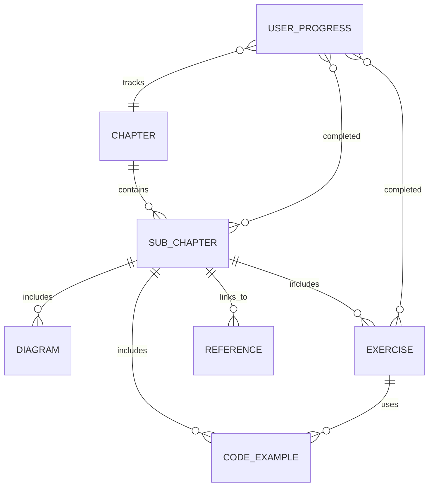

# Data Model: Module 2 - The Digital Twin

**Feature**: 006-digital-twin-chapter  
**Date**: 2025-12-07  
**Phase**: Phase 1 - Design

## Overview

This data model defines the educational content structure, metadata, and relationships for Module 2: The Digital Twin chapter. As an educational resource, the "data" consists of chapter content, code examples, diagrams, exercises, and reader progress tracking.

---

## 1. Chapter Structure

### ChapterMetadata

Defines high-level chapter information displayed in Docusaurus frontmatter.

```typescript
interface ChapterMetadata {
  id: string;                    // "module-2-digital-twin"
  title: string;                 // "Module 2: The Digital Twin (Gazebo & Unity)"
  description: string;           // Short description for SEO
  difficulty: "beginner" | "intermediate" | "advanced";  // "intermediate"
  readingTime: number;           // Estimated minutes (180-240)
  prerequisites: string[];       // ["module-1-ros2-fundamentals"]
  learningObjectives: string[];  // 5-7 objectives
  tags: string[];                // ["simulation", "gazebo", "unity", "sensors"]
  lastUpdated: Date;             // ISO 8601 timestamp
  version: string;               // "1.0.0"
}
```

**Example**:
```yaml
---
id: module-2-digital-twin
title: "Module 2: The Digital Twin (Gazebo & Unity)"
description: "Learn physics-accurate simulation in Gazebo and high-fidelity rendering in Unity for robotics development"
difficulty: intermediate
readingTime: 210
prerequisites:
  - module-1-ros2-fundamentals
learningObjectives:
  - Understand digital twin concepts and sim-to-real transfer
  - Configure Gazebo physics simulations with realistic parameters
  - Build custom environments using world files and 3D models
  - Create photorealistic renderings in Unity with URP
  - Simulate LiDAR, depth cameras, and IMUs accurately
tags: [simulation, gazebo, unity, sensors, digital-twin]
---
```

---

### SubChapter

Represents individual sections within the main chapter.

```typescript
interface SubChapter {
  id: string;                    // "02-gazebo-physics"
  parentChapterId: string;       // "module-2-digital-twin"
  title: string;                 // "Gazebo Physics Simulation"
  slug: string;                  // "/ros2-fundamentals/module-2/gazebo-physics"
  order: number;                 // 2 (display order)
  readingTime: number;           // Estimated minutes (25-30)
  content: string;               // MDX content (markdown + React components)
  diagrams: Diagram[];           // Array of Mermaid diagrams
  codeExamples: CodeExample[];   // Code snippets
  exercises: Exercise[];         // Hands-on exercises
  furtherReading: Reference[];   // External links
}
```

**SubChapter Hierarchy**:
```
module-2-digital-twin/
├── 01-digital-twin-intro (20 min)
├── 02-gazebo-physics (30 min)
├── 03-gazebo-environments (25 min)
├── 04-unity-rendering (30 min)
├── 05-unity-hri (20 min)
├── 06-lidar-simulation (25 min)
├── 07-depth-cameras (25 min)
├── 08-imu-sensors (20 min)
└── 09-integration-concepts (15 min)
```

---

## 2. Content Components

### Diagram

Represents Mermaid diagrams embedded in chapter content.

```typescript
interface Diagram {
  id: string;                    // "physics-workflow-flowchart"
  type: "flowchart" | "sequence" | "architecture" | "class";
  title: string;                 // "Physics Simulation Workflow"
  description: string;           // Alt text for accessibility
  mermaidCode: string;           // Mermaid DSL code
  caption?: string;              // Optional caption below diagram
}
```

**Example**:
```typescript
{
  id: "sensor-data-flow-sequence",
  type: "sequence",
  title: "Sensor Data Flow in ROS2",
  description: "Sequence diagram showing how sensor data flows from Gazebo through ROS2 topics to processing nodes",
  mermaidCode: `
sequenceDiagram
    participant G as Gazebo
    participant P as gazebo_ros Plugin
    participant R as ROS2 Topic
    participant N as ROS2 Node
    
    G->>P: Generate sensor data
    P->>R: Publish sensor_msgs/LaserScan
    R->>N: Subscribe to /scan
    N->>N: Process point cloud
  `,
  caption: "Figure 2.1: LiDAR data pipeline in Gazebo-ROS2 ecosystem"
}
```

---

### CodeExample

Represents code snippets with syntax highlighting.

```typescript
interface CodeExample {
  id: string;                    // "gazebo-lidar-config"
  language: "xml" | "python" | "cpp" | "csharp" | "yaml" | "bash";
  title: string;                 // "LiDAR Sensor Configuration"
  description: string;           // What this code does
  code: string;                  // Actual code content
  filename?: string;             // "lidar_sensor.sdf"
  showLineNumbers: boolean;      // true
  highlightLines?: number[];     // [5, 6, 7] - lines to highlight
  tags: string[];                // ["gazebo", "sensor", "lidar"]
}
```

**Example**:
```typescript
{
  id: "imu-ros2-subscriber",
  language: "python",
  title: "IMU Data Subscriber in ROS2",
  description: "Subscribe to IMU topic and extract accelerometer/gyroscope data",
  code: `
import rclpy
from sensor_msgs.msg import Imu

def imu_callback(msg):
    gyro_x = msg.angular_velocity.x  # rad/s
    acc_z = msg.linear_acceleration.z  # m/s^2 (includes gravity!)
  `,
  filename: "imu_subscriber.py",
  showLineNumbers: true,
  highlightLines: [5, 6],
  tags: ["ros2", "imu", "sensor_msgs"]
}
```

---

### Exercise

Represents hands-on exercises for readers.

```typescript
interface Exercise {
  id: string;                    // "create-custom-world"
  type: "quick-start" | "deep-dive" | "challenge";
  title: string;                 // "Create a Custom Gazebo World"
  difficulty: "beginner" | "intermediate" | "advanced";
  estimatedTime: number;         // Minutes (15 for quick-start, 60 for deep-dive)
  objectives: string[];          // What readers will accomplish
  instructions: string;          // Step-by-step guide (MDX format)
  hints?: string[];              // Optional hints for stuck readers
  solution?: string;             // Optional solution code/explanation
  validationCriteria: string[];  // How to verify success
  prerequisites: string[];       // Required prior knowledge/exercises
}
```

**Example**:
```typescript
{
  id: "add-lidar-to-robot",
  type: "quick-start",
  title: "Add a LiDAR Sensor to TurtleBot3",
  difficulty: "beginner",
  estimatedTime: 15,
  objectives: [
    "Add a simulated LiDAR sensor to existing robot model",
    "Configure sensor parameters (range, resolution, update rate)",
    "Visualize point cloud data in RViz2"
  ],
  instructions: "...", // MDX content with steps
  validationCriteria: [
    "LiDAR sensor appears in Gazebo simulation",
    "Point cloud data published to /scan topic",
    "RViz2 displays point cloud matching environment geometry"
  ],
  prerequisites: ["ros2-basics", "turtlebot3-setup"]
}
```

---

### Reference

External resources for further reading.

```typescript
interface Reference {
  id: string;                    // "gazebo-physics-tutorial"
  type: "documentation" | "tutorial" | "paper" | "video" | "repository";
  title: string;                 // "Gazebo Physics Engine Tutorial"
  url: string;                   // "https://classic.gazebosim.org/tutorials"
  description: string;           // What readers will find
  difficulty?: "beginner" | "intermediate" | "advanced";
}
```

---

## 3. Sensor Data Formats (Educational Reference)

These are not "data" in the traditional database sense, but educational reference models for ROS2 message structures that readers will learn about.

### PointCloud2 (LiDAR)

```python
# sensor_msgs/PointCloud2 structure (educational reference)
{
  "header": {
    "stamp": {"sec": 1234567890, "nanosec": 123456789},
    "frame_id": "lidar_link"
  },
  "height": 1,          # Unorganized point cloud
  "width": 65536,       # Number of points
  "fields": [
    {"name": "x", "offset": 0, "datatype": 7, "count": 1},   # FLOAT32
    {"name": "y", "offset": 4, "datatype": 7, "count": 1},
    {"name": "z", "offset": 8, "datatype": 7, "count": 1},
    {"name": "intensity", "offset": 12, "datatype": 7, "count": 1}
  ],
  "is_bigendian": False,
  "point_step": 16,     # Bytes per point (4 fields * 4 bytes)
  "row_step": 1048576,  # 65536 points * 16 bytes
  "data": bytes([...]), # Binary point cloud data
  "is_dense": False     # May contain invalid points (NaN)
}
```

### Imu

```python
# sensor_msgs/Imu structure (educational reference)
{
  "header": {
    "stamp": {"sec": 1234567890, "nanosec": 123456789},
    "frame_id": "imu_link"
  },
  "orientation": {"x": 0.0, "y": 0.0, "z": 0.0, "w": 1.0},  # Quaternion
  "orientation_covariance": [-1, 0, 0, 0, 0, 0, 0, 0, 0],    # -1 = unavailable
  "angular_velocity": {"x": 0.01, "y": -0.02, "z": 0.001},   # rad/s
  "angular_velocity_covariance": [0.009, 0, 0, 0, 0.009, 0, 0, 0, 0.009],
  "linear_acceleration": {"x": 0.1, "y": 0.05, "z": 9.81},   # m/s^2 (includes gravity!)
  "linear_acceleration_covariance": [0.017, 0, 0, 0, 0.017, 0, 0, 0, 0.017]
}
```

### Image (Depth Camera)

```python
# sensor_msgs/Image structure (educational reference)
{
  "header": {
    "stamp": {"sec": 1234567890, "nanosec": 123456789},
    "frame_id": "camera_depth_optical_frame"
  },
  "height": 480,
  "width": 640,
  "encoding": "32FC1",      # 32-bit float, 1 channel (depth in meters)
  "is_bigendian": False,
  "step": 2560,             # 640 pixels * 4 bytes per pixel
  "data": bytes([...])      # Binary image data
}
```

---

## 4. Progress Tracking (Future Enhancement)

For user progress tracking (not implemented in Phase 1, design for future).

### UserProgress

```typescript
interface UserProgress {
  userId: string;                // Authenticated user ID
  chapterId: string;             // "module-2-digital-twin"
  subChaptersCompleted: string[]; // ["01-intro", "02-gazebo-physics"]
  exercisesCompleted: string[];  // ["add-lidar-to-robot", "create-world"]
  readingTime: number;           // Actual time spent (seconds)
  lastAccessedAt: Date;          // ISO 8601 timestamp
  completionPercentage: number;  // 0-100
  notes?: string;                // User's personal notes (if feature exists)
}
```

*Note: This is design only. Actual implementation deferred to personalization feature (later development phase).*

---

## 5. File Structure Mapping

Content files in Docusaurus project:

```
docs/ros2-fundamentals/module-2-digital-twin/
├── index.md                    # Chapter overview + metadata
├── 01-digital-twin-intro.md    # SubChapter 1
├── 02-gazebo-physics/
│   ├── index.md                # SubChapter 2 overview
│   ├── gravity-and-forces.md   # Deep dive section
│   ├── collision-detection.md
│   └── material-properties.md
├── 03-gazebo-environments/
│   ├── index.md
│   ├── world-files.md
│   └── model-repositories.md
├── 04-unity-rendering/
│   ├── index.md
│   ├── urp-setup.md
│   ├── lighting-systems.md
│   └── materials-shaders.md
├── 05-unity-hri/
│   └── index.md
├── 06-lidar-simulation/
│   ├── index.md
│   ├── gazebo-lidar.md
│   └── unity-lidar.md
├── 07-depth-cameras/
│   ├── index.md
│   ├── rgbd-basics.md
│   └── depth-artifacts.md
├── 08-imu-sensors/
│   ├── index.md
│   ├── imu-basics.md
│   └── noise-modeling.md
├── 09-integration-concepts.md
└── _assets/                    # Images, videos (if needed)
    ├── diagrams/               # Pre-rendered diagram PNGs (backup)
    └── screenshots/            # Gazebo/Unity screenshots
```

---

## 6. Relationships



---

## 7. Validation Rules

### Chapter Metadata
- **id**: Must be unique, kebab-case
- **readingTime**: 120-300 minutes (total chapter)
- **learningObjectives**: 5-7 objectives maximum
- **prerequisites**: At least one prerequisite (except Module 1)

### SubChapter
- **order**: Sequential integers starting from 1
- **readingTime**: 15-40 minutes per sub-chapter
- **content**: Valid MDX syntax
- **diagrams**: Maximum 3 per sub-chapter (avoid visual clutter)

### CodeExample
- **code**: Valid syntax for specified language
- **filename**: Optional but recommended for context
- **highlightLines**: Must be within code line range

### Exercise
- **estimatedTime**: Quick-start (10-20 min), Deep-dive (45-90 min), Challenge (60+ min)
- **validationCriteria**: At least 2 criteria per exercise
- **solution**: Provided for beginner/intermediate, optional for advanced

---

## 8. Example: Complete SubChapter Data

```yaml
# SubChapter: Gazebo Physics Simulation
id: "02-gazebo-physics"
parentChapterId: "module-2-digital-twin"
title: "Gazebo Physics Simulation"
slug: "/ros2-fundamentals/module-2/gazebo-physics"
order: 2
readingTime: 30

diagrams:
  - id: "physics-workflow"
    type: "flowchart"
    title: "Physics Simulation Workflow"
    mermaidCode: |
      flowchart TD
        A[Define World] --> B[Configure Physics]
        B --> C[Add Robot] --> D[Test]
    caption: "Figure 2.1: Typical physics simulation setup workflow"

codeExamples:
  - id: "gravity-config"
    language: "xml"
    title: "Gravity Configuration"
    code: |
      <physics type="ode">
        <gravity>0 0 -9.81</gravity>
      </physics>
    filename: "world.sdf"
    tags: ["gazebo", "physics", "gravity"]

exercises:
  - id: "custom-gravity"
    type: "quick-start"
    title: "Simulate Lunar Gravity"
    difficulty: "beginner"
    estimatedTime: 15
    objectives:
      - "Modify gravity to lunar conditions (1.62 m/s²)"
      - "Observe robot behavior changes"
    validationCriteria:
      - "Robot jumps higher than Earth gravity"
      - "Falls slower when dropped"

furtherReading:
  - id: "gazebo-physics-docs"
    type: "documentation"
    title: "Gazebo Physics Engine Documentation"
    url: "https://gazebosim.org/libs/physics"
```

---

## Summary

This data model defines the structure for educational content in Module 2. Key entities:
- **ChapterMetadata**: High-level chapter information
- **SubChapter**: Individual sections with content, diagrams, code, exercises
- **Diagram**: Mermaid diagrams for visual learning
- **CodeExample**: Syntax-highlighted code snippets
- **Exercise**: Hands-on learning activities
- **Reference**: External resources

All content stored as MDX files in Docusaurus, with frontmatter metadata for structured access. Future enhancements may include user progress tracking via API backend.
