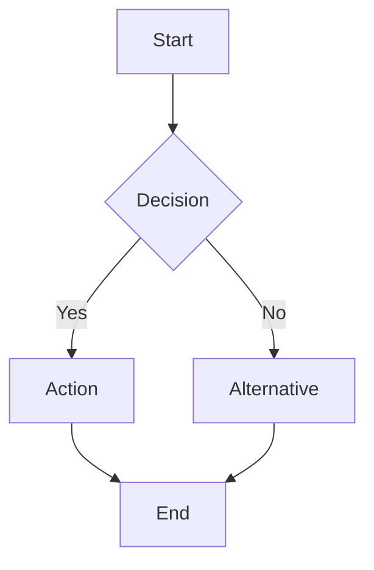
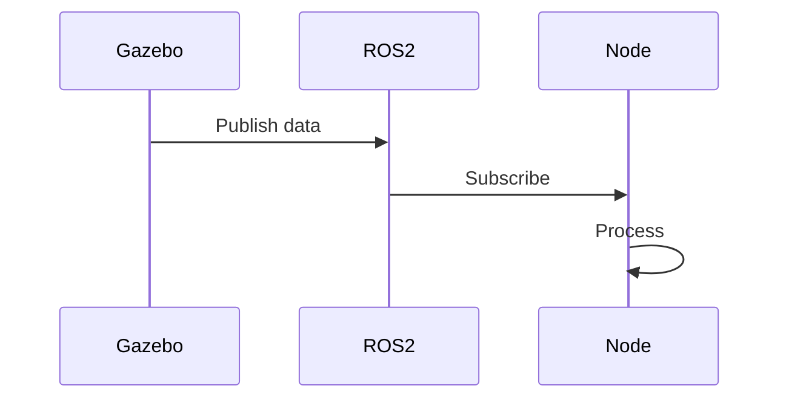
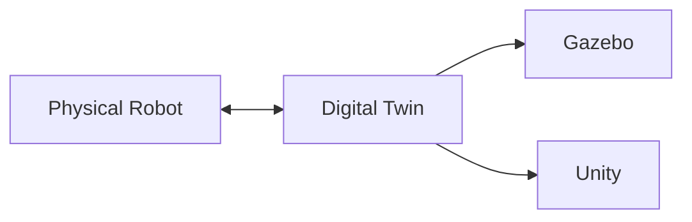

# Quick Start: Module 2 - The Digital Twin

**Feature**: 006-digital-twin-chapter  
**Date**: 2025-12-07  
**Purpose**: Rapid implementation guide for content creators

## Overview

This quick start guide provides content creators with a streamlined workflow to implement Module 2: The Digital Twin chapter in Docusaurus. Follow these steps sequentially to create the complete chapter with all sub-sections, diagrams, code examples, and exercises.

**Estimated Time**: 20-30 hours total (can be done over 1-2 weeks)

---

## Prerequisites

Before starting, ensure:

- [x] Docusaurus 3.x project initialized (from Module setup)
- [x] Node.js 20.x installed
- [x] Git repository set up
- [x] Access to Gazebo and Unity documentation
- [x] Familiarity with MDX format
- [x] Mermaid diagram basics

---

## Phase 1: Project Setup (30 minutes)

### Step 1.1: Install Mermaid Theme

```bash
cd hackathon-book
npm install --save @docusaurus/theme-mermaid
```

### Step 1.2: Configure Docusaurus

Edit `docusaurus.config.ts`:

```typescript
export default {
  // ... existing config
  themes: ['@docusaurus/theme-mermaid'],
  markdown: {
    mermaid: true,
  },
  themeConfig: {
    mermaid: {
      theme: {light: 'neutral', dark: 'dark'},
    },
  },
};
```

### Step 1.3: Create Directory Structure

```bash
mkdir -p docs/ros2-fundamentals/module-2-digital-twin
mkdir -p docs/ros2-fundamentals/module-2-digital-twin/02-gazebo-physics
mkdir -p docs/ros2-fundamentals/module-2-digital-twin/03-gazebo-environments
mkdir -p docs/ros2-fundamentals/module-2-digital-twin/04-unity-rendering
mkdir -p docs/ros2-fundamentals/module-2-digital-twin/05-unity-hri
mkdir -p docs/ros2-fundamentals/module-2-digital-twin/06-lidar-simulation
mkdir -p docs/ros2-fundamentals/module-2-digital-twin/07-depth-cameras
mkdir -p docs/ros2-fundamentals/module-2-digital-twin/08-imu-sensors
mkdir -p docs/ros2-fundamentals/module-2-digital-twin/_assets/screenshots
```

### Step 1.4: Verify Setup

```bash
npm run start
# Navigate to http://localhost:3000/ros2-fundamentals/module-2-digital-twin
# Verify directory structure appears in sidebar
```

---

## Phase 2: Create Chapter Index (1 hour)

### Step 2.1: Create Main Chapter File

Create `docs/ros2-fundamentals/module-2-digital-twin/index.md`:

```markdown
---
id: module-2-digital-twin
title: "Module 2: The Digital Twin (Gazebo & Unity)"
sidebar_label: "Module 2: Digital Twin"
description: "Learn physics-accurate simulation in Gazebo and high-fidelity rendering in Unity for robotics development"
keywords: [simulation, gazebo, unity, digital twin, sensors, physics, rendering]
difficulty: intermediate
readingTime: 210
---

# Module 2: The Digital Twin (Gazebo & Unity)

## Overview

Welcome to Module 2! In this chapter, you'll learn how to create **digital twins**—virtual replicas of physical robots and environments that enable safe, cost-effective testing before deploying to real hardware.

### What You'll Learn

- ✅ Digital twin concepts and sim-to-real transfer
- ✅ Physics-accurate simulation in Gazebo
- ✅ Photorealistic rendering in Unity
- ✅ Sensor simulation (LiDAR, depth cameras, IMUs)
- ✅ When to use Gazebo vs Unity vs integrated approaches

### Prerequisites

Before starting this module, you should have completed:
- [Module 1: ROS2 Fundamentals](/ros2-fundamentals/module-1)
- Basic understanding of 3D coordinate systems
- Familiarity with YAML/XML configuration files

### Reading Time

Estimated: **3.5 hours** (includes hands-on exercises)

---

## Chapter Structure

This module contains 9 sub-chapters:

1. **[Digital Twin Fundamentals](01-digital-twin-intro)** (20 min)
2. **[Gazebo Physics Simulation](02-gazebo-physics)** (30 min)
3. **[Gazebo Environment Building](03-gazebo-environments)** (25 min)
4. **[Unity High-Fidelity Rendering](04-unity-rendering)** (30 min)
5. **[Unity Human-Robot Interaction](05-unity-hri)** (20 min)
6. **[LiDAR Sensor Simulation](06-lidar-simulation)** (25 min)
7. **[Depth Camera Simulation](07-depth-cameras)** (25 min)
8. **[IMU Sensor Simulation](08-imu-sensors)** (20 min)
9. **[Integration Concepts](09-integration-concepts)** (15 min)

---

## Learning Objectives

By the end of this module, you will be able to:

1. Explain the difference between digital twins and digital cousins
2. Configure Gazebo physics engines with realistic parameters
3. Build custom simulation environments using world files
4. Create photorealistic scenes in Unity using URP
5. Simulate LiDAR, RGB-D cameras, and IMUs with realistic noise
6. Decide when to use Gazebo, Unity, or integrated approaches
7. Validate simulation accuracy against real-world data

---

## Quick Start Path

**Want to get hands-on immediately?** Follow this accelerated path:

1. Start with **[Digital Twin Intro](01-digital-twin-intro)** (concepts)
2. Jump to **[Gazebo Physics](02-gazebo-physics)** (first simulation)
3. Complete "Add LiDAR to Robot" exercise in **[LiDAR Simulation](06-lidar-simulation)**

You can return to other sections as needed!

---

## System Requirements

### For Gazebo Simulation
- **OS**: Ubuntu 22.04 LTS (recommended) or Windows 10/11 with WSL2
- **RAM**: Minimum 8GB, 16GB recommended
- **CPU**: Quad-core processor
- **GPU**: Optional but helpful for faster rendering

### For Unity Rendering
- **OS**: Windows 10/11 or macOS 10.15+
- **RAM**: Minimum 8GB, 16GB recommended
- **GPU**: Discrete GPU recommended (NVIDIA GTX 1060 or equivalent)
- **Disk**: 10GB free space for Unity installation

:::tip[Don't Have Unity?]
You can complete Gazebo-only sections without Unity. Unity sections (Chapters 4-5) are optional for readers focused on physics simulation.
:::

---

## Support & Community

- **GitHub Discussions**: Ask questions and share projects
- **Discord**: Join our community server for real-time help
- **Issue Tracker**: Report errors or suggest improvements

Ready to dive in? Start with [Digital Twin Fundamentals →](01-digital-twin-intro)
```

---

## Phase 3: Create Sub-Chapters (15-20 hours)

For each sub-chapter, follow this template structure:

### Template: Sub-Chapter File

```markdown
---
id: [sub-chapter-id]
title: "[Sub-Chapter Title]"
sidebar_label: "[Short Label]"
---

# [Sub-Chapter Title]

## Introduction

[Brief overview of what this section covers]

## Key Concepts

### Concept 1

[Explanation with examples]

```[language]
[code example]
```

### Concept 2

[Explanation]

```mermaid
[diagram]
```

## Hands-On Exercise

:::info[Quick Start Exercise - 15 minutes]
**Objective**: [What you'll accomplish]

**Steps**:
1. [Step 1]
2. [Step 2]
...

**Validation**:
- ✅ [Criterion 1]
- ✅ [Criterion 2]
:::

## Common Errors & Troubleshooting

### Error: "[Common Error Message]"

**Solution**: [How to fix]

## Summary

- ✅ [Key takeaway 1]
- ✅ [Key takeaway 2]

## Further Reading

- [External resource 1](url)
- [External resource 2](url)

---

**Next**: [Next Chapter Title](next-chapter-link) →
```

### Sub-Chapter Creation Order

Create sub-chapters in this sequence (dependency order):

1. **01-digital-twin-intro.md** (concepts, no dependencies)
2. **02-gazebo-physics/index.md** (builds on intro)
3. **03-gazebo-environments/index.md** (builds on physics)
4. **06-lidar-simulation/index.md** (sensor basics)
5. **07-depth-cameras/index.md** (similar to LiDAR)
6. **08-imu-sensors/index.md** (sensor completion)
7. **04-unity-rendering/index.md** (parallel track)
8. **05-unity-hri/index.md** (builds on Unity rendering)
9. **09-integration-concepts.md** (requires all prior knowledge)

**Time Estimate**: 1.5-2 hours per sub-chapter = 15-20 hours total

---

## Phase 4: Add Diagrams (3-4 hours)

### Diagram Types to Create

For each sub-chapter, aim for 1-2 diagrams:

**Flowcharts** (workflows):
```markdown

```

**Sequence Diagrams** (data flow):
```markdown

```

**Architecture Diagrams**:
```markdown

```

### Diagram Locations

| Sub-Chapter | Recommended Diagrams |
|-------------|---------------------|
| 01-intro | Architecture (digital twin system) |
| 02-gazebo-physics | Flowchart (simulation workflow) |
| 03-environments | Flowchart (model import process) |
| 04-unity-rendering | Architecture (Unity rendering pipeline) |
| 05-unity-hri | Sequence (proximity detection) |
| 06-lidar | Sequence (sensor data flow) |
| 07-depth-cameras | Flowchart (RGB-D processing) |
| 08-imu | Sequence (IMU data flow) |
| 09-integration | Architecture (Gazebo-Unity bridge) |

**Time Estimate**: 20-30 minutes per diagram = 3-4 hours total

---

## Phase 5: Add Code Examples (2-3 hours)

### Code Example Best Practices

1. **Keep examples short**: 10-30 lines max
2. **Add comments**: Explain non-obvious lines
3. **Use realistic values**: Match real sensor specs
4. **Show complete context**: Include imports, setup

### Example Template

````markdown
```xml title="lidar_sensor.sdf" showLineNumbers
<sensor type="ray" name="lidar">
  <pose>0 0 0.1 0 0 0</pose>
  <update_rate>10</update_rate>
  <ray>
    <scan>
      <horizontal>
        <samples>360</samples>      # 1° resolution
        <min_angle>-3.14159</min_angle>
        <max_angle>3.14159</max_angle>
      </horizontal>
    </scan>
    <range>
      <min>0.1</min>               # 10 cm minimum
      <max>30.0</max>              # 30 m maximum
    </range>
  </ray>
</sensor>
```
````

### Code Examples per Sub-Chapter

Target **5-7 code examples** per sub-chapter:
- 2-3 configuration files (XML, YAML)
- 2-3 Python scripts
- 1-2 command-line examples

**Time Estimate**: 15-20 minutes per example = 2-3 hours total

---

## Phase 6: Create Exercises (2-3 hours)

### Exercise Template

```markdown
:::info[Quick Start Exercise - 15 minutes]

### Create Your First Gazebo World

**Objective**: Build a custom simulation environment with obstacles

**Prerequisites**:
- Gazebo 11 installed
- ROS2 Humble sourced

**Steps**:

1. **Create world file**:
   ```bash
   mkdir -p ~/gazebo_worlds
   cd ~/gazebo_worlds
   touch my_world.sdf
   ```

2. **Add basic structure**:
   ```xml
   <?xml version="1.0"?>
   <sdf version="1.6">
     <world name="my_world">
       <include><uri>model://sun</uri></include>
       <include><uri>model://ground_plane</uri></include>
     </world>
   </sdf>
   ```

3. **Launch Gazebo**:
   ```bash
   gazebo my_world.sdf
   ```

**Validation Criteria**:
- ✅ Gazebo opens without errors
- ✅ Sun and ground plane visible
- ✅ Physics simulation running (check bottom-left corner)

**Common Issues**:
- **"Model not found"**: Check `GAZEBO_MODEL_PATH` environment variable
- **Black screen**: Update graphics drivers

:::
```

### Exercise Distribution

- **Quick Start** (15-20 min): 2-3 per sub-chapter = ~20 total
- **Deep Dive** (45-60 min): 1 per major section = ~5 total
- **Challenges** (60+ min): 1-2 for entire module = ~2 total

**Time Estimate**: 10-15 minutes per exercise = 2-3 hours total

---

## Phase 7: Review & Polish (2-3 hours)

### Checklist

For each sub-chapter:

- [ ] Frontmatter metadata complete
- [ ] All headings follow hierarchy (H2 → H3 → H4)
- [ ] Code blocks have language specified
- [ ] Diagrams render correctly in preview
- [ ] Internal links work (test navigation)
- [ ] External links valid (use link checker)
- [ ] Admonitions used appropriately (tip, warning, danger, info)
- [ ] Reading time realistic (test with timer)
- [ ] No orphaned pages (all linked from parent)
- [ ] Accessibility: Alt text for images, descriptive link text
- [ ] Grammar and spelling checked

### Build Test

```bash
npm run build
# Verify no errors
# Check bundle size (should be < 200KB per page)
```

### Preview Test

```bash
npm run serve
# Navigate through all pages
# Test on mobile viewport
# Check dark mode
```

---

## Phase 8: Deploy (30 minutes)

### Option 1: GitHub Pages

Already configured in CI/CD via GitHub Actions (per constitution).

```bash
git add docs/ros2-fundamentals/module-2-digital-twin
git commit -m "feat: add Module 2 - Digital Twin chapter"
git push origin 006-digital-twin-chapter
```

Create PR → Merge → Auto-deploy to GitHub Pages

### Option 2: Local Build

```bash
npm run build
npm run serve
# Test at http://localhost:3000
```

---

## Timeline Summary

| Phase | Tasks | Est. Time |
|-------|-------|-----------|
| 1 | Project setup | 30 min |
| 2 | Chapter index | 1 hour |
| 3 | Sub-chapters (9) | 15-20 hours |
| 4 | Diagrams (~15) | 3-4 hours |
| 5 | Code examples (~50) | 2-3 hours |
| 6 | Exercises (~25) | 2-3 hours |
| 7 | Review & polish | 2-3 hours |
| 8 | Deploy | 30 min |
| **Total** | | **26-34 hours** |

**Realistic Schedule**: 1-2 weeks (3-4 hours/day)

---

## Tips for Success

### 1. Start Simple
Begin with shortest sub-chapters (intro, integration concepts) to build momentum.

### 2. Batch Similar Tasks
- Write all chapter introductions in one session
- Create all diagrams in another session
- Add code examples in focused blocks

### 3. Use Templates
Copy-paste the sub-chapter template and fill in content. Don't start from blank page.

### 4. Test Early, Test Often
Run `npm run start` frequently to catch errors immediately.

### 5. Seek Feedback
Share draft chapters with colleagues or community for early feedback.

### 6. Version Control
Commit after each sub-chapter completion. Small commits = easier rollback.

---

## Troubleshooting

### Mermaid Diagrams Not Rendering

**Solution**: Verify theme installed and configured:
```bash
npm list @docusaurus/theme-mermaid
# Should show version number
```

### Sidebar Not Showing

**Solution**: Check `sidebars.ts` configuration:
```typescript
module.exports = {
  tutorialSidebar: [
    {
      type: 'category',
      label: 'ROS2 Fundamentals',
      items: [
        'ros2-fundamentals/module-1-intro',
        {
          type: 'category',
          label: 'Module 2: Digital Twin',
          items: [
            'ros2-fundamentals/module-2-digital-twin/index',
            // ... sub-chapters
          ],
        },
      ],
    },
  ],
};
```

### Build Warnings

**Solution**: Most warnings can be ignored during development. Fix before deployment:
```bash
npm run build 2>&1 | grep -i "error"
# Focus on errors, ignore warnings
```

---

## Next Steps

After completing this module:

1. **Gather Analytics**: Monitor reader engagement (time on page, completion rate)
2. **Collect Feedback**: Add feedback widget or GitHub Discussions
3. **Iterate**: Update based on common questions or confusion points
4. **Expand**: Add video walkthroughs, interactive demos

**Ready to start?** Begin with [Phase 1: Project Setup](#phase-1-project-setup-30-minutes) above! 🚀
