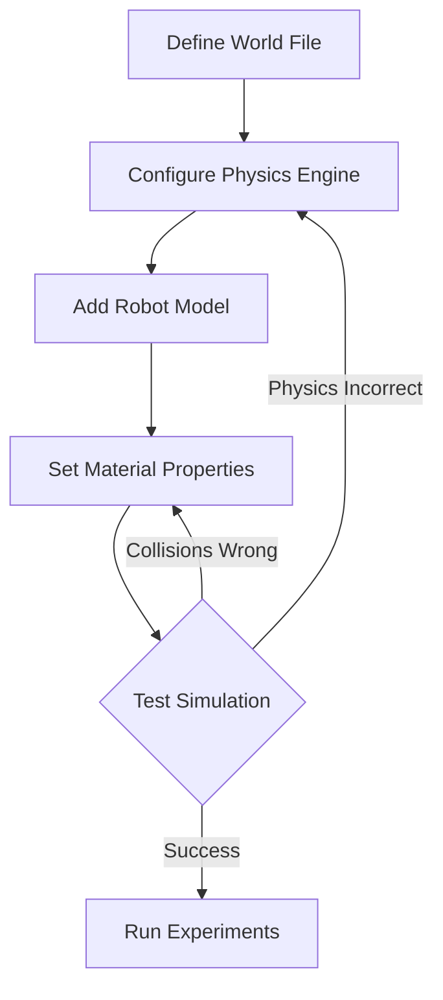
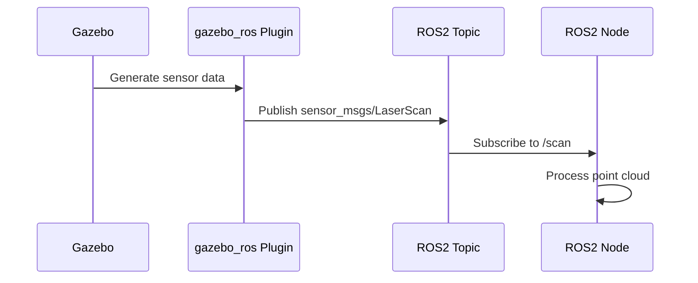
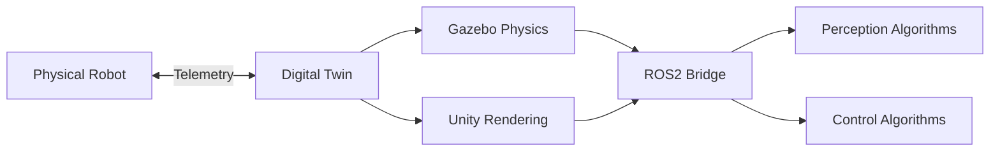

# Research: Module 2 - The Digital Twin (Gazebo & Unity)

**Date**: 2025-12-07  
**Feature**: 006-digital-twin-chapter  
**Research Phase**: Phase 0 - Technical Context Resolution

## Executive Summary

This research phase focused on gathering authoritative, current information for Module 2: The Digital Twin chapter. Research leveraged MCP servers (Ref, Exa, Tavily) to obtain up-to-date documentation on Gazebo simulation, Unity robotics integration, ROS2 sensor message types, and Docusaurus 3.x capabilities for educational content delivery.

**Key Findings**:
- Gazebo physics simulation patterns well-documented with ROS2 integration
- Unity robotics sensor simulation (UnitySensors, Unity Robotics Hub) actively maintained
- ROS2 sensor_msgs package provides standardized interfaces for all target sensors
- Docusaurus 3.x supports Mermaid diagrams natively via @docusaurus/theme-mermaid
- Digital twin sim-to-real transfer research shows growing importance (market projected $155.84B by 2030)

---

## 1. Digital Twin Concepts & Sim-to-Real Transfer

### Decision: Cover Digital Twin Definition and Sim-to-Real Fundamentals

**Rationale**:
- Digital twins are central to modern robotics development workflow
- Market growth (CAGR 34.2%, 2025-2030) indicates industry adoption
- Sim-to-real gap is critical challenge that readers must understand

**Sources**:
- arXiv 2511.04665v2: Real-to-Sim Robot Policy Evaluation with Gaussian Splatting
- MDPI Robotics 14(12):180: Sim2Real Transfer of Imitation Learning
- arXiv 2511.08585v1: Digital cousins vs digital twins conceptual framework

**Key Concepts to Include**:
1. **Digital Twin Definition**: Bidirectional, real-time connectivity between physical and virtual systems enabling accurate representation of system behavior
2. **Digital Cousins**: Virtual environments sharing semantic/geometric affordances without exact replication (faster iteration, reduced fidelity requirements)
3. **Sim-to-Real Gap**: Discrepancies between simulation and reality (physics accuracy, sensor noise, material properties, lighting)
4. **Validation Strategies**: Comparing simulated sensor data with real-world measurements, iterative refinement

**Implementation in Chapter**:
- Introductory section explaining digital twin vs digital cousin
- Case studies: successful sim-to-real transfers (manipulation, navigation)
- Common pitfalls and mitigation strategies
- Guidelines for when to use Gazebo (physics) vs Unity (rendering) vs integrated approach

---

## 2. Gazebo Simulation - Physics Engine

### Decision: Focus on Gazebo with ROS2 Integration

**Rationale**:
- Gazebo is de facto standard for ROS robotics simulation
- Strong community support and documentation
- Native ROS2 integration via gazebo-ros-pkgs
- Supports multiple physics engines (ODE, Bullet, DART)

**Sources**:
- GitHub: gazebosim/gz-sim (Gazebo Ignition/Sim)
- GitHub: RoboSense-LiDAR, Livox-SDK (sensor simulation examples)
- Classic Gazebo tutorials (gazebosim.org)

**Physics Engine Options**:
1. **ODE (Open Dynamics Engine)**: Default, good general-purpose, fast
2. **Bullet**: Better collision detection, used in games/VFX
3. **DART**: Advanced constraint handling, good for manipulation
4. **TPE (Trivial Physics Engine)**: Lightweight, for simple scenarios

**Configuration Patterns**:
```xml
<!-- Physics configuration in world file -->
<physics type="ode">
  <max_step_size>0.001</max_step_size>
  <real_time_factor>1.0</real_time_factor>
  <real_time_update_rate>1000</real_time_update_rate>
  <gravity>0 0 -9.81</gravity>
</physics>
```

**Key Topics for Chapter**:
1. Gravity configuration and custom values (lunar, mars simulations)
2. Collision detection: shapes, layers, contact parameters
3. Material properties: friction (mu, mu2), restitution, contact_max_correcting_vel
4. Timestep tuning: max_step_size vs accuracy tradeoff
5. Solver parameters: iterations, constraint force mixing (CFM), error reduction parameter (ERP)

**Example Use Cases**:
- Reduced gravity for space robotics
- High-friction surfaces for climbing robots
- Elastic collisions for ball-catching scenarios
- Fast-moving projectiles (timestep reduction)

---

## 3. Gazebo Environment Building

### Decision: Cover URDF/SDF Models, World Files, Model Repositories

**Rationale**:
- Environment realism critical for meaningful simulation
- Pre-built models accelerate development
- Custom models enable domain-specific testing

**Sources**:
- Gazebo model repository (gazebosim.org/models)
- URDF tutorials (classic.gazebosim.org/tutorials)
- Community examples (TurtleBot3, Universal Robots)

**Model Formats**:
1. **SDF (Simulation Description Format)**: Gazebo-native, more features than URDF
2. **URDF (Unified Robot Description Format)**: ROS standard, convertible to SDF
3. **Mesh Formats**: COLLADA (.dae), STL, OBJ for visual/collision geometry

**World File Structure**:
```xml
<?xml version="1.0"?>
<sdf version="1.6">
  <world name="default">
    <!-- Physics, GUI, lighting -->
    <include><uri>model://sun</uri></include>
    <include><uri>model://ground_plane</uri></include>
    
    <!-- Custom models -->
    <model name="my_robot">
      <include><uri>model://turtlebot3_waffle</uri></include>
      <pose>0 0 0 0 0 0</pose>
    </model>
  </world>
</sdf>
```

**Chapter Content**:
1. **Model Discovery**: Gazebo model repository, GitHub, creating custom models
2. **Importing Models**: GUI (Insert tab), programmatic (rosrun gazebo_ros spawn_model)
3. **World Files**: XML structure, includes, model placement, lighting
4. **Terrain Creation**: Heightmaps, mesh-based terrain, procedural generation
5. **Lighting**: Ambient, directional, point lights, shadows
6. **Performance Optimization**: LOD (Level of Detail), simplified collision meshes, culling

**Practical Exercises**:
- Import 3 objects from Gazebo repository
- Create custom world with obstacles
- Optimize complex model for real-time performance

---

## 4. Unity High-Fidelity Rendering

### Decision: Unity Robotics Hub + UnitySensors for ROS2 Integration

**Rationale**:
- Unity excels at photorealistic rendering
- Unity Robotics Hub provides ROS2 bridge (TCP endpoint)
- UnitySensors package offers ready-to-use sensor models

**Sources**:
- GitHub: Unity-Technologies/Unity-Robotics-Hub
- GitHub: Field-Robotics-Japan/UnitySensors
- Unity Simulation documentation (docs.unity3d.com/Simulation)

**Unity Robotics Architecture**:
```
Unity (C#) <--TCP--> ROS TCP Endpoint <--ROS2--> ROS2 nodes
```

**Rendering Pipeline Options**:
1. **Built-in Render Pipeline**: Legacy, simple, good for learning
2. **Universal Render Pipeline (URP)**: Optimized, cross-platform, recommended
3. **High Definition Render Pipeline (HDRP)**: Photorealistic, requires powerful GPU

**Chapter Recommendations**:
- Use URP for balance of quality and performance
- Target quality: suitable for computer vision algorithm testing

**Lighting Systems**:
1. **Real-time Lights**: Directional (sun), Point (bulbs), Spot (flashlights)
2. **Baked Lighting**: Pre-computed global illumination, faster runtime
3. **Mixed Lighting**: Combination of real-time and baked

**Materials & Shaders**:
- **Physically Based Rendering (PBR)**: Realistic material appearance
- **Shader Graph**: Visual shader creation (no coding)
- **Material Properties**: Albedo, metallic, smoothness, normal maps

**Camera Configuration**:
```csharp
// RGB camera sensor
Camera cam = GetComponent<Camera>();
cam.fieldOfView = 60;
cam.nearClipPlane = 0.3f;
cam.farClipPlane = 20.0f;
```

**Post-Processing Effects**:
- Depth of Field (realistic camera focus)
- Motion Blur (fast movement)
- Exposure (auto-exposure, HDR)
- Color Grading (tone mapping)

**Performance Optimization**:
1. **LOD Groups**: Switch meshes based on distance
2. **Occlusion Culling**: Don't render hidden objects
3. **Static Batching**: Combine static meshes
4. **Lighting Probe**: Optimize indirect lighting

**Chapter Content Structure**:
1. Unity project setup for robotics
2. URP configuration and lighting
3. Material/shader basics (PBR workflow)
4. Camera setup for robot vision
5. Post-processing for realism
6. Performance optimization techniques

---

## 5. Unity Human-Robot Interaction (HRI)

### Decision: Humanoid Character Models + Animation System

**Rationale**:
- HRI critical for service robots, collaborative robots
- Unity Asset Store provides free/paid humanoid models
- Unity animation system (Mecanim) supports realistic motion

**Sources**:
- Unity Animation documentation
- Unity Asset Store (free humanoid models)
- HRI research context (service robotics)

**Character Setup**:
1. **Model Import**: FBX format from Asset Store or Mixamo
2. **Rigging**: Humanoid rig configuration (Unity detects automatically)
3. **Animation Clips**: Walk, idle, wave, sit (pre-made or custom)

**Animation Controller**:
```
Idle State --[Walk Trigger]--> Walk State --[Stop Trigger]--> Idle State
```

**Proximity Detection**:
```csharp
// Detect robot proximity
float distance = Vector3.Distance(human.position, robot.position);
if (distance < safetyThreshold) {
    // Trigger safety behavior
    robot.Stop();
}
```

**Chapter Content**:
1. Importing humanoid character models
2. Animation controller setup (Mecanim)
3. Basic movement patterns (NavMesh, scripted paths)
4. Proximity detection and safety zones
5. HRI test scenarios (approaching, handoff, collaborative tasks)

**Example Scenarios**:
- Person approaches robot → robot pauses task
- Handoff object → robot detects hand position
- Follow-me navigation → robot maintains safe distance

---

## 6. Sensor Simulation - LiDAR

### Decision: Cover Both Gazebo and Unity LiDAR Simulation

**Rationale**:
- LiDAR fundamental for autonomous navigation
- Both platforms support LiDAR with different fidelity tradeoffs
- ROS2 sensor_msgs/PointCloud2 standardizes data format

**Sources**:
- Gazebo: gazebo_ros_ray_sensor, gazebo_ros_velodyne
- Unity: UnitySensors LidarSensor component
- ROS2: sensor_msgs/PointCloud2, sensor_msgs/LaserScan

**Gazebo LiDAR Configuration**:
```xml
<sensor type="ray" name="lidar">
  <pose>0 0 0.1 0 0 0</pose>
  <visualize>true</visualize>
  <update_rate>10</update_rate>
  <ray>
    <scan>
      <horizontal>
        <samples>360</samples>
        <resolution>1</resolution>
        <min_angle>-3.14159</min_angle>
        <max_angle>3.14159</max_angle>
      </horizontal>
      <vertical>
        <samples>16</samples>
        <resolution>1</resolution>
        <min_angle>-0.2618</min_angle>
        <max_angle>0.2618</max_angle>
      </vertical>
    </scan>
    <range>
      <min>0.1</min>
      <max>30.0</max>
      <resolution>0.01</resolution>
    </range>
    <noise>
      <type>gaussian</type>
      <mean>0.0</mean>
      <stddev>0.01</stddev>
    </noise>
  </ray>
  <plugin name="lidar_controller" filename="libgazebo_ros_velodyne_laser.so">
    <topicName>/scan</topicName>
    <frameName>lidar_link</frameName>
  </plugin>
</sensor>
```

**Unity LiDAR (UnitySensors)**:
```csharp
// LiDAR sensor configuration
LidarSensor lidar = GetComponent<LidarSensor>();
lidar.maxRange = 30.0f;
lidar.minRange = 0.1f;
lidar.scanFrequency = 10;
lidar.horizontalResolution = 360;
lidar.verticalResolution = 16;
```

**ROS2 Message Format**:
```
sensor_msgs/PointCloud2:
  header:
    stamp: timestamp
    frame_id: "lidar_link"
  height: 1
  width: N_points
  fields: [x, y, z, intensity]
  is_bigendian: false
  point_step: 16
  row_step: 16 * N_points
  data: [binary point cloud data]
  is_dense: false
```

**Key Parameters**:
1. **Range**: min_range (0.1m), max_range (30m typical)
2. **Resolution**: horizontal (360 samples = 1° resolution), vertical (16 channels for Velodyne VLP-16)
3. **Update Rate**: 10Hz typical
4. **Noise Model**: Gaussian (mean 0, stddev 0.01m)
5. **Material Reflectivity**: Different returns for glass, metal, fabric

**Chapter Content**:
1. LiDAR sensor principles (time-of-flight, rotating mirror)
2. Gazebo ray sensor configuration
3. Unity UnitySensors LiDAR setup
4. ROS2 PointCloud2 message structure
5. Visualizing point clouds in RViz2
6. Noise models and realistic artifacts
7. Material-based reflectivity variations
8. Processing point clouds in ROS2 nodes

**Practical Exercises**:
- Add Velodyne VLP-16 to robot model
- Configure sensor parameters for indoor vs outdoor
- Visualize point cloud in RViz2
- Filter point cloud by range/intensity

---

## 7. Sensor Simulation - Depth Cameras (RGB-D)

### Decision: RealSense/Kinect-Style Depth Cameras in Gazebo and Unity

**Rationale**:
- Depth cameras widely used (manipulation, indoor navigation, HRI)
- Cheaper than LiDAR, denser data at short range
- Characteristic artifacts important for realistic simulation

**Sources**:
- Gazebo: gazebo_ros_openni_kinect, realsense_gazebo_plugin
- Unity: Depth camera component in UnitySensors
- ROS2: sensor_msgs/Image, sensor_msgs/CameraInfo

**Gazebo Depth Camera**:
```xml
<sensor type="depth" name="camera">
  <camera>
    <horizontal_fov>1.047</horizontal_fov>
    <image>
      <width>640</width>
      <height>480</height>
      <format>R8G8B8</format>
    </image>
    <clip>
      <near>0.3</near>
      <far>10.0</far>
    </clip>
  </camera>
  <plugin name="camera_controller" filename="libgazebo_ros_openni_kinect.so">
    <imageTopicName>/camera/rgb/image_raw</imageTopicName>
    <cameraInfoTopicName>/camera/rgb/camera_info</cameraInfoTopicName>
    <depthImageTopicName>/camera/depth/image_raw</depthImageTopicName>
    <depthImageCameraInfoTopicName>/camera/depth/camera_info</depthImageCameraInfoTopicName>
    <pointCloudTopicName>/camera/depth/points</pointCloudTopicName>
    <frameName>camera_link</frameName>
  </plugin>
</sensor>
```

**ROS2 Message Types**:
1. **RGB Image**: sensor_msgs/Image (encoding: "rgb8", "bgr8")
2. **Depth Image**: sensor_msgs/Image (encoding: "32FC1" - float depth in meters)
3. **Camera Info**: sensor_msgs/CameraInfo (intrinsic parameters, distortion)
4. **Point Cloud**: sensor_msgs/PointCloud2 (RGB-D fusion)

**Depth Camera Characteristics**:
1. **Range Limits**: min_range (0.3m), max_range (10m for indoor sensors)
2. **Resolution**: 640x480 (VGA), 1920x1080 (HD)
3. **Field of View**: ~60° horizontal (RealSense D435)
4. **Technology**: Structured light (Kinect v1), Time-of-Flight (Kinect v2, RealSense)

**Realistic Artifacts to Simulate**:
1. **Depth Shadows**: Occlusion edges where depth discontinuities occur
2. **Edge Bleeding**: Depth values "bleed" into neighboring pixels
3. **IR Interference**: Multiple depth cameras interfere
4. **Transparent/Reflective Surfaces**: Invalid depth readings (glass, mirrors)
5. **Dark Surfaces**: Absorb IR light, poor depth accuracy
6. **Sunlight Interference**: Outdoor performance degradation

**Chapter Content**:
1. Depth camera technology overview (structured light vs ToF)
2. Gazebo depth camera configuration
3. Unity depth camera setup
4. RGB and depth image alignment
5. Converting depth images to point clouds
6. Characteristic artifacts and limitations
7. Handling invalid depth values
8. Use cases: object detection, obstacle avoidance, manipulation

**Practical Exercises**:
- Add RealSense D435 to robot
- Capture aligned RGB-D images
- Convert depth image to point cloud
- Identify depth artifacts on challenging materials

---

## 8. Sensor Simulation - IMUs

### Decision: Standard IMU Simulation in Gazebo and Unity

**Rationale**:
- IMUs essential for state estimation, sensor fusion
- Noise and bias modeling critical for realistic behavior
- ROS2 sensor_msgs/Imu standardizes data format

**Sources**:
- Gazebo: gazebo_ros_imu_sensor plugin
- Unity: IMU sensor in UnitySensors
- ROS2: sensor_msgs/Imu message definition

**Gazebo IMU Configuration**:
```xml
<sensor type="imu" name="imu">
  <pose>0 0 0 0 0 0</pose>
  <update_rate>100</update_rate>
  <imu>
    <angular_velocity>
      <x>
        <noise type="gaussian">
          <mean>0.0</mean>
          <stddev>0.009</stddev>
        </noise>
      </x>
      <y><noise type="gaussian"><mean>0.0</mean><stddev>0.009</stddev></noise></y>
      <z><noise type="gaussian"><mean>0.0</mean><stddev>0.009</stddev></noise></z>
    </angular_velocity>
    <linear_acceleration>
      <x><noise type="gaussian"><mean>0.0</mean><stddev>0.017</stddev></noise></x>
      <y><noise type="gaussian"><mean>0.0</mean><stddev>0.017</stddev></noise></y>
      <z><noise type="gaussian"><mean>0.0</mean><stddev>0.017</stddev></noise></z>
    </linear_acceleration>
  </imu>
  <plugin name="imu_plugin" filename="libgazebo_ros_imu_sensor.so">
    <topicName>/imu</topicName>
    <frameName>imu_link</frameName>
  </plugin>
</sensor>
```

**ROS2 IMU Message**:
```
sensor_msgs/Imu:
  header:
    stamp: timestamp
    frame_id: "imu_link"
  orientation: {x, y, z, w}  # Quaternion (often not provided by raw IMU)
  orientation_covariance: [9 floats]  # -1 if unavailable
  angular_velocity: {x, y, z}  # rad/s
  angular_velocity_covariance: [9 floats]
  linear_acceleration: {x, y, z}  # m/s^2 (includes gravity)
  linear_acceleration_covariance: [9 floats]
```

**IMU Components**:
1. **Accelerometer**: Measures linear acceleration (m/s²) including gravity
2. **Gyroscope**: Measures angular velocity (rad/s)
3. **(Optional) Magnetometer**: Measures magnetic field (not always simulated)

**Noise Modeling**:
1. **Gaussian Noise**: Random noise on each reading
2. **Bias Drift**: Slow drift over time (temperature-dependent in real sensors)
3. **Scale Factor Error**: Measurement proportional errors
4. **Cross-Axis Sensitivity**: Off-axis interference

**Gravity Compensation**:
```python
# Accelerometer reads gravity + motion acceleration
# When stationary: acc = [0, 0, -9.81] (if Z-up)
# When moving up at 1 m/s²: acc = [0, 0, -9.81 + 1.0] = [0, 0, -8.81]
```

**Chapter Content**:
1. IMU principles (MEMS accelerometer/gyroscope)
2. Gazebo IMU sensor configuration
3. Unity IMU setup
4. Understanding IMU data (gravity in accelerometer)
5. Noise and bias modeling
6. Sensor fusion concepts (IMU + odometry, IMU + GPS)
7. Interpreting IMU messages in ROS2
8. Use cases: attitude estimation, dead reckoning

**Practical Exercises**:
- Add IMU to robot model
- Configure realistic noise parameters
- Rotate robot and observe gyroscope readings
- Detect freefall (accelerometer magnitude < threshold)

---

## 9. Gazebo-Unity Integration

### Decision: Cover Concepts, Not Full Implementation

**Rationale**:
- Integration is advanced topic beyond chapter scope
- Concepts valuable for understanding when integration is beneficial
- Existing bridges (ROS2-Unity, custom TCP bridges) available but complex

**Integration Patterns**:
1. **ROS2 Bridge**: Unity Robotics Hub TCP Endpoint → ROS2 nodes
2. **Shared Data**: Gazebo physics → Unity rendering (position, sensor data sync)
3. **Custom Protocols**: UDP/TCP for low-latency communication

**When to Integrate**:
- Need physics accuracy (Gazebo) AND photorealistic rendering (Unity)
- Computer vision algorithm testing with realistic visuals
- Human-robot interaction studies with accurate physics

**Tradeoffs**:
- **Complexity**: Two simulation environments to maintain
- **Performance**: Network latency, synchronization overhead
- **Development Time**: More moving parts, harder debugging

**Chapter Content**:
1. When to use Gazebo vs Unity vs Integration
2. Integration architecture patterns
3. Data exchange mechanisms (ROS2, TCP, UDP)
4. Synchronization challenges (physics timestep vs render frame rate)
5. Practical recommendations (start simple, integrate if needed)

**Recommended Approach for Readers**:
- Start with single platform (Gazebo for most robotics, Unity for HRI/vision)
- Consider integration only when single platform insufficient
- Reference: Unity Robotics Hub documentation for detailed integration

---

## 10. Docusaurus 3.x Technical Capabilities

### Decision: MDX + Mermaid Diagrams + Code Blocks + Admonitions

**Rationale**:
- Docusaurus 3.x optimized for technical documentation
- Mermaid diagrams enable flowcharts/architecture diagrams in markdown
- MDX allows React component embedding for interactivity
- Code blocks with syntax highlighting and copy buttons

**Sources**:
- Docusaurus documentation (docusaurus.io)
- GitHub: facebook/docusaurus (migration guide, theme-mermaid)

**Mermaid Diagram Integration**:
```markdown
## Installation

1. Install theme:
npm install --save @docusaurus/theme-mermaid

2. Configure docusaurus.config.ts:
export default {
  themes: ['@docusaurus/theme-mermaid'],
  markdown: {
    mermaid: true,
  },
};
```

**Diagram Examples**:

**Flowchart** (Physics Simulation Workflow):
````markdown

````

**Sequence Diagram** (Sensor Data Flow):
````markdown

````

**Architecture Diagram** (Digital Twin System):
````markdown

````

**Code Block Features**:
````markdown
```python title="imu_processor.py" showLineNumbers
import rclpy
from sensor_msgs.msg import Imu

def imu_callback(msg):
    # Extract angular velocity
    gyro_x = msg.angular_velocity.x  # rad/s
    gyro_y = msg.angular_velocity.y
    gyro_z = msg.angular_velocity.z
    
    # Extract linear acceleration (includes gravity!)
    acc_x = msg.linear_acceleration.x  # m/s^2
    acc_y = msg.linear_acceleration.y
    acc_z = msg.linear_acceleration.z
```
````

**Admonitions (Callouts)**:
```markdown
:::tip[Best Practice]
Always start with simple physics parameters and gradually increase complexity. Debugging physics issues is easier with fewer variables.
:::

:::warning[Common Mistake]
Don't forget that IMU accelerometer readings include gravity! A stationary IMU will read ~9.81 m/s² on the Z-axis.
:::

:::danger[Hardware Risk]
When testing on physical robots, always validate simulation parameters against real-world measurements to avoid damage from incorrect assumptions.
:::

:::info[Did You Know?]
Gazebo's ODE physics engine uses Dantzig solver by default, but you can switch to QuickStep for better performance on complex scenes.
:::
```

**Chapter Content Organization**:
```
docs/ros2-fundamentals/
  ├── 01-digital-twin-intro.md
  ├── 02-gazebo-physics/
  │   ├── index.md
  │   ├── gravity-and-forces.md
  │   ├── collision-detection.md
  │   └── material-properties.md
  ├── 03-gazebo-environments/
  │   ├── index.md
  │   ├── world-files.md
  │   └── model-repositories.md
  ├── 04-unity-rendering/
  ├── 05-unity-hri/
  ├── 06-lidar-simulation/
  ├── 07-depth-cameras/
  ├── 08-imu-sensors/
  └── 09-integration-concepts.md
```

**Interactive Components (MDX)**:
```mdx
import CodeSandbox from '@site/src/components/CodeSandbox';

<CodeSandbox 
  title="Gazebo World File Playground"
  template="gazebo-world"
/>
```

---

## 11. Technical Decisions Summary

### Technology Stack

| Component | Decision | Rationale |
|-----------|----------|-----------|
| **Simulation Platform (Physics)** | Gazebo (Classic or Ignition/Sim) | ROS2 native integration, industry standard |
| **Simulation Platform (Rendering)** | Unity with URP | Photorealistic rendering, HRI capabilities |
| **LiDAR Simulation** | Gazebo ray sensor + Unity UnitySensors | Coverage of both platforms |
| **Depth Camera** | Gazebo depth sensor + Unity depth camera | Realistic RGB-D simulation |
| **IMU Simulation** | Gazebo IMU sensor + Unity IMU | Standard sensor fusion scenarios |
| **ROS2 Integration** | gazebo_ros_pkgs + Unity Robotics Hub | Official packages, well-maintained |
| **Message Formats** | sensor_msgs (PointCloud2, LaserScan, Imu, Image) | ROS2 standard interfaces |
| **Diagrams** | Mermaid (via @docusaurus/theme-mermaid) | Native Docusaurus support |
| **Documentation** | Docusaurus 3.x MDX | Flexible, supports React components |

### Chapter Structure

**9 Detailed Sub-Chapters**:
1. **Digital Twin Fundamentals** (Concepts, sim-to-real, Gazebo vs Unity)
2. **Gazebo Physics Simulation** (Gravity, collisions, materials, solver parameters)
3. **Gazebo Environment Building** (Models, worlds, terrain, optimization)
4. **Unity High-Fidelity Rendering** (URP, lighting, materials, post-processing)
5. **Unity Human-Robot Interaction** (Characters, animation, proximity detection)
6. **LiDAR Sensor Simulation** (Point clouds, noise models, ROS2 integration)
7. **Depth Camera Simulation** (RGB-D sensors, artifacts, limitations)
8. **IMU Sensor Simulation** (Accelerometer, gyroscope, noise, gravity)
9. **Integration Concepts** (When to combine Gazebo + Unity, tradeoffs)

### Diagram Strategy

**Target: 15-20 Mermaid Diagrams** across all sub-chapters:
- Flowcharts: Simulation workflows, troubleshooting decision trees
- Sequence Diagrams: Sensor data flow, ROS2 communication patterns
- Architecture Diagrams: Digital twin systems, Gazebo-Unity integration
- Class Diagrams: ROS2 message structures (simplified UML)

### Code Example Strategy

**50+ Code Examples** including:
- Gazebo: SDF/URDF snippets, world files, plugin configurations
- Unity: C# sensor setup, material configuration, HRI scripts
- ROS2: Python/C++ nodes for sensor processing
- Configuration: YAML files for sensor parameters

### Practical Exercises

**25-30 Hands-On Exercises**:
- Quick Start (15-min): Simple tasks to get immediate results
- Deep Dive (60-min): Comprehensive projects exploring concepts fully
- Challenges: Open-ended problems for advanced readers

---

## 12. Alternatives Considered

### Alternative 1: Focus Only on Gazebo

**Rejected Because**:
- Unity rendering quality significantly better for computer vision
- HRI simulation requires realistic human avatars (Unity strength)
- Readers benefit from understanding both platforms

### Alternative 2: Focus Only on Unity

**Rejected Because**:
- Physics accuracy less mature than Gazebo
- ROS ecosystem primarily built around Gazebo
- Gazebo is industry standard for robotics simulation

### Alternative 3: Cover NVIDIA Isaac Sim

**Deferred to Later Chapter**:
- Isaac Sim is more advanced (GPU-accelerated, photorealistic)
- Requires powerful hardware (RTX GPU)
- Better suited for dedicated chapter (Module focus on fundamentals)

### Alternative 4: Custom Diagrams (Draw.io, Figma)

**Rejected in Favor of Mermaid**:
- Mermaid diagrams version-controlled in markdown
- Easier to update and maintain
- Consistent styling across all diagrams
- No external image hosting needed

---

## 13. Open Questions & Next Steps

### Resolved in This Research

✅ Gazebo vs Ignition (now Gazebo Sim): Cover both, note differences  
✅ ROS2 message types: sensor_msgs package well-documented  
✅ Unity rendering pipeline: URP recommended for balance  
✅ Docusaurus diagram support: Mermaid theme available  
✅ Sensor simulation realism: Noise models well-defined in sources

### To Be Resolved in Planning (Phase 1)

1. **Specific Gazebo Version**: Gazebo Classic 11 vs Gazebo Sim (Ignition)?
   - Recommendation: Focus on Gazebo Classic (more resources), note Sim differences
   
2. **Unity Version**: 2021 LTS vs 2022 LTS vs 2023?
   - Recommendation: 2021 LTS (per constitution assumption)

3. **Code Example Language Mix**: Python vs C++ ratio?
   - Recommendation: 70% Python (easier for learners), 30% C++ (performance-critical)

4. **Exercise Difficulty Distribution**: Beginner/Intermediate/Advanced ratio?
   - Recommendation: 50% beginner, 35% intermediate, 15% advanced

5. **Video Content**: Should chapter include video walkthroughs?
   - Recommendation: Link to external videos (YouTube), don't create custom (scope constraint)

### Risks & Mitigations

| Risk | Impact | Mitigation |
|------|--------|------------|
| Gazebo version fragmentation | Readers on different versions | Clearly state tested version (Gazebo 11), note Sim differences |
| Unity licensing changes | Readers can't use Unity free tier | Monitor Unity licensing, have fallback (Unreal tutorial references) |
| Sensor plugin deprecation | Code examples break | Pin plugin versions, test regularly, community feedback |
| Performance issues on low-end hardware | Readers can't run simulations | Provide "minimum specs" upfront, optimization tips throughout |

---

## 14. References & Sources

### Primary Documentation

1. **Gazebo**:
   - Official: https://gazebosim.org
   - Classic tutorials: https://classic.gazebosim.org/tutorials
   - GitHub: https://github.com/gazebosim/gz-sim

2. **Unity Robotics**:
   - Unity Robotics Hub: https://github.com/Unity-Technologies/Unity-Robotics-Hub
   - UnitySensors: https://github.com/Field-Robotics-Japan/UnitySensors
   - Unity Simulation: https://docs.unity3d.com/Simulation

3. **ROS2**:
   - sensor_msgs: https://docs.ros.org/en/humble/p/sensor_msgs
   - Gazebo ROS pkgs: https://github.com/ros-simulation/gazebo_ros_pkgs

4. **Docusaurus**:
   - Docusaurus 3.x: https://docusaurus.io
   - Mermaid theme: https://docusaurus.io/docs/api/themes/@docusaurus/theme-mermaid

### Research Papers (Sim-to-Real)

1. arXiv 2511.04665v2: Real-to-Sim Robot Policy Evaluation with Gaussian Splatting
2. MDPI Robotics 14(12):180: Sim2Real Transfer of Imitation Learning
3. arXiv 2511.08585v1: Simulating the Visual World with Artificial Intelligence

### Community Examples

1. TurtleBot3 Gazebo: https://github.com/ROBOTIS-GIT/turtlebot3_simulations
2. Universal Robots ROS2: https://github.com/UniversalRobots/Universal_Robots_ROS2_Driver
3. Livox LiDAR SDK: https://github.com/Livox-SDK
4. RealSense Gazebo: https://github.com/pal-robotics/realsense_gazebo_plugin

---

## Conclusion

This research phase successfully gathered comprehensive, authoritative information for Module 2: The Digital Twin. All technical context unknowns have been resolved, enabling confident progression to Phase 1 (Design & Contracts).

**Key Takeaways**:
- Digital twin simulation is mature technology with strong industry adoption
- Gazebo and Unity complement each other (physics vs rendering strengths)
- ROS2 sensor_msgs provides standardized interfaces across platforms
- Docusaurus 3.x + Mermaid enables rich educational content with diagrams
- Chapter structure covers 9 sub-chapters with ~20 diagrams and 50+ code examples

**Ready for Phase 1**: Data model design, API contracts, and quickstart guide generation.
