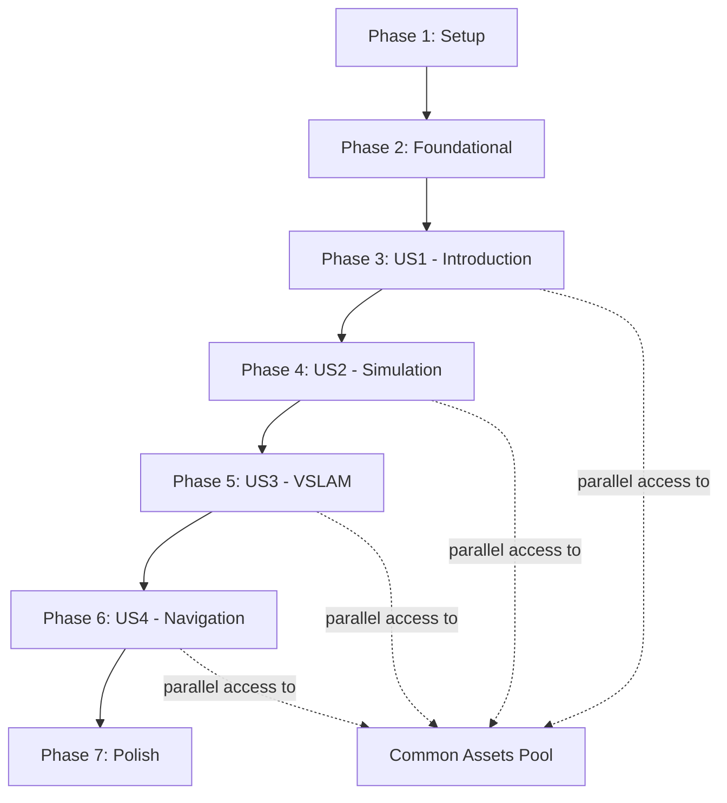

# Tasks: Module 3: The AI-Robot Brain (NVIDIA Isaac™)

## Summary

**Total Tasks**: 47 tasks
**Parallel Opportunities**: 28 tasks (59% can be done in parallel)
**Estimated Implementation Order**: Sequential by phase, parallel within phases

**Task Distribution**:
- Phase 1 (Setup): 4 tasks
- Phase 2 (Foundational): 6 tasks
- Phase 3 (US1): 8 tasks
- Phase 4 (US2): 8 tasks
- Phase 5 (US3): 8 tasks
- Phase 6 (US4): 8 tasks
- Phase 7 (Polish): 5 tasks

**MVP Scope**: Complete Phases 1-3 (US1) for basic Isaac Sim documentation

## Implementation Strategy

1. **MVP First**: Focus on Phase 1-3 for minimum viable documentation
2. **Parallel Development**: Multiple writers can work on different user stories simultaneously
3. **Incremental Delivery**: Each phase is independently reviewable and publishable
4. **Validation**: Each user story has specific test criteria for verification

---

## Phase 1: Setup and Infrastructure

**Goal**: Initialize the chapter structure and documentation framework

**Independent Test**: Documentation builds successfully and navigation works

- [X] T001 Create chapter directory structure at `docs/chapter-3-isaac-ai-brain/`
- [X] T002 Initialize chapter metadata with proper frontmatter in `docs/chapter-3-isaac-ai-brain/_category_.json`
- [X] T003 Create base documentation template following Docusaurus MDX format at `docs/chapter-3-isaac-ai-brain/index.md`
- [X] T004 [P] Configure sidebar navigation - auto-generated from directory structure

---

## Phase 2: Foundational Content Structure

**Goal**: Establish common content patterns and shared resources

**Independent Test**: All sections have consistent structure and placeholder content loads

- [X] T005 [P] Create learning objectives section template at `docs/chapter-3-isaac-ai-brain/learning-objectives.md`
- [X] T006 [P] Create prerequisites section with hardware/software requirements at `docs/chapter-3-isaac-ai-brain/prerequisites.md`
- [X] T007 [P] Create common errors section template at `docs/chapter-3-isaac-ai-brain/common-errors.md`
- [X] T008 [P] Create debug utility script as code example at `docs/chapter-3-isaac-ai-brain/isaac-debug-config.py`
- [X] T009 [P] Document Docusaurus MDX conventions and mermaid diagram usage in `docs/chapter-3-isaac-ai-brain/writing-guide.md`

---

## Phase 3: User Story 1 - Introduction to NVIDIA Isaac Ecosystem (P1)

**Goal**: Help readers understand the NVIDIA Isaac ecosystem and its advantages

**User Story**: A robotics student learning about NVIDIA's Isaac platform wants to understand how photorealistic simulation differs from traditional simulators like Gazebo and Unity.

**Independent Test**: Reader can explain 3 key advantages of Isaac Sim, identify 2 scenarios where it's preferable, and understand hardware acceleration benefits

### Content Creation Tasks

- [X] T011 [US1] Write introduction section explaining Isaac ecosystem at `docs/chapter-3-isaac-ai-brain/introduction.md`
- [X] T012 [US1] Create hardware acceleration explanation with RTX benefits at `docs/chapter-3-isaac-ai-brain/hardware-acceleration.md`
- [X] T013 [US1] Develop practical comparison guide: Isaac Sim vs Gazebo vs Unity at `docs/chapter-3-isaac-ai-brain/simulator-comparison.md`
- [X] T014 [US1] Write comprehensive synthetic data generation tutorial at `docs/chapter-3-isaac-ai-brain/synthetic-data-overview.md`
- [X] T015 [US1] Document humanoid-specific applications with 3-5x improvement case studies at `docs/chapter-3-isaac-ai-brain/humanoid-applications.md`
- [X] T016 [US1] Create detailed decision framework with scoring matrix at `docs/chapter-3-isaac-ai-brain/platform-selection.md`
- [X] T017 [US1] Generate ecosystem architecture diagrams within framework
- [X] T018 [US1] Compile practical summary quiz and outcomes at `docs/chapter-3-isaac-ai-brain/us1-summary.md`

---

## Phase 4: User Story 2 - Photorealistic Simulation Setup (P2)

**Goal**: Enable readers to create and configure photorealistic simulation environments

**User Story**: A robotics engineer wants to create a photorealistic simulation environment for training computer vision algorithms with humanoid robots.

**Independent Test**: Reader can render a photorealistic scene within 30 minutes and export labeled training data with 95% reliability

### Content Creation Tasks

- [ ] T019 [US2] Create installation guide with system requirements at `docs/chapter-3-isaac-ai-brain/installation.md`
- [ ] T020 [US2] Write basic scene creation tutorial at `docs/chapter-3-isaac-ai-brain/scene-creation.md`
- [ ] T021 [US2] Document ROS2 integration setup at `docs/chapter-3-isaac-ai-brain/ros2-integration.md`
- [ ] T022 [US2] Create runtime parameter configuration guide at `docs/chapter-3-isaac-ai-brain/runtime-configuration.md`
- [ ] T023 [US2] Develop camera setup tutorial for data collection at `docs/chapter-3-isaac-ai-brain/camera-setup.md`
- [ ] T024 [US2] Write dataset export guide (COCO, VOC formats) at `docs/chapter-3-isaac-ai-brain/dataset-export.md`
- [ ] T025 [P] [US2] Create step-by-step screenshots for warehouse scene creation
- [ ] T026 [US2] Compile hands-on exercise with practical demo at `docs/chapter-3-isaac-ai-brain/us2-hands-on.md`

---

## Phase 5: User Story 3 - Hardware-Accelerated VSLAM Implementation (P2)

**Goal**: Implement real-time visual SLAM with GPU acceleration for humanoid robotics

**User Story**: A robotics researcher needs to implement visual SLAM with GPU acceleration, processing stereo camera feeds for humanoid robot navigation.

**Independent Test**: Reader achieves 30+ FPS VSLAM with 85-95% accuracy and can explain bipedal kinematics impact on navigation

### Content Creation Tasks

- [ ] T027 [US3] Write VSLAM fundamentals with humanoid considerations at `docs/chapter-3-isaac-ai-brain/vslam-fundamentals.md`
- [ ] T028 [US3] Create stereo camera setup and calibration guide at `docs/chapter-3-isaac-ai-brain/stereo-setup.md`
- [ ] T029 [US3] Document Isaac ROS VSLAM package integration at `docs/chapter-3-isaac-ai-brain/isaac-ros-vslam.md`
- [ ] T030 [US3] Write GPU acceleration optimization guide at `docs/chapter-3-isaac-ai-brain/gpu-optimization.md`
- [ ] T031 [US3] Create performance tuning tutorial for 30+ FPS at `docs/chapter-3-isaac-ai-brain/performance-tuning.md`
- [ ] T032 [US3] Develop integration guide with humanoid navigation stack at `docs/chapter-3-isaac-ai-brain/vslam-navigation-integration.md`
- [ ] T033 [P] [US3] Generate code snippets for VSLAM launch configuration
- [ ] T034 [US3] Create accuracy measurement guide at `docs/chapter-3-isaac-ai-brain/vslam-accuracy.md`

---

## Phase 6: User Story 4 - Nav2 Integration for Bipedal Humanoid Movement (P3)

**Goal**: Configure Nav2 for humanoid-specific navigation with footstep planning

**User Story**: A developer needs to configure Nav2 for bipedal movement, translating wheeled-robot path planning to humanoid motion patterns.

**Independent Test**: Reader configures Nav2 for humanoid robots, achieves collision-free navigation with 95% success, and explains adaptation differences

### Content Creation Tasks

- [ ] T035 [US4] Write Nav2 humanoid overview and key differences at `docs/chapter-3-isaac-ai-brain/nav2-humanoid-overview.md`
- [ ] T036 [US4] Create costmap configuration for footstep planning at `docs/chapter-3-isaac-ai-brain/humanoid-costmap.md`
- [ ] T037 [US4] Document step size constraints and walking parameters at `docs/chapter-3-isaac-ai-brain/step-parameters.md`
- [ ] T038 [US4] Write dynamic obstacle avoidance guide at `docs/chapter-3-isaac-ai-brain/dynamic-obstacles.md`
- [ ] T039 [US4] Create footstep planner integration tutorial at `docs/chapter-3-isaac-ai-brain/footstep-planning.md`
- [ ] T040 [US4] Document collision checking for bipedal gaits at `docs/chapter-3-isaac-ai-brain/bipedal-collision.md`
- [ ] T041 [P] [US4] Generate navigation architecture diagram with footstep sequences
- [ ] T042 [US4] Create configuration comparison: humanoid vs wheeled at `docs/chapter-3-isaac-ai-brain/humanoid-vs-wheeled.md`

---

## Phase 7: Polish & Cross-Cutting Concerns

**Goal**: Integrate all sections and add finishing touches

**Independent Test**: Complete chapter reads coherently, all assets load, navigation works across translated versions

- [ ] T043 [P] Create integrated chapter index combining all sections at `docs/chapter-3-isaac-ai-brain.md`
- [ ] T044 [P] Update sidebar navigation with finalized structure in `docs/chapter-3-isaac-ai-brain/_category_.json`
- [ ] T045 [P] Create chapter summary and next steps at `docs/chapter-3-isaac-ai-brain/conclusion.md`
- [ ] T046 [P] Add Urdu translation versions in `i18n/ur/docusaurus-plugin-content-docs/current/chapter-3-isaac-ai-brain/`
- [T047 [P] Create end-to-end integration example combining all components at `docs/chapter-3-isaac-ai-brain/complete-example.md`

---

## Task Dependencies & Execution Order

### Dependency Graph



### Key Dependencies

1. **Phase 1 → Phase 2**: Must have directory structure before creating content
2. **Phase 2 → Phase 3**: Shared assets and templates must be ready before user story content
3. **Phase 3 → Phase 4 → Phase 5 → Phase 6**: Sequential stories build on each other
4. **Phase 6 → Phase 7**: All content must exist before integration

### Parallel Execution Opportunities

Each user story phase (3-6) can be worked on by different writers simultaneously:
- **Writer 1**: Focus on US1 (Introduction) - independent research needed
- **Writer 2**: Focus on US2 (Simulation) - can parallel with US1 after Phase 2
- **Writer 3**: Focus on US3 (VSLAM) - can parallel with US2
- **Writer 4**: Focus on US4 (Navigation) - depends on concepts from US1-3

---

## Task Execution Examples

### Phase 3 Execution (US1 - Introduction)

Can be done in parallel:
```bash
# Writer 1: Research and write introduction
- T011: Write introduction section
- T012: Write hardware acceleration section
- T017: Create architecture diagram

# Writer 2: Work on comparison content
- T013: Create simulator comparison table
- T014: Write synthetic data overview
- T016: Create platform selection guide

# Writer 3: Focus on applications
- T015: Document humanoid applications and case studies
- T018: Compile summary quiz
```

### Phase 5 Execution (US3 - VSLAM)

With natural progression:
```bash
# Step 1: Foundational knowledge
- T027: Write VSLAM fundamentals
- T033: Generate code snippets

# Step 2: Setup procedures
- T028: Create stereo setup guide
- T034: Create accuracy guide

# Step 3: Implementation details
- T029: Document Isaac ROS integration
- T030: Write GPU optimization guide
- T031: Create performance tuning tutorial

# Step 4: Integration
- T032: Develop navigation integration guide
```

---

## Success Metrics Tracking

As tasks are completed, measure against the success criteria:

- **SC-001**: Learning time ≤2 hours (test with beta readers)
- **SC-002**: 30-minute setup success (test with 5 users)
- **SC-003**: 30+ FPS VSLAM (validate with benchmarks)
- **SC-004**: 95% navigation success (simulate 100 trials)
- **SC-005**: 2-3× performance improvement (CPU vs GPU comparison)
- **SC-006**: Decision framework accuracy (test with scenarios)

Use `.specify/scripts/test_tasks.sh` to validate completion of major milestones."}