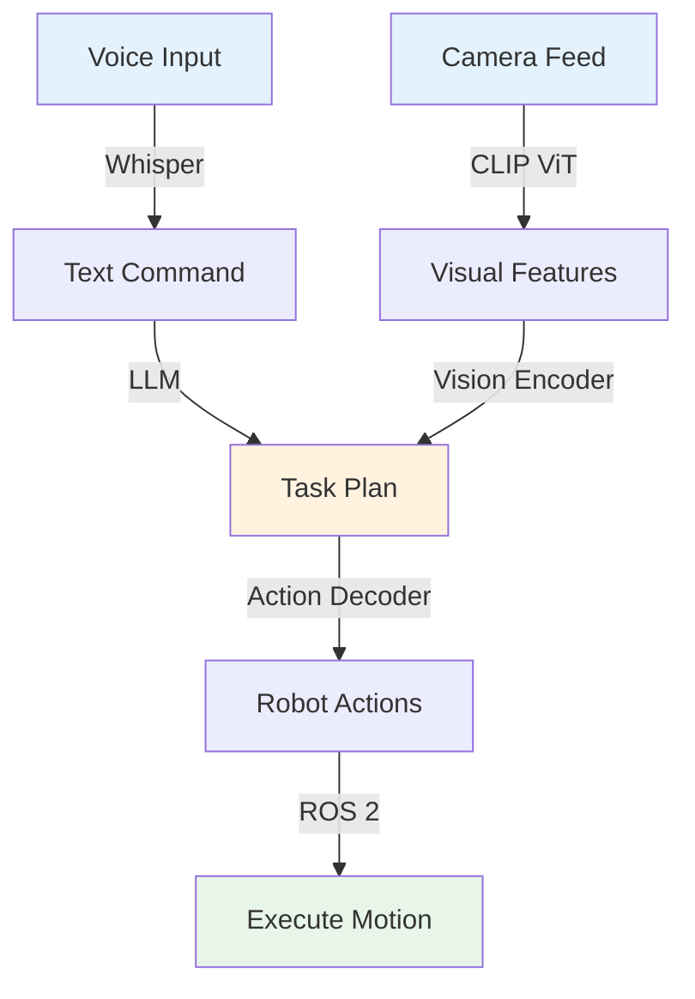
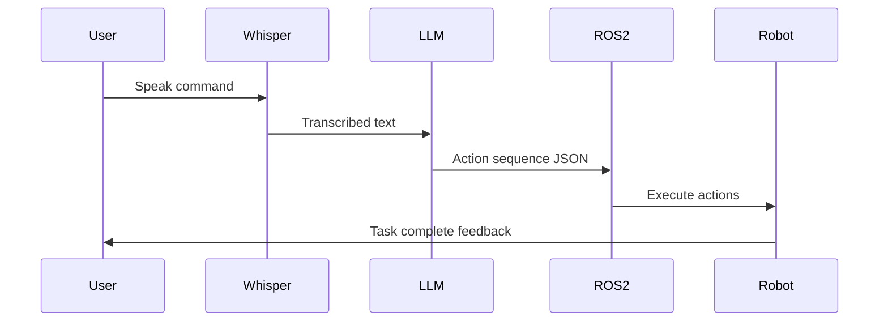
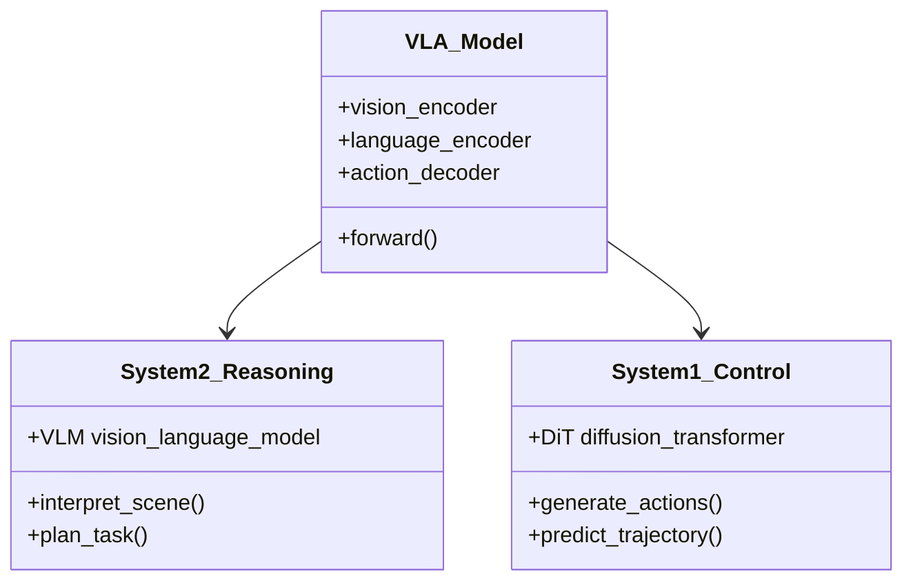

# Data Model: VLA Module Content Structure

**Feature**: 008-vla-module | **Date**: 2025-12-09  
**Purpose**: Define the content entities, structure, and schemas for the VLA chapter

## Content Entities

### 1. Chapter (Main Index)

**File**: `docs/chapter-4-vla/index.md`

**Schema**:
```typescript
interface ChapterIndex {
  frontmatter: {
    id: string;                    // "chapter-4-vla"
    title: string;                 // "Chapter 4: Vision-Language-Action Models"
    sidebar_label: string;         // "VLA Models"
    sidebar_position: number;      // 4
    sidebar_custom_props: {
      difficulty: "Intermediate" | "Advanced";
      readingTime: string;         // "15 minutes" (overview only)
    };
  };
  content: {
    overview: string;              // What this chapter teaches
    why_matters: string;           // Real-world relevance
    prerequisites: string[];       // Links to Chapter 1-3
    learning_path: string;         // How sub-chapters connect
    sub_chapters: SubChapterLink[];
  };
}

interface SubChapterLink {
  number: string;                  // "4.1", "4.2", etc.
  title: string;
  description: string;
  readingTime: string;
  hasQuickStart: boolean;
}
```

**Example**:
```yaml
---
id: chapter-4-vla
title: "Chapter 4: Vision-Language-Action Models"
sidebar_label: "VLA Models"
sidebar_position: 4
sidebar_custom_props:
  difficulty: "Intermediate"
  readingTime: "15 minutes"
---

# Chapter 4: Vision-Language-Action Models

Discover how foundation models enable robots to see, understand language, and take action...
```

---

### 2. Sub-Chapter

**Files**: `01-vla-introduction.md`, `02-voice-to-action.md`, etc.

**Schema**:
```typescript
interface SubChapter {
  frontmatter: {
    id: string;                    // "vla-introduction"
    title: string;                 // "4.1 Introduction to VLA Models"
    sidebar_label: string;         // "Introduction"
    sidebar_position: number;      // 1, 2, 3, 4, 5
    sidebar_custom_props: {
      difficulty: "Beginner" | "Intermediate" | "Advanced";
      readingTime: string;         // "12 minutes"
      hasQuickStart: boolean;
      prerequisites: string[];     // ["ROS 2 Fundamentals", "Isaac Sim"]
    };
  };
  content: {
    learning_objectives: LearningObjective[];
    prerequisites_detailed: PrerequisiteSection;
    main_content: Section[];
    code_examples: CodeExample[];
    diagrams: Diagram[];
    common_errors: ErrorGuide[];
    exercises: Exercise[];
    further_reading: Resource[];
  };
}

interface LearningObjective {
  id: string;
  text: string;                    // "Explain the dual-system VLA architecture"
  taxonomy_level: "understand" | "apply" | "analyze" | "create";
}

interface Section {
  heading_level: 2 | 3 | 4;
  title: string;
  content: string;                 // MDX content with markdown + React components
  subsections?: Section[];
}

interface CodeExample {
  id: string;
  language: "python" | "bash" | "yaml" | "json";
  title: string;
  description: string;
  code: string;
  file_path?: string;              // If standalone file
  runnable: boolean;               // Can students run this?
  expected_output?: string;
  version_constraints: {
    python?: string;               // ">=3.11,<3.12"
    ros2?: string;                 // "humble"
    packages: Record<string, string>;
  };
}

interface Diagram {
  type: "mermaid" | "image";
  title: string;
  content: string;                 // Mermaid code or image path
  caption: string;
  alt_text: string;                // For accessibility
  dark_mode_variant?: string;      // Optional dark theme version
}

interface ErrorGuide {
  error_type: string;              // "Audio not detected", "LLM timeout"
  symptoms: string[];
  causes: string[];
  solutions: string[];
  prevention: string;
}

interface Exercise {
  id: string;
  title: string;
  description: string;
  difficulty: "Easy" | "Medium" | "Hard";
  estimated_time: string;          // "30 minutes"
  starter_code?: string;
  hints: string[];
  solution_provided: boolean;
}

interface Resource {
  title: string;
  url: string;
  type: "paper" | "documentation" | "tutorial" | "video";
  description: string;
}
```

---

### 3. Quick Start Section

**Location**: Embedded in sub-chapter, signaled by special heading

**Schema**:
```typescript
interface QuickStart {
  parent_chapter: string;          // "02-voice-to-action.md"
  title: string;                   // "Quick Start: Voice Command in 15 Minutes"
  duration: string;                // "15 minutes"
  prerequisites: string[];
  steps: QuickStartStep[];
  expected_outcome: string;
  troubleshooting: string[];
}

interface QuickStartStep {
  step_number: number;
  title: string;
  command?: string;                // Shell command to run
  code?: string;                   // Code to write
  explanation: string;             // Why this step matters
  expected_result: string;
}
```

**Example**:
```mdx
## Quick Start: Voice Command Demo (15 Minutes)

Get a robot responding to voice commands in under 15 minutes.

### Step 1: Install Whisper
```bash
pip install openai-whisper
```
Expected: Package installs successfully, version >=20230314

### Step 2: Test Speech Recognition
```python
import whisper
model = whisper.load_model("small")
result = model.transcribe("test_audio.wav")
print(result["text"])
```
Expected: Prints transcribed text from audio file
```

---

### 4. Code Example Annotations

**Purpose**: Standardize how code examples are presented and validated

**Schema**:
```typescript
interface AnnotatedCodeExample {
  metadata: {
    id: string;
    file_path: string;             // For CI validation
    language: string;
    tested: boolean;               // CI validation status
    test_command?: string;         // How to run test
  };
  code: {
    imports: string[];             // Highlight dependencies
    main_logic: string;
    comments: CodeComment[];
  };
  context: {
    when_to_use: string;
    variations: string[];          // Alternative approaches
    gotchas: string[];             // Common mistakes
  };
}

interface CodeComment {
  line_number: number;
  type: "explanation" | "warning" | "tip" | "alternative";
  text: string;
}
```

**Example**:
```python
# VLA Voice Command Integration (Example ID: vla-voice-001)
# Tested: ✓ | Test: pytest tests/test_vla_voice.py

import whisper  # openai-whisper>=20230314
import rclpy     # ROS 2 Humble
from std_msgs.msg import String

class VoiceCommandNode(rclpy.node.Node):
    def __init__(self):
        super().__init__('voice_command_node')
        self.model = whisper.load_model("small")  # ⚠️ Downloads ~500MB on first run
        self.text_pub = self.create_publisher(String, '/voice/command', 10)
        self.get_logger().info("Voice command node ready")  # 💡 Check logs to confirm startup
    
    def transcribe_audio(self, audio_path):
        result = self.model.transcribe(audio_path, language='en')
        return result["text"]
```

---

### 5. Mermaid Diagrams

**Purpose**: Visualize VLA architectures, pipelines, data flows

**Schema**:
```typescript
interface MermaidDiagram {
  id: string;
  title: string;
  diagram_type: "flowchart" | "sequence" | "class" | "state" | "gantt";
  mermaid_code: string;
  theme: {
    light: string;                 // "neutral" | "default"
    dark: string;                  // "dark" | "forest"
  };
  accessibility: {
    alt_text: string;
    long_description?: string;     // For complex diagrams
  };
}
```

**Example Diagrams for VLA Chapter**:

1. **VLA Pipeline Architecture** (Flowchart)


2. **Voice-to-Action Sequence** (Sequence Diagram)


3. **Dual-System VLA Architecture** (Class Diagram)


---

## Content Organization Patterns

### Progressive Disclosure
Each sub-chapter follows this pattern:
1. **Hook** (30 seconds): Why this matters, real-world example
2. **Learning Objectives** (1 minute): What you'll achieve
3. **Prerequisites** (1 minute): What you need to know
4. **Quick Start** (15 minutes): Hands-on demo (if applicable)
5. **Deep Dive** (10-20 minutes): Theory, architecture, best practices
6. **Code Examples** (5-10 minutes): Practical implementations
7. **Common Errors** (3-5 minutes): Troubleshooting guide
8. **Exercises** (30-60 minutes): Practice problems
9. **Further Reading** (references): Research papers, advanced topics

### Code-to-Theory Ratio
- **Beginner sub-chapters** (4.1 Introduction): 30% code, 70% concepts
- **Intermediate sub-chapters** (4.2-4.4): 50% code, 50% concepts
- **Advanced sub-chapter** (4.5 Capstone): 70% code, 30% concepts

### Version Constraints (All Code Examples)
```yaml
versions:
  python: ">=3.11,<3.12"
  ros2: "humble"
  pytorch: ">=2.0,<3.0"
  openai-whisper: ">=20230314"
  transformers: ">=4.30"
  numpy: ">=1.24,<2.0"
  opencv-python: ">=4.8"
```

---

## Validation Rules

### Code Example Validation
- ✅ All Python code must pass `black` formatting
- ✅ All code must have type hints for public functions
- ✅ All imports must specify minimum versions in comments
- ✅ All code examples must include expected output
- ✅ Safety warnings for hardware-related code

### Diagram Validation
- ✅ All Mermaid diagrams must render without errors
- ✅ All diagrams must have alt text
- ✅ Complex diagrams must have long descriptions
- ✅ Diagrams must work in both light and dark modes

### Content Validation
- ✅ Reading time must match actual word count (200 words/minute)
- ✅ Learning objectives must use Bloom's taxonomy verbs
- ✅ Prerequisites must link to earlier chapters
- ✅ Common errors must have at least 3 solutions
- ✅ Exercises must have difficulty levels and time estimates

---

## File Naming Conventions

```
docs/chapter-4-vla/
├── index.md                          # Chapter overview
├── 01-vla-introduction.md            # Sub-chapter (two-digit prefix)
├── 02-voice-to-action.md
├── 03-cognitive-planning.md
├── 04-vision-integration.md
├── 05-capstone-project.md
├── _category_.json                   # Sidebar config
└── assets/
    ├── vla-pipeline.png              # kebab-case for images
    ├── voice-action-flow.png
    └── diagrams/
        └── [mermaid-only, no files]  # Mermaid embedded in MDX
```

### Frontmatter ID Convention
- Chapter: `chapter-4-vla`
- Sub-chapters: `vla-introduction`, `voice-to-action`, `cognitive-planning`, etc.
- Use kebab-case, descriptive, unique across entire book

---

## Relationships

```
Chapter 4 VLA
  ├── depends on → Chapter 1 (ROS 2 Fundamentals)
  ├── depends on → Chapter 2 (Simulation)
  ├── depends on → Chapter 3 (NVIDIA Isaac)
  ├── contains → Sub-chapter 4.1 (Introduction)
  ├── contains → Sub-chapter 4.2 (Voice-to-Action)
  ├── contains → Sub-chapter 4.3 (Cognitive Planning)
  ├── contains → Sub-chapter 4.4 (Vision Integration)
  └── contains → Sub-chapter 4.5 (Capstone Project)
      └── integrates → All previous sub-chapters
```

---

## Next Steps (Phase 1 Continued)

With data model defined:
1. Create `contracts/` directory with detailed outlines
2. Create `quickstart.md` with 15-minute demonstration
3. Update agent context with VLA-specific terminology
