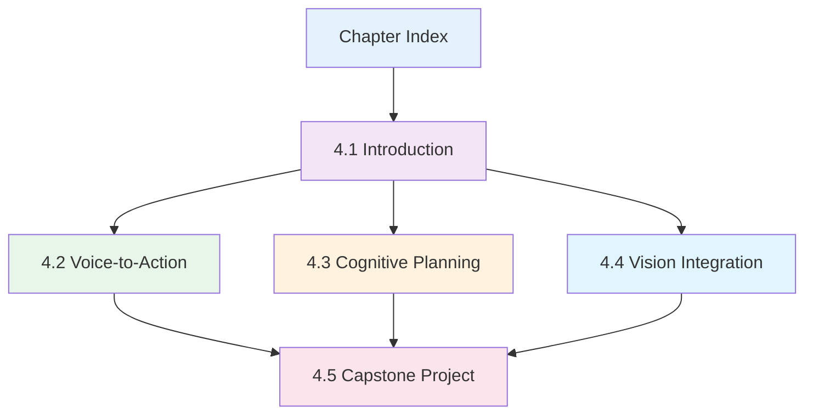

# Implementation Tasks: Vision-Language-Action (VLA) Module

**Feature**: 008-vla-module | **Branch**: `008-vla-module` | **Date**: 2025-12-09

---

## Overview

This document outlines implementation tasks for Chapter 4: Vision-Language-Action Models. The chapter consists of 5 sub-chapters (index + 4.1-4.5) with educational content teaching students how VLA models enable robots to understand language, perceive visually, and take actions.

**Project Type**: Documentation/Educational Content (MDX files for Docusaurus)  
**No traditional tests**: Educational content is validated through code example correctness and diagram rendering, not unit tests

---

## Implementation Strategy

**MVP Scope**: Complete Chapter 4.1 (Introduction) + Chapter 4.2 (Voice-to-Action) as minimum viable content  
**Incremental Delivery**: Each sub-chapter is independently valuable and can be published separately  
**Validation**: Code examples must run correctly, Mermaid diagrams must render, content must meet accessibility standards

---

## User Story Mapping (Educational Content)

| Content Piece | Priority | Maps To | Independent Test |
|---------------|----------|---------|------------------|
| Chapter Index (overview) | P0 | Foundation | Renders correctly, links work |
| 4.1 Introduction to VLA | P1 | US1 (Voice) foundation | Diagrams render, code examples valid |
| 4.2 Voice-to-Action | P1 | US1 (Voice Command Recognition) | Quick Start runs, code examples work |
| 4.3 Cognitive Planning | P1 | US2 (LLM Planning) | Quick Start runs, validation examples work |
| 4.4 Vision Integration | P2 | US4 (Computer Vision) | Code examples run, 3D localization explained |
| 4.5 Capstone Project | P3 | US6 (End-to-End Integration) | Integration code complete, evaluation guide provided |

**Note**: User Stories 3 (Navigation) and 5 (Manipulation) are covered within sub-chapters 4.3-4.5 as integrated topics rather than standalone content pieces, as they rely on prior VLA concepts.

---

## Phase 1: Setup & Structure

**Goal**: Create directory structure, configure Docusaurus, prepare chapter infrastructure

**Success Criteria**:
- ✅ Directory `docs/chapter-4-vla/` exists with proper structure
- ✅ Sidebar configuration (`_category_.json`) created
- ✅ Mermaid support verified in Docusaurus config
- ✅ All file paths align with plan.md structure

### Tasks

- [X] T001 Create chapter directory structure in docs/chapter-4-vla/
- [X] T002 Create sidebar configuration file docs/chapter-4-vla/_category_.json
- [X] T003 [P] Verify Mermaid support in docusaurus.config.ts (markdown.mermaid: true)
- [X] T004 [P] Create assets directory docs/chapter-4-vla/assets/ for images (if needed)
- [X] T005 [P] Create placeholder .gitkeep files to preserve directory structure

---

## Phase 2: Chapter Index (Foundation)

**Goal**: Create chapter landing page (index.md) that introduces VLA concepts and provides navigation

**Success Criteria**:
- ✅ index.md renders correctly with proper frontmatter
- ✅ Learning objectives clearly stated (5 chapter-level objectives)
- ✅ Mermaid diagram showing sub-chapter progression renders
- ✅ Prerequisites section links to Chapters 1-3
- ✅ Roadmap describes all 5 sub-chapters with time estimates

### Tasks

- [X] T006 Create docs/chapter-4-vla/index.md with frontmatter (id, title, sidebar_label, sidebar_position, difficulty, readingTime)
- [X] T007 Write "Why VLA Matters" section with Physical Intelligence π0.6 dishwasher example in docs/chapter-4-vla/index.md
- [X] T008 Write chapter-level learning objectives (5 objectives using Bloom's taxonomy) in docs/chapter-4-vla/index.md
- [X] T009 Create "Learning Path" Mermaid diagram showing progression (4.1 → 4.2 → 4.3 → 4.4 → 4.5) in docs/chapter-4-vla/index.md
- [X] T010 Write prerequisites section with links to /docs/ros2-fundamentals/, /docs/module-2-digital-twin/, /docs/chapter-3-isaac-ai-brain/ in docs/chapter-4-vla/index.md
- [X] T011 Write chapter roadmap describing each sub-chapter (4.1-4.5) with reading time estimates in docs/chapter-4-vla/index.md
- [X] T012 Add "Next Steps" section linking to sub-chapter 4.1 in docs/chapter-4-vla/index.md

---

## Phase 3: Sub-chapter 4.1 - Introduction to VLA Models

**Goal**: Create conceptual foundation explaining VLA architecture, dual-system design, and state-of-the-art models

**Success Criteria**:
- ✅ File renders with proper frontmatter (Beginner difficulty, 12 min reading time)
- ✅ Learning objectives stated (4 objectives: Define, Identify, Explain, Compare)
- ✅ 2 Mermaid diagrams render correctly (VLA Pipeline, Dual-System Architecture)
- ✅ 2 code examples are syntactically valid (pseudo-code VLA forward pass, PyTorch model loading)
- ✅ State-of-the-art comparison table includes GR00T N1.5, OpenVLA, π0.6
- ✅ Exercises section provides 3 activities (diagram labeling, comparison table, research)

### Tasks

- [X] T013 Create docs/chapter-4-vla/01-vla-introduction.md with frontmatter (id: vla-introduction, difficulty: Beginner, readingTime: "12 minutes")
- [X] T014 Write learning objectives section (4 objectives) in docs/chapter-4-vla/01-vla-introduction.md
- [X] T015 Write "What Are VLA Models?" section (3 min, ~600 words) in docs/chapter-4-vla/01-vla-introduction.md
- [X] T016 Write "The Three Pillars of VLA" section (4 min, ~800 words) in docs/chapter-4-vla/01-vla-introduction.md
- [X] T017 Create "VLA Pipeline Architecture" Mermaid flowchart diagram in docs/chapter-4-vla/01-vla-introduction.md
- [X] T018 Write "Dual-System Architecture" section (3 min, ~600 words) in docs/chapter-4-vla/01-vla-introduction.md
- [X] T019 Create "Dual-System Class Diagram" Mermaid class diagram showing System 1 (Control) and System 2 (Reasoning) in docs/chapter-4-vla/01-vla-introduction.md
- [X] T020 Write "State-of-the-Art VLA Models" section (2 min, ~400 words) with comparison table (GR00T N1.5, OpenVLA, π0.6) in docs/chapter-4-vla/01-vla-introduction.md
- [X] T021 Add conceptual VLA forward pass code example (Python pseudo-code, 15 lines) in docs/chapter-4-vla/01-vla-introduction.md
- [X] T022 Add PyTorch VLA model loading code example (Python, 10 lines) in docs/chapter-4-vla/01-vla-introduction.md
- [X] T023 Write exercises section (3 exercises: diagram labeling, comparison table, research) in docs/chapter-4-vla/01-vla-introduction.md
- [X] T024 Add "Further Reading" section with 3 resources (GR00T report, OpenVLA repo, VLA survey paper) in docs/chapter-4-vla/01-vla-introduction.md

---

## Phase 4: Sub-chapter 4.2 - Voice-to-Action with OpenAI Whisper

**Goal**: Teach Whisper integration with ROS 2, create hands-on Quick Start demonstration

**Success Criteria**:
- ✅ File renders with proper frontmatter (Intermediate difficulty, 15 min reading time, hasQuickStart: true)
- ✅ Learning objectives stated (4 objectives: Implement, Select, Apply, Debug)
- ✅ Quick Start section provides complete 15-minute demo with 5 steps
- ✅ 4 code examples are syntactically valid and runnable (Whisper test, ROS 2 node, preprocessing, launch file)
- ✅ 2 Mermaid diagrams render (Voice-to-Action sequence, Audio pipeline flowchart)
- ✅ Common errors section addresses 4 issues with solutions
- ✅ 3 exercises with difficulty levels (Easy, Medium, Hard)

### Tasks

- [X] T025 Create docs/chapter-4-vla/02-voice-to-action.md with frontmatter (id: voice-to-action, difficulty: Intermediate, readingTime: "15 minutes", hasQuickStart: true)
- [X] T026 Write learning objectives section (4 objectives) in docs/chapter-4-vla/02-voice-to-action.md
- [X] T027 Write "Quick Start: Voice Command Demo" section (15 min guide, 5 steps) in docs/chapter-4-vla/02-voice-to-action.md
- [X] T028 Write "Speech Recognition Fundamentals" section (3 min, ~600 words) in docs/chapter-4-vla/02-voice-to-action.md
- [X] T029 Write "Whisper Model Selection for Robotics" section (2 min, ~400 words) with benchmarks table in docs/chapter-4-vla/02-voice-to-action.md
- [X] T030 Write "ROS 2 Integration Pattern" section (5 min, ~1000 words) in docs/chapter-4-vla/02-voice-to-action.md
- [X] T031 Create "Voice-to-Action Sequence Diagram" Mermaid diagram (User → Whisper → LLM → ROS2 → Robot) in docs/chapter-4-vla/02-voice-to-action.md
- [X] T032 Create "Audio Processing Pipeline" Mermaid flowchart diagram in docs/chapter-4-vla/02-voice-to-action.md
- [X] T033 Add Whisper standalone test code example (Python, 15 lines) in docs/chapter-4-vla/02-voice-to-action.md
- [X] T034 Add ROS 2 WhisperVoiceNode complete implementation (Python, 50 lines) in docs/chapter-4-vla/02-voice-to-action.md
- [X] T035 Add audio preprocessing helper code example (Python, 20 lines) in docs/chapter-4-vla/02-voice-to-action.md
- [X] T036 Add ROS 2 launch file configuration (YAML, 10 lines) in docs/chapter-4-vla/02-voice-to-action.md
- [X] T037 Write "Audio Preprocessing & Optimization" section (3 min, ~600 words) with VAD, noise reduction in docs/chapter-4-vla/02-voice-to-action.md
- [X] T038 Write "Performance Tuning" section (2 min, ~400 words) with GPU setup, caching in docs/chapter-4-vla/02-voice-to-action.md
- [X] T039 Write "Common Errors" section with 4 issues and solutions (audio device, transcription quality, latency, noise) in docs/chapter-4-vla/02-voice-to-action.md
- [X] T040 Write exercises section (3 exercises: model swap, confidence filtering, wake word) with difficulty levels in docs/chapter-4-vla/02-voice-to-action.md
- [X] T041 Add "Further Reading" section with 3 resources (Whisper paper, audio_common docs, VAD algorithms) in docs/chapter-4-vla/02-voice-to-action.md

---

## Phase 5: Sub-chapter 4.3 - Cognitive Planning with LLMs

**Goal**: Teach LLM-based planning, function calling, schema validation, and feedback loops

**Success Criteria**:
- ✅ File renders with proper frontmatter (Intermediate difficulty, 18 min reading time, hasQuickStart: true)
- ✅ Learning objectives stated (4 objectives: Implement, Validate, Design, Apply)
- ✅ Quick Start section provides "Pick Up Cup" demo (15 minutes, 5 steps)
- ✅ 5 code examples are syntactically valid (function calling, Pydantic models, planning node, feedback loop, safety validator)
- ✅ 2 Mermaid diagrams render (LLM Planning Pipeline, Error Recovery Feedback Loop)
- ✅ Common errors section addresses 4 issues (invalid JSON, impossible actions, timeout, infinite loop)
- ✅ 3 exercises with difficulty levels

### Tasks

- [X] T042 Create docs/chapter-4-vla/03-cognitive-planning.md with frontmatter (id: cognitive-planning, difficulty: Intermediate, readingTime: "18 minutes", hasQuickStart: true)
- [X] T043 Write learning objectives section (4 objectives) in docs/chapter-4-vla/03-cognitive-planning.md
- [X] T044 Write "Quick Start: Pick Up Cup Planning" section (15 min guide, 5 steps) in docs/chapter-4-vla/03-cognitive-planning.md
- [X] T045 Write "LLM Planning Fundamentals" section (3 min, ~600 words) in docs/chapter-4-vla/03-cognitive-planning.md
- [X] T046 Write "Function Calling Pattern" section (5 min, ~1000 words) in docs/chapter-4-vla/03-cognitive-planning.md
- [X] T047 Create "LLM Planning Pipeline" Mermaid flowchart diagram in docs/chapter-4-vla/03-cognitive-planning.md
- [X] T048 Create "Error Recovery Feedback Loop" Mermaid sequence diagram in docs/chapter-4-vla/03-cognitive-planning.md
- [X] T049 Add function calling setup code example (Python, 30 lines) with OpenAI API in docs/chapter-4-vla/03-cognitive-planning.md
- [X] T050 Add Pydantic validation models code example (Python, 40 lines) with RobotAction and TaskPlan schemas in docs/chapter-4-vla/03-cognitive-planning.md
- [X] T051 Add planning node with LLM integration (Python, 60 lines) in docs/chapter-4-vla/03-cognitive-planning.md
- [X] T052 Add feedback loop implementation code example (Python, 25 lines) for error recovery in docs/chapter-4-vla/03-cognitive-planning.md
- [X] T053 Add safety validator code example (Python, 20 lines) with constraint checking in docs/chapter-4-vla/03-cognitive-planning.md
- [X] T054 Write "Schema Validation with Pydantic" section (4 min, ~800 words) in docs/chapter-4-vla/03-cognitive-planning.md
- [X] T055 Write "Feedback Loops for Error Recovery" section (4 min, ~800 words) in docs/chapter-4-vla/03-cognitive-planning.md
- [X] T056 Write "Safety Constraints & Validation" section (2 min, ~400 words) in docs/chapter-4-vla/03-cognitive-planning.md
- [X] T057 Write "Common Errors" section with 4 issues and solutions (JSON parsing, impossible actions, timeout, infinite loop) in docs/chapter-4-vla/03-cognitive-planning.md
- [X] T058 Write exercises section (3 exercises: add function, multi-step planning, state machine) with difficulty levels in docs/chapter-4-vla/03-cognitive-planning.md
- [X] T059 Add "Further Reading" section with 3 resources (OpenAI function calling, Pydantic docs, LLM planning survey) in docs/chapter-4-vla/03-cognitive-planning.md

---

## Phase 6: Sub-chapter 4.4 - Vision Integration & Object Detection

**Goal**: Teach vision backbone integration (CLIP, PaliGemma), ROS 2 camera processing, multimodal fusion

**Success Criteria**:
- ✅ File renders with proper frontmatter (Intermediate difficulty, 16 min reading time)
- ✅ Learning objectives stated (4 objectives: Integrate, Process, Implement, Combine)
- ✅ 4 code examples are syntactically valid (CLIP encoder, ROS 2 vision node, object detection, 3D localization)
- ✅ 3 Mermaid diagrams render (Vision Pipeline, Multimodal Fusion, 3D Localization)
- ✅ Common errors section addresses 4 vision-specific issues
- ✅ 3 exercises with difficulty levels

### Tasks

- [X] T060 Create docs/chapter-4-vla/04-vision-integration.md with frontmatter (id: vision-integration, difficulty: Intermediate, readingTime: "16 minutes")
- [X] T061 Write learning objectives section (4 objectives) in docs/chapter-4-vla/04-vision-integration.md
- [X] T062 Write "Vision Backbones in VLA Models" section (4 min, ~800 words) comparing CLIP, PaliGemma, Grounded-SAM2 in docs/chapter-4-vla/04-vision-integration.md
- [X] T063 Write "ROS 2 Camera Integration" section (4 min, ~800 words) with cv_bridge usage in docs/chapter-4-vla/04-vision-integration.md
- [X] T064 Create "Vision Processing Pipeline" Mermaid flowchart diagram in docs/chapter-4-vla/04-vision-integration.md
- [X] T065 Create "Multimodal Fusion Architecture" Mermaid flowchart diagram showing vision + language fusion in docs/chapter-4-vla/04-vision-integration.md
- [X] T066 Create "3D Localization from Depth" Mermaid flowchart diagram in docs/chapter-4-vla/04-vision-integration.md
- [X] T067 Add CLIP vision encoder code example (Python, 25 lines) in docs/chapter-4-vla/04-vision-integration.md
- [X] T068 Add ROS 2 vision node implementation (Python, 50 lines) with camera subscription in docs/chapter-4-vla/04-vision-integration.md
- [X] T069 Add object detection integration code example (Python, 40 lines) in docs/chapter-4-vla/04-vision-integration.md
- [X] T070 Add 3D localization helper code example (Python, 30 lines) using depth + intrinsics in docs/chapter-4-vla/04-vision-integration.md
- [X] T071 Write "Object Detection for Manipulation" section (4 min, ~800 words) in docs/chapter-4-vla/04-vision-integration.md
- [X] T072 Write "Multimodal Fusion" section (4 min, ~800 words) with cross-attention explanation in docs/chapter-4-vla/04-vision-integration.md
- [X] T073 Write "Common Errors" section with 4 issues (no detection, noisy depth, vision latency, calibration errors) in docs/chapter-4-vla/04-vision-integration.md
- [X] T074 Write exercises section (3 exercises: model swap, color filtering, Kalman tracking) with difficulty levels in docs/chapter-4-vla/04-vision-integration.md
- [X] T075 Add "Further Reading" section with 3 resources (CLIP paper, PaliGemma docs, ROS 2 vision_opencv) in docs/chapter-4-vla/04-vision-integration.md

---

## Phase 7: Sub-chapter 4.5 - Capstone Project: Autonomous Humanoid

**Goal**: Guide end-to-end VLA integration, fine-tuning, deployment, and evaluation

**Success Criteria**:
- ✅ File renders with proper frontmatter (Advanced difficulty, 25 min reading time + 4-6 hours hands-on)
- ✅ Learning objectives stated (5 objectives: Integrate, Fine-tune, Deploy, Evaluate, Troubleshoot)
- ✅ Project phases clearly defined (5 phases from architecture to optimization)
- ✅ 4 code examples are complete (orchestration node, fine-tuning script, evaluation harness, launch file)
- ✅ 3 Mermaid diagrams render (System Architecture, State Machine, Deployment Pipeline)
- ✅ Common errors section addresses 4 integration issues
- ✅ Project deliverables section lists student submission requirements
- ✅ Grading rubric provided (code quality, integration, performance, documentation)

### Tasks

- [X] T076 Create docs/chapter-4-vla/05-capstone-project.md with frontmatter (id: capstone-project, difficulty: Advanced, readingTime: "25 minutes")
- [X] T077 Write learning objectives section (5 objectives) in docs/chapter-4-vla/05-capstone-project.md
- [X] T078 Write "Project Overview" section (2 min, ~400 words) with goal, components, timeline in docs/chapter-4-vla/05-capstone-project.md
- [X] T079 Write "Phase 1: System Architecture Design" section (3 min, ~600 words) in docs/chapter-4-vla/05-capstone-project.md
- [X] T080 Create "Complete System Architecture" Mermaid flowchart diagram showing all VLA components in docs/chapter-4-vla/05-capstone-project.md
- [X] T081 Write "Phase 2: Integration Strategy" section (5 min, ~1000 words) with incremental integration in docs/chapter-4-vla/05-capstone-project.md
- [X] T082 Create "Integration State Machine" Mermaid state diagram in docs/chapter-4-vla/05-capstone-project.md
- [X] T083 Write "Phase 3: Fine-tuning VLA on Custom Task" section (6 min, ~1200 words) in docs/chapter-4-vla/05-capstone-project.md
- [X] T084 Create "Deployment Pipeline" Mermaid sequence diagram in docs/chapter-4-vla/05-capstone-project.md
- [X] T085 Add master orchestration node code example (Python, 100 lines) in docs/chapter-4-vla/05-capstone-project.md
- [X] T086 Add fine-tuning script code example (Python, 80 lines) for GR00T N1.5 in docs/chapter-4-vla/05-capstone-project.md
- [X] T087 Add evaluation harness code example (Python, 60 lines) with metrics calculation in docs/chapter-4-vla/05-capstone-project.md
- [X] T088 Add complete launch file (YAML, 40 lines) integrating all nodes in docs/chapter-4-vla/05-capstone-project.md
- [X] T089 Write "Phase 4: Deployment & Testing" section (5 min, ~1000 words) in docs/chapter-4-vla/05-capstone-project.md
- [X] T090 Write "Phase 5: Troubleshooting & Optimization" section (4 min, ~800 words) in docs/chapter-4-vla/05-capstone-project.md
- [X] T091 Write "Common Errors" section with 4 integration issues (system hangs, overfitting, inconsistent success, latency budget) in docs/chapter-4-vla/05-capstone-project.md
- [X] T092 Write exercises section (3 exercises: sorting task, multi-robot coordination, real hardware deployment) in docs/chapter-4-vla/05-capstone-project.md
- [X] T093 Write "Project Deliverables" section listing 4 submission requirements (video, code repo, performance report, lessons learned) in docs/chapter-4-vla/05-capstone-project.md
- [X] T094 Add grading rubric table (code quality 30%, integration 25%, performance 25%, documentation 20%) in docs/chapter-4-vla/05-capstone-project.md
- [X] T095 Add "Further Reading" section with 3 resources (GR00T fine-tuning, ROS 2 best practices, VLA deployment cases) in docs/chapter-4-vla/05-capstone-project.md

---

## Phase 8: Polish & Cross-Cutting Concerns

**Goal**: Finalize chapter, ensure consistency, validate all technical content

**Success Criteria**:
- ✅ All Mermaid diagrams render in both light and dark modes
- ✅ All code examples are syntactically correct and follow style guide
- ✅ All internal links work correctly
- ✅ Reading time estimates match actual word counts
- ✅ Accessibility standards met (WCAG AA)
- ✅ Version constraints clearly stated in code comments

### Tasks

- [ ] T096 [P] Validate all Mermaid diagrams render without errors in light mode across all 5 sub-chapters
- [ ] T097 [P] Validate all Mermaid diagrams render without errors in dark mode across all 5 sub-chapters
- [ ] T098 [P] Run Python syntax check on all embedded code examples (black --check, flake8)
- [ ] T099 [P] Verify all internal links work (links to /docs/ros2-fundamentals/, /docs/module-2-digital-twin/, /docs/chapter-3-isaac-ai-brain/)
- [ ] T100 [P] Calculate actual reading times based on word counts (200 words/min) and update frontmatter if needed
- [ ] T101 [P] Add alt text to all Mermaid diagrams for accessibility
- [ ] T102 [P] Verify proper heading hierarchy (h1 → h2 → h3, no skips) in all sub-chapters
- [ ] T103 [P] Add version constraint comments to all code examples (# Python 3.11+, # PyTorch 2.x, # ROS 2 Humble)
- [ ] T104 Proofread all content for technical accuracy and clarity
- [ ] T105 Create chapter-level README.md in docs/chapter-4-vla/ explaining structure and contribution guidelines
- [ ] T106 Update main book README or documentation with Chapter 4 addition

---

## Dependencies & Execution Order

### User Story Dependencies (Content Pieces)



**Blocking Dependencies**:
- Phase 1 (Setup) must complete before all other phases
- Phase 2 (Index) must complete before Phase 3 (4.1)
- Phase 3 (4.1) provides conceptual foundation for Phases 4-7
- Phases 4, 5, 6 (sub-chapters 4.2-4.4) are independent and can be written in parallel
- Phase 7 (4.5 Capstone) depends on completion of Phases 4, 5, 6
- Phase 8 (Polish) should run after all content phases complete

### Parallel Execution Opportunities

**Phase 1 (Setup)**: All tasks T001-T005 can run in parallel (marked [P])

**Phase 2 (Index)**: Tasks T006-T012 are sequential (building document incrementally)

**Phase 3 (4.1 Introduction)**: Tasks T013-T024 are sequential

**Phase 4 (4.2 Voice)**: Tasks T025-T041 are sequential

**Phase 5 (4.3 Planning)**: Tasks T042-T059 are sequential

**Phase 6 (4.4 Vision)**: Tasks T060-T075 are sequential

**Phase 7 (4.5 Capstone)**: Tasks T076-T095 are sequential

**Phase 8 (Polish)**: Tasks T096-T103 can run in parallel (marked [P]), T104-T106 are sequential

**Maximum Parallelism**:
- After Phase 2 completes, Phases 3-6 can run in parallel (4 parallel streams)
- Within Phase 8, up to 8 tasks can run in parallel (T096-T103)

---

## Validation Checklist

Before marking chapter complete, verify:

### Content Quality
- [ ] All 5 sub-chapters have proper frontmatter with accurate metadata
- [ ] All learning objectives use Bloom's taxonomy verbs (Define, Explain, Implement, Apply, etc.)
- [ ] Prerequisites section in index.md links to correct earlier chapters
- [ ] Reading time estimates are accurate (±2 minutes of 200 words/min calculation)
- [ ] All sub-chapters follow consistent structure (objectives → content → diagrams → code → errors → exercises → reading)

### Technical Accuracy
- [ ] All code examples are syntactically valid Python 3.11+
- [ ] All code examples include version constraints in comments
- [ ] ROS 2 Humble specific features/APIs used correctly
- [ ] OpenAI Whisper API usage is current (as of Dec 2025)
- [ ] VLA model references (GR00T N1.5, OpenVLA, π0.6) are accurate
- [ ] No hardcoded secrets or API keys in code examples

### Visual Elements
- [ ] All 12 Mermaid diagrams render without errors
- [ ] Diagrams work in both light and dark themes
- [ ] All diagrams have descriptive titles and alt text
- [ ] Code blocks have proper syntax highlighting (```python, ```yaml, ```bash)
- [ ] Tables are properly formatted with headers and alignment

### Accessibility
- [ ] Proper heading hierarchy (no h1→h3 jumps)
- [ ] All code blocks have language identifiers for screen readers
- [ ] Color contrast meets WCAG AA standards
- [ ] Alt text provided for all non-text content
- [ ] Links have descriptive text (not "click here")

### Navigation
- [ ] Sidebar configuration (_category_.json) is correct
- [ ] All internal links work (../ros2-fundamentals/, ../chapter-3-isaac-ai-brain/)
- [ ] "Next Steps" or navigation links at end of each sub-chapter
- [ ] Breadcrumb navigation functional
- [ ] Search includes all new content

### Educational Value
- [ ] Quick Starts are truly completable in 15 minutes
- [ ] Exercises have clear difficulty levels (Easy/Medium/Hard)
- [ ] Common Errors section addresses real student pain points
- [ ] Code examples are copy-pasteable and runnable
- [ ] Capstone project has clear deliverables and grading rubric

---

## Task Summary

**Total Tasks**: 106  
**Setup/Infrastructure**: 5 tasks (T001-T005)  
**Chapter Index**: 7 tasks (T006-T012)  
**Sub-chapter 4.1**: 12 tasks (T013-T024)  
**Sub-chapter 4.2**: 17 tasks (T025-T041)  
**Sub-chapter 4.3**: 18 tasks (T042-T059)  
**Sub-chapter 4.4**: 16 tasks (T060-T075)  
**Sub-chapter 4.5**: 20 tasks (T076-T095)  
**Polish**: 11 tasks (T096-T106)

**Parallelizable Tasks**: 13 (marked with [P])  
**Sequential Tasks**: 93

**Estimated Effort**:
- Setup & Index: 3-4 hours
- Sub-chapter 4.1: 4-5 hours
- Sub-chapter 4.2: 6-7 hours
- Sub-chapter 4.3: 7-8 hours
- Sub-chapter 4.4: 6-7 hours
- Sub-chapter 4.5: 8-10 hours
- Polish & Validation: 3-4 hours
- **Total**: 37-45 hours

**MVP Scope** (Minimum Viable Product):
- Phase 1: Setup (T001-T005)
- Phase 2: Index (T006-T012)
- Phase 3: Sub-chapter 4.1 (T013-T024)
- Phase 4: Sub-chapter 4.2 (T025-T041)
- **MVP Total**: 41 tasks, ~16-18 hours

This provides students with foundational VLA concepts (4.1) and hands-on voice command implementation (4.2), delivering immediate educational value.

---

## Notes

- **No automated tests**: Educational content validation happens through manual review, code example execution, and Mermaid rendering
- **Content-first approach**: Write content incrementally, validate as you go
- **Reusable patterns**: Sub-chapters 4.2-4.5 follow similar structure (objectives → quick start → sections → diagrams → code → errors → exercises → reading)
- **Version pinning critical**: All code examples must specify Python 3.11+, ROS 2 Humble, PyTorch 2.x to prevent future breakage
- **Accessibility non-negotiable**: WCAG AA compliance required for all content
- **Independent value**: Each sub-chapter should be independently useful; students can learn 4.2 (Voice) without completing 4.3 (Planning)

---

**Generated**: 2025-12-09  
**Ready for**: Implementation via `/sp.implement` or manual task execution  
**Branch**: 008-vla-module
