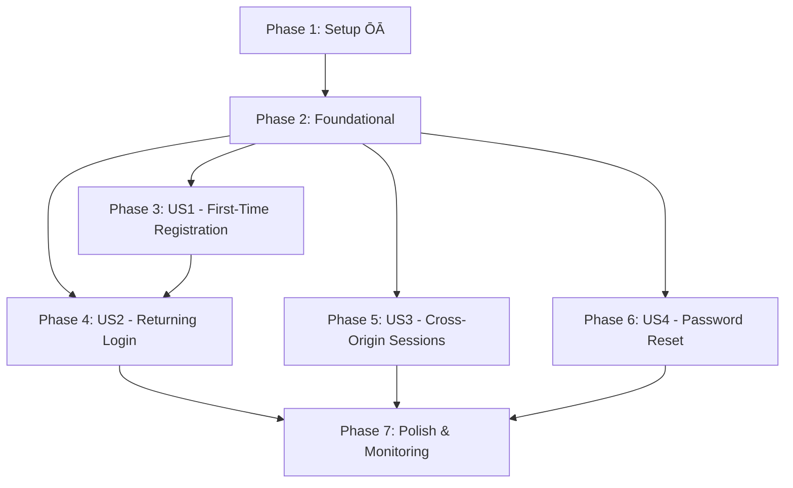

# Tasks: Better Auth Implementation with OAuth

**Branch**: `[009-better-auth-implementation]` | **Feature**: Better Auth Implementation with OAuth
**Date**: 2025-12-10 | **Status**: Ready for Implementation

## Implementation Overview

Build comprehensive authentication system using Better-Auth with Google/GitHub OAuth for the Physical AI textbook platform. Configure secure cross-origin sessions between GitHub Pages frontend and Vercel API backend. Implement user onboarding with expertise capture and progress tracking.

**Tech Stack**: TypeScript 5+, Next.js 14+ App Router, Better-Auth, Neon Postgres, Drizzle ORM, Redis rate limiting

**Testing**: 80% test coverage requirement for all API routes

## Dependencies & Execution Order

**User Story Dependencies**: Stories US1-US3 can be implemented partially in parallel after foundational setup. US2 requires US1 completion (user must exist to login). US4 is independent. All stories can complete testing independently.

---

## Phase 1: Setup

**Goal**: Initialize project infrastructure and dependencies

- [ ] T001 Set up Next.js App Router project structure in `api/` directory
- [ ] T002 Initialize TypeScript configuration with strict mode in `api/tsconfig.json`
- [ ] T003 Install core dependencies: `better-auth`, `drizzle-orm`, `@neondatabase/serverless`, `zod`, `upstash/redis`, `@types/node`
- [ ] T004 Set up package.json scripts for development, build, test, and DB migrations
- [ ] T005 Create Git ignore for API backend in `api/.gitignore`
- [ ] T006 Configure environment variables template in `api/.env.example`
- [ ] T007 Create Vercel configuration in `api/vercel.json`
- [ ] T008 Set up ESLint configuration for TypeScript in `api/.eslintrc.json`
- [ ] T009 Configure Prettier for code formatting in `api/.prettierrc.json`
- [ ] T010 Initialize empty directories: `api/src/lib/`, `api/src/app/`, `api/tests/`

---

## Phase 2: Foundational

**Goal**: Create shared infrastructure required by all user stories

- [ ] T011 Create database connection module in `api/src/lib/db.ts` with Neon
- [ ] T012 Implement Drizzle ORM configuration in `api/src/lib/drizzle.ts`
- [ ] T013 Define database schema enums in `api/src/lib/schema.ts` with python_level, ros_experience, hardware_access, learning_goals
- [ ] T014 Create User table schema in `api/src/lib/schema.ts` with all fields and indexes
- [ ] T015 Create Account table schema in `api/src/lib/schema.ts` for OAuth provider links
- [ ] T016 Create Session table schema in `api/src/lib/schema.ts` with security fields
- [ ] T017 Create UserProgress table schema in `api/src/lib/schema.ts` for tracking
- [ ] T018 Set up drizzle-kit configuration in `api/drizzle.config.ts`
- [ ] T019 Create database migration script in `api/package.json` with drizzle-kit
- [ ] T020 Configure Redis client for rate limiting in `api/src/lib/redis.ts`
- [ ] T021 Create environment variable validation in `api/src/lib/env.ts`
- [ ] T022 Define TypeScript types in `api/src/lib/types.ts` for auth system
- [ ] T023 Create CORS middleware in `api/src/lib/cors.ts` for cross-origin support
- [ ] T024 Implement rate limiting middleware in `api/src/lib/rate-limit.ts` (5 attempts per 15min)
- [ ] T025 Set up security logging utility in `api/src/lib/security-log.ts` for audit events
- [ ] T026 Create better-auth core configuration in `api/src/lib/auth.ts`
- [ ] T027 Configure Google OAuth provider in `api/src/lib/auth.ts`
- [ ] T028 Configure GitHub OAuth provider in `api/src/lib/auth.ts`
- [ ] T029 Set up Jest/Vitest configuration in `api/jest.config.js` or `api/vitest.config.ts`
- [ ] T030 Create test utilities and mocks in `api/tests/utils.ts`

---

## Phase 3: User Story 1 - First-Time Visitor Registration

**Story Goal**: Enable new users to register via OAuth and complete onboarding

**Independent Test**: Can fully test by clicking "Sign Up", completing OAuth flow, and verifying account creation

**Test Criteria**:
- OAuth redirect completes successfully
- Session cookie is set after OAuth callback
- User profile is created with provider data
- Onboarding survey captures all expertise fields
- User is logged into platform after completion

### Implementation Tasks

#### A. OAuth Flow Implementation
- [ ] T031 [P] Create OAuth initiate endpoint in `api/src/app/api/auth/login/google/route.ts`
- [ ] T032 [P] Create OAuth initiate endpoint in `api/src/app/api/auth/login/github/route.ts`
- [ ] T033 [US1] Implement OAuth callback handler in `api/src/app/api/auth/callback/[provider]/route.ts`
- [ ] T034 [US1] Configure cross-origin redirect logic in OAuth callback endpoints
- [ ] T035A [US1] Implement OAuth provider health check and timeout handling (5s timeout, 503 status when unavailable)
- [ ] T035B [US1] Add user-friendly error messages for OAuth provider outages (display "Sign-in temporarily unavailable"")
- [ ] T035C [US1] Create fallback mechanism to retry OAuth on different provider (if one fails, redirect to account selection)
- [ ] T035D [US1] Log OAuth provider outages for monitoring and alerts
- [ ] T035 [US1] Add error handling for failed OAuth attempts in callback routes
#### B. User Registration Logic
- [ ] T036 [US1] Create user account creation service in `api/src/lib/services/user.ts`
- [ ] T037 [US1] Link OAuth account to user in database after successful auth
- [ ] T038 [US1] Handle duplicate account attempts per strict linking clarification
- [ ] T039 [US1] Set default expertise values from onboarding clarifications

#### C. Onboarding Implementation
- [ ] T040 [US1] Create onboarding endpoint in `api/src/app/api/auth/onboard/route.ts`
- [ ] T041 [US1] Implement expertise data validation for onboarding request
- [ ] T042 [US1] Update user profile with onboarding data in database
- [ ] T043 [US1] Return updated user profile after onboarding completion

#### D. Frontend Components
- [ ] T044 [P] Create AuthWidget component in `src/components/AuthWidget.tsx`
- [ ] T045 [US1] Implement BrowserOnly wrapper for client-side auth components
- [ ] T046 [US1] Add OAuth provider buttons with proper redirect URLs

#### E. Testing
- [ ] T047 [P] Create unit tests for OAuth callback logic `api/tests/unit/oauth-callback.test.ts`
- [ ] T048 [US1] Write integration test for full registration flow `api/tests/integration/registration.test.ts`
- [ ] T049 [US1] Test cross-origin session cookie setting in CORS environment
- [ ] T050 [US1] Validate onboarding data persistence in database tests

---

## Phase 4: User Story 2 - Returning User Login

**Story Goal**: Enable frictionless login for existing users with session persistence

**Independent Test**: Can test by clicking "Sign In" and verifying immediate access to saved progress

**Test Criteria**:
- Login succeeds without entering credentials (one-click)
- Progress indicators show correctly after login
- Session persists through browser refresh
- Invalid/expired sessions redirect to login

### Implementation Tasks

#### A. Session Management
- [ ] T051 [P] Create session validation middleware in `api/src/app/middleware/session-validation.ts`
- [ ] T052 [US2] Implement get session endpoint in `api/src/app/api/auth/session/route.ts`
- [ ] T053 [US2] Update session last active timestamp on each authenticated request
- [ ] T054 [US2] Handle automatic session refresh before expiration

#### B. User Authentication Service
- [ ] T055 [US2] Create user authentication service in `api/src/lib/services/auth.ts`
- [ ] T056 [US2] Implement provider-based user lookup (Google/GitHub)
- [ ] T057 [US2] Create profile retrieval service in `api/src/app/api/auth/me/route.ts`
- [ ] T058 [US2] Implement user data serialization for API responses

#### C. Logout Functionality
- [ ] T059 [US2] Create logout endpoint in `api/src/app/api/auth/logout/route.ts`
- [ ] T060 [US2] Implement session invalidation across all devices
- [ ] T061 [US2] Clear session cookie on logout with proper CORS headers

#### D. Frontend Enhancements
- [ ] T062 [P] Add login state detection in `src/components/AuthWidget.tsx`
- [ ] T063 [US2] Implement login buttons with one-click OAuth flow
- [ ] T064 [US2] Create user profile display in auth interface

#### E. Testing
- [ ] T065 [P] Write unit tests for session management `api/tests/unit/session.test.ts`
- [ ] T066 [US2] Test login flow preservation across browser refresh
- [ ] T067 [US2] Validate logout clears all session data and cookies
- [ ] T068 [US2] Integration test for full login/profile access cycle

---

## Phase 5: User Story 3 - Cross-Origin Session Management

**Story Goal**: Maintain secure sessions between GitHub Pages frontend and Vercel API backend

**Independent Test**: Can test by authenticating on static site and verifying API calls are authenticated

**Test Criteria**:
- Session cookie is accessible cross-origin
- API requests include valid session credentials
- Session persists browser restart within 30 days
- Requests from non-allowed origins are rejected

### Implementation Tasks

#### A. Cross-Origin Security
- [ ] T069 [US3] Configure Better-Auth to accept origin from GitHub Pages static sites
- [ ] T070 [US3] Implement CSRF protection for cross-origin requests in auth system
- [ ] T071 [US3] Set up secure cookie attributes (httpOnly, secure, sameSite='none')
- [ ] T072 [US3] Add origin validation middleware in `api/src/middleware/origin-validator.ts`

#### B. CORS Configuration
- [ ] T073 [US3] Extend CORS middleware to handle preflight OPTIONS requests
- [ ] T074 [US3] Configure Access-Control-Allow-Credentials for authenticated endpoints
- [ ] T075 [US3] Set proper Vary headers for cross-origin cache control
- [ ] T076 [US3] Implement CORS error handling with clear messages

#### C. Session Persistence
- [ ] T077 [US3] Configure 30-day inactive / 90-day max session expiration
- [ ] T078 [US3] Implement automatic session refresh before expiration
- [ ] T079 [US3] Add session rotation for security on key operations
- [ ] T080 [US3] Handle browser restart scenarios with persistent storage

#### D. Frontend Cross-Origin Handling
- [ ] T081 [P] Update fetch calls in `src/components/AuthWidget.tsx` with credentials
- [ ] T082 [US3] Add cross-origin request handling in frontend auth utilities
- [ ] T083 [P] Example API call implementation for cross-origin in documentation

#### E. Testing
- [ ] T084 [US3] CORS integration tests in `api/tests/integration/cors.test.ts`
- [ ] T085 [US3] Cross-origin cookie persistence tests across browser sessions
- [ ] T086 [US3] Validate rejection of unauthorized origin requests
- [ ] T087 [US3] Test session expiration and renewal scenarios

---

## Phase 6: User Story 4 - Password Reset Flow

**Story Goal**: Enable email-based password reset for users who need it

**Independent Test**: Can test "Forgot Password" flow from password reset to successful login

**Test Criteria**:
- Password reset email arrives within 5 minutes
- Reset link resets password successfully when clicked within 1 hour
- New password works immediately for login
- Old password no longer works after reset

### Implementation Tasks

#### A. Email Service Setup
- [ ] T088 [US4] Configure email SMTP settings in environment variables
- [ ] T089 [US4] Create email template service in `api/src/lib/email.ts`
- [ ] T090 [US4] Implement password reset email template with 1-hour expiry link

#### B. Password Reset Flow
- [ ] T091 [US4] Create password reset request endpoint in `api/src/app/api/auth/reset-request/route.ts`
- [ ] T092 [US4] Generate secure password reset token and store in database
- [ ] T093 [US4] Send password reset email with tokenized link
- [ ] T094 [US4] Create password reset confirmation in `api/src/app/api/auth/reset-confirm/route.ts`
- [ ] T095 [US4] Validate reset token and update user password
- [ ] T096 [US4] Invalidate previous sessions after password reset

#### C. Frontend Integration
- [ ] T097 [P] Add "Forgot Password" link to auth interface
- [ ] T098 [US4] Create reset password request form UI
- [ ] T099 [US4] Display reset password confirmation with new password rules

#### D. Rate Limiting
- [ ] T100 [US4] Implement rate limiting for password reset requests (2 per hour per email)
- [ ] T101 [US4] Add audit logging for all password reset attempts
- [ ] T102 [US4] Handle reset token expiration gracefully with clear messages

#### E. Testing
- [ ] T103 [US4] Test password reset email delivery timing
- [ ] T104 [US4] Validate reset token security and expiration
- [ ] T105 [US4] Integration test for complete password reset flow

---

## Phase 7: Polish & Cross-Cutting Concerns

**Goal**: Finalize implementation with monitoring, documentation, and production readiness

### A. Monitoring & Observability
- [ ] T106 [P] Add structured logging for all auth events `api/src/lib/logger.ts`
- [ ] T107 [P] Implement auth metrics collection (signup/login success rates)
- [ ] T108 [P] Create health check endpoint `api/src/app/api/health/route.ts`
- [ ] T109 [P] Add performance monitoring for OAuth provider calls
- [ ] T110 [P] Set up error tracking with proper context

### B. API Documentation
- [ ] T111 [P] Generate OpenAPI documentation from contracts using swagger-ui
- [ ] T112 [P] Update API README with auth endpoints and usage examples
- [ ] T113 [P] Document environment variables and setup requirements
- [ ] T114 [P] Create API versioning strategy documentation

### C. Testing Complete
- [ ] T115 [P] Achieve minimum 80% test coverage for all API routes
- [ ] T116 [P] Run all integration tests and fix any failures
- [ ] T117 [P] Execute contract tests against live API endpoints
- [ ] T118 [P] Test all user story acceptance scenarios manually

### D. Security Hardening
- [ ] T119 [P] Review all auth-related code for security vulnerabilities
- [ ] T120 [P] Update dependencies to latest patched versions
- [ ] T121 [P] Add security headers (HSTS, nosniff, etc.) via Next.js config
- [ ] T122 [P] Configure OAuth token encryption at rest

### E. Production Readiness
- [ ] T123 [P] Set up production environment variables in Vercel
- [ ] T124 [P] Configure staging environment for QA testing
- [ ] T125 [P] Implement database backup strategy for Neon
- [ ] T126 [P] Create deployment checklist and runbook
- [ ] T127 [P] Set up monitoring alerts for auth errors/rate limit hits

---

## Parallel Execution Opportunities

**Story-Parallel Tasks** (can be executed by different developers):
- T031-T041: OAuth provider implementations (Google vs GitHub)
- T065-T068: Session management vs logout implementation
- T084-T087: CORS testing vs session persistence testing

**Cross-Story Parallel Tasks**:
- Setup and foundational phases must complete first
- Then US1, US2, US3 can all be worked on simultaneously
- US4 can start once basic infrastructure is complete

## MVP Scope Recommendation

For initial release, complete **Phase 3 (US1)** only, which provides:
- Basic OAuth registration with Google/GitHub
- User account creation
- Core session establishment
- Minimal onboarding interface

This enables basic authentication for testing without blocking future user stories.

## Testing Strategy

No explicit test tasks requested in specification, but coverage requirement is:
- Unit tests for all service functions
- Integration tests for API endpoints
- Contract tests for OpenAPI compliance
- Target: 80% code coverage for all API routes

Manual testing of user story acceptance criteria should be performed throughout implementation.

---

**Total Tasks**: 127
**Ready for**: /sp.green (implementation)
**Estimated Effort**: 45-60 developer hours for complete implementation